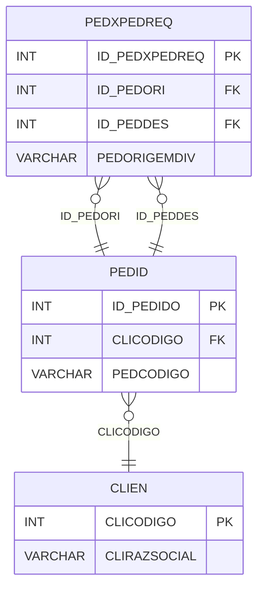

# PEDXPEDREQ - Documentação Completa de Relacionamentos

## 📊 Informações Gerais

- **Nome da Tabela**: PEDXPEDREQ (Pedido x Pedido Requisição)
- **Total de Registros**: 67.930
- **Total de Colunas**: 4
- **Chave Primária**: ID_PEDXPEDREQ
- **Chaves Estrangeiras**: 2
- **Índices**: 0
- **Tabelas Dependentes**: 0
- **Banco de Dados**: Firebird

## 📝 Descrição

**PEDXPEDREQ** é uma tabela de relacionamento que gerencia relações entre pedidos e requisições. Com **67.930 registros**, esta tabela permite rastrear quando um pedido foi gerado a partir de uma requisição ou quando pedidos foram relacionados através de requisições.

Esta tabela é essencial para:
- **Rastreamento**: Rastrear relações entre pedidos e requisições
- **Requisições**: Gerenciar requisições de pedidos
- **Histórico**: Manter histórico de requisições
- **Relatórios**: Gerar relatórios de pedidos por requisição

**Contexto de Negócio:**
Pedidos podem ser gerados a partir de requisições ou relacionados através de requisições. Esta tabela gerencia essas relações, permitindo rastrear a origem e destino de pedidos relacionados através de requisições.

---

## 🔑 Estrutura de Colunas

| Coluna | Tipo | Descrição |
|--------|------|-----------|
| **ID_PEDXPEDREQ** 🔑 | INT | Identificador único do relacionamento (PK) |
| **ID_PEDORI** 🔗 | INT | Código do pedido origem (FK → PEDID) |
| **ID_PEDDES** 🔗 | INT | Código do pedido destino (FK → PEDID) |
| **PEDORIGEMDIV** | VARCHAR(14) | Origem da divisão/requisição |

---

## 🔗 Relacionamentos - Nível 1 (Diretos)

### PEDID - Pedido Origem (FK Obrigatória)
**Volume:** 3.099.176 registros

**Relacionamento:**
```
PEDXPEDREQ.ID_PEDORI → PEDID.ID_PEDIDO (N:1)
Constraint: FKPEDORI_PEDID
```

**Descrição:** Cada registro relaciona um pedido origem com um pedido destino.

---

### PEDID - Pedido Destino (FK Obrigatória)
**Volume:** 3.099.176 registros

**Relacionamento:**
```
PEDXPEDREQ.ID_PEDDES → PEDID.ID_PEDIDO (N:1)
Constraint: FKPEDDES_PEDID
```

**Descrição:** Cada registro relaciona um pedido destino com um pedido origem.

---

## 🔗 Relacionamentos - Nível 2 (Indiretos)

### PEDID → CLIEN (Cliente)
**Volume:** 9.251 registros

**Relacionamento:**
```
PEDXPEDREQ → PEDID → CLIEN
```

**Descrição:** Através de PEDID, é possível identificar os clientes relacionados.

---

## 🗺️ Diagrama de Relacionamentos



---

## 💡 Exemplos de Uso

### Consulta Básica

```sql
SELECT ID_PEDXPEDREQ, ID_PEDORI, ID_PEDDES, PEDORIGEMDIV
FROM PEDXPEDREQ
WHERE ID_PEDXPEDREQ = ?;
```

### Consulta com Informações dos Pedidos

```sql
SELECT 
    px.*,
    p_origem.PEDCODIGO AS PEDCODIGO_ORIGEM,
    p_origem.PEDDTEMIS AS DTEMIS_ORIGEM,
    p_destino.PEDCODIGO AS PEDCODIGO_DESTINO,
    p_destino.PEDDTEMIS AS DTEMIS_DESTINO
FROM PEDXPEDREQ px
INNER JOIN PEDID p_origem
    ON px.ID_PEDORI = p_origem.ID_PEDIDO
INNER JOIN PEDID p_destino
    ON px.ID_PEDDES = p_destino.ID_PEDIDO
WHERE px.ID_PEDXPEDREQ = ?;
```

### Consulta de Pedidos Destino por Origem

```sql
SELECT 
    p_origem.PEDCODIGO AS PEDIDO_ORIGEM,
    p_destino.PEDCODIGO AS PEDIDO_DESTINO,
    px.PEDORIGEMDIV,
    p_destino.PEDDTEMIS,
    p_destino.PEDVRTOTAL
FROM PEDXPEDREQ px
INNER JOIN PEDID p_origem
    ON px.ID_PEDORI = p_origem.ID_PEDIDO
INNER JOIN PEDID p_destino
    ON px.ID_PEDDES = p_destino.ID_PEDIDO
WHERE px.ID_PEDORI = ?
ORDER BY p_destino.PEDDTEMIS;
```

### Estatísticas de Requisições

```sql
SELECT 
    PEDORIGEMDIV,
    COUNT(*) AS TOTAL_REQUISICOES
FROM PEDXPEDREQ
GROUP BY PEDORIGEMDIV
ORDER BY TOTAL_REQUISICOES DESC;
```

### Inserção de Relacionamento

```sql
INSERT INTO PEDXPEDREQ (ID_PEDORI, ID_PEDDES, PEDORIGEMDIV)
VALUES (?, ?, ?);
```

---

## ⚡ Performance e Otimização

### Índices Recomendados

#### 1. Índice na Chave Primária (Já existe implicitamente)
```sql
-- Índice primário já existe implicitamente
```

#### 2. Índice em ID_PEDORI
```sql
CREATE INDEX IDX_PEDXPEDREQ_ID_PEDORI 
ON PEDXPEDREQ (ID_PEDORI);
```

**Justificativa:** Facilita buscas por pedido origem.

#### 3. Índice em ID_PEDDES
```sql
CREATE INDEX IDX_PEDXPEDREQ_ID_PEDDES 
ON PEDXPEDREQ (ID_PEDDES);
```

**Justificativa:** Facilita buscas por pedido destino.

---

## 📊 Estatísticas e Insights

### Volume de Dados

- **Total de Registros**: 67.930
- **Tamanho Médio Estimado**: ~40 bytes por registro
- **Tamanho Total Estimado**: ~2.7 MB

### Distribuição de Dados

- **Relacionamentos**: 67.930 relacionamentos entre pedidos e requisições
- **Taxa de Utilização**: ~2,2% dos pedidos têm relacionamentos através de requisições

---

## 🔧 Integração com Código Laravel

### Model Eloquent

```php
<?php

namespace App\Models;

use Illuminate\Database\Eloquent\Model;
use Illuminate\Database\Eloquent\Relations\BelongsTo;

final class PedXPedReq extends Model
{
    protected $table = 'PEDXPEDREQ';
    protected $primaryKey = 'ID_PEDXPEDREQ';
    public $incrementing = true;
    public $timestamps = false;

    protected $fillable = [
        'ID_PEDORI',
        'ID_PEDDES',
        'PEDORIGEMDIV',
    ];

    protected $casts = [
        'ID_PEDXPEDREQ' => 'integer',
        'ID_PEDORI' => 'integer',
        'ID_PEDDES' => 'integer',
        'PEDORIGEMDIV' => 'string',
    ];

    /**
     * Relacionamento com Pedido Origem
     */
    public function pedidoOrigem(): BelongsTo
    {
        return $this->belongsTo(Pedid::class, 'ID_PEDORI', 'ID_PEDIDO');
    }

    /**
     * Relacionamento com Pedido Destino
     */
    public function pedidoDestino(): BelongsTo
    {
        return $this->belongsTo(Pedid::class, 'ID_PEDDES', 'ID_PEDIDO');
    }

    /**
     * Buscar pedidos destino por origem
     */
    public static function pedidosDestinoPorOrigem(int $idPedOri)
    {
        return self::where('ID_PEDORI', $idPedOri)
            ->with(['pedidoOrigem', 'pedidoDestino'])
            ->get();
    }

    /**
     * Buscar pedidos origem por destino
     */
    public static function pedidosOrigemPorDestino(int $idPedDes)
    {
        return self::where('ID_PEDDES', $idPedDes)
            ->with(['pedidoOrigem', 'pedidoDestino'])
            ->get();
    }
}
```

---

## ✅ Boas Práticas

### Design

1. **Chave Primária**: ID_PEDXPEDREQ deve ser único e sequencial
2. **Validação**: Validar que ID_PEDORI e ID_PEDDES sejam diferentes
3. **Ciclos**: Evitar criar ciclos de relacionamento

### Performance

1. **Índices**: Usar índices para buscas frequentes
2. **Consultas**: Usar eager loading para relacionamentos

### Segurança

1. **Validação**: Validar valores antes de inserir
2. **Acesso**: Restringir acesso de escrita a usuários autorizados
3. **Integridade**: Validar que pedidos existam antes de relacionar

---

**Documentação gerada em**: 2025-01-27

**Banco de dados**: Firebird

