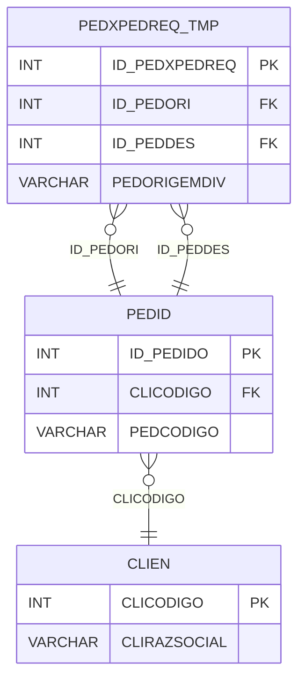

# PEDXPEDREQ_TMP - Documentação Completa de Relacionamentos

## 📊 Informações Gerais

- **Nome da Tabela**: PEDXPEDREQ_TMP (Pedido x Pedido Requisição - Temporária)
- **Total de Registros**: 33.979
- **Total de Colunas**: 4
- **Chave Primária**: ID_PEDXPEDREQ
- **Chaves Estrangeiras**: 2
- **Índices**: 0
- **Tabelas Dependentes**: 0
- **Banco de Dados**: Firebird

## 📝 Descrição

**PEDXPEDREQ_TMP** é uma tabela temporária que gerencia relações entre pedidos e requisições durante processamento. Com **33.979 registros**, esta tabela armazena relacionamentos temporários que podem ser processados e movidos para a tabela definitiva PEDXPEDREQ.

Esta tabela é essencial para:
- **Processamento Temporário**: Armazenar relacionamentos durante processamento
- **Validação**: Validar relacionamentos antes de confirmar
- **Performance**: Melhorar performance de inserções em lote
- **Auditoria**: Manter histórico de processamento

**Contexto de Negócio:**
Durante o processamento de requisições e divisões de pedidos, os relacionamentos são primeiro inseridos nesta tabela temporária para validação e processamento em lote, antes de serem movidos para a tabela definitiva.

---

## 🔑 Estrutura de Colunas

| Coluna | Tipo | Descrição |
|--------|------|-----------|
| **ID_PEDXPEDREQ** 🔑 | INT | Identificador único do relacionamento temporário (PK) |
| **ID_PEDORI** 🔗 | INT | Código do pedido origem (FK → PEDID) |
| **ID_PEDDES** 🔗 | INT | Código do pedido destino (FK → PEDID) |
| **PEDORIGEMDIV** | VARCHAR(14) | Origem da divisão/relação |

---

## 🔗 Relacionamentos - Nível 1 (Diretos)

### PEDID - Pedido Origem (FK Obrigatória)
**Volume:** 3.099.176 registros

**Relacionamento:**
```
PEDXPEDREQ_TMP.ID_PEDORI → PEDID.ID_PEDIDO (N:1)
Constraint: FKPEDORI_PEDID_TMP
```

**Descrição:** Cada registro relaciona um pedido origem com um pedido destino.

---

### PEDID - Pedido Destino (FK Obrigatória)
**Volume:** 3.099.176 registros

**Relacionamento:**
```
PEDXPEDREQ_TMP.ID_PEDDES → PEDID.ID_PEDIDO (N:1)
Constraint: FKPEDDES_PEDID_TMP
```

**Descrição:** Cada registro relaciona um pedido destino com um pedido origem.

---

## 🔗 Relacionamentos - Nível 2 (Indiretos)

### PEDID → CLIEN (Cliente)
**Volume:** 9.251 registros

**Relacionamento:**
```
PEDXPEDREQ_TMP → PEDID → CLIEN
```

**Descrição:** Através de PEDID, é possível identificar os clientes relacionados.

---

## 🗺️ Diagrama de Relacionamentos



---

## 💡 Exemplos de Uso

### Consulta Básica

```sql
SELECT ID_PEDXPEDREQ, ID_PEDORI, ID_PEDDES, PEDORIGEMDIV
FROM PEDXPEDREQ_TMP
WHERE ID_PEDXPEDREQ = ?;
```

### Consulta com Informações dos Pedidos

```sql
SELECT 
    px.*,
    p_origem.PEDCODIGO AS PEDCODIGO_ORIGEM,
    p_destino.PEDCODIGO AS PEDCODIGO_DESTINO
FROM PEDXPEDREQ_TMP px
INNER JOIN PEDID p_origem
    ON px.ID_PEDORI = p_origem.ID_PEDIDO
INNER JOIN PEDID p_destino
    ON px.ID_PEDDES = p_destino.ID_PEDIDO
WHERE px.ID_PEDXPEDREQ = ?;
```

### Processamento em Lote para Tabela Definitiva

```sql
-- Mover registros validados para tabela definitiva
INSERT INTO PEDXPEDREQ (ID_PEDORI, ID_PEDDES, PEDORIGEMDIV)
SELECT ID_PEDORI, ID_PEDDES, PEDORIGEMDIV
FROM PEDXPEDREQ_TMP
WHERE -- condições de validação
;

-- Limpar tabela temporária após processamento
DELETE FROM PEDXPEDREQ_TMP
WHERE ID_PEDXPEDREQ IN (
    SELECT ID_PEDXPEDREQ FROM PEDXPEDREQ
);
```

### Inserção Temporária

```sql
INSERT INTO PEDXPEDREQ_TMP (ID_PEDORI, ID_PEDDES, PEDORIGEMDIV)
VALUES (?, ?, ?);
```

---

## ⚡ Performance e Otimização

### Índices Recomendados

#### 1. Índice na Chave Primária (Já existe implicitamente)
```sql
-- Índice primário já existe implicitamente
```

#### 2. Índice em ID_PEDORI
```sql
CREATE INDEX IDX_PEDXPEDREQ_TMP_ID_PEDORI 
ON PEDXPEDREQ_TMP (ID_PEDORI);
```

**Justificativa:** Facilita buscas por pedido origem durante processamento.

#### 3. Índice em ID_PEDDES
```sql
CREATE INDEX IDX_PEDXPEDREQ_TMP_ID_PEDDES 
ON PEDXPEDREQ_TMP (ID_PEDDES);
```

**Justificativa:** Facilita buscas por pedido destino durante processamento.

---

## 📊 Estatísticas e Insights

### Volume de Dados

- **Total de Registros**: 33.979
- **Tamanho Médio Estimado**: ~40 bytes por registro
- **Tamanho Total Estimado**: ~1.4 MB

### Distribuição de Dados

- **Relacionamentos Temporários**: 33.979 registros
- **Taxa de Utilização**: Tabela temporária para processamento

---

## 🔧 Integração com Código Laravel

### Model Eloquent

```php
<?php

namespace App\Models;

use Illuminate\Database\Eloquent\Model;
use Illuminate\Database\Eloquent\Relations\BelongsTo;

final class PedXPedReqTmp extends Model
{
    protected $table = 'PEDXPEDREQ_TMP';
    protected $primaryKey = 'ID_PEDXPEDREQ';
    public $incrementing = true;
    public $timestamps = false;

    protected $fillable = [
        'ID_PEDORI',
        'ID_PEDDES',
        'PEDORIGEMDIV',
    ];

    protected $casts = [
        'ID_PEDXPEDREQ' => 'integer',
        'ID_PEDORI' => 'integer',
        'ID_PEDDES' => 'integer',
        'PEDORIGEMDIV' => 'string',
    ];

    /**
     * Relacionamento com Pedido Origem
     */
    public function pedidoOrigem(): BelongsTo
    {
        return $this->belongsTo(Pedid::class, 'ID_PEDORI', 'ID_PEDIDO');
    }

    /**
     * Relacionamento com Pedido Destino
     */
    public function pedidoDestino(): BelongsTo
    {
        return $this->belongsTo(Pedid::class, 'ID_PEDDES', 'ID_PEDIDO');
    }

    /**
     * Processar e mover para tabela definitiva
     */
    public function processar(): bool
    {
        // Validar relacionamento
        if (!$this->validar()) {
            return false;
        }

        // Criar na tabela definitiva
        PedXPedReq::create([
            'ID_PEDORI' => $this->ID_PEDORI,
            'ID_PEDDES' => $this->ID_PEDDES,
            'PEDORIGEMDIV' => $this->PEDORIGEMDIV,
        ]);

        // Remover da tabela temporária
        return $this->delete();
    }

    /**
     * Validar relacionamento
     */
    private function validar(): bool
    {
        // Validações necessárias
        return $this->ID_PEDORI !== $this->ID_PEDDES
            && Pedid::find($this->ID_PEDORI) !== null
            && Pedid::find($this->ID_PEDDES) !== null;
    }
}
```

---

## ✅ Boas Práticas

### Design

1. **Tabela Temporária**: Limpar regularmente após processamento
2. **Validação**: Validar relacionamentos antes de mover para definitiva
3. **Processamento**: Processar em lote para melhor performance

### Performance

1. **Índices**: Usar índices para buscas durante processamento
2. **Limpeza**: Limpar registros processados regularmente
3. **Lote**: Processar múltiplos registros em uma única transação

### Segurança

1. **Validação**: Validar valores antes de inserir
2. **Acesso**: Restringir acesso de escrita a processos automatizados
3. **Transações**: Usar transações para garantir consistência

---

**Documentação gerada em**: 2025-01-27

**Banco de dados**: Firebird

