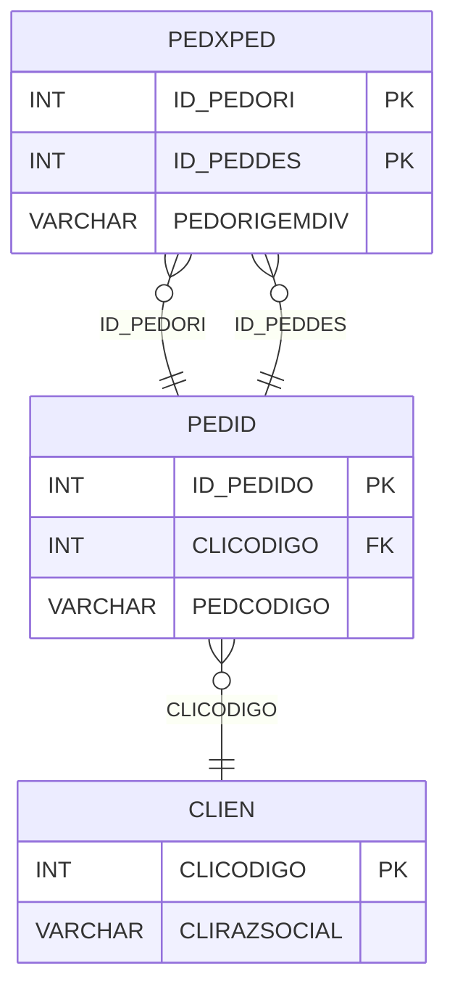

# PEDXPED - Documentação Completa de Relacionamentos

## 📊 Informações Gerais

- **Nome da Tabela**: PEDXPED (Pedido x Pedido)
- **Total de Registros**: 486.339
- **Total de Colunas**: 3
- **Chave Primária**: ID_PEDORI, ID_PEDDES (composite)
- **Chaves Estrangeiras**: 2
- **Índices**: 0
- **Tabelas Dependentes**: 0
- **Banco de Dados**: Firebird

## 📝 Descrição

**PEDXPED** é uma tabela de relacionamento que gerencia relações entre pedidos, como divisão, unificação ou outras relações. Com **486.339 registros**, esta tabela permite rastrear quando um pedido foi dividido em outros pedidos ou quando pedidos foram relacionados de alguma forma.

Esta tabela é essencial para:
- **Rastreamento**: Rastrear relações entre pedidos
- **Divisão**: Gerenciar divisão de pedidos
- **Histórico**: Manter histórico de alterações de pedidos
- **Relatórios**: Gerar relatórios de pedidos relacionados

**Contexto de Negócio:**
Pedidos podem ser divididos em outros pedidos ou relacionados entre si. Esta tabela gerencia essas relações, permitindo rastrear a origem e destino de pedidos relacionados.

---

## 🔑 Estrutura de Colunas

| Coluna | Tipo | Descrição |
|--------|------|-----------|
| **ID_PEDORI** 🔑 🔗 | INT | Código do pedido origem (PK, FK → PEDID) |
| **ID_PEDDES** 🔑 🔗 | INT | Código do pedido destino (PK, FK → PEDID) |
| **PEDORIGEMDIV** | VARCHAR(14) | Origem da divisão/relação |

---

## 🔗 Relacionamentos - Nível 1 (Diretos)

### PEDID - Pedido Origem (FK Obrigatória)
**Volume:** 3.099.176 registros

**Relacionamento:**
```
PEDXPED.ID_PEDORI → PEDID.ID_PEDIDO (N:1)
Constraint: PEDORI_PEDID
```

**Descrição:** Cada registro relaciona um pedido origem com um pedido destino.

---

### PEDID - Pedido Destino (FK Obrigatória)
**Volume:** 3.099.176 registros

**Relacionamento:**
```
PEDXPED.ID_PEDDES → PEDID.ID_PEDIDO (N:1)
Constraint: PEDDES_PEDID
```

**Descrição:** Cada registro relaciona um pedido destino com um pedido origem.

---

## 🔗 Relacionamentos - Nível 2 (Indiretos)

### PEDID → CLIEN (Cliente)
**Volume:** 9.251 registros

**Relacionamento:**
```
PEDXPED → PEDID → CLIEN
```

**Descrição:** Através de PEDID, é possível identificar os clientes relacionados aos pedidos origem e destino.

---

## 🗺️ Diagrama de Relacionamentos



---

## 💡 Exemplos de Uso

### Consulta Básica

```sql
SELECT ID_PEDORI, ID_PEDDES, PEDORIGEMDIV
FROM PEDXPED
WHERE ID_PEDORI = ?;
```

### Consulta com Informações dos Pedidos

```sql
SELECT 
    px.*,
    p_origem.PEDCODIGO AS PEDCODIGO_ORIGEM,
    p_origem.PEDDTEMIS AS DTEMIS_ORIGEM,
    p_destino.PEDCODIGO AS PEDCODIGO_DESTINO,
    p_destino.PEDDTEMIS AS DTEMIS_DESTINO
FROM PEDXPED px
INNER JOIN PEDID p_origem
    ON px.ID_PEDORI = p_origem.ID_PEDIDO
INNER JOIN PEDID p_destino
    ON px.ID_PEDDES = p_destino.ID_PEDIDO
WHERE px.ID_PEDORI = ?;
```

### Consulta de Pedidos Destino por Origem

```sql
SELECT 
    p_origem.PEDCODIGO AS PEDIDO_ORIGEM,
    p_destino.PEDCODIGO AS PEDIDO_DESTINO,
    px.PEDORIGEMDIV,
    p_destino.PEDDTEMIS,
    p_destino.PEDVRTOTAL
FROM PEDXPED px
INNER JOIN PEDID p_origem
    ON px.ID_PEDORI = p_origem.ID_PEDIDO
INNER JOIN PEDID p_destino
    ON px.ID_PEDDES = p_destino.ID_PEDIDO
WHERE px.ID_PEDORI = ?
ORDER BY p_destino.PEDDTEMIS;
```

### Consulta de Pedidos Origem por Destino

```sql
SELECT 
    p_destino.PEDCODIGO AS PEDIDO_DESTINO,
    p_origem.PEDCODIGO AS PEDIDO_ORIGEM,
    px.PEDORIGEMDIV,
    p_origem.PEDDTEMIS,
    p_origem.PEDVRTOTAL
FROM PEDXPED px
INNER JOIN PEDID p_destino
    ON px.ID_PEDDES = p_destino.ID_PEDIDO
INNER JOIN PEDID p_origem
    ON px.ID_PEDORI = p_origem.ID_PEDIDO
WHERE px.ID_PEDDES = ?
ORDER BY p_origem.PEDDTEMIS;
```

### Estatísticas de Divisões

```sql
SELECT 
    PEDORIGEMDIV,
    COUNT(*) AS TOTAL_RELACOES
FROM PEDXPED
GROUP BY PEDORIGEMDIV
ORDER BY TOTAL_RELACOES DESC;
```

### Inserção de Relacionamento

```sql
INSERT INTO PEDXPED (ID_PEDORI, ID_PEDDES, PEDORIGEMDIV)
VALUES (?, ?, ?);
```

---

## ⚡ Performance e Otimização

### Índices Recomendados

#### 1. Índice Composto na Chave Primária (Já existe implicitamente)
```sql
-- Índice primário já existe implicitamente
```

#### 2. Índice em ID_PEDDES
```sql
CREATE INDEX IDX_PEDXPED_ID_PEDDES 
ON PEDXPED (ID_PEDDES);
```

**Justificativa:** Facilita buscas por pedido destino.

---

## 📊 Estatísticas e Insights

### Volume de Dados

- **Total de Registros**: 486.339
- **Tamanho Médio Estimado**: ~30 bytes por registro
- **Tamanho Total Estimado**: ~15 MB

### Distribuição de Dados

- **Relacionamentos**: 486.339 relacionamentos entre pedidos
- **Taxa de Utilização**: ~15,7% dos pedidos têm relacionamentos

---

## 🔧 Integração com Código Laravel

### Model Eloquent

```php
<?php

namespace App\Models;

use Illuminate\Database\Eloquent\Model;
use Illuminate\Database\Eloquent\Relations\BelongsTo;

final class PedXPed extends Model
{
    protected $table = 'PEDXPED';
    public $incrementing = false;
    public $timestamps = false;

    protected $primaryKey = ['ID_PEDORI', 'ID_PEDDES'];

    protected $fillable = [
        'ID_PEDORI',
        'ID_PEDDES',
        'PEDORIGEMDIV',
    ];

    protected $casts = [
        'ID_PEDORI' => 'integer',
        'ID_PEDDES' => 'integer',
        'PEDORIGEMDIV' => 'string',
    ];

    /**
     * Relacionamento com Pedido Origem
     */
    public function pedidoOrigem(): BelongsTo
    {
        return $this->belongsTo(Pedid::class, 'ID_PEDORI', 'ID_PEDIDO');
    }

    /**
     * Relacionamento com Pedido Destino
     */
    public function pedidoDestino(): BelongsTo
    {
        return $this->belongsTo(Pedid::class, 'ID_PEDDES', 'ID_PEDIDO');
    }

    /**
     * Buscar pedidos destino por origem
     */
    public static function pedidosDestinoPorOrigem(int $idPedOri)
    {
        return self::where('ID_PEDORI', $idPedOri)
            ->with(['pedidoOrigem', 'pedidoDestino'])
            ->get();
    }

    /**
     * Buscar pedidos origem por destino
     */
    public static function pedidosOrigemPorDestino(int $idPedDes)
    {
        return self::where('ID_PEDDES', $idPedDes)
            ->with(['pedidoOrigem', 'pedidoDestino'])
            ->get();
    }
}
```

---

## ✅ Boas Práticas

### Design

1. **Chave Composta**: Manter integridade da chave composta
2. **Validação**: Validar que ID_PEDORI e ID_PEDDES sejam diferentes
3. **Ciclos**: Evitar criar ciclos de relacionamento

### Performance

1. **Índices**: Usar índices para buscas frequentes
2. **Consultas**: Usar eager loading para relacionamentos

### Segurança

1. **Validação**: Validar valores antes de inserir
2. **Acesso**: Restringir acesso de escrita a usuários autorizados
3. **Integridade**: Validar que pedidos existam antes de relacionar

---

**Documentação gerada em**: 2025-01-27

**Banco de dados**: Firebird

