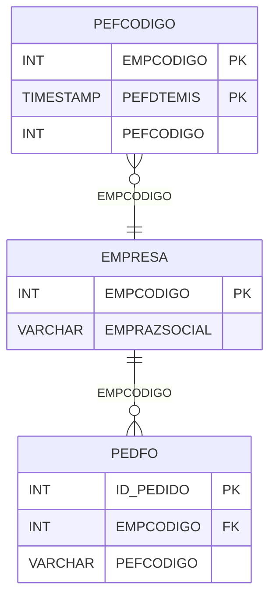

# PEFCODIGO - Documentação Completa de Relacionamentos

## 📊 Informações Gerais

- **Nome da Tabela**: PEFCODIGO (Pedido Fornecedor - Código)
- **Total de Registros**: 7
- **Total de Colunas**: 3
- **Chave Primária**: EMPCODIGO, PEFDTEMIS (composite)
- **Chaves Estrangeiras**: 0
- **Índices**: 0
- **Tabelas Dependentes**: 0
- **Banco de Dados**: Firebird

## 📝 Descrição

**PEFCODIGO** é uma tabela de controle que armazena códigos sequenciais de pedidos de fornecedores por empresa e data. Com apenas **7 registros**, esta tabela controla a numeração sequencial de pedidos de fornecedores, garantindo unicidade por empresa e data.

Esta tabela é essencial para:
- **Controle de Numeração**: Controlar numeração sequencial de pedidos de fornecedores
- **Unicidade**: Garantir unicidade de códigos por empresa e data
- **Sequenciamento**: Manter sequência de códigos

**Contexto de Negócio:**
Cada empresa precisa gerar códigos únicos para pedidos de fornecedores. Esta tabela controla o último código gerado por empresa e data, permitindo gerar o próximo código sequencial.

---

## 🔑 Estrutura de Colunas

| Coluna | Tipo | Descrição |
|--------|------|-----------|
| **EMPCODIGO** 🔑 | INT | Código da empresa (PK) |
| **PEFDTEMIS** 🔑 | TIMESTAMP | Data de emissão (PK) |
| **PEFCODIGO** | INT | Último código gerado para esta empresa e data |

---

## 🔗 Relacionamentos - Nível 1 (Diretos)

### Relacionamentos Lógicos

### EMPRESA - Empresa (Relacionamento Lógico)
**Volume:** 6 registros

**Relacionamento Lógico:**
```
PEFCODIGO.EMPCODIGO → EMPRESA.EMPCODIGO (N:1)
```

**Descrição:** Cada registro está relacionado a uma empresa específica.

---

## 🔗 Relacionamentos - Nível 2 (Indiretos)

### EMPRESA → PEDFO (Pedidos Fornecedor)
**Volume:** 129.041 registros

**Relacionamento:**
```
PEFCODIGO → EMPRESA → PEDFO
```

**Descrição:** Através de EMPRESA, é possível identificar pedidos de fornecedores relacionados.

---

## 🗺️ Diagrama de Relacionamentos



---

## 💡 Exemplos de Uso

### Consulta Básica

```sql
SELECT EMPCODIGO, PEFDTEMIS, PEFCODIGO
FROM PEFCODIGO
WHERE EMPCODIGO = ?
    AND DATE(PEFDTEMIS) = CURRENT_DATE;
```

### Obter Próximo Código

```sql
SELECT COALESCE(MAX(PEFCODIGO), 0) + 1 AS PROXIMO_CODIGO
FROM PEFCODIGO
WHERE EMPCODIGO = ?
    AND DATE(PEFDTEMIS) = CURRENT_DATE;
```

### Atualizar Código

```sql
UPDATE PEFCODIGO
SET PEFCODIGO = PEFCODIGO + 1
WHERE EMPCODIGO = ?
    AND DATE(PEFDTEMIS) = CURRENT_DATE;
```

### Inserção de Novo Registro

```sql
INSERT INTO PEFCODIGO (EMPCODIGO, PEFDTEMIS, PEFCODIGO)
VALUES (?, CURRENT_DATE, 1);
```

---

## ⚡ Performance e Otimização

### Índices Recomendados

#### 1. Índice Composto na Chave Primária (Já existe implicitamente)
```sql
-- Índice primário já existe implicitamente
```

#### 2. Índice em EMPCODIGO e Data
```sql
CREATE INDEX IDX_PEFCODIGO_EMP_DATA 
ON PEFCODIGO (EMPCODIGO, DATE(PEFDTEMIS));
```

**Justificativa:** Facilita buscas por empresa e data.

---

## 📊 Estatísticas e Insights

### Volume de Dados

- **Total de Registros**: 7
- **Tamanho Médio Estimado**: ~30 bytes por registro
- **Tamanho Total Estimado**: ~210 bytes

### Distribuição de Dados

- **Registros de Controle**: 7 registros
- **Taxa de Utilização**: Tabela de controle com poucos registros

---

## 🔧 Integração com Código Laravel

### Model Eloquent

```php
<?php

namespace App\Models;

use Illuminate\Database\Eloquent\Model;
use Illuminate\Database\Eloquent\Relations\BelongsTo;

final class PefCodigo extends Model
{
    protected $table = 'PEFCODIGO';
    public $incrementing = false;
    public $timestamps = false;

    protected $primaryKey = ['EMPCODIGO', 'PEFDTEMIS'];

    protected $fillable = [
        'EMPCODIGO',
        'PEFDTEMIS',
        'PEFCODIGO',
    ];

    protected $casts = [
        'EMPCODIGO' => 'integer',
        'PEFDTEMIS' => 'datetime',
        'PEFCODIGO' => 'integer',
    ];

    /**
     * Relacionamento com Empresa
     */
    public function empresa(): BelongsTo
    {
        return $this->belongsTo(Empresa::class, 'EMPCODIGO', 'EMPCODIGO');
    }

    /**
     * Obter próximo código para empresa e data
     */
    public static function obterProximoCodigo(int $empCodigo, $data = null): int
    {
        $data = $data ?? now();
        $dataFormatada = $data->format('Y-m-d');

        $registro = self::where('EMPCODIGO', $empCodigo)
            ->whereDate('PEFDTEMIS', $dataFormatada)
            ->first();

        if ($registro) {
            $proximoCodigo = $registro->PEFCODIGO + 1;
            $registro->update(['PEFCODIGO' => $proximoCodigo]);
            return $proximoCodigo;
        }

        // Criar novo registro
        self::create([
            'EMPCODIGO' => $empCodigo,
            'PEFDTEMIS' => $data,
            'PEFCODIGO' => 1,
        ]);

        return 1;
    }
}
```

---

## ✅ Boas Práticas

### Design

1. **Chave Composta**: Manter integridade da chave composta
2. **Validação**: Validar EMPCODIGO antes de inserir
3. **Sequenciamento**: Garantir incremento sequencial

### Performance

1. **Índices**: Usar índice para busca por empresa e data
2. **Transações**: Usar transações para garantir atomicidade

### Segurança

1. **Validação**: Validar valores antes de inserir
2. **Acesso**: Restringir acesso de escrita a processos autorizados
3. **Concorrência**: Usar locks para evitar condições de corrida

---

**Documentação gerada em**: 2025-01-27

**Banco de dados**: Firebird

