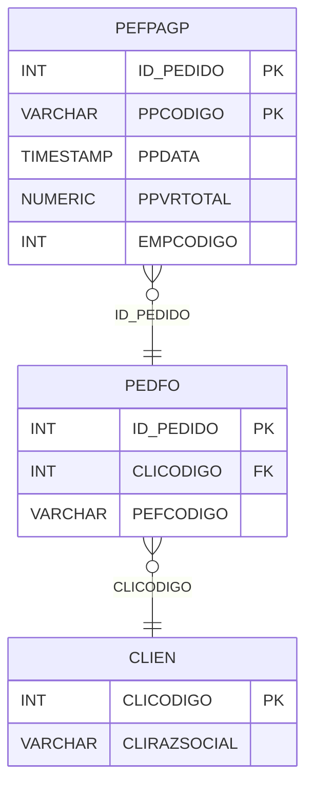

# PEFPAGP - Documentação Completa de Relacionamentos

## 📊 Informações Gerais

- **Nome da Tabela**: PEFPAGP (Pedido Fornecedor - Pagamento Provisório)
- **Total de Registros**: 169
- **Total de Colunas**: 5
- **Chave Primária**: ID_PEDIDO, PPCODIGO (composite)
- **Chaves Estrangeiras**: 1
- **Índices**: 1
- **Tabelas Dependentes**: 0
- **Banco de Dados**: Firebird

## 📝 Descrição

**PEFPAGP** é uma tabela de detalhamento que armazena informações sobre pagamentos provisórios relacionados a pedidos de fornecedores. Com **169 registros**, esta tabela registra pagamentos provisórios com código, data e valor total.

Esta tabela é essencial para:
- **Pagamentos Provisórios**: Registrar pagamentos provisórios de pedidos de fornecedores
- **Rastreamento**: Rastrear pagamentos provisórios por pedido
- **Financeiro**: Gerenciar valores de pagamentos provisórios
- **Relatórios**: Gerar relatórios de pagamentos provisórios

**Contexto de Negócio:**
Pedidos de fornecedores podem ter pagamentos provisórios registrados antes do pagamento definitivo. Esta tabela gerencia esses pagamentos provisórios.

---

## 🔑 Estrutura de Colunas

| Coluna | Tipo | Descrição |
|--------|------|-----------|
| **ID_PEDIDO** 🔑 🔗 | INT | Código do pedido fornecedor (PK, FK → PEDFO) |
| **PPCODIGO** 🔑 | VARCHAR(14) | Código do pagamento provisório (PK) |
| **PPDATA** | TIMESTAMP | Data do pagamento provisório |
| **PPVRTOTAL** | NUMERIC(27,2) | Valor total do pagamento provisório |
| **EMPCODIGO** | INT | Código da empresa |

---

## 🔗 Relacionamentos - Nível 1 (Diretos)

### PEDFO - Pedido Fornecedor (FK Obrigatória)
**Volume:** 129.041 registros

**Relacionamento:**
```
PEFPAGP.ID_PEDIDO → PEDFO.ID_PEDIDO (N:1)
Constraint: PEDFO_PEFPAGP
```

**Descrição:** Cada pagamento provisório está vinculado a um pedido de fornecedor específico.

**Proporção:** ~0,1% dos pedidos de fornecedores têm pagamentos provisórios (169 / 129.041)

---

## 🔗 Relacionamentos - Nível 2 (Indiretos)

### PEDFO → CLIEN (Fornecedor/Cliente)
**Volume:** 9.251 registros

**Relacionamento:**
```
PEFPAGP → PEDFO → CLIEN
```

**Descrição:** Através de PEDFO, é possível identificar o fornecedor relacionado.

---

## 🗺️ Diagrama de Relacionamentos



---

## 💡 Exemplos de Uso

### Consulta Básica

```sql
SELECT ID_PEDIDO, PPCODIGO, PPDATA, PPVRTOTAL, EMPCODIGO
FROM PEFPAGP
WHERE ID_PEDIDO = ?;
```

### Consulta com Informações do Pedido

```sql
SELECT 
    pp.*,
    pf.PEFCODIGO,
    pf.PEFDTEMIS,
    pf.PEFVRTOTAL,
    c.CLIRAZSOCIAL AS FORNECEDOR
FROM PEFPAGP pp
INNER JOIN PEDFO pf
    ON pp.ID_PEDIDO = pf.ID_PEDIDO
INNER JOIN CLIEN c
    ON pf.CLICODIGO = c.CLICODIGO
WHERE pp.ID_PEDIDO = ?;
```

### Consulta de Pagamentos Provisórios por Período

```sql
SELECT 
    DATE(pp.PPDATA) AS DATA,
    COUNT(*) AS TOTAL_PAGAMENTOS,
    SUM(pp.PPVRTOTAL) AS VALOR_TOTAL
FROM PEFPAGP pp
WHERE pp.PPDATA BETWEEN ? AND ?
GROUP BY DATE(pp.PPDATA)
ORDER BY DATA DESC;
```

### Inserção de Pagamento Provisório

```sql
INSERT INTO PEFPAGP (ID_PEDIDO, PPCODIGO, PPDATA, PPVRTOTAL, EMPCODIGO)
VALUES (?, ?, ?, ?, ?);
```

---

## ⚡ Performance e Otimização

### Índices Existentes

#### 1. Índice Composto em PPCODIGO e PPDATA
**Nome:** INDPEFPAGP_PPCODIGO_PPDATA
**Colunas:** PPCODIGO, PPDATA

**Justificativa:** Facilita buscas por código e data.

---

### Índices Recomendados

#### 1. Índice Composto na Chave Primária (Já existe implicitamente)
```sql
-- Índice primário já existe implicitamente
```

#### 2. Índice em PPDATA
```sql
CREATE INDEX IDX_PEFPAGP_PPDATA 
ON PEFPAGP (PPDATA);
```

**Justificativa:** Facilita buscas por data.

---

## 📊 Estatísticas e Insights

### Volume de Dados

- **Total de Registros**: 169
- **Tamanho Médio Estimado**: ~60 bytes por registro
- **Tamanho Total Estimado**: ~10 KB

### Distribuição de Dados

- **Pagamentos Provisórios**: 169 registros
- **Taxa de Utilização**: ~0,1% dos pedidos de fornecedores têm pagamentos provisórios

---

## 🔧 Integração com Código Laravel

### Model Eloquent

```php
<?php

namespace App\Models;

use Illuminate\Database\Eloquent\Model;
use Illuminate\Database\Eloquent\Relations\BelongsTo;

final class PefPagP extends Model
{
    protected $table = 'PEFPAGP';
    public $incrementing = false;
    public $timestamps = false;

    protected $primaryKey = ['ID_PEDIDO', 'PPCODIGO'];

    protected $fillable = [
        'ID_PEDIDO',
        'PPCODIGO',
        'PPDATA',
        'PPVRTOTAL',
        'EMPCODIGO',
    ];

    protected $casts = [
        'ID_PEDIDO' => 'integer',
        'PPCODIGO' => 'string',
        'PPDATA' => 'datetime',
        'PPVRTOTAL' => 'decimal:2',
        'EMPCODIGO' => 'integer',
    ];

    /**
     * Relacionamento com Pedido Fornecedor
     */
    public function pedidoFornecedor(): BelongsTo
    {
        return $this->belongsTo(PedFo::class, 'ID_PEDIDO', 'ID_PEDIDO');
    }

    /**
     * Buscar pagamentos provisórios por pedido
     */
    public static function porPedido(int $idPedido)
    {
        return self::where('ID_PEDIDO', $idPedido)
            ->with(['pedidoFornecedor'])
            ->orderBy('PPDATA')
            ->get();
    }
}
```

---

## ✅ Boas Práticas

### Design

1. **Chave Composta**: Manter integridade da chave composta
2. **Validação**: Validar valores antes de inserir
3. **Valores**: Validar que PPVRTOTAL seja positivo

### Performance

1. **Índices**: Usar índice para busca por data (já existe composto)
2. **Consultas**: Usar eager loading para relacionamentos

### Segurança

1. **Validação**: Validar valores antes de inserir
2. **Acesso**: Restringir acesso de escrita a usuários autorizados

---

**Documentação gerada em**: 2025-01-27

**Banco de dados**: Firebird

