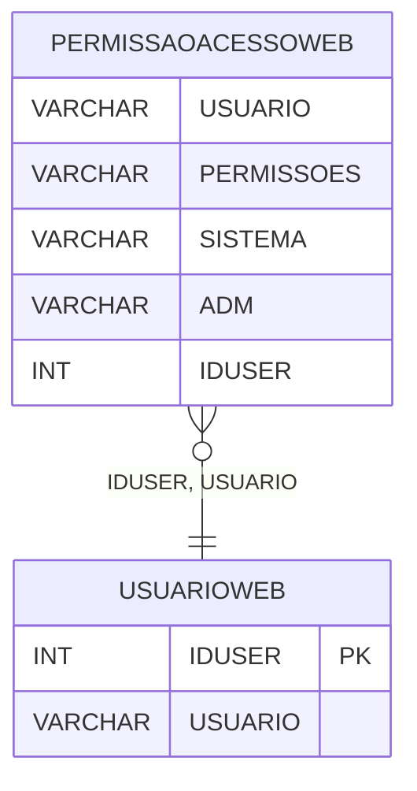

# PERMISSAOACESSOWEB - Documentação Completa de Relacionamentos

## 📊 Informações Gerais

- **Nome da Tabela**: PERMISSAOACESSOWEB (Permissão de Acesso Web)
- **Total de Registros**: 800
- **Total de Colunas**: 5
- **Chave Primária**: Não possui (tabela sem PK formal)
- **Chaves Estrangeiras**: 0
- **Índices**: 1
- **Tabelas Dependentes**: 0
- **Banco de Dados**: Firebird

## 📝 Descrição

**PERMISSAOACESSOWEB** é uma tabela que armazena permissões de acesso web para usuários. Com **800 registros**, esta tabela registra permissões de acesso por usuário, sistema e nível administrativo.

Esta tabela é essencial para:
- **Controle de Acesso**: Controlar acesso de usuários a sistemas web
- **Permissões**: Gerenciar permissões por usuário e sistema
- **Segurança**: Implementar controle de acesso granular
- **Auditoria**: Manter histórico de permissões

**Contexto de Negócio:**
Usuários podem ter diferentes níveis de acesso a sistemas web. Esta tabela gerencia essas permissões, permitindo controle granular de acesso por usuário e sistema.

---

## 🔑 Estrutura de Colunas

| Coluna | Tipo | Descrição |
|--------|------|-----------|
| **USUARIO** | VARCHAR(37) | Nome do usuário |
| **PERMISSOES** | VARCHAR(37) | Permissões do usuário |
| **SISTEMA** | VARCHAR(14) | Sistema relacionado |
| **ADM** | VARCHAR(14) | Flag indicando se é administrador |
| **IDUSER** | INT | ID do usuário (relacionamento lógico) |

---

## 🔗 Relacionamentos - Nível 1 (Diretos)

### Relacionamentos Lógicos

### USUARIOWEB - Usuário Web (Relacionamento Lógico)
**Volume:** 7.366 registros

**Relacionamento Lógico:**
```
PERMISSAOACESSOWEB.IDUSER → USUARIOWEB.IDUSER
PERMISSAOACESSOWEB.USUARIO → USUARIOWEB.USUARIO
```

**Descrição:** Cada registro está relacionado a um usuário web específico.

---

## 🔗 Relacionamentos - Nível 2 (Indiretos)

### USUARIOWEB → GRUPOCLI (Grupo de Cliente)
**Volume:** Variável

**Relacionamento:**
```
PERMISSAOACESSOWEB → USUARIOWEB → GRUPOCLI
```

**Descrição:** Através de USUARIOWEB, é possível identificar grupos de cliente relacionados.

---

## 🗺️ Diagrama de Relacionamentos



---

## 💡 Exemplos de Uso

### Consulta Básica

```sql
SELECT USUARIO, PERMISSOES, SISTEMA, ADM, IDUSER
FROM PERMISSAOACESSOWEB
WHERE USUARIO = ?;
```

### Consulta de Permissões por Usuário

```sql
SELECT 
    pa.*,
    uw.USUARIO,
    uw.USUEMAIL
FROM PERMISSAOACESSOWEB pa
LEFT JOIN USUARIOWEB uw
    ON pa.IDUSER = uw.IDUSER
WHERE pa.USUARIO = ?;
```

### Consulta de Usuários Administradores

```sql
SELECT 
    USUARIO,
    SISTEMA,
    COUNT(*) AS TOTAL_PERMISSOES
FROM PERMISSAOACESSOWEB
WHERE ADM = 'SIM'
GROUP BY USUARIO, SISTEMA
ORDER BY USUARIO;
```

### Consulta de Permissões por Sistema

```sql
SELECT 
    SISTEMA,
    COUNT(DISTINCT USUARIO) AS TOTAL_USUARIOS,
    COUNT(*) AS TOTAL_PERMISSOES
FROM PERMISSAOACESSOWEB
GROUP BY SISTEMA
ORDER BY TOTAL_USUARIOS DESC;
```

### Inserção de Permissão

```sql
INSERT INTO PERMISSAOACESSOWEB (USUARIO, PERMISSOES, SISTEMA, ADM, IDUSER)
VALUES (?, ?, ?, ?, ?);
```

---

## ⚡ Performance e Otimização

### Índices Existentes

#### 1. Índice em USUARIO
**Nome:** IDX_PERMISSAOWEB_USUARIO
**Colunas:** USUARIO

**Justificativa:** Facilita buscas por usuário.

---

### Índices Recomendados

#### 1. Índice em IDUSER
```sql
CREATE INDEX IDX_PERMISSAOACESSOWEB_IDUSER 
ON PERMISSAOACESSOWEB (IDUSER);
```

**Justificativa:** Facilita buscas por ID do usuário.

#### 2. Índice em SISTEMA
```sql
CREATE INDEX IDX_PERMISSAOACESSOWEB_SISTEMA 
ON PERMISSAOACESSOWEB (SISTEMA);
```

**Justificativa:** Facilita buscas por sistema.

---

## 📊 Estatísticas e Insights

### Volume de Dados

- **Total de Registros**: 800
- **Tamanho Médio Estimado**: ~60 bytes por registro
- **Tamanho Total Estimado**: ~48 KB

### Distribuição de Dados

- **Permissões**: 800 registros de permissões
- **Taxa de Utilização**: Média (tabela de controle de acesso)

---

## 🔧 Integração com Código Laravel

### Model Eloquent

```php
<?php

namespace App\Models;

use Illuminate\Database\Eloquent\Model;
use Illuminate\Database\Eloquent\Relations\BelongsTo;

final class PermissaoAcessoWeb extends Model
{
    protected $table = 'PERMISSAOACESSOWEB';
    public $incrementing = false;
    public $timestamps = false;

    protected $fillable = [
        'USUARIO',
        'PERMISSOES',
        'SISTEMA',
        'ADM',
        'IDUSER',
    ];

    protected $casts = [
        'IDUSER' => 'integer',
        'USUARIO' => 'string',
        'PERMISSOES' => 'string',
        'SISTEMA' => 'string',
        'ADM' => 'string',
    ];

    /**
     * Relacionamento com Usuário Web
     */
    public function usuarioWeb(): BelongsTo
    {
        return $this->belongsTo(UsuarioWeb::class, 'IDUSER', 'IDUSER');
    }

    /**
     * Buscar permissões por usuário
     */
    public static function porUsuario(string $usuario)
    {
        return self::where('USUARIO', $usuario)
            ->with(['usuarioWeb'])
            ->get();
    }

    /**
     * Verificar se usuário é administrador
     */
    public function isAdministrador(): bool
    {
        return $this->ADM === 'SIM';
    }
}
```

---

## ✅ Boas Práticas

### Design

1. **Sem PK Formal**: Tabela não possui chave primária formal
2. **Validação**: Validar USUARIO e IDUSER antes de inserir
3. **Permissões**: Validar formato de PERMISSOES

### Performance

1. **Índices**: Usar índices para buscas frequentes
2. **Consultas**: Usar eager loading para relacionamentos

### Segurança

1. **Validação**: Validar valores antes de inserir
2. **Acesso**: Restringir acesso de escrita a administradores
3. **Auditoria**: Registrar mudanças de permissões

---

**Documentação gerada em**: 2025-01-27

**Banco de dados**: Firebird

