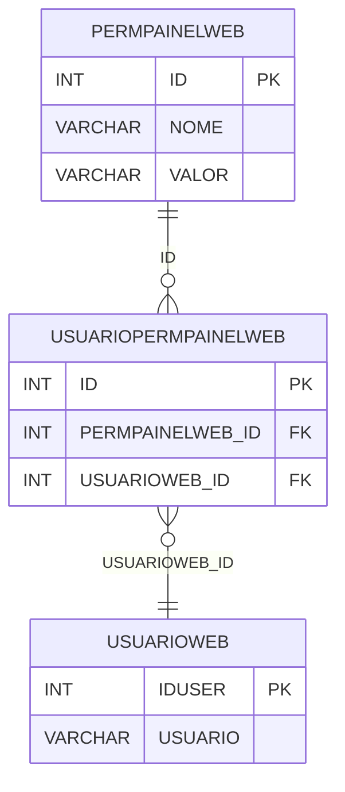

# PERMPAINELWEB - Documentação Completa de Relacionamentos

## 📊 Informações Gerais

- **Nome da Tabela**: PERMPAINELWEB (Permissão Painel Web)
- **Total de Registros**: 3
- **Total de Colunas**: 3
- **Chave Primária**: ID
- **Chaves Estrangeiras**: 0
- **Índices**: 0
- **Tabelas Dependentes**: 1
- **Banco de Dados**: Firebird

## 📝 Descrição

**PERMPAINELWEB** é uma tabela mestre que define tipos de permissões de painel web disponíveis no sistema. Com apenas **3 registros**, esta tabela armazena configurações de permissões que podem ser atribuídas a usuários através da tabela USUARIOPERMPAINELWEB.

Esta tabela é essencial para:
- **Tipos de Permissão**: Definir tipos de permissões de painel disponíveis
- **Configuração**: Armazenar configurações de permissões
- **Rastreamento**: Rastrear quais permissões estão disponíveis
- **Relatórios**: Gerar relatórios de permissões

**Contexto de Negócio:**
O sistema possui diferentes tipos de permissões de painel web que podem ser atribuídas a usuários. Esta tabela define esses tipos e suas configurações.

---

## 🔑 Estrutura de Colunas

| Coluna | Tipo | Descrição |
|--------|------|-----------|
| **ID** 🔑 | INT | Identificador único da permissão (PK) |
| **NOME** | VARCHAR(37) | Nome da permissão |
| **VALOR** | VARCHAR(37) | Valor/configuração da permissão |

---

## 🔗 Relacionamentos - Nível 1 (Diretos)

### Tabelas que Referenciam Esta

### USUARIOPERMPAINELWEB - Usuário Permissão Painel Web
**Volume:** Variável

**Relacionamento:**
```
USUARIOPERMPAINELWEB.PERMPAINELWEB_ID → PERMPAINELWEB.ID (N:1)
Constraint: PERMISSAO_PAINELWEB
```

**Descrição:** Cada registro relaciona um usuário com uma permissão de painel.

---

## 🔗 Relacionamentos - Nível 2 (Indiretos)

### USUARIOPERMPAINELWEB → USUARIOWEB (Usuário Web)
**Volume:** 7.366 registros

**Relacionamento:**
```
PERMPAINELWEB → USUARIOPERMPAINELWEB → USUARIOWEB
```

**Descrição:** Através de USUARIOPERMPAINELWEB, é possível identificar usuários relacionados.

---

## 🗺️ Diagrama de Relacionamentos



---

## 💡 Exemplos de Uso

### Consulta Básica

```sql
SELECT ID, NOME, VALOR
FROM PERMPAINELWEB
WHERE ID = ?;
```

### Consulta com Usuários Relacionados

```sql
SELECT 
    pp.*,
    COUNT(upw.ID) AS TOTAL_USUARIOS
FROM PERMPAINELWEB pp
LEFT JOIN USUARIOPERMPAINELWEB upw
    ON pp.ID = upw.PERMPAINELWEB_ID
GROUP BY pp.ID, pp.NOME, pp.VALOR
ORDER BY TOTAL_USUARIOS DESC;
```

### Consulta de Permissões por Usuário

```sql
SELECT 
    pp.NOME,
    pp.VALOR,
    uw.USUARIO
FROM PERMPAINELWEB pp
INNER JOIN USUARIOPERMPAINELWEB upw
    ON pp.ID = upw.PERMPAINELWEB_ID
INNER JOIN USUARIOWEB uw
    ON upw.USUARIOWEB_ID = uw.IDUSER
WHERE uw.IDUSER = ?;
```

### Inserção de Nova Permissão

```sql
INSERT INTO PERMPAINELWEB (NOME, VALOR)
VALUES (?, ?);
```

---

## ⚡ Performance e Otimização

### Índices Recomendados

#### 1. Índice na Chave Primária (Já existe implicitamente)
```sql
-- Índice primário já existe implicitamente
```

#### 2. Índice em NOME
```sql
CREATE INDEX IDX_PERMPAINELWEB_NOME 
ON PERMPAINELWEB (NOME);
```

**Justificativa:** Facilita buscas por nome da permissão.

---

## 📊 Estatísticas e Insights

### Volume de Dados

- **Total de Registros**: 3
- **Tamanho Médio Estimado**: ~50 bytes por registro
- **Tamanho Total Estimado**: ~150 bytes

### Distribuição de Dados

- **Tipos de Permissão**: 3 tipos disponíveis
- **Taxa de Utilização**: Tabela mestre com poucos registros

---

## 🔧 Integração com Código Laravel

### Model Eloquent

```php
<?php

namespace App\Models;

use Illuminate\Database\Eloquent\Model;
use Illuminate\Database\Eloquent\Relations\HasMany;

final class PermPainelWeb extends Model
{
    protected $table = 'PERMPAINELWEB';
    protected $primaryKey = 'ID';
    public $incrementing = true;
    public $timestamps = false;

    protected $fillable = [
        'NOME',
        'VALOR',
    ];

    protected $casts = [
        'ID' => 'integer',
        'NOME' => 'string',
        'VALOR' => 'string',
    ];

    /**
     * Relacionamento com Usuários Permissão Painel Web
     */
    public function usuariosPermissao(): HasMany
    {
        return $this->hasMany(UsuarioPermPainelWeb::class, 'PERMPAINELWEB_ID', 'ID');
    }

    /**
     * Buscar todas as permissões
     */
    public static function todas()
    {
        return self::with(['usuariosPermissao'])
            ->get();
    }
}
```

---

## ✅ Boas Práticas

### Design

1. **Chave Primária**: ID deve ser único e sequencial
2. **Validação**: Validar NOME e VALOR antes de inserir
3. **Unicidade**: Garantir que NOME seja único

### Performance

1. **Índices**: Usar índice para busca por nome
2. **Consultas**: Usar eager loading para relacionamentos

### Segurança

1. **Validação**: Validar valores antes de inserir
2. **Acesso**: Restringir acesso de escrita a administradores

---

**Documentação gerada em**: 2025-01-27

**Banco de dados**: Firebird

