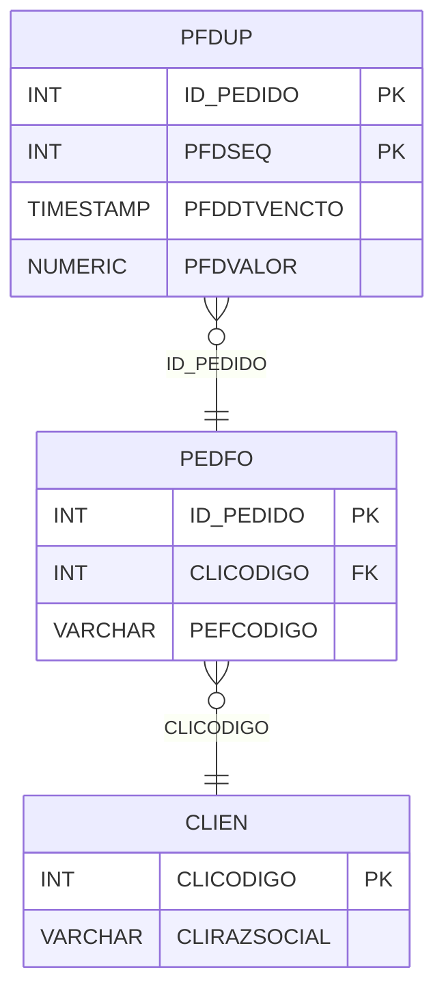

# PFDUP - Documentação Completa de Relacionamentos

## 📊 Informações Gerais

- **Nome da Tabela**: PFDUP (Pedido Fornecedor - Duplicatas)
- **Total de Registros**: 148.774
- **Total de Colunas**: 4
- **Chave Primária**: ID_PEDIDO, PFDSEQ (composite)
- **Chaves Estrangeiras**: 1
- **Índices**: 0
- **Tabelas Dependentes**: 0
- **Banco de Dados**: Firebird

## 📝 Descrição

**PFDUP** é uma tabela de detalhamento que armazena as duplicatas (parcelas de pagamento) relacionadas a pedidos de fornecedores. Com **148.774 registros**, esta tabela registra cada parcela de pagamento com sua data de vencimento e valor.

Esta tabela é essencial para:
- **Controle de Pagamentos**: Registrar cada parcela de pagamento do pedido de fornecedor
- **Vencimentos**: Controlar datas de vencimento das duplicatas
- **Financeiro**: Gerenciar valores de cada duplicata
- **Relatórios**: Gerar relatórios de vencimentos

**Contexto de Negócio:**
Um pedido de fornecedor pode ter múltiplas duplicatas, cada uma com data de vencimento e valor específicos. Esta tabela detalha essas duplicatas.

---

## 🔑 Estrutura de Colunas

| Coluna | Tipo | Descrição |
|--------|------|-----------|
| **ID_PEDIDO** 🔑 🔗 | INT | Código do pedido fornecedor (PK, FK → PEDFO) |
| **PFDSEQ** 🔑 | INT | Sequencial da duplicata (PK) |
| **PFDDTVENCTO** | TIMESTAMP | Data de vencimento da duplicata |
| **PFDVALOR** | NUMERIC(27,2) | Valor da duplicata |

---

## 🔗 Relacionamentos - Nível 1 (Diretos)

### PEDFO - Pedido Fornecedor (FK Obrigatória)
**Volume:** 129.041 registros

**Relacionamento:**
```
PFDUP.ID_PEDIDO → PEDFO.ID_PEDIDO (N:1)
Constraint: PEDFO_PFDUP
```

**Descrição:** Cada duplicata está vinculada a um pedido de fornecedor específico.

**Proporção:** ~1,2 duplicatas por pedido em média (148.774 / 129.041)

---

## 🔗 Relacionamentos - Nível 2 (Indiretos)

### PEDFO → CLIEN (Fornecedor)
**Volume:** 9.251 registros

**Relacionamento:**
```
PFDUP → PEDFO → CLIEN
```

**Descrição:** Através de PEDFO, é possível identificar o fornecedor relacionado.

---

## 🗺️ Diagrama de Relacionamentos



---

## 💡 Exemplos de Uso

### Consulta Básica

```sql
SELECT ID_PEDIDO, PFDSEQ, PFDDTVENCTO, PFDVALOR
FROM PFDUP
WHERE ID_PEDIDO = ?
ORDER BY PFDDTVENCTO;
```

### Consulta com Informações do Pedido

```sql
SELECT 
    d.*,
    pf.PEFCODIGO,
    pf.PEFDTEMIS,
    pf.PEFVRTOTAL,
    c.CLIRAZSOCIAL AS FORNECEDOR
FROM PFDUP d
INNER JOIN PEDFO pf
    ON d.ID_PEDIDO = pf.ID_PEDIDO
INNER JOIN CLIEN c
    ON pf.CLICODIGO = c.CLICODIGO
WHERE d.ID_PEDIDO = ?
ORDER BY d.PFDDTVENCTO;
```

### Consulta de Duplicatas Vencidas

```sql
SELECT 
    d.*,
    pf.PEFCODIGO,
    c.CLIRAZSOCIAL AS FORNECEDOR
FROM PFDUP d
INNER JOIN PEDFO pf
    ON d.ID_PEDIDO = pf.ID_PEDIDO
INNER JOIN CLIEN c
    ON pf.CLICODIGO = c.CLICODIGO
WHERE d.PFDDTVENCTO < CURRENT_DATE
    AND pf.PEFSIT = 'ATIVO'
ORDER BY d.PFDDTVENCTO;
```

### Soma de Valores por Pedido

```sql
SELECT 
    ID_PEDIDO,
    COUNT(*) AS TOTAL_DUPLICATAS,
    SUM(PFDVALOR) AS VALOR_TOTAL
FROM PFDUP
GROUP BY ID_PEDIDO;
```

### Inserção de Nova Duplicata

```sql
INSERT INTO PFDUP (ID_PEDIDO, PFDSEQ, PFDDTVENCTO, PFDVALOR)
VALUES (?, ?, ?, ?);
```

---

## ⚡ Performance e Otimização

### Índices Recomendados

#### 1. Índice Composto na Chave Primária (Já existe implicitamente)
```sql
-- Índice primário já existe implicitamente
```

#### 2. Índice em PFDDTVENCTO
```sql
CREATE INDEX IDX_PFDUP_DTVENCTO 
ON PFDUP (PFDDTVENCTO);
```

**Justificativa:** Facilita buscas por data de vencimento (crítico para relatórios de vencidos).

---

## 📊 Estatísticas e Insights

### Volume de Dados

- **Total de Registros**: 148.774
- **Tamanho Médio Estimado**: ~40 bytes por registro
- **Tamanho Total Estimado**: ~6 MB

### Distribuição de Dados

- **Pedidos com Duplicatas**: 129.041 pedidos
- **Média de Duplicatas**: ~1,2 duplicatas por pedido

---

## 🔧 Integração com Código Laravel

### Model Eloquent

```php
<?php

namespace App\Models;

use Illuminate\Database\Eloquent\Model;
use Illuminate\Database\Eloquent\Relations\BelongsTo;

final class PfDup extends Model
{
    protected $table = 'PFDUP';
    public $incrementing = false;
    public $timestamps = false;

    protected $primaryKey = ['ID_PEDIDO', 'PFDSEQ'];

    protected $fillable = [
        'ID_PEDIDO',
        'PFDSEQ',
        'PFDDTVENCTO',
        'PFDVALOR',
    ];

    protected $casts = [
        'ID_PEDIDO' => 'integer',
        'PFDSEQ' => 'integer',
        'PFDDTVENCTO' => 'datetime',
        'PFDVALOR' => 'decimal:2',
    ];

    /**
     * Relacionamento com Pedido Fornecedor
     */
    public function pedidoFornecedor(): BelongsTo
    {
        return $this->belongsTo(PedFo::class, 'ID_PEDIDO', 'ID_PEDIDO');
    }

    /**
     * Buscar duplicatas por pedido
     */
    public static function porPedido(int $idPedido)
    {
        return self::where('ID_PEDIDO', $idPedido)
            ->orderBy('PFDDTVENCTO')
            ->get();
    }

    /**
     * Buscar duplicatas vencidas
     */
    public static function vencidas()
    {
        return self::where('PFDDTVENCTO', '<', now())
            ->with(['pedidoFornecedor'])
            ->get();
    }
}
```

---

## ✅ Boas Práticas

### Design

1. **Chave Composta**: Manter integridade da chave composta
2. **Validação**: Validar valores antes de inserir
3. **Datas**: Validar PFDDTVENCTO antes de inserir

### Performance

1. **Índices**: Usar índice para busca por vencimento (crítico)
2. **Consultas**: Usar eager loading para relacionamentos

### Segurança

1. **Validação**: Validar valores antes de inserir
2. **Acesso**: Restringir acesso de escrita a usuários autorizados

---

**Documentação gerada em**: 2025-01-27

**Banco de dados**: Firebird

