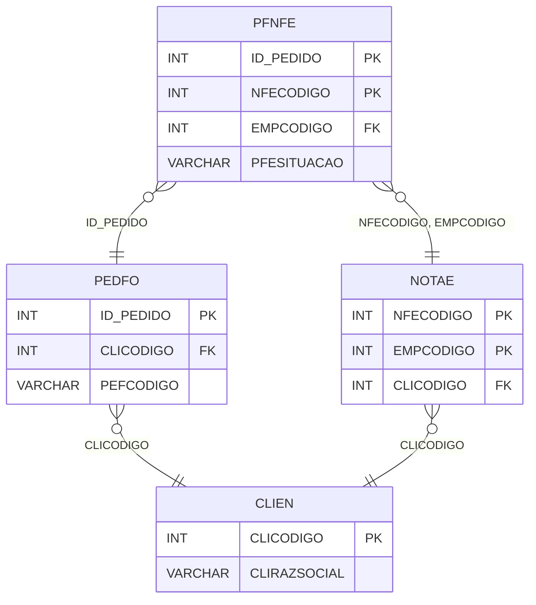

# PFNFE - Documentação Completa de Relacionamentos

## 📊 Informações Gerais

- **Nome da Tabela**: PFNFE (Pedido Fornecedor x Nota Fiscal Eletrônica)
- **Total de Registros**: 127.523
- **Total de Colunas**: 4
- **Chave Primária**: ID_PEDIDO, NFECODIGO (composite)
- **Chaves Estrangeiras**: 3
- **Índices**: 0
- **Tabelas Dependentes**: 0
- **Banco de Dados**: Firebird

## 📝 Descrição

**PFNFE** é uma tabela de relacionamento que associa pedidos de fornecedores com notas fiscais eletrônicas (NF-e). Com **127.523 registros**, esta tabela permite rastrear quais NF-e estão relacionadas a cada pedido de fornecedor.

Esta tabela é essencial para:
- **Rastreamento Fiscal**: Rastrear quais NF-e estão relacionadas a cada pedido de fornecedor
- **Conciliação**: Facilitar conciliação entre pedidos e NF-e
- **Relatórios**: Gerar relatórios fiscais por pedido
- **Auditoria**: Manter histórico de relacionamentos fiscais

**Contexto de Negócio:**
Um pedido de fornecedor pode estar relacionado a uma ou mais notas fiscais eletrônicas. Esta tabela gerencia essa relação, permitindo rastrear a origem fiscal de cada pedido.

---

## 🔑 Estrutura de Colunas

| Coluna | Tipo | Descrição |
|--------|------|-----------|
| **ID_PEDIDO** 🔑 🔗 | INT | Código do pedido fornecedor (PK, FK → PEDFO) |
| **NFECODIGO** 🔑 🔗 | INT | Código da NF-e (PK, FK → NOTAE) |
| **EMPCODIGO** 🔗 | INT | Código da empresa (FK → NOTAE) |
| **PFESITUACAO** | VARCHAR(14) | Situação da relação (ATIVA, CANCELADA, etc.) |

---

## 🔗 Relacionamentos - Nível 1 (Diretos)

### PEDFO - Pedido Fornecedor (FK Obrigatória)
**Volume:** 129.041 registros

**Relacionamento:**
```
PFNFE.ID_PEDIDO → PEDFO.ID_PEDIDO (N:1)
Constraint: PEDFO_PFNFE
```

**Descrição:** Cada registro relaciona um pedido de fornecedor com uma NF-e.

**Proporção:** ~98,8% dos pedidos de fornecedores têm relacionamento com NF-e (127.523 / 129.041)

---

### NOTAE - Nota Fiscal Eletrônica (FK Obrigatória)
**Volume:** 204.952 registros

**Relacionamento:**
```
PFNFE.NFECODIGO, EMPCODIGO → NOTAE.NFECODIGO, EMPCODIGO (N:1)
Constraint: NOTAE_PFNFE
```

**Descrição:** Cada registro relaciona uma NF-e com um pedido de fornecedor.

---

## 🔗 Relacionamentos - Nível 2 (Indiretos)

### PEDFO → CLIEN (Fornecedor)
**Volume:** 9.251 registros

**Relacionamento:**
```
PFNFE → PEDFO → CLIEN
```

**Descrição:** Através de PEDFO, é possível identificar o fornecedor relacionado.

---

### NOTAE → CLIEN (Cliente da NF-e)
**Volume:** 9.251 registros

**Relacionamento:**
```
PFNFE → NOTAE → CLIEN
```

**Descrição:** Através de NOTAE, é possível identificar o cliente relacionado.

---

## 🗺️ Diagrama de Relacionamentos



---

## 💡 Exemplos de Uso

### Consulta Básica

```sql
SELECT ID_PEDIDO, NFECODIGO, EMPCODIGO, PFESITUACAO
FROM PFNFE
WHERE ID_PEDIDO = ?;
```

### Consulta com Informações da NF-e

```sql
SELECT 
    pn.*,
    nfe.NFENRNOTA,
    nfe.NFEDTEMIS,
    nfe.NFEVRTOTAL,
    nfe.NFESIT
FROM PFNFE pn
INNER JOIN NOTAE nfe
    ON pn.NFECODIGO = nfe.NFECODIGO
    AND pn.EMPCODIGO = nfe.EMPCODIGO
WHERE pn.ID_PEDIDO = ?;
```

### Consulta com Informações do Pedido

```sql
SELECT 
    pn.*,
    pf.PEFCODIGO,
    pf.PEFDTEMIS,
    pf.PEFVRTOTAL,
    nfe.NFENRNOTA,
    nfe.NFEVRTOTAL AS NF_VALOR
FROM PFNFE pn
INNER JOIN PEDFO pf
    ON pn.ID_PEDIDO = pf.ID_PEDIDO
INNER JOIN NOTAE nfe
    ON pn.NFECODIGO = nfe.NFECODIGO
    AND pn.EMPCODIGO = nfe.EMPCODIGO
WHERE pn.ID_PEDIDO = ?;
```

### Consulta de NF-e por Pedido

```sql
SELECT 
    pf.PEFCODIGO,
    COUNT(DISTINCT pn.NFECODIGO) AS TOTAL_NFES,
    SUM(nfe.NFEVRTOTAL) AS VALOR_TOTAL_NFES
FROM PEDFO pf
LEFT JOIN PFNFE pn
    ON pf.ID_PEDIDO = pn.ID_PEDIDO
LEFT JOIN NOTAE nfe
    ON pn.NFECODIGO = nfe.NFECODIGO
    AND pn.EMPCODIGO = nfe.EMPCODIGO
GROUP BY pf.ID_PEDIDO, pf.PEFCODIGO
HAVING COUNT(DISTINCT pn.NFECODIGO) > 0
ORDER BY TOTAL_NFES DESC;
```

### Inserção de Relacionamento

```sql
INSERT INTO PFNFE (ID_PEDIDO, NFECODIGO, EMPCODIGO, PFESITUACAO)
VALUES (?, ?, ?, 'ATIVA');
```

---

## ⚡ Performance e Otimização

### Índices Recomendados

#### 1. Índice Composto na Chave Primária (Já existe implicitamente)
```sql
-- Índice primário já existe implicitamente
```

#### 2. Índice em ID_PEDIDO
```sql
CREATE INDEX IDX_PFNFE_ID_PEDIDO 
ON PFNFE (ID_PEDIDO);
```

**Justificativa:** Facilita buscas por pedido (muito frequente).

#### 3. Índice Composto em NFECODIGO e EMPCODIGO
```sql
CREATE INDEX IDX_PFNFE_NFE_EMP 
ON PFNFE (NFECODIGO, EMPCODIGO);
```

**Justificativa:** Facilita buscas por NF-e.

---

## 📊 Estatísticas e Insights

### Volume de Dados

- **Total de Registros**: 127.523
- **Tamanho Médio Estimado**: ~40 bytes por registro
- **Tamanho Total Estimado**: ~5 MB

### Distribuição de Dados

- **Relacionamentos**: 127.523 relacionamentos entre pedidos e NF-e
- **Taxa de Relacionamento**: ~98,8% dos pedidos de fornecedores têm relacionamento com NF-e

---

## 🔧 Integração com Código Laravel

### Model Eloquent

```php
<?php

namespace App\Models;

use Illuminate\Database\Eloquent\Model;
use Illuminate\Database\Eloquent\Relations\BelongsTo;

final class PfNfe extends Model
{
    protected $table = 'PFNFE';
    public $incrementing = false;
    public $timestamps = false;

    protected $primaryKey = ['ID_PEDIDO', 'NFECODIGO'];

    protected $fillable = [
        'ID_PEDIDO',
        'NFECODIGO',
        'EMPCODIGO',
        'PFESITUACAO',
    ];

    protected $casts = [
        'ID_PEDIDO' => 'integer',
        'NFECODIGO' => 'integer',
        'EMPCODIGO' => 'integer',
        'PFESITUACAO' => 'string',
    ];

    /**
     * Relacionamento com Pedido Fornecedor
     */
    public function pedidoFornecedor(): BelongsTo
    {
        return $this->belongsTo(PedFo::class, 'ID_PEDIDO', 'ID_PEDIDO');
    }

    /**
     * Relacionamento com Nota Fiscal Eletrônica
     */
    public function notaFiscalEletronica(): BelongsTo
    {
        return $this->belongsTo(NotaE::class, ['NFECODIGO', 'EMPCODIGO'], ['NFECODIGO', 'EMPCODIGO']);
    }

    /**
     * Buscar NF-e por pedido
     */
    public static function nfesPorPedido(int $idPedido)
    {
        return self::where('ID_PEDIDO', $idPedido)
            ->with(['notaFiscalEletronica', 'pedidoFornecedor'])
            ->get();
    }
}
```

---

## ✅ Boas Práticas

### Design

1. **Chave Composta**: Manter integridade da chave composta
2. **Validação**: Validar NFECODIGO, EMPCODIGO e ID_PEDIDO antes de inserir
3. **Situação**: Manter PFESITUACAO sempre atualizada

### Performance

1. **Índices**: Usar índices para buscas frequentes (crítico devido ao volume)
2. **Consultas**: Usar eager loading para relacionamentos

### Segurança

1. **Validação**: Validar valores antes de inserir
2. **Acesso**: Restringir acesso de escrita a usuários autorizados
3. **Fiscal**: Validar integridade fiscal cuidadosamente

---

**Documentação gerada em**: 2025-01-27

**Banco de dados**: Firebird

