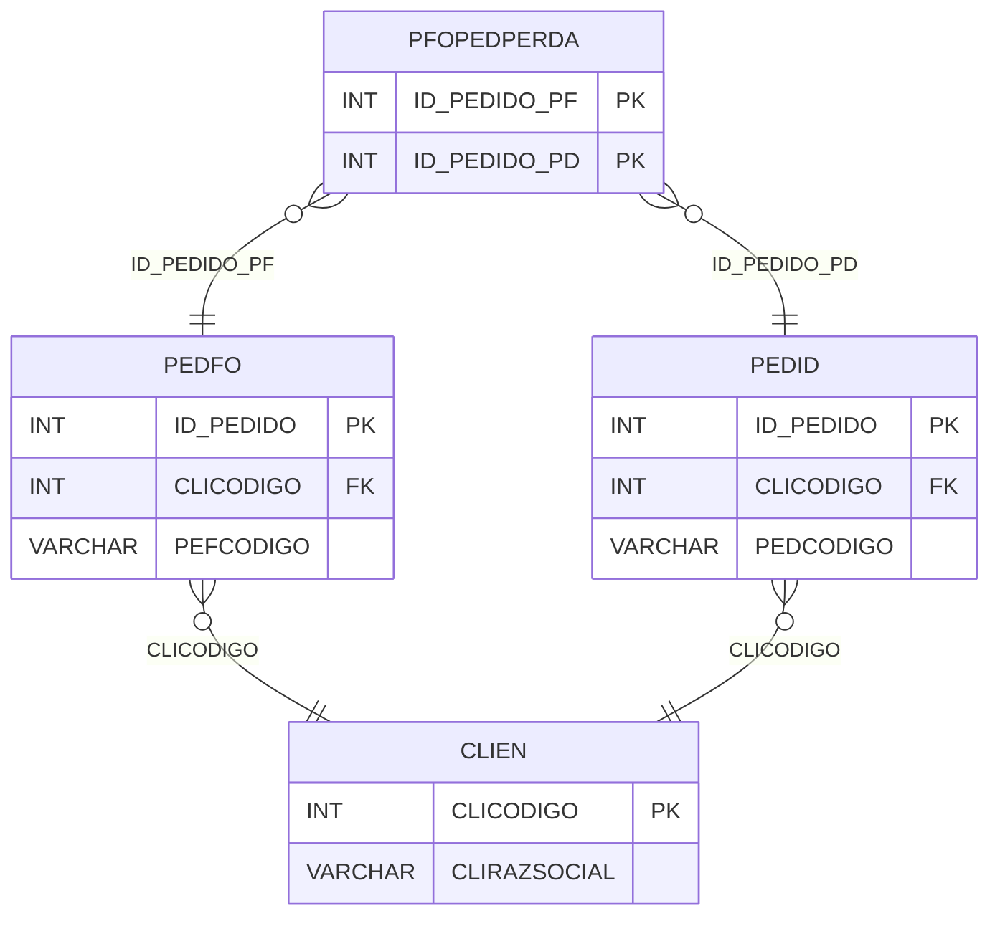

# PFOPEDPERDA - Documentação Completa de Relacionamentos

## 📊 Informações Gerais

- **Nome da Tabela**: PFOPEDPERDA (Pedido Fornecedor x Pedido - Perda)
- **Total de Registros**: 3
- **Total de Colunas**: 2
- **Chave Primária**: ID_PEDIDO_PF, ID_PEDIDO_PD (composite)
- **Chaves Estrangeiras**: 2
- **Índices**: 0
- **Tabelas Dependentes**: 0
- **Banco de Dados**: Firebird

## 📝 Descrição

**PFOPEDPERDA** é uma tabela de relacionamento que associa pedidos de fornecedores com pedidos de venda quando há perda relacionada. Com apenas **3 registros**, esta tabela permite rastrear quando um pedido de fornecedor está relacionado a um pedido de venda devido a perda.

Esta tabela é essencial para:
- **Rastreamento de Perdas**: Rastrear perdas relacionadas entre pedidos de fornecedores e pedidos de venda
- **Conciliação**: Facilitar conciliação de perdas
- **Relatórios**: Gerar relatórios de perdas
- **Auditoria**: Manter histórico de perdas

**Contexto de Negócio:**
Quando há perda relacionada entre um pedido de fornecedor e um pedido de venda, esta tabela registra essa relação para rastreamento e auditoria.

---

## 🔑 Estrutura de Colunas

| Coluna | Tipo | Descrição |
|--------|------|-----------|
| **ID_PEDIDO_PF** 🔑 🔗 | INT | Código do pedido fornecedor (PK, FK → PEDFO) |
| **ID_PEDIDO_PD** 🔑 🔗 | INT | Código do pedido de venda (PK, FK → PEDID) |

---

## 🔗 Relacionamentos - Nível 1 (Diretos)

### PEDFO - Pedido Fornecedor (FK Obrigatória)
**Volume:** 129.041 registros

**Relacionamento:**
```
PFOPEDPERDA.ID_PEDIDO_PF → PEDFO.ID_PEDIDO (N:1)
Constraint: PEDFO_PFOPEDPERDA
```

**Descrição:** Cada registro relaciona um pedido de fornecedor com um pedido de venda.

---

### PEDID - Pedido de Venda (FK Obrigatória)
**Volume:** 3.099.176 registros

**Relacionamento:**
```
PFOPEDPERDA.ID_PEDIDO_PD → PEDID.ID_PEDIDO (N:1)
Constraint: PEDID_PFOPEDPERDA
```

**Descrição:** Cada registro relaciona um pedido de venda com um pedido de fornecedor.

---

## 🔗 Relacionamentos - Nível 2 (Indiretos)

### PEDFO → CLIEN (Fornecedor)
**Volume:** 9.251 registros

**Relacionamento:**
```
PFOPEDPERDA → PEDFO → CLIEN
```

**Descrição:** Através de PEDFO, é possível identificar o fornecedor relacionado.

---

### PEDID → CLIEN (Cliente)
**Volume:** 9.251 registros

**Relacionamento:**
```
PFOPEDPERDA → PEDID → CLIEN
```

**Descrição:** Através de PEDID, é possível identificar o cliente relacionado.

---

## 🗺️ Diagrama de Relacionamentos



---

## 💡 Exemplos de Uso

### Consulta Básica

```sql
SELECT ID_PEDIDO_PF, ID_PEDIDO_PD
FROM PFOPEDPERDA
WHERE ID_PEDIDO_PF = ?;
```

### Consulta com Informações dos Pedidos

```sql
SELECT 
    pp.*,
    pf.PEFCODIGO AS PEDIDO_FORNECEDOR,
    pf.PEFDTEMIS AS DTEMIS_FORNECEDOR,
    pd.PEDCODIGO AS PEDIDO_VENDA,
    pd.PEDDTEMIS AS DTEMIS_VENDA
FROM PFOPEDPERDA pp
INNER JOIN PEDFO pf
    ON pp.ID_PEDIDO_PF = pf.ID_PEDIDO
INNER JOIN PEDID pd
    ON pp.ID_PEDIDO_PD = pd.ID_PEDIDO
WHERE pp.ID_PEDIDO_PF = ?;
```

### Consulta de Pedidos de Venda por Pedido Fornecedor

```sql
SELECT 
    pf.PEFCODIGO AS PEDIDO_FORNECEDOR,
    pd.PEDCODIGO AS PEDIDO_VENDA,
    pd.PEDDTEMIS,
    pd.PEDVRTOTAL
FROM PFOPEDPERDA pp
INNER JOIN PEDFO pf
    ON pp.ID_PEDIDO_PF = pf.ID_PEDIDO
INNER JOIN PEDID pd
    ON pp.ID_PEDIDO_PD = pd.ID_PEDIDO
WHERE pp.ID_PEDIDO_PF = ?;
```

### Inserção de Relacionamento

```sql
INSERT INTO PFOPEDPERDA (ID_PEDIDO_PF, ID_PEDIDO_PD)
VALUES (?, ?);
```

---

## ⚡ Performance e Otimização

### Índices Recomendados

#### 1. Índice Composto na Chave Primária (Já existe implicitamente)
```sql
-- Índice primário já existe implicitamente
```

#### 2. Índice em ID_PEDIDO_PD
```sql
CREATE INDEX IDX_PFOPEDPERDA_ID_PEDIDO_PD 
ON PFOPEDPERDA (ID_PEDIDO_PD);
```

**Justificativa:** Facilita buscas por pedido de venda.

---

## 📊 Estatísticas e Insights

### Volume de Dados

- **Total de Registros**: 3
- **Tamanho Médio Estimado**: ~20 bytes por registro
- **Tamanho Total Estimado**: ~60 bytes

### Distribuição de Dados

- **Relacionamentos de Perda**: 3 relacionamentos
- **Taxa de Utilização**: Muito baixa (~0,002% dos pedidos têm relacionamento de perda)

---

## 🔧 Integração com Código Laravel

### Model Eloquent

```php
<?php

namespace App\Models;

use Illuminate\Database\Eloquent\Model;
use Illuminate\Database\Eloquent\Relations\BelongsTo;

final class PfOPedPerda extends Model
{
    protected $table = 'PFOPEDPERDA';
    public $incrementing = false;
    public $timestamps = false;

    protected $primaryKey = ['ID_PEDIDO_PF', 'ID_PEDIDO_PD'];

    protected $fillable = [
        'ID_PEDIDO_PF',
        'ID_PEDIDO_PD',
    ];

    protected $casts = [
        'ID_PEDIDO_PF' => 'integer',
        'ID_PEDIDO_PD' => 'integer',
    ];

    /**
     * Relacionamento com Pedido Fornecedor
     */
    public function pedidoFornecedor(): BelongsTo
    {
        return $this->belongsTo(PedFo::class, 'ID_PEDIDO_PF', 'ID_PEDIDO');
    }

    /**
     * Relacionamento com Pedido de Venda
     */
    public function pedidoVenda(): BelongsTo
    {
        return $this->belongsTo(Pedid::class, 'ID_PEDIDO_PD', 'ID_PEDIDO');
    }

    /**
     * Buscar pedidos de venda por pedido fornecedor
     */
    public static function pedidosVendaPorFornecedor(int $idPedidoPf)
    {
        return self::where('ID_PEDIDO_PF', $idPedidoPf)
            ->with(['pedidoFornecedor', 'pedidoVenda'])
            ->get();
    }
}
```

---

## ✅ Boas Práticas

### Design

1. **Chave Composta**: Manter integridade da chave composta
2. **Validação**: Validar que ID_PEDIDO_PF e ID_PEDIDO_PD sejam diferentes
3. **Unicidade**: Garantir que não haja duplicatas

### Performance

1. **Índices**: Usar índices para buscas frequentes
2. **Consultas**: Usar eager loading para relacionamentos

### Segurança

1. **Validação**: Validar valores antes de inserir
2. **Acesso**: Restringir acesso de escrita a usuários autorizados

---

**Documentação gerada em**: 2025-01-27

**Banco de dados**: Firebird

