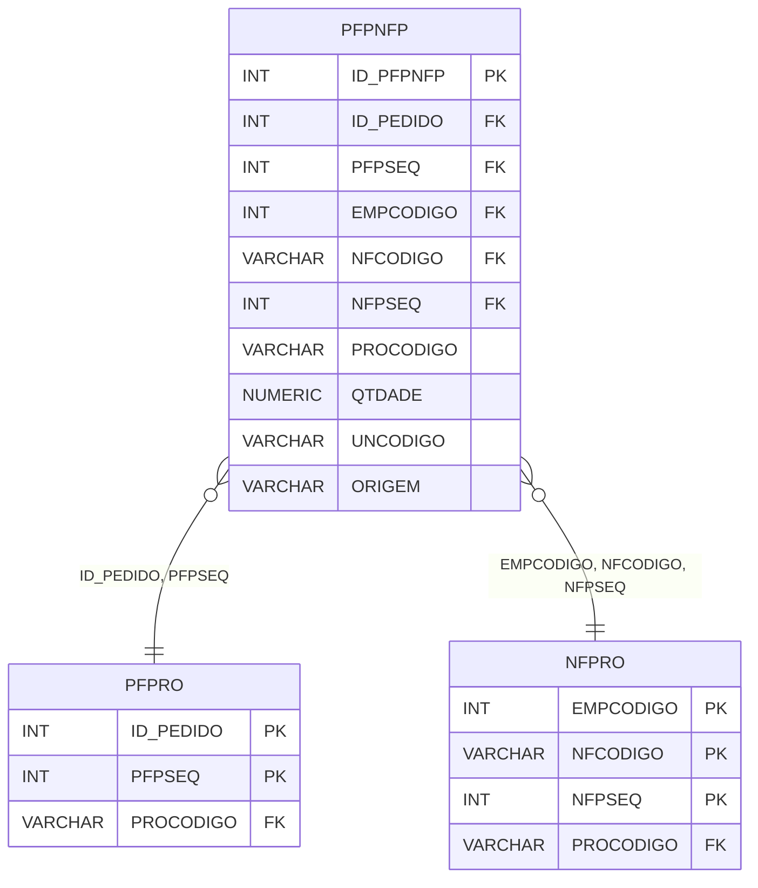

# PFPNFP - Documentação Completa de Relacionamentos

## 📊 Informações Gerais

- **Nome da Tabela**: PFPNFP (Pedido Fornecedor Produto x Nota Fiscal Produto)
- **Total de Registros**: 310
- **Total de Colunas**: 10
- **Chave Primária**: ID_PFPNFP
- **Chaves Estrangeiras**: 5
- **Índices**: 0
- **Tabelas Dependentes**: 0
- **Banco de Dados**: Firebird

## 📝 Descrição

**PFPNFP** é uma tabela de relacionamento que associa produtos de pedidos de fornecedores com produtos de notas fiscais tradicionais. Com **310 registros**, esta tabela permite rastrear quais produtos de pedidos de fornecedores foram faturados em quais notas fiscais.

Esta tabela é essencial para:
- **Rastreamento Fiscal**: Rastrear produtos faturados em notas fiscais
- **Conciliação**: Facilitar conciliação entre produtos de pedidos e notas fiscais
- **Relatórios**: Gerar relatórios de produtos faturados
- **Auditoria**: Manter histórico de relacionamentos fiscais por produto

**Contexto de Negócio:**
Produtos de pedidos de fornecedores podem ser faturados em notas fiscais tradicionais. Esta tabela gerencia essa relação no nível de produto, permitindo rastrear exatamente quais produtos foram faturados em quais notas fiscais.

---

## 🔑 Estrutura de Colunas

| Coluna | Tipo | Descrição |
|--------|------|-----------|
| **ID_PFPNFP** 🔑 | INT | Identificador único do relacionamento (PK) |
| **ID_PEDIDO** 🔗 | INT | Código do pedido fornecedor (FK → PFPRO) |
| **PFPSEQ** 🔗 | INT | Sequencial do produto no pedido (FK → PFPRO) |
| **EMPCODIGO** 🔗 | INT | Código da empresa (FK → NFPRO) |
| **NFCODIGO** 🔗 | VARCHAR(14) | Código da nota fiscal (FK → NFPRO) |
| **NFPSEQ** 🔗 | INT | Sequencial do produto na nota fiscal (FK → NFPRO) |
| **PROCODIGO** | VARCHAR(14) | Código do produto |
| **QTDADE** | NUMERIC(16,2) | Quantidade relacionada |
| **UNCODIGO** | VARCHAR(14) | Código da unidade de medida |
| **ORIGEM** | VARCHAR(14) | Origem do relacionamento |

---

## 🔗 Relacionamentos - Nível 1 (Diretos)

### PFPRO - Produto do Pedido Fornecedor (FK Obrigatória)
**Volume:** 1.860.415 registros

**Relacionamento:**
```
PFPNFP.ID_PEDIDO, PFPSEQ → PFPRO.ID_PEDIDO, PFPSEQ (N:1)
Constraint: PFPRO_PFPNFP
```

**Descrição:** Cada registro relaciona um produto de pedido de fornecedor com um produto de nota fiscal.

---

### NFPRO - Produto da Nota Fiscal (FK Obrigatória)
**Volume:** 3.724.413 registros

**Relacionamento:**
```
PFPNFP.EMPCODIGO, NFCODIGO, NFPSEQ → NFPRO.EMPCODIGO, NFCODIGO, NFPSEQ (N:1)
Constraint: NFPRO_PFPNFP
```

**Descrição:** Cada registro relaciona um produto de nota fiscal com um produto de pedido de fornecedor.

---

## 🔗 Relacionamentos - Nível 2 (Indiretos)

### PFPRO → PEDFO (Pedido Fornecedor)
**Volume:** 129.041 registros

**Relacionamento:**
```
PFPNFP → PFPRO → PEDFO
```

**Descrição:** Através de PFPRO, é possível identificar o pedido de fornecedor relacionado.

---

### NFPRO → NOTAS (Nota Fiscal)
**Volume:** 1.206.013 registros

**Relacionamento:**
```
PFPNFP → NFPRO → NOTAS
```

**Descrição:** Através de NFPRO, é possível identificar a nota fiscal relacionada.

---

## 🗺️ Diagrama de Relacionamentos



---

## 💡 Exemplos de Uso

### Consulta Básica

```sql
SELECT ID_PFPNFP, ID_PEDIDO, PFPSEQ, EMPCODIGO, NFCODIGO, NFPSEQ, PROCODIGO, QTDADE
FROM PFPNFP
WHERE ID_PEDIDO = ?;
```

### Consulta com Informações do Produto do Pedido

```sql
SELECT 
    pnfp.*,
    pfp.PFPDESCRICAO,
    pfp.PFPQTDADE,
    pf.PEFCODIGO
FROM PFPNFP pnfp
INNER JOIN PFPRO pfp
    ON pnfp.ID_PEDIDO = pfp.ID_PEDIDO
    AND pnfp.PFPSEQ = pfp.PFPSEQ
INNER JOIN PEDFO pf
    ON pnfp.ID_PEDIDO = pf.ID_PEDIDO
WHERE pnfp.ID_PEDIDO = ?;
```

### Consulta com Informações do Produto da Nota Fiscal

```sql
SELECT 
    pnfp.*,
    nfp.NFPDESCRICAO,
    nfp.NFPQTDADE,
    nf.NFCODIGO,
    nf.NFDTEMIS
FROM PFPNFP pnfp
INNER JOIN NFPRO nfp
    ON pnfp.EMPCODIGO = nfp.EMPCODIGO
    AND pnfp.NFCODIGO = nfp.NFCODIGO
    AND pnfp.NFPSEQ = nfp.NFPSEQ
INNER JOIN NOTAS nf
    ON nfp.EMPCODIGO = nf.EMPCODIGO
    AND nfp.NFCODIGO = nf.NFCODIGO
WHERE pnfp.ID_PEDIDO = ?;
```

### Inserção de Relacionamento

```sql
INSERT INTO PFPNFP (
    ID_PEDIDO,
    PFPSEQ,
    EMPCODIGO,
    NFCODIGO,
    NFPSEQ,
    PROCODIGO,
    QTDADE,
    UNCODIGO,
    ORIGEM
)
VALUES (?, ?, ?, ?, ?, ?, ?, ?, ?);
```

---

## ⚡ Performance e Otimização

### Índices Recomendados

#### 1. Índice na Chave Primária (Já existe implicitamente)
```sql
-- Índice primário já existe implicitamente
```

#### 2. Índice Composto em ID_PEDIDO e PFPSEQ
```sql
CREATE INDEX IDX_PFPNFP_PEDID_SEQ 
ON PFPNFP (ID_PEDIDO, PFPSEQ);
```

**Justificativa:** Facilita buscas por produto de pedido.

#### 3. Índice Composto em Nota Fiscal
```sql
CREATE INDEX IDX_PFPNFP_NF 
ON PFPNFP (EMPCODIGO, NFCODIGO, NFPSEQ);
```

**Justificativa:** Facilita buscas por produto de nota fiscal.

---

## 📊 Estatísticas e Insights

### Volume de Dados

- **Total de Registros**: 310
- **Tamanho Médio Estimado**: ~60 bytes por registro
- **Tamanho Total Estimado**: ~19 KB

### Distribuição de Dados

- **Relacionamentos**: 310 relacionamentos entre produtos de pedidos e notas fiscais
- **Taxa de Relacionamento**: ~0,02% dos produtos de pedidos de fornecedores têm relacionamento com notas fiscais

---

## 🔧 Integração com Código Laravel

### Model Eloquent

```php
<?php

namespace App\Models;

use Illuminate\Database\Eloquent\Model;
use Illuminate\Database\Eloquent\Relations\BelongsTo;

final class PfPnFp extends Model
{
    protected $table = 'PFPNFP';
    protected $primaryKey = 'ID_PFPNFP';
    public $incrementing = true;
    public $timestamps = false;

    protected $fillable = [
        'ID_PEDIDO',
        'PFPSEQ',
        'EMPCODIGO',
        'NFCODIGO',
        'NFPSEQ',
        'PROCODIGO',
        'QTDADE',
        'UNCODIGO',
        'ORIGEM',
    ];

    protected $casts = [
        'ID_PFPNFP' => 'integer',
        'ID_PEDIDO' => 'integer',
        'PFPSEQ' => 'integer',
        'EMPCODIGO' => 'integer',
        'NFCODIGO' => 'string',
        'NFPSEQ' => 'integer',
        'PROCODIGO' => 'string',
        'QTDADE' => 'decimal:2',
        'UNCODIGO' => 'string',
        'ORIGEM' => 'string',
    ];

    /**
     * Relacionamento com Produto do Pedido Fornecedor
     */
    public function produtoPedidoFornecedor(): BelongsTo
    {
        return $this->belongsTo(PfPro::class, ['ID_PEDIDO', 'PFPSEQ'], ['ID_PEDIDO', 'PFPSEQ']);
    }

    /**
     * Relacionamento com Produto da Nota Fiscal
     */
    public function produtoNotaFiscal(): BelongsTo
    {
        return $this->belongsTo(NfPro::class, ['EMPCODIGO', 'NFCODIGO', 'NFPSEQ'], ['EMPCODIGO', 'NFCODIGO', 'NFPSEQ']);
    }

    /**
     * Buscar relacionamentos por pedido
     */
    public static function porPedido(int $idPedido)
    {
        return self::where('ID_PEDIDO', $idPedido)
            ->with(['produtoPedidoFornecedor', 'produtoNotaFiscal'])
            ->get();
    }
}
```

---

## ✅ Boas Práticas

### Design

1. **Chave Primária**: ID_PFPNFP deve ser único
2. **Validação**: Validar todas as chaves estrangeiras antes de inserir
3. **Quantidade**: Validar que QTDADE seja positiva

### Performance

1. **Índices**: Usar índices compostos para buscas frequentes
2. **Consultas**: Usar eager loading para relacionamentos

### Segurança

1. **Validação**: Validar valores antes de inserir
2. **Acesso**: Restringir acesso de escrita a usuários autorizados
3. **Fiscal**: Validar integridade fiscal cuidadosamente

---

**Documentação gerada em**: 2025-01-27

**Banco de dados**: Firebird

