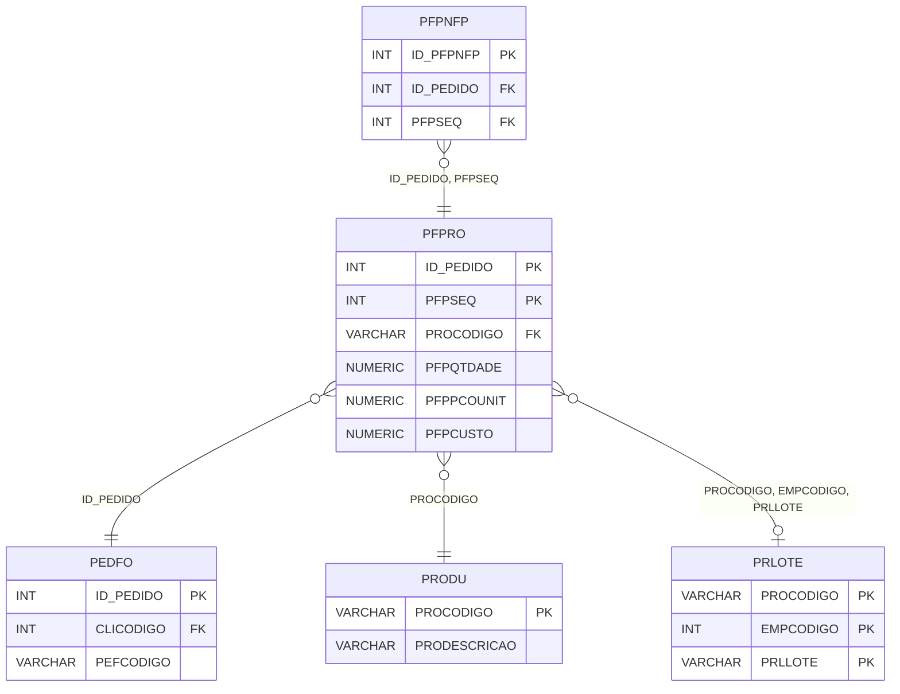

# PFPRO - Documentação Completa de Relacionamentos

## 📊 Informações Gerais

- **Nome da Tabela**: PFPRO (Pedido Fornecedor - Produto)
- **Total de Registros**: 1.860.415
- **Total de Colunas**: 190
- **Chave Primária**: ID_PEDIDO, PFPSEQ (composite)
- **Chaves Estrangeiras**: 5
- **Índices**: 0
- **Tabelas Dependentes**: 2
- **Banco de Dados**: Firebird

## 📝 Descrição

**PFPRO** é uma tabela de detalhamento que armazena produtos relacionados a pedidos de fornecedores. Com **1.860.415 registros** e **190 colunas**, esta tabela registra cada produto incluído em um pedido de fornecedor, com informações completas sobre quantidade, preços, impostos (ICMS, IPI, PIS, COFINS, CSLL, IBS, CBS, IS), custos e outras informações fiscais e comerciais.

Esta tabela é essencial para:
- **Detalhamento de Produtos**: Detalhar produtos incluídos em cada pedido de fornecedor
- **Financeiro**: Gerenciar preços, descontos e valores
- **Fiscal**: Controlar impostos (ICMS, IPI, PIS, COFINS, CSLL, IBS, CBS, IS)
- **Produção**: Fornecer dados para produção e estoque

**Contexto de Negócio:**
Um pedido de fornecedor pode incluir múltiplos produtos, cada um com quantidade, preço, impostos e outras informações específicas. Esta tabela detalha esses produtos com informações completas para faturamento, produção e controle fiscal.

---

## 🔑 Estrutura de Colunas

### Identificação
| Coluna | Tipo | Descrição |
|--------|------|-----------|
| **ID_PEDIDO** 🔑 🔗 | INT | Código do pedido fornecedor (PK, FK → PEDFO) |
| **PFPSEQ** 🔑 | INT | Sequencial do produto no pedido (PK) |
| **PROCODIGO** 🔗 | VARCHAR(14) | Código do produto (FK → PRODU) |
| **PFPDESCRICAO** | VARCHAR(37) | Descrição do produto |
| **UNCODIGO** | VARCHAR(14) | Código da unidade de medida |

### Quantidades e Valores
| Coluna | Tipo | Descrição |
|--------|------|-----------|
| **PFPQTDADE** | NUMERIC(27,2) | Quantidade do produto |
| **PFPPCOUNIT** | NUMERIC(27,2) | Preço unitário |
| **PFPUNITLIQUIDO** | NUMERIC(27,2) | Preço unitário líquido |
| **PFPCUSTO** | NUMERIC(27,2) | Custo do produto |
| **PFPCUSTOTOTAL** | NUMERIC(27,2) | Custo total |
| **PFPCUSTOREAL** | NUMERIC(27,2) | Custo real |
| **PFPVRCONTABIL** | NUMERIC(16,2) | Valor contábil |

### Impostos - ICMS (Múltiplas Versões)
| Coluna | Tipo | Descrição |
|--------|------|-----------|
| **PFPCICMS** | NUMERIC(16,2) | Percentual ICMS |
| **PFPBASEICMS** | NUMERIC(16,2) | Base de cálculo ICMS |
| **PFPVRICMS** | NUMERIC(16,2) | Valor ICMS |
| **PFPPCBASEICMS** | NUMERIC(16,2) | Percentual base ICMS |
| **PFPPCICMSDIF** | NUMERIC(16,2) | Percentual ICMS diferencial |
| **PFPVRICMSDIF** | NUMERIC(16,2) | Valor ICMS diferencial |
| **PFPPCICMSINTER** | NUMERIC(16,2) | Percentual ICMS interestadual |
| **PFPPCICMSUFDEST** | NUMERIC(16,2) | Percentual ICMS UF destino |
| **PFPPCICMSINTERPART** | NUMERIC(16,2) | Percentual ICMS interestadual participação |
| **PFPVRICMSUFDEST** | NUMERIC(16,2) | Valor ICMS UF destino |
| **PFPVRICMSUFREMET** | NUMERIC(16,2) | Valor ICMS UF remetente |
| **PFPBASEICMSSUB** | NUMERIC(16,2) | Base ICMS substituição |
| **PFPVRICMSSUB** | NUMERIC(16,2) | Valor ICMS substituição |
| **PFPPCICMSSUB** | NUMERIC(16,2) | Percentual ICMS substituição |
| **PFPVRICMSSUFRA** | NUMERIC(16,2) | Valor ICMS sufrágio |
| **PFPBASEICMS2** | NUMERIC(16,2) | Base ICMS versão 2 |
| **PFPCICMS2** | NUMERIC(16,2) | Percentual ICMS versão 2 |
| **PFPVRICMS2** | NUMERIC(16,2) | Valor ICMS versão 2 |
| **PFPBASEICMSSUB2** | NUMERIC(16,2) | Base ICMS substituição versão 2 |
| **PFPPCICMSSUB2** | NUMERIC(16,2) | Percentual ICMS substituição versão 2 |
| **PFPVRICMSSUB2** | NUMERIC(16,2) | Valor ICMS substituição versão 2 |

### Impostos - IPI (Múltiplas Versões)
| Coluna | Tipo | Descrição |
|--------|------|-----------|
| **PFPPCIPI** | NUMERIC(16,2) | Percentual IPI |
| **PFPBASEIPI** | NUMERIC(16,2) | Base de cálculo IPI |
| **PFPVRIPI** | NUMERIC(16,2) | Valor IPI |
| **PFPPCIPI2** | NUMERIC(16,2) | Percentual IPI versão 2 |
| **PFPBASEIPI2** | NUMERIC(16,2) | Base IPI versão 2 |
| **PFPVRIPI2** | NUMERIC(16,2) | Valor IPI versão 2 |

### Impostos - PIS (Múltiplas Versões)
| Coluna | Tipo | Descrição |
|--------|------|-----------|
| **PFPPCPIS** | NUMERIC(16,2) | Percentual PIS |
| **PFPBASEPIS** | NUMERIC(16,2) | Base de cálculo PIS |
| **PFPVRPIS** | NUMERIC(16,2) | Valor PIS |
| **PFPPCBSPIS** | NUMERIC(16,2) | Percentual base PIS |
| **PFPVRPISSUFRA** | NUMERIC(16,2) | Valor PIS sufrágio |
| **PFPPCPIS2** | NUMERIC(16,2) | Percentual PIS versão 2 |
| **PFPBASEPIS2** | NUMERIC(16,2) | Base PIS versão 2 |
| **PFPVRPIS2** | NUMERIC(16,2) | Valor PIS versão 2 |
| **PFPPCPISII** | NUMERIC(16,2) | Percentual PIS II |
| **PFPVRPISII** | NUMERIC(16,2) | Valor PIS II |
| **PFPPCBASEPISII** | NUMERIC(16,2) | Percentual base PIS II |
| **PFPBASEPISII** | NUMERIC(16,2) | Base PIS II |
| **PFPPCPISII2** | NUMERIC(16,2) | Percentual PIS II versão 2 |
| **PFPVRPISII2** | NUMERIC(16,2) | Valor PIS II versão 2 |
| **PFPPCBASEPISII2** | NUMERIC(16,2) | Percentual base PIS II versão 2 |
| **PFPBASEPISII2** | NUMERIC(16,2) | Base PIS II versão 2 |

### Impostos - COFINS (Múltiplas Versões)
| Coluna | Tipo | Descrição |
|--------|------|-----------|
| **PFPPCCOFINS** | NUMERIC(16,2) | Percentual COFINS |
| **PFPBASECOFINS** | NUMERIC(16,2) | Base de cálculo COFINS |
| **PFPVRCOFINS** | NUMERIC(16,2) | Valor COFINS |
| **PFPPCBSCOFINS** | NUMERIC(16,2) | Percentual base COFINS |
| **PFPVRCOFINSSUFRA** | NUMERIC(16,2) | Valor COFINS sufrágio |
| **PFPPCCOFINS2** | NUMERIC(16,2) | Percentual COFINS versão 2 |
| **PFPBASECOFINS2** | NUMERIC(16,2) | Base COFINS versão 2 |
| **PFPVRCOFINS2** | NUMERIC(16,2) | Valor COFINS versão 2 |
| **PFPPCCOFINSII** | NUMERIC(16,2) | Percentual COFINS II |
| **PFPVRCOFINSII** | NUMERIC(16,2) | Valor COFINS II |
| **PFPPCBASECOFINSII** | NUMERIC(16,2) | Percentual base COFINS II |
| **PFPBASECOFINSII** | NUMERIC(16,2) | Base COFINS II |
| **PFPPCCOFINSII2** | NUMERIC(16,2) | Percentual COFINS II versão 2 |
| **PFPVRCOFINSII2** | NUMERIC(16,2) | Valor COFINS II versão 2 |
| **PFPPCBASECOFINSII2** | NUMERIC(16,2) | Percentual base COFINS II versão 2 |
| **PFPBASECOFINSII2** | NUMERIC(16,2) | Base COFINS II versão 2 |

### Impostos - CSLL (Múltiplas Versões)
| Coluna | Tipo | Descrição |
|--------|------|-----------|
| **PFPPCBASECSLL** | NUMERIC(16,2) | Percentual base CSLL |
| **PFPBASECSLL** | NUMERIC(16,2) | Base de cálculo CSLL |
| **PFPPCCSLL** | NUMERIC(16,2) | Percentual CSLL |
| **PFPVRCSLL** | NUMERIC(16,2) | Valor CSLL |
| **PFPPCBASECSLL2** | NUMERIC(16,2) | Percentual base CSLL versão 2 |
| **PFPBASECSLL2** | NUMERIC(16,2) | Base CSLL versão 2 |
| **PFPPCCSLL2** | NUMERIC(16,2) | Percentual CSLL versão 2 |
| **PFPVRCSLL2** | NUMERIC(16,2) | Valor CSLL versão 2 |
| **PFPPCCSLLII** | NUMERIC(16,2) | Percentual CSLL II |
| **PFPVRCSLLII** | NUMERIC(16,2) | Valor CSLL II |
| **PFPPCBASECSLLII** | NUMERIC(16,2) | Percentual base CSLL II |
| **PFPBASECSLLII** | NUMERIC(16,2) | Base CSLL II |
| **PFPPCCSLLII2** | NUMERIC(16,2) | Percentual CSLL II versão 2 |
| **PFPVRCSLLII2** | NUMERIC(16,2) | Valor CSLL II versão 2 |
| **PFPPCBASECSLLII2** | NUMERIC(16,2) | Percentual base CSLL II versão 2 |
| **PFPBASECSLLII2** | NUMERIC(16,2) | Base CSLL II versão 2 |

### Impostos - FCP, IBS, CBS, IS
| Coluna | Tipo | Descrição |
|--------|------|-----------|
| **PFPPCFCPUFDEST** | NUMERIC(16,2) | Percentual FCP UF destino |
| **PFPVRFCPUFDEST** | NUMERIC(16,2) | Valor FCP UF destino |
| **PFPBCFCP** | NUMERIC(16,2) | Base FCP |
| **PFPPCFCP** | NUMERIC(16,2) | Percentual FCP |
| **PFPVRFCP** | NUMERIC(16,2) | Valor FCP |
| **PFPBCFCPSUB** | NUMERIC(16,2) | Base FCP substituição |
| **PFPPCFCPSUB** | NUMERIC(16,2) | Percentual FCP substituição |
| **PFPVRFCPSUB** | NUMERIC(16,2) | Valor FCP substituição |
| **PFPBASEIBS** | NUMERIC(16,2) | Base IBS |
| **PFPPCIBS** | NUMERIC(16,2) | Percentual IBS |
| **PFPVRIBS** | NUMERIC(16,2) | Valor IBS |
| **PFPBASECBS** | NUMERIC(16,2) | Base CBS |
| **PFPPCCBS** | NUMERIC(16,2) | Percentual CBS |
| **PFPVRCBS** | NUMERIC(16,2) | Valor CBS |
| **PFPBASEIS** | NUMERIC(16,2) | Base IS |
| **PFPPCIS** | NUMERIC(16,2) | Percentual IS |
| **PFPVRIS** | NUMERIC(16,2) | Valor IS |

### Descontos e Outros Valores
| Coluna | Tipo | Descrição |
|--------|------|-----------|
| **PFPPCDESCTO** | NUMERIC(16,2) | Percentual desconto |
| **PFPVRDESCTOITEM** | NUMERIC(16,2) | Valor desconto item |
| **PFPVRDESCTOGERAL** | NUMERIC(16,2) | Valor desconto geral |
| **PFPVRFRETE** | NUMERIC(16,2) | Valor frete |
| **PFPVRSEGURO** | NUMERIC(16,2) | Valor seguro |
| **PFPVRDESPESA** | NUMERIC(16,2) | Valor despesa |
| **PFPVRISENFINAN** | NUMERIC(16,2) | Valor isenção financeira |
| **PFPVRACRESFIN** | NUMERIC(16,2) | Valor acréscimo financeiro |

### Situações Tributárias
| Coluna | Tipo | Descrição |
|--------|------|-----------|
| **PFPSITTRIB** | VARCHAR(14) | Situação tributária ICMS |
| **PFPSITTRIBIPI** | VARCHAR(14) | Situação tributária IPI |
| **PFPSITTRIBPIS** | VARCHAR(14) | Situação tributária PIS |
| **PFPSITTRIBCOFINS** | VARCHAR(14) | Situação tributária COFINS |
| **PFPSITTRIBIBS** | VARCHAR(37) | Situação tributária IBS |
| **PFPSITTRIBCBS** | VARCHAR(37) | Situação tributária CBS |
| **PFPSITTRIBIS** | VARCHAR(37) | Situação tributária IS |

### Outros Campos Importantes
| Coluna | Tipo | Descrição |
|--------|------|-----------|
| **EMPCODIGO** | INT | Código da empresa |
| **PRLLOTE** | VARCHAR(14) | Lote do produto (FK → PRLOTE) |
| **PRLLOTEFOR** | VARCHAR(14) | Lote do fornecedor |
| **FISCODIGO** | VARCHAR(14) | Código fiscal |
| **PCTNUMERO** | INT | Código da parcela cliente |
| **PFPLCETQ** | VARCHAR(14) | Flag etiqueta |
| **PFPLCCOMIS** | VARCHAR(14) | Flag comissão |
| **PFPLCFINAN** | VARCHAR(14) | Flag financeiro |
| **PFPVRALTERADO** | VARCHAR(14) | Flag valor alterado |
| **PFPBCUFDEST** | NUMERIC(16,2) | Base UF destino |
| **PFPCODCLASSTRIBIBS** | NUMERIC(16,2) | Código classificação tributária IBS |
| **PFPCODCLASSTRIBCBS** | NUMERIC(16,2) | Código classificação tributária CBS |
| **PFPCODCLASSTRIBIS** | NUMERIC(16,2) | Código classificação tributária IS |
| **ID_PEDIDO_ORIGEM** | INT | Código do pedido origem |
| **PFPNRDRAW** | VARCHAR(37) | Número DRAW |

---

## 🔗 Relacionamentos - Nível 1 (Diretos)

### PEDFO - Pedido Fornecedor (FK Obrigatória)
**Volume:** 129.041 registros

**Relacionamento:**
```
PFPRO.ID_PEDIDO → PEDFO.ID_PEDIDO (N:1)
Constraint: PEDFO_PFPRO
```

**Descrição:** Cada produto está vinculado a um pedido de fornecedor específico.

**Proporção:** ~14,4 produtos por pedido em média (1.860.415 / 129.041)

---

### PRODU - Produto (FK Obrigatória)
**Volume:** 178.187 registros

**Relacionamento:**
```
PFPRO.PROCODIGO → PRODU.PROCODIGO (N:1)
Constraint: PRODUPFPRO
```

**Descrição:** Identifica o produto relacionado ao pedido de fornecedor.

---

### PRLOTE - Lote do Produto (FK Opcional)
**Volume:** Variável

**Relacionamento:**
```
PFPRO.PROCODIGO, EMPCODIGO, PRLLOTE → PRLOTE.PROCODIGO, EMPCODIGO, PRLLOTE (N:1)
Constraint: PRLLOTE_PFPRO
```

**Descrição:** Relaciona com informações de lote do produto.

---

## 📊 Tabelas que Referenciam Esta

Esta tabela é referenciada por 2 tabelas:

### PFPNFP - Produto Pedido Fornecedor x NF Produto
**Volume:** 310 registros

**Relacionamento:**
```
PFPNFP.ID_PEDIDO, PFPSEQ → PFPRO.ID_PEDIDO, PFPSEQ (N:1)
Constraint: PFPRO_PFPNFP
```

**Descrição:** Relaciona produtos de pedidos de fornecedores com produtos de notas fiscais.

---

## 🗺️ Diagrama de Relacionamentos



---

## 💡 Exemplos de Uso

### Consulta Básica

```sql
SELECT ID_PEDIDO, PFPSEQ, PROCODIGO, PFPDESCRICAO, PFPQTDADE, PFPPCOUNIT, PFPCUSTO
FROM PFPRO
WHERE ID_PEDIDO = ?
ORDER BY PFPSEQ;
```

### Consulta com Informações do Produto

```sql
SELECT 
    pfp.*,
    pr.PRODESCRICAO,
    pr.PROUN,
    u.UNDESCRICAO
FROM PFPRO pfp
INNER JOIN PRODU pr
    ON pfp.PROCODIGO = pr.PROCODIGO
LEFT JOIN UNMED u
    ON pfp.UNCODIGO = u.UNCODIGO
WHERE pfp.ID_PEDIDO = ?
ORDER BY pfp.PFPSEQ;
```

### Consulta com Informações do Pedido

```sql
SELECT 
    pfp.*,
    pf.PEFCODIGO,
    pf.PEFDTEMIS,
    pf.PEFVRTOTAL,
    pr.PRODESCRICAO
FROM PFPRO pfp
INNER JOIN PEDFO pf
    ON pfp.ID_PEDIDO = pf.ID_PEDIDO
INNER JOIN PRODU pr
    ON pfp.PROCODIGO = pr.PROCODIGO
WHERE pfp.ID_PEDIDO = ?;
```

### Soma de Valores por Pedido

```sql
SELECT 
    ID_PEDIDO,
    COUNT(*) AS TOTAL_PRODUTOS,
    SUM(PFPQTDADE * PFPPCOUNIT) AS VALOR_TOTAL
FROM PFPRO
GROUP BY ID_PEDIDO;
```

### Consulta de Produtos com Impostos

```sql
SELECT 
    pfp.*,
    pr.PRODESCRICAO
FROM PFPRO pfp
INNER JOIN PRODU pr
    ON pfp.PROCODIGO = pr.PROCODIGO
WHERE pfp.PFPVRICMS > 0
    OR pfp.PFPVRIPI > 0
    OR pfp.PFPVRPIS > 0
ORDER BY pfp.ID_PEDIDO, pfp.PFPSEQ;
```

---

## ⚡ Performance e Otimização

### Índices Recomendados

#### 1. Índice Composto na Chave Primária (Já existe implicitamente)
```sql
-- Índice primário já existe implicitamente
```

#### 2. Índice em PROCODIGO
```sql
CREATE INDEX IDX_PFPRO_PROCODIGO 
ON PFPRO (PROCODIGO);
```

**Justificativa:** Facilita buscas por produto (muito frequente).

#### 3. Índice em EMPCODIGO
```sql
CREATE INDEX IDX_PFPRO_EMPCODIGO 
ON PFPRO (EMPCODIGO);
```

**Justificativa:** Facilita buscas por empresa.

---

## 📊 Estatísticas e Insights

### Volume de Dados

- **Total de Registros**: 1.860.415
- **Tamanho Médio Estimado**: ~600 bytes por registro
- **Tamanho Total Estimado**: ~1.1 GB

### Distribuição de Dados

- **Pedidos com Produtos**: 129.041 pedidos
- **Média de Produtos**: ~14,4 produtos por pedido

---

## 🔧 Integração com Código Laravel

### Model Eloquent

```php
<?php

namespace App\Models;

use Illuminate\Database\Eloquent\Model;
use Illuminate\Database\Eloquent\Relations\BelongsTo;
use Illuminate\Database\Eloquent\Relations\HasMany;

final class PfPro extends Model
{
    protected $table = 'PFPRO';
    public $incrementing = false;
    public $timestamps = false;

    protected $primaryKey = ['ID_PEDIDO', 'PFPSEQ'];

    protected $fillable = [
        'ID_PEDIDO',
        'PFPSEQ',
        'PROCODIGO',
        'PFPDESCRICAO',
        'PFPQTDADE',
        'PFPPCOUNIT',
        // ... todos os outros campos (190 colunas)
    ];

    protected $casts = [
        'ID_PEDIDO' => 'integer',
        'PFPSEQ' => 'integer',
        'PROCODIGO' => 'string',
        'PFPQTDADE' => 'decimal:2',
        'PFPPCOUNIT' => 'decimal:2',
        // ... casts para todos os campos numéricos
    ];

    /**
     * Relacionamento com Pedido Fornecedor
     */
    public function pedidoFornecedor(): BelongsTo
    {
        return $this->belongsTo(PedFo::class, 'ID_PEDIDO', 'ID_PEDIDO');
    }

    /**
     * Relacionamento com Produto
     */
    public function produto(): BelongsTo
    {
        return $this->belongsTo(Produ::class, 'PROCODIGO', 'PROCODIGO');
    }

    /**
     * Relacionamento com Lote
     */
    public function lote(): BelongsTo
    {
        return $this->belongsTo(PrLote::class, ['PROCODIGO', 'EMPCODIGO', 'PRLLOTE'], ['PROCODIGO', 'EMPCODIGO', 'PRLLOTE']);
    }

    /**
     * Relacionamento com Produtos NF
     */
    public function produtosNf(): HasMany
    {
        return $this->hasMany(PfPnFp::class, ['ID_PEDIDO', 'PFPSEQ'], ['ID_PEDIDO', 'PFPSEQ']);
    }

    /**
     * Buscar produtos por pedido
     */
    public static function produtosPorPedido(int $idPedido)
    {
        return self::where('ID_PEDIDO', $idPedido)
            ->with(['produto', 'lote'])
            ->orderBy('PFPSEQ')
            ->get();
    }

    /**
     * Calcular valor total do produto
     */
    public function getValorTotalAttribute(): float
    {
        return (float) $this->PFPQTDADE * (float) $this->PFPPCOUNIT;
    }
}
```

---

## ✅ Boas Práticas

### Design

1. **Chave Composta**: Manter integridade da chave composta
2. **Validação**: Validar valores antes de inserir
3. **Impostos**: Validar cálculos de impostos

### Performance

1. **Índices**: Usar índices para buscas frequentes (crítico devido ao volume)
2. **Consultas**: Usar eager loading para relacionamentos
3. **Volume**: Considerar particionamento devido ao grande volume

### Segurança

1. **Validação**: Validar valores antes de inserir
2. **Acesso**: Restringir acesso de escrita a usuários autorizados
3. **Fiscal**: Validar cálculos fiscais cuidadosamente

---

**Documentação gerada em**: 2025-01-27

**Banco de dados**: Firebird

