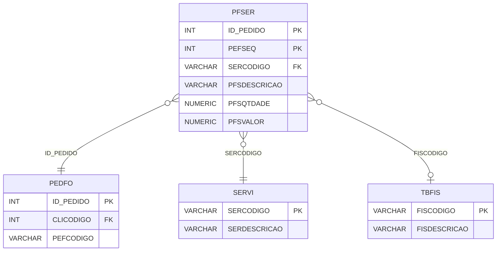

# PFSER - Documentação Completa de Relacionamentos

## 📊 Informações Gerais

- **Nome da Tabela**: PFSER (Pedido Fornecedor - Serviço)
- **Total de Registros**: 4
- **Total de Colunas**: 167
- **Chave Primária**: ID_PEDIDO, PEFSEQ (composite)
- **Chaves Estrangeiras**: 3
- **Índices**: 0
- **Tabelas Dependentes**: 0
- **Banco de Dados**: Firebird

## 📝 Descrição

**PFSER** é uma tabela de detalhamento que armazena serviços relacionados a pedidos de fornecedores. Com apenas **4 registros** e **167 colunas**, esta tabela registra serviços incluídos em pedidos de fornecedores, com informações completas sobre quantidade, valores, impostos (ISS, IR, INSS, IPI, ICMS, PIS, COFINS, CSLL, IBS, CBS, IS) e outras informações fiscais.

Esta tabela é essencial para:
- **Detalhamento de Serviços**: Detalhar serviços incluídos em cada pedido de fornecedor
- **Financeiro**: Gerenciar valores e impostos de serviços
- **Fiscal**: Controlar impostos sobre serviços (ISS, IR, INSS, etc.)
- **Relatórios**: Gerar relatórios de serviços

**Contexto de Negócio:**
Um pedido de fornecedor pode incluir serviços, cada um com quantidade, valor, impostos e outras informações específicas. Esta tabela detalha esses serviços com informações completas para faturamento e controle fiscal.

---

## 🔑 Estrutura de Colunas

### Identificação
| Coluna | Tipo | Descrição |
|--------|------|-----------|
| **ID_PEDIDO** 🔑 🔗 | INT | Código do pedido fornecedor (PK, FK → PEDFO) |
| **PEFSEQ** 🔑 | INT | Sequencial do serviço no pedido (PK) |
| **SERCODIGO** 🔗 | VARCHAR(14) | Código do serviço (FK → SERVI) |
| **PFSDESCRICAO** | VARCHAR(37) | Descrição do serviço |
| **PFSQTDADE** | NUMERIC(27,2) | Quantidade do serviço |
| **PFSVALOR** | NUMERIC(27,2) | Valor do serviço |
| **PFSUNITLIQUIDO** | NUMERIC(27,2) | Valor unitário líquido |

### Impostos - ISS (Múltiplas Versões)
| Coluna | Tipo | Descrição |
|--------|------|-----------|
| **PFSBASEISS** | NUMERIC(16,2) | Base de cálculo ISS |
| **PFSPCISS** | NUMERIC(16,2) | Percentual ISS |
| **PFSVRISS** | NUMERIC(16,2) | Valor ISS |
| **PFSISEISS** | NUMERIC(16,2) | Valor isenção ISS |
| **PFSBASEISS2** | NUMERIC(16,2) | Base ISS versão 2 |
| **PFSPCISS2** | NUMERIC(16,2) | Percentual ISS versão 2 |
| **PFSVRISS2** | NUMERIC(16,2) | Valor ISS versão 2 |
| **PFSISEISS2** | NUMERIC(16,2) | Valor isenção ISS versão 2 |
| **PFSVRISSRET** | NUMERIC(16,2) | Valor ISS retido |
| **PFSPCISSRET** | NUMERIC(16,2) | Percentual ISS retido |
| **PFSBASEISSRET** | NUMERIC(16,2) | Base ISS retido |
| **PFSVRISSRET2** | NUMERIC(16,2) | Valor ISS retido versão 2 |
| **PFSPCISSRET2** | NUMERIC(16,2) | Percentual ISS retido versão 2 |
| **PFSBASEISSRET2** | NUMERIC(16,2) | Base ISS retido versão 2 |

### Impostos - IR, INSS, IPI, ICMS
| Coluna | Tipo | Descrição |
|--------|------|-----------|
| **PFSBASEIR** | NUMERIC(16,2) | Base IR |
| **PFSPCIR** | NUMERIC(16,2) | Percentual IR |
| **PFSVRIR** | NUMERIC(16,2) | Valor IR |
| **PFSBASEINSS** | NUMERIC(16,2) | Base INSS |
| **PFSPCINSS** | NUMERIC(16,2) | Percentual INSS |
| **PFSVRINSS** | NUMERIC(16,2) | Valor INSS |
| **PFSBASEIPI** | NUMERIC(16,2) | Base IPI |
| **PFSPCIPI** | NUMERIC(16,2) | Percentual IPI |
| **PFSVRIPI** | NUMERIC(16,2) | Valor IPI |
| **PFSBASEICMS** | NUMERIC(16,2) | Base ICMS |
| **PFSPCICMS** | NUMERIC(16,2) | Percentual ICMS |
| **PFSVRICMS** | NUMERIC(16,2) | Valor ICMS |

### Impostos - PIS, COFINS, CSLL (Múltiplas Versões)
| Coluna | Tipo | Descrição |
|--------|------|-----------|
| **PFSPCPIS** | NUMERIC(16,2) | Percentual PIS |
| **PFSBASEPIS** | NUMERIC(16,2) | Base PIS |
| **PFSVRPIS** | NUMERIC(16,2) | Valor PIS |
| **PFSPCCOFINS** | NUMERIC(16,2) | Percentual COFINS |
| **PFSBASECOFINS** | NUMERIC(16,2) | Base COFINS |
| **PFSVRCOFINS** | NUMERIC(16,2) | Valor COFINS |
| **PFSPCCSLL** | NUMERIC(16,2) | Percentual CSLL |
| **PFSBASECSLL** | NUMERIC(16,2) | Base CSLL |
| **PFSVRCSLL** | NUMERIC(16,2) | Valor CSLL |

### Impostos - IBS, CBS, IS
| Coluna | Tipo | Descrição |
|--------|------|-----------|
| **PFSBASEIBS** | NUMERIC(16,2) | Base IBS |
| **PFSPCIBS** | NUMERIC(16,2) | Percentual IBS |
| **PFSVRIBS** | NUMERIC(16,2) | Valor IBS |
| **PFSBASECBS** | NUMERIC(16,2) | Base CBS |
| **PFSPCCBS** | NUMERIC(16,2) | Percentual CBS |
| **PFSVRCBS** | NUMERIC(16,2) | Valor CBS |
| **PFSBASEIS** | NUMERIC(16,2) | Base IS |
| **PFSPCIS** | NUMERIC(16,2) | Percentual IS |
| **PFSVRIS** | NUMERIC(16,2) | Valor IS |

### Situações Tributárias
| Coluna | Tipo | Descrição |
|--------|------|-----------|
| **PFSSITTRIB** | VARCHAR(14) | Situação tributária |
| **PFSSITTRIBIPI** | VARCHAR(14) | Situação tributária IPI |
| **PFSSITTRIBPIS** | VARCHAR(14) | Situação tributária PIS |
| **PFSSITTRIBCOFINS** | VARCHAR(14) | Situação tributária COFINS |
| **PFSSITTRIBIBS** | VARCHAR(37) | Situação tributária IBS |
| **PFSSITTRIBCBS** | VARCHAR(37) | Situação tributária CBS |
| **PFSSITTRIBIS** | VARCHAR(37) | Situação tributária IS |

### Outros Campos
| Coluna | Tipo | Descrição |
|--------|------|-----------|
| **FISCODIGO** 🔗 | VARCHAR(14) | Código fiscal (FK → TBFIS) |
| **PFSPCDESCTO** | NUMERIC(16,2) | Percentual desconto |
| **PFSVRDESCTOITEM** | NUMERIC(16,2) | Valor desconto item |
| **PFSVRDESCTOGERAL** | NUMERIC(16,2) | Valor desconto geral |
| **PFSVRFRETE** | NUMERIC(16,2) | Valor frete |
| **PFSVRSEGURO** | NUMERIC(16,2) | Valor seguro |
| **PFSVRDESPESA** | NUMERIC(16,2) | Valor despesa |
| **PFSVRCONTABIL** | NUMERIC(16,2) | Valor contábil |
| **PFSLCETQ** | VARCHAR(14) | Flag etiqueta |
| **PFSLCCOMIS** | VARCHAR(14) | Flag comissão |
| **PFSLCFINAN** | VARCHAR(14) | Flag financeiro |
| **PCTNUMERO** | INT | Código da parcela cliente |
| **PFSVRALTERADO** | VARCHAR(14) | Flag valor alterado |
| **PFSCODCLASSTRIBIBS** | NUMERIC(16,2) | Código classificação tributária IBS |
| **PFSCODCLASSTRIBCBS** | NUMERIC(16,2) | Código classificação tributária CBS |
| **PFSCODCLASSTRIBIS** | NUMERIC(16,2) | Código classificação tributária IS |

---

## 🔗 Relacionamentos - Nível 1 (Diretos)

### PEDFO - Pedido Fornecedor (FK Obrigatória)
**Volume:** 129.041 registros

**Relacionamento:**
```
PFSER.ID_PEDIDO → PEDFO.ID_PEDIDO (N:1)
Constraint: PEDFO_PFSER
```

**Descrição:** Cada serviço está vinculado a um pedido de fornecedor específico.

**Proporção:** Muito baixa (~0,003% dos pedidos têm serviços)

---

### SERVI - Serviço (FK Obrigatória)
**Volume:** 13 registros

**Relacionamento:**
```
PFSER.SERCODIGO → SERVI.SERCODIGO (N:1)
Constraint: SERVI_PFSER
```

**Descrição:** Identifica o serviço relacionado ao pedido de fornecedor.

---

### TBFIS - Tabela Fiscal (FK Opcional)
**Volume:** 311 registros

**Relacionamento:**
```
PFSER.FISCODIGO → TBFIS.FISCODIGO (N:1)
Constraint: TBFIS_PFSER
```

**Descrição:** Define a configuração fiscal do serviço.

---

## 🔗 Relacionamentos - Nível 2 (Indiretos)

### PEDFO → CLIEN (Fornecedor)
**Volume:** 9.251 registros

**Relacionamento:**
```
PFSER → PEDFO → CLIEN
```

**Descrição:** Através de PEDFO, é possível identificar o fornecedor relacionado.

---

## 🗺️ Diagrama de Relacionamentos



---

## 💡 Exemplos de Uso

### Consulta Básica

```sql
SELECT ID_PEDIDO, PEFSEQ, SERCODIGO, PFSDESCRICAO, PFSQTDADE, PFSVALOR
FROM PFSER
WHERE ID_PEDIDO = ?
ORDER BY PEFSEQ;
```

### Consulta com Informações do Serviço

```sql
SELECT 
    ps.*,
    s.SERDESCRICAO,
    s.SERVALOR,
    tf.FISDESCRICAO
FROM PFSER ps
INNER JOIN SERVI s
    ON ps.SERCODIGO = s.SERCODIGO
LEFT JOIN TBFIS tf
    ON ps.FISCODIGO = tf.FISCODIGO
WHERE ps.ID_PEDIDO = ?;
```

### Consulta com Informações do Pedido

```sql
SELECT 
    ps.*,
    pf.PEFCODIGO,
    pf.PEFDTEMIS,
    pf.PEFVRTOTAL,
    s.SERDESCRICAO
FROM PFSER ps
INNER JOIN PEDFO pf
    ON ps.ID_PEDIDO = pf.ID_PEDIDO
INNER JOIN SERVI s
    ON ps.SERCODIGO = s.SERCODIGO
WHERE ps.ID_PEDIDO = ?;
```

### Soma de Valores por Pedido

```sql
SELECT 
    ID_PEDIDO,
    COUNT(*) AS TOTAL_SERVICOS,
    SUM(PFSVALOR) AS VALOR_TOTAL
FROM PFSER
GROUP BY ID_PEDIDO;
```

---

## ⚡ Performance e Otimização

### Índices Recomendados

#### 1. Índice Composto na Chave Primária (Já existe implicitamente)
```sql
-- Índice primário já existe implicitamente
```

#### 2. Índice em SERCODIGO
```sql
CREATE INDEX IDX_PFSER_SERCODIGO 
ON PFSER (SERCODIGO);
```

**Justificativa:** Facilita buscas por serviço.

---

## 📊 Estatísticas e Insights

### Volume de Dados

- **Total de Registros**: 4
- **Tamanho Médio Estimado**: ~500 bytes por registro
- **Tamanho Total Estimado**: ~2 KB

### Distribuição de Dados

- **Pedidos com Serviços**: 4 pedidos
- **Taxa de Utilização**: Muito baixa (~0,003% dos pedidos têm serviços)

---

## 🔧 Integração com Código Laravel

### Model Eloquent

```php
<?php

namespace App\Models;

use Illuminate\Database\Eloquent\Model;
use Illuminate\Database\Eloquent\Relations\BelongsTo;

final class PfSer extends Model
{
    protected $table = 'PFSER';
    public $incrementing = false;
    public $timestamps = false;

    protected $primaryKey = ['ID_PEDIDO', 'PEFSEQ'];

    protected $fillable = [
        'ID_PEDIDO',
        'PEFSEQ',
        'SERCODIGO',
        'PFSDESCRICAO',
        'PFSQTDADE',
        'PFSVALOR',
        // ... todos os outros campos (167 colunas)
    ];

    protected $casts = [
        'ID_PEDIDO' => 'integer',
        'PEFSEQ' => 'integer',
        'SERCODIGO' => 'string',
        'PFSQTDADE' => 'decimal:2',
        'PFSVALOR' => 'decimal:2',
        // ... casts para todos os campos numéricos
    ];

    /**
     * Relacionamento com Pedido Fornecedor
     */
    public function pedidoFornecedor(): BelongsTo
    {
        return $this->belongsTo(PedFo::class, 'ID_PEDIDO', 'ID_PEDIDO');
    }

    /**
     * Relacionamento com Serviço
     */
    public function servico(): BelongsTo
    {
        return $this->belongsTo(Servi::class, 'SERCODIGO', 'SERCODIGO');
    }

    /**
     * Relacionamento com Tabela Fiscal
     */
    public function tabelaFiscal(): BelongsTo
    {
        return $this->belongsTo(TbFis::class, 'FISCODIGO', 'FISCODIGO');
    }

    /**
     * Buscar serviços por pedido
     */
    public static function servicosPorPedido(int $idPedido)
    {
        return self::where('ID_PEDIDO', $idPedido)
            ->with(['servico', 'tabelaFiscal'])
            ->orderBy('PEFSEQ')
            ->get();
    }
}
```

---

## ✅ Boas Práticas

### Design

1. **Chave Composta**: Manter integridade da chave composta
2. **Validação**: Validar valores antes de inserir
3. **Impostos**: Validar cálculos de impostos sobre serviços

### Performance

1. **Índices**: Usar índices para buscas frequentes
2. **Consultas**: Usar eager loading para relacionamentos

### Segurança

1. **Validação**: Validar valores antes de inserir
2. **Acesso**: Restringir acesso de escrita a usuários autorizados
3. **Fiscal**: Validar cálculos fiscais cuidadosamente

---

**Documentação gerada em**: 2025-01-27

**Banco de dados**: Firebird

