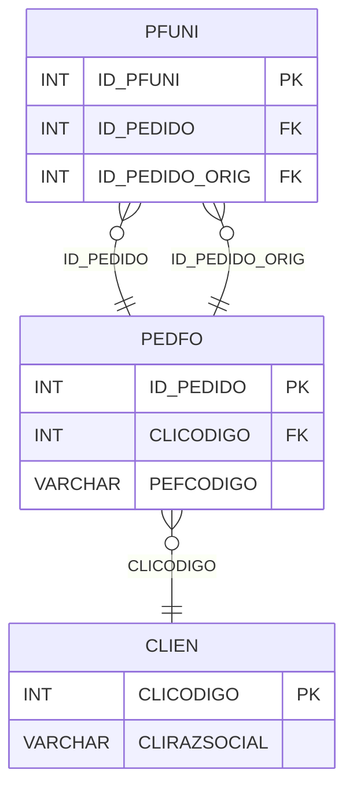

# PFUNI - Documentação Completa de Relacionamentos

## 📊 Informações Gerais

- **Nome da Tabela**: PFUNI (Pedido Fornecedor - Unificação)
- **Total de Registros**: 2
- **Total de Colunas**: 3
- **Chave Primária**: ID_PFUNI
- **Chaves Estrangeiras**: 2
- **Índices**: 0
- **Tabelas Dependentes**: 0
- **Banco de Dados**: Firebird

## 📝 Descrição

**PFUNI** é uma tabela de relacionamento que gerencia a unificação de pedidos de fornecedores. Com apenas **2 registros**, esta tabela relaciona pedidos de fornecedores unificados com seus pedidos originais, permitindo rastrear quando pedidos foram unificados em um único pedido.

Esta tabela é essencial para:
- **Rastreamento**: Rastrear pedidos de fornecedores unificados e seus originais
- **Histórico**: Manter histórico de unificações
- **Relatórios**: Gerar relatórios de pedidos unificados
- **Auditoria**: Facilitar auditoria de unificações

**Contexto de Negócio:**
Quando múltiplos pedidos de fornecedores são unificados em um único pedido, esta tabela registra essa relação, permitindo rastrear os pedidos originais a partir do pedido unificado.

---

## 🔑 Estrutura de Colunas

| Coluna | Tipo | Descrição |
|--------|------|-----------|
| **ID_PFUNI** 🔑 | INT | Identificador único do relacionamento (PK) |
| **ID_PEDIDO** 🔗 | INT | Código do pedido fornecedor unificado (FK → PEDFO) |
| **ID_PEDIDO_ORIG** 🔗 | INT | Código do pedido fornecedor original (FK → PEDFO) |

---

## 🔗 Relacionamentos - Nível 1 (Diretos)

### PEDFO - Pedido Fornecedor Unificado (FK Obrigatória)
**Volume:** 129.041 registros

**Relacionamento:**
```
PFUNI.ID_PEDIDO → PEDFO.ID_PEDIDO (N:1)
Constraint: PEDFO_PFUNI
```

**Descrição:** Cada registro relaciona um pedido de fornecedor unificado com um pedido original.

---

### PEDFO - Pedido Fornecedor Original (FK Obrigatória)
**Volume:** 129.041 registros

**Relacionamento:**
```
PFUNI.ID_PEDIDO_ORIG → PEDFO.ID_PEDIDO (N:1)
Constraint: PEDFO_PFUNIORIG
```

**Descrição:** Cada registro relaciona um pedido de fornecedor original com um pedido unificado.

---

## 🔗 Relacionamentos - Nível 2 (Indiretos)

### PEDFO → CLIEN (Fornecedor)
**Volume:** 9.251 registros

**Relacionamento:**
```
PFUNI → PEDFO → CLIEN
```

**Descrição:** Através de PEDFO, é possível identificar os fornecedores relacionados aos pedidos unificados e originais.

---

## 🗺️ Diagrama de Relacionamentos



---

## 💡 Exemplos de Uso

### Consulta Básica

```sql
SELECT ID_PFUNI, ID_PEDIDO, ID_PEDIDO_ORIG
FROM PFUNI
WHERE ID_PFUNI = ?;
```

### Consulta com Informações dos Pedidos

```sql
SELECT 
    pu.*,
    pu_unificado.PEFCODIGO AS PEFCODIGO_UNIFICADO,
    pu_unificado.PEFDTEMIS AS DTEMIS_UNIFICADO,
    pu_original.PEFCODIGO AS PEFCODIGO_ORIGINAL,
    pu_original.PEFDTEMIS AS DTEMIS_ORIGINAL
FROM PFUNI pu
INNER JOIN PEDFO pu_unificado
    ON pu.ID_PEDIDO = pu_unificado.ID_PEDIDO
INNER JOIN PEDFO pu_original
    ON pu.ID_PEDIDO_ORIG = pu_original.ID_PEDIDO
WHERE pu.ID_PFUNI = ?;
```

### Consulta de Pedidos Originais por Unificado

```sql
SELECT 
    pu_unificado.PEFCODIGO AS PEDIDO_UNIFICADO,
    pu_original.PEFCODIGO AS PEDIDO_ORIGINAL,
    pu_original.PEFDTEMIS,
    pu_original.PEFVRTOTAL
FROM PFUNI pu
INNER JOIN PEDFO pu_unificado
    ON pu.ID_PEDIDO = pu_unificado.ID_PEDIDO
INNER JOIN PEDFO pu_original
    ON pu.ID_PEDIDO_ORIG = pu_original.ID_PEDIDO
WHERE pu.ID_PEDIDO = ?
ORDER BY pu_original.PEFDTEMIS;
```

### Inserção de Unificação

```sql
INSERT INTO PFUNI (ID_PEDIDO, ID_PEDIDO_ORIG)
VALUES (?, ?);
```

---

## ⚡ Performance e Otimização

### Índices Recomendados

#### 1. Índice na Chave Primária (Já existe implicitamente)
```sql
-- Índice primário já existe implicitamente
```

#### 2. Índice em ID_PEDIDO_ORIG
```sql
CREATE INDEX IDX_PFUNI_ID_PEDIDO_ORIG 
ON PFUNI (ID_PEDIDO_ORIG);
```

**Justificativa:** Facilita buscas por pedido original.

---

## 📊 Estatísticas e Insights

### Volume de Dados

- **Total de Registros**: 2
- **Tamanho Médio Estimado**: ~20 bytes por registro
- **Tamanho Total Estimado**: ~40 bytes

### Distribuição de Dados

- **Unificações**: 2 relacionamentos de unificação
- **Taxa de Utilização**: Muito baixa (~0,002% dos pedidos foram unificados)

---

## 🔧 Integração com Código Laravel

### Model Eloquent

```php
<?php

namespace App\Models;

use Illuminate\Database\Eloquent\Model;
use Illuminate\Database\Eloquent\Relations\BelongsTo;

final class PfUni extends Model
{
    protected $table = 'PFUNI';
    protected $primaryKey = 'ID_PFUNI';
    public $incrementing = true;
    public $timestamps = false;

    protected $fillable = [
        'ID_PEDIDO',
        'ID_PEDIDO_ORIG',
    ];

    protected $casts = [
        'ID_PFUNI' => 'integer',
        'ID_PEDIDO' => 'integer',
        'ID_PEDIDO_ORIG' => 'integer',
    ];

    /**
     * Relacionamento com Pedido Fornecedor Unificado
     */
    public function pedidoUnificado(): BelongsTo
    {
        return $this->belongsTo(PedFo::class, 'ID_PEDIDO', 'ID_PEDIDO');
    }

    /**
     * Relacionamento com Pedido Fornecedor Original
     */
    public function pedidoOriginal(): BelongsTo
    {
        return $this->belongsTo(PedFo::class, 'ID_PEDIDO_ORIG', 'ID_PEDIDO');
    }

    /**
     * Buscar pedidos originais por unificado
     */
    public static function originaisPorUnificado(int $idPedido)
    {
        return self::where('ID_PEDIDO', $idPedido)
            ->with(['pedidoOriginal', 'pedidoUnificado'])
            ->get();
    }
}
```

---

## ✅ Boas Práticas

### Design

1. **Chave Primária**: ID_PFUNI deve ser único e sequencial
2. **Validação**: Validar que ID_PEDIDO e ID_PEDIDO_ORIG sejam diferentes
3. **Ciclos**: Evitar criar ciclos de unificação

### Performance

1. **Índices**: Usar índice para busca por pedido original
2. **Consultas**: Usar eager loading para relacionamentos

### Segurança

1. **Validação**: Validar valores antes de inserir
2. **Acesso**: Restringir acesso de escrita a usuários autorizados
3. **Integridade**: Validar que pedidos existam antes de unificar

---

**Documentação gerada em**: 2025-01-27

**Banco de dados**: Firebird

