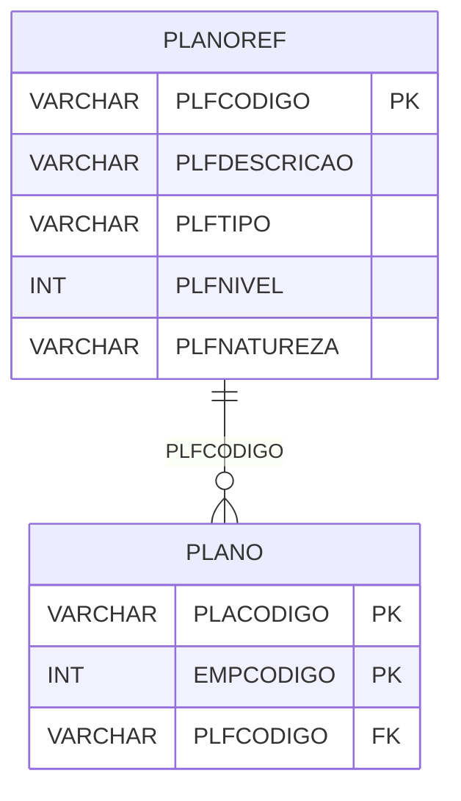

# PLANOREF - Documentação Completa de Relacionamentos

## 📊 Informações Gerais

- **Nome da Tabela**: PLANOREF (Plano de Contas de Referência)
- **Total de Registros**: 1.031
- **Total de Colunas**: 8
- **Chave Primária**: PLFCODIGO
- **Chaves Estrangeiras**: 0
- **Índices**: 0
- **Tabelas Dependentes**: 1
- **Banco de Dados**: Firebird

## 📝 Descrição

**PLANOREF** é uma tabela mestre que armazena planos de contas de referência padrão. Com **1.031 registros**, esta tabela define contas contábeis padrão que podem ser referenciadas pelos planos de contas específicos de cada empresa.

Esta tabela é essencial para:
- **Padronização**: Manter planos de contas padrão
- **Referência**: Servir como referência para planos de contas de empresas
- **Hierarquia**: Manter hierarquia de contas padrão
- **Migração**: Facilitar migração e padronização de contas

**Contexto de Negócio:**
O sistema possui planos de contas padrão que podem ser usados como referência ao criar planos de contas específicos para cada empresa. Esta tabela armazena esses planos padrão.

---

## 🔑 Estrutura de Colunas

| Coluna | Tipo | Descrição |
|--------|------|-----------|
| **PLFCODIGO** 🔑 | VARCHAR(37) | Código da conta de referência (PK) |
| **PLFDESCRICAO** | VARCHAR(37) | Descrição da conta |
| **PLFTIPO** | VARCHAR(37) | Tipo da conta |
| **PLFDTINI** | DATE | Data inicial |
| **PLFDTFIN** | DATE | Data final |
| **PLFSUPERIOR** | VARCHAR(37) | Código da conta superior (hierarquia) |
| **PLFNIVEL** | INT | Nível hierárquico da conta |
| **PLFNATUREZA** | VARCHAR(14) | Natureza da conta |

---

## 🔗 Relacionamentos - Nível 1 (Diretos)

### Tabelas que Referenciam Esta

### PLANO - Plano de Contas
**Volume:** 5.190 registros

**Relacionamento:**
```
PLANO.PLFCODIGO → PLANOREF.PLFCODIGO (N:1)
Constraint: PLANOREF_PLANO
```

**Descrição:** Cada conta do plano de contas pode referenciar uma conta do plano de referência.

---

## 🔗 Relacionamentos - Nível 2 (Indiretos)

### PLANO → EMPRESA (Empresa)
**Volume:** 6 registros

**Relacionamento:**
```
PLANOREF → PLANO → EMPRESA
```

**Descrição:** Através de PLANO, é possível identificar empresas que usam este plano de referência.

---

## 🗺️ Diagrama de Relacionamentos



---

## 💡 Exemplos de Uso

### Consulta Básica

```sql
SELECT PLFCODIGO, PLFDESCRICAO, PLFTIPO, PLFNIVEL, PLFNATUREZA
FROM PLANOREF
WHERE PLFCODIGO = ?;
```

### Consulta com Contas Relacionadas

```sql
SELECT 
    pr.*,
    COUNT(p.PLACODIGO) AS TOTAL_CONTAS_USANDO
FROM PLANOREF pr
LEFT JOIN PLANO p
    ON pr.PLFCODIGO = p.PLFCODIGO
GROUP BY pr.PLFCODIGO, pr.PLFDESCRICAO, pr.PLFTIPO, pr.PLNIVEL, pr.PLNATUREZA
ORDER BY TOTAL_CONTAS_USANDO DESC;
```

### Consulta de Contas por Nível

```sql
SELECT 
    PLFNIVEL,
    COUNT(*) AS TOTAL_CONTAS
FROM PLANOREF
GROUP BY PLFNIVEL
ORDER BY PLFNIVEL;
```

### Consulta Hierárquica (Contas e Subcontas)

```sql
SELECT 
    pr_superior.PLFCODIGO AS CONTA_SUPERIOR,
    pr_superior.PLFDESCRICAO AS DESC_SUPERIOR,
    pr.PLFCODIGO AS CONTA,
    pr.PLFDESCRICAO AS DESC_CONTA
FROM PLANOREF pr
LEFT JOIN PLANOREF pr_superior
    ON pr.PLFSUPERIOR = pr_superior.PLFCODIGO
ORDER BY pr_superior.PLFCODIGO, pr.PLFCODIGO;
```

### Inserção de Nova Conta de Referência

```sql
INSERT INTO PLANOREF (
    PLFCODIGO,
    PLFDESCRICAO,
    PLFTIPO,
    PLFNIVEL,
    PLFNATUREZA,
    PLFDTINI,
    PLFDTFIN,
    PLFSUPERIOR
)
VALUES (?, ?, ?, ?, ?, ?, ?, ?);
```

---

## ⚡ Performance e Otimização

### Índices Recomendados

#### 1. Índice na Chave Primária (Já existe implicitamente)
```sql
-- Índice primário já existe implicitamente
```

#### 2. Índice em PLFSUPERIOR
```sql
CREATE INDEX IDX_PLANOREF_PLFSUPERIOR 
ON PLANOREF (PLFSUPERIOR);
```

**Justificativa:** Facilita consultas hierárquicas.

#### 3. Índice em PLFNIVEL
```sql
CREATE INDEX IDX_PLANOREF_PLFNIVEL 
ON PLANOREF (PLFNIVEL);
```

**Justificativa:** Facilita buscas por nível hierárquico.

---

## 📊 Estatísticas e Insights

### Volume de Dados

- **Total de Registros**: 1.031
- **Tamanho Médio Estimado**: ~80 bytes por registro
- **Tamanho Total Estimado**: ~82 KB

### Distribuição de Dados

- **Contas de Referência**: 1.031 contas padrão
- **Taxa de Utilização**: Média (tabela mestre de referência)

---

## 🔧 Integração com Código Laravel

### Model Eloquent

```php
<?php

namespace App\Models;

use Illuminate\Database\Eloquent\Model;
use Illuminate\Database\Eloquent\Relations\HasMany;
use Illuminate\Database\Eloquent\Relations\BelongsTo;

final class PlanorRef extends Model
{
    protected $table = 'PLANOREF';
    protected $primaryKey = 'PLFCODIGO';
    public $incrementing = false;
    public $timestamps = false;

    protected $fillable = [
        'PLFCODIGO',
        'PLFDESCRICAO',
        'PLFTIPO',
        'PLFDTINI',
        'PLFDTFIN',
        'PLFSUPERIOR',
        'PLFNIVEL',
        'PLFNATUREZA',
    ];

    protected $casts = [
        'PLFCODIGO' => 'string',
        'PLFNIVEL' => 'integer',
        'PLFDTINI' => 'date',
        'PLFDTFIN' => 'date',
    ];

    /**
     * Relacionamento com Conta Superior
     */
    public function contaSuperior(): BelongsTo
    {
        return $this->belongsTo(PlanorRef::class, 'PLFSUPERIOR', 'PLFCODIGO');
    }

    /**
     * Relacionamento com Subcontas
     */
    public function subcontas(): HasMany
    {
        return $this->hasMany(PlanorRef::class, 'PLFSUPERIOR', 'PLFCODIGO');
    }

    /**
     * Relacionamento com Planos que usam esta referência
     */
    public function planos(): HasMany
    {
        return $this->hasMany(Plano::class, 'PLFCODIGO', 'PLFCODIGO');
    }

    /**
     * Buscar todas as contas
     */
    public static function todas()
    {
        return self::with(['contaSuperior', 'subcontas'])
            ->orderBy('PLFNIVEL')
            ->orderBy('PLFCODIGO')
            ->get();
    }
}
```

---

## ✅ Boas Práticas

### Design

1. **Chave Primária**: PLFCODIGO deve ser único
2. **Validação**: Validar PLFCODIGO antes de inserir
3. **Hierarquia**: Manter consistência na hierarquia (PLFSUPERIOR)

### Performance

1. **Índices**: Usar índices para consultas hierárquicas
2. **Consultas**: Usar eager loading para relacionamentos

### Segurança

1. **Validação**: Validar valores antes de inserir
2. **Acesso**: Restringir acesso de escrita a administradores

---

**Documentação gerada em**: 2025-01-27

**Banco de dados**: Firebird

