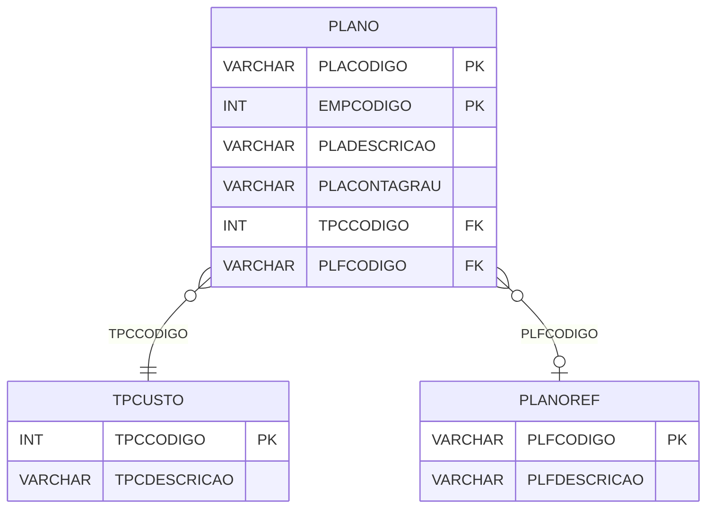

# PLANO - Documentação Completa de Relacionamentos

## 📊 Informações Gerais

- **Nome da Tabela**: PLANO (Plano de Contas)
- **Total de Registros**: 5.190
- **Total de Colunas**: 14
- **Chave Primária**: PLACODIGO, EMPCODIGO (composite)
- **Chaves Estrangeiras**: 2
- **Índices**: 1
- **Tabelas Dependentes**: 0
- **Banco de Dados**: Firebird

## 📝 Descrição

**PLANO** é uma tabela mestre que armazena o plano de contas contábil por empresa. Com **5.190 registros**, esta tabela registra contas contábeis com suas descrições, tipos, níveis hierárquicos e referências ao plano de contas de referência.

Esta tabela é essencial para:
- **Plano de Contas**: Gerenciar plano de contas contábil por empresa
- **Contabilidade**: Suportar escrituração contábil
- **Relatórios**: Gerar relatórios contábeis
- **Hierarquia**: Manter hierarquia de contas

**Contexto de Negócio:**
Cada empresa possui um plano de contas contábil próprio. Esta tabela gerencia essas contas, permitindo organização hierárquica e referência a planos de contas padrão.

---

## 🔑 Estrutura de Colunas

| Coluna | Tipo | Descrição |
|--------|------|-----------|
| **PLACODIGO** 🔑 | VARCHAR(14) | Código da conta (PK) |
| **EMPCODIGO** 🔑 | INT | Código da empresa (PK) |
| **PLADESCRICAO** | VARCHAR(37) | Descrição da conta |
| **PLACONTAGRAU** | VARCHAR(14) | Tipo de conta (grau) |
| **PLATPSALDO** | VARCHAR(14) | Tipo de saldo |
| **PLATIPO** | VARCHAR(14) | Tipo da conta |
| **TPCCODIGO** 🔗 | INT | Código do tipo de custo (FK → TPCUSTO) |
| **PLAIMPRIME** | VARCHAR(14) | Flag de impressão |
| **PLADATA** | TIMESTAMP | Data de criação/atualização |
| **PLAINDNAT** | VARCHAR(37) | Indicador de natureza |
| **PLFCODIGO** 🔗 | VARCHAR(37) | Código do plano de referência (FK → PLANOREF) |
| **PLASITUACAO** | VARCHAR(14) | Situação da conta |
| **PLFCODIGOANT** | VARCHAR(37) | Código anterior do plano de referência |
| **PLADTINATIVA** | TIMESTAMP | Data de inativação |

---

## 🔗 Relacionamentos - Nível 1 (Diretos)

### TPCUSTO - Tipo de Custo (FK Obrigatória)
**Volume:** Variável

**Relacionamento:**
```
PLANO.TPCCODIGO → TPCUSTO.TPCCODIGO (N:1)
Constraint: TPCUSTO_PLANO
```

**Descrição:** Define o tipo de custo relacionado à conta.

---

### PLANOREF - Plano de Contas de Referência (FK Opcional)
**Volume:** 1.031 registros

**Relacionamento:**
```
PLANO.PLFCODIGO → PLANOREF.PLFCODIGO (N:1)
Constraint: PLANOREF_PLANO
```

**Descrição:** Referencia um plano de contas padrão ou de referência.

---

## 🔗 Relacionamentos - Nível 2 (Indiretos)

### EMPRESA - Empresa (Relacionamento Lógico)
**Volume:** 6 registros

**Relacionamento Lógico:**
```
PLANO.EMPCODIGO → EMPRESA.EMPCODIGO (N:1)
```

**Descrição:** Cada conta está relacionada a uma empresa específica.

---

## 🗺️ Diagrama de Relacionamentos



---

## 💡 Exemplos de Uso

### Consulta Básica

```sql
SELECT PLACODIGO, EMPCODIGO, PLADESCRICAO, PLACONTAGRAU, PLATIPO, TPCCODIGO
FROM PLANO
WHERE EMPCODIGO = ?
ORDER BY PLACODIGO;
```

### Consulta com Tipo de Custo

```sql
SELECT 
    p.*,
    tc.TPCDESCRICAO
FROM PLANO p
LEFT JOIN TPCUSTO tc
    ON p.TPCCODIGO = tc.TPCCODIGO
WHERE p.EMPCODIGO = ?
ORDER BY p.PLACODIGO;
```

### Consulta com Plano de Referência

```sql
SELECT 
    p.*,
    pr.PLFDESCRICAO,
    pr.PLFTIPO
FROM PLANO p
LEFT JOIN PLANOREF pr
    ON p.PLFCODIGO = pr.PLFCODIGO
WHERE p.EMPCODIGO = ?
ORDER BY p.PLACODIGO;
```

### Consulta de Contas por Tipo

```sql
SELECT 
    PLATIPO,
    COUNT(*) AS TOTAL_CONTAS
FROM PLANO
WHERE EMPCODIGO = ?
GROUP BY PLATIPO
ORDER BY TOTAL_CONTAS DESC;
```

### Inserção de Nova Conta

```sql
INSERT INTO PLANO (
    PLACODIGO,
    EMPCODIGO,
    PLADESCRICAO,
    PLACONTAGRAU,
    PLATIPO,
    TPCCODIGO,
    PLADATA
)
VALUES (?, ?, ?, ?, ?, ?, CURRENT_TIMESTAMP);
```

---

## ⚡ Performance e Otimização

### Índices Existentes

#### 1. Índice em PLACONTAGRAU
**Nome:** PLANO_IDXCONTAGRAU
**Colunas:** PLACONTAGRAU

**Justificativa:** Facilita buscas por tipo de conta (grau).

---

### Índices Recomendados

#### 1. Índice Composto na Chave Primária (Já existe implicitamente)
```sql
-- Índice primário já existe implicitamente
```

#### 2. Índice em EMPCODIGO
```sql
CREATE INDEX IDX_PLANO_EMPCODIGO 
ON PLANO (EMPCODIGO);
```

**Justificativa:** Facilita buscas por empresa.

---

## 📊 Estatísticas e Insights

### Volume de Dados

- **Total de Registros**: 5.190
- **Tamanho Médio Estimado**: ~100 bytes por registro
- **Tamanho Total Estimado**: ~519 KB

### Distribuição de Dados

- **Contas Contábeis**: 5.190 contas
- **Média por Empresa**: ~865 contas por empresa

---

## 🔧 Integração com Código Laravel

### Model Eloquent

```php
<?php

namespace App\Models;

use Illuminate\Database\Eloquent\Model;
use Illuminate\Database\Eloquent\Relations\BelongsTo;

final class Plano extends Model
{
    protected $table = 'PLANO';
    public $incrementing = false;
    public $timestamps = false;

    protected $primaryKey = ['PLACODIGO', 'EMPCODIGO'];

    protected $fillable = [
        'PLACODIGO',
        'EMPCODIGO',
        'PLADESCRICAO',
        'PLACONTAGRAU',
        'PLATPSALDO',
        'PLATIPO',
        'TPCCODIGO',
        'PLAIMPRIME',
        'PLADATA',
        'PLAINDNAT',
        'PLFCODIGO',
        'PLASITUACAO',
        'PLFCODIGOANT',
        'PLADTINATIVA',
    ];

    protected $casts = [
        'EMPCODIGO' => 'integer',
        'TPCCODIGO' => 'integer',
        'PLACODIGO' => 'string',
        'PLADATA' => 'datetime',
        'PLADTINATIVA' => 'datetime',
    ];

    /**
     * Relacionamento com Tipo de Custo
     */
    public function tipoCusto(): BelongsTo
    {
        return $this->belongsTo(TpCusto::class, 'TPCCODIGO', 'TPCCODIGO');
    }

    /**
     * Relacionamento com Plano de Referência
     */
    public function planoReferencia(): BelongsTo
    {
        return $this->belongsTo(PlanorRef::class, 'PLFCODIGO', 'PLFCODIGO');
    }

    /**
     * Buscar contas por empresa
     */
    public static function porEmpresa(int $empCodigo)
    {
        return self::where('EMPCODIGO', $empCodigo)
            ->with(['tipoCusto', 'planoReferencia'])
            ->orderBy('PLACODIGO')
            ->get();
    }
}
```

---

## ✅ Boas Práticas

### Design

1. **Chave Composta**: Manter integridade da chave composta
2. **Validação**: Validar PLACODIGO e EMPCODIGO antes de inserir
3. **Hierarquia**: Manter consistência na hierarquia de contas

### Performance

1. **Índices**: Usar índices para buscas frequentes
2. **Consultas**: Usar eager loading para relacionamentos

### Segurança

1. **Validação**: Validar valores antes de inserir
2. **Acesso**: Restringir acesso de escrita a usuários autorizados

---

**Documentação gerada em**: 2025-01-27

**Banco de dados**: Firebird

