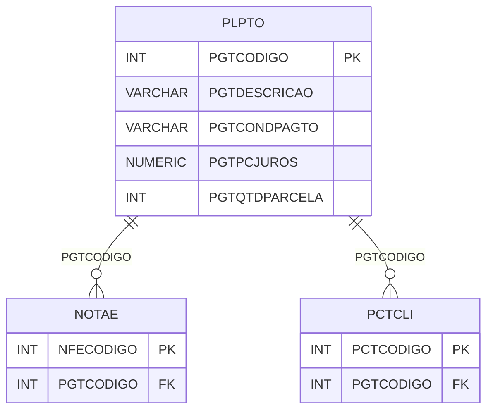

# PLPTO - Documentação Completa de Relacionamentos

## 📊 Informações Gerais

- **Nome da Tabela**: PLPTO (Plano de Pagamento)
- **Total de Registros**: 173
- **Total de Colunas**: 13
- **Chave Primária**: PGTCODIGO
- **Chaves Estrangeiras**: 0
- **Índices**: 0
- **Tabelas Dependentes**: 10
- **Banco de Dados**: Firebird

## 📝 Descrição

**PLPTO** é uma tabela mestre que define planos de pagamento disponíveis no sistema. Com **173 registros**, esta tabela armazena configurações de planos de pagamento, incluindo condições de pagamento, taxas de juros, descontos, número de parcelas e outras configurações financeiras.

Esta tabela é essencial para:
- **Planos de Pagamento**: Definir planos de pagamento disponíveis
- **Financeiro**: Configurar condições financeiras (juros, descontos)
- **Parcelamento**: Gerenciar número de parcelas e condições
- **Relatórios**: Gerar relatórios de pagamentos por plano

**Contexto de Negócio:**
O sistema possui diferentes planos de pagamento que podem ser aplicados a pedidos, notas fiscais e outras transações. Esta tabela define esses planos e suas configurações.

---

## 🔑 Estrutura de Colunas

| Coluna | Tipo | Descrição |
|--------|------|-----------|
| **PGTCODIGO** 🔑 | INT | Código do plano de pagamento (PK) |
| **PGTDESCRICAO** | VARCHAR(37) | Descrição do plano |
| **PGTCONDPAGTO** | VARCHAR(37) | Condições de pagamento |
| **PGTPCJUROS** | NUMERIC(27,2) | Percentual de juros |
| **PGTPCDESC** | NUMERIC(27,2) | Percentual de desconto |
| **PGTPCDESCTOCONC** | NUMERIC(27,2) | Percentual de desconto à vista |
| **PGTVRDESCTOCONC** | NUMERIC(27,2) | Valor de desconto à vista |
| **PGTCONDPER** | VARCHAR(37) | Condições de período |
| **PGTQTDPARCELA** | INT | Quantidade de parcelas |
| **PGTTPRATEIO** | VARCHAR(14) | Tipo de rateio |
| **PGTMES** | VARCHAR(14) | Mês relacionado |
| **PGTVRDESPESA** | NUMERIC(16,2) | Valor de despesa |
| **PGTVRJUROSPRODU** | VARCHAR(14) | Flag de juros em produção |

---

## 🔗 Relacionamentos - Nível 1 (Diretos)

### Tabelas que Referenciam Esta

Esta tabela é referenciada por 10 tabelas:

### CLIEMPCMP - Cliente Empresa Configuração Completa
**Volume:** Variável

**Relacionamento:**
```
CLIEMPCMP.PGTCODIGO → PLPTO.PGTCODIGO (N:1)
Constraint: PLPTO_CLIEMPCMP
```

### CUPOM - Cupom
**Volume:** Variável

**Relacionamento:**
```
CUPOM.PGTCODIGO → PLPTO.PGTCODIGO (N:1)
Constraint: PLPTO_CUPOM
```

### EMPFILIAL - Empresa Filial
**Volume:** Variável

**Relacionamento:**
```
EMPFILIAL.PGTCODIGO → PLPTO.PGTCODIGO (N:1)
Constraint: PLPTO_EMPFILIAL
```

### INFCLITBFECHA - Informação Cliente Tabela Fechamento
**Volume:** Variável

**Relacionamento:**
```
INFCLITBFECHA.PGTCODIGO → PLPTO.PGTCODIGO (N:1)
Constraint: FK_INFCLITBFECHA_PLPTO
```

### NOTAC - Nota de Crédito
**Volume:** Variável

**Relacionamento:**
```
NOTAC.PGTCODIGO → PLPTO.PGTCODIGO (N:1)
Constraint: PLPTO_NOTAC
```

### NOTAE - Nota Fiscal Eletrônica
**Volume:** 204.952 registros

**Relacionamento:**
```
NOTAE.PGTCODIGO → PLPTO.PGTCODIGO (N:1)
Constraint: PLPTO_NOTAE
```

### ORCAM - Orçamento
**Volume:** Variável

**Relacionamento:**
```
ORCAM.PGTCODIGO → PLPTO.PGTCODIGO (N:1)
Constraint: PLPTO_ORCAM
```

### PCTCLI - Parcela Cliente
**Volume:** 1.301 registros

**Relacionamento:**
```
PCTCLI.PGTCODIGO → PLPTO.PGTCODIGO (N:1)
Constraint: PLPTO_PCTCLI
```

### SOLICITACAO - Solicitação
**Volume:** Variável

**Relacionamento:**
```
SOLICITACAO.PGTCODIGO → PLPTO.PGTCODIGO (N:1)
Constraint: PLPTO_SOLICITACAO
```

### TABFXFAT - Tabela Fixa Faturamento
**Volume:** Variável

**Relacionamento:**
```
TABFXFAT.PGTCODIGO → PLPTO.PGTCODIGO (N:1)
Constraint: PLPTO_TABFXFAT
```

---

## 🗺️ Diagrama de Relacionamentos



---

## 💡 Exemplos de Uso

### Consulta Básica

```sql
SELECT PGTCODIGO, PGTDESCRICAO, PGTCONDPAGTO, PGTPCJUROS, PGTQTDPARCELA
FROM PLPTO
WHERE PGTCODIGO = ?;
```

### Consulta de Planos por Quantidade de Parcelas

```sql
SELECT 
    PGTQTDPARCELA,
    COUNT(*) AS TOTAL_PLANOS
FROM PLPTO
WHERE PGTQTDPARCELA IS NOT NULL
GROUP BY PGTQTDPARCELA
ORDER BY PGTQTDPARCELA;
```

### Consulta de Planos com Desconto à Vista

```sql
SELECT 
    PGTCODIGO,
    PGTDESCRICAO,
    PGTPCDESCTOCONC,
    PGTVRDESCTOCONC
FROM PLPTO
WHERE PGTPCDESCTOCONC IS NOT NULL
    AND PGTPCDESCTOCONC > 0
ORDER BY PGTPCDESCTOCONC DESC;
```

### Inserção de Novo Plano

```sql
INSERT INTO PLPTO (
    PGTDESCRICAO,
    PGTCONDPAGTO,
    PGTPCJUROS,
    PGTPCDESC,
    PGTQTDPARCELA
)
VALUES (?, ?, ?, ?, ?);
```

---

## ⚡ Performance e Otimização

### Índices Recomendados

#### 1. Índice na Chave Primária (Já existe implicitamente)
```sql
-- Índice primário já existe implicitamente
```

#### 2. Índice em PGTDESCRICAO
```sql
CREATE INDEX IDX_PLPTO_PGTDESCRICAO 
ON PLPTO (PGTDESCRICAO);
```

**Justificativa:** Facilita buscas por descrição.

---

## 📊 Estatísticas e Insights

### Volume de Dados

- **Total de Registros**: 173
- **Tamanho Médio Estimado**: ~150 bytes por registro
- **Tamanho Total Estimado**: ~26 KB

### Distribuição de Dados

- **Planos de Pagamento**: 173 planos disponíveis
- **Taxa de Utilização**: Tabela mestre com uso amplo

---

## 🔧 Integração com Código Laravel

### Model Eloquent

```php
<?php

namespace App\Models;

use Illuminate\Database\Eloquent\Model;
use Illuminate\Database\Eloquent\Relations\HasMany;

final class PlPto extends Model
{
    protected $table = 'PLPTO';
    protected $primaryKey = 'PGTCODIGO';
    public $incrementing = true;
    public $timestamps = false;

    protected $fillable = [
        'PGTDESCRICAO',
        'PGTCONDPAGTO',
        'PGTPCJUROS',
        'PGTPCDESC',
        'PGTPCDESCTOCONC',
        'PGTVRDESCTOCONC',
        'PGTCONDPER',
        'PGTQTDPARCELA',
        'PGTTPRATEIO',
        'PGTMES',
        'PGTVRDESPESA',
        'PGTVRJUROSPRODU',
    ];

    protected $casts = [
        'PGTCODIGO' => 'integer',
        'PGTPCJUROS' => 'decimal:2',
        'PGTPCDESC' => 'decimal:2',
        'PGTPCDESCTOCONC' => 'decimal:2',
        'PGTVRDESCTOCONC' => 'decimal:2',
        'PGTQTDPARCELA' => 'integer',
        'PGTVRDESPESA' => 'decimal:2',
    ];

    /**
     * Buscar todos os planos
     */
    public static function todos()
    {
        return self::orderBy('PGTDESCRICAO')
            ->get();
    }

    /**
     * Buscar planos com desconto à vista
     */
    public static function comDescontoAVista()
    {
        return self::whereNotNull('PGTPCDESCTOCONC')
            ->where('PGTPCDESCTOCONC', '>', 0)
            ->orderBy('PGTPCDESCTOCONC', 'desc')
            ->get();
    }
}
```

---

## ✅ Boas Práticas

### Design

1. **Chave Primária**: PGTCODIGO deve ser único e sequencial
2. **Validação**: Validar valores antes de inserir
3. **Percentuais**: Validar que percentuais sejam entre 0 e 100

### Performance

1. **Índices**: Usar índice para busca por descrição
2. **Consultas**: Usar eager loading quando necessário

### Segurança

1. **Validação**: Validar valores antes de inserir
2. **Acesso**: Restringir acesso de escrita a usuários autorizados

---

**Documentação gerada em**: 2025-01-27

**Banco de dados**: Firebird

