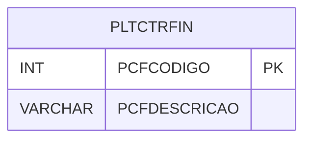

# PLTCTRFIN - Documentação Completa de Relacionamentos

## 📊 Informações Gerais

- **Nome da Tabela**: PLTCTRFIN (Plano de Controle Financeiro)
- **Total de Registros**: 1
- **Total de Colunas**: 2
- **Chave Primária**: PCFCODIGO
- **Chaves Estrangeiras**: 0
- **Índices**: 0
- **Tabelas Dependentes**: 0
- **Banco de Dados**: Firebird

## 📝 Descrição

**PLTCTRFIN** é uma tabela de configuração que armazena informações sobre o plano de controle financeiro do sistema. Com apenas **1 registro**, esta tabela define configurações globais relacionadas ao controle financeiro.

Esta tabela é essencial para:
- **Configuração**: Armazenar configurações globais de controle financeiro
- **Sistema**: Definir parâmetros do sistema financeiro
- **Padronização**: Manter padrões de controle financeiro

**Contexto de Negócio:**
O sistema possui configurações globais relacionadas ao controle financeiro que são armazenadas nesta tabela. Geralmente há apenas uma configuração ativa.

---

## 🔑 Estrutura de Colunas

| Coluna | Tipo | Descrição |
|--------|------|-----------|
| **PCFCODIGO** 🔑 | INT | Código da configuração (PK) |
| **PCFDESCRICAO** | VARCHAR(37) | Descrição da configuração |

---

## 🔗 Relacionamentos - Nível 1 (Diretos)

### Sem relacionamentos diretos

Esta tabela não possui relacionamentos formais com outras tabelas, sendo uma tabela de configuração independente.

---

## 🗺️ Diagrama de Relacionamentos



---

## 💡 Exemplos de Uso

### Consulta Básica

```sql
SELECT PCFCODIGO, PCFDESCRICAO
FROM PLTCTRFIN
WHERE PCFCODIGO = ?;
```

### Consulta da Configuração Ativa

```sql
SELECT PCFCODIGO, PCFDESCRICAO
FROM PLTCTRFIN
ORDER BY PCFCODIGO
ROWS 1;
```

### Inserção de Configuração

```sql
INSERT INTO PLTCTRFIN (PCFDESCRICAO)
VALUES (?);
```

---

## ⚡ Performance e Otimização

### Índices Recomendados

#### 1. Índice na Chave Primária (Já existe implicitamente)
```sql
-- Índice primário já existe implicitamente
```

**Nota:** Devido ao volume muito baixo (1 registro), índices adicionais não são necessários.

---

## 📊 Estatísticas e Insights

### Volume de Dados

- **Total de Registros**: 1
- **Tamanho Médio Estimado**: ~50 bytes por registro
- **Tamanho Total Estimado**: ~50 bytes

### Distribuição de Dados

- **Configurações**: 1 registro de configuração
- **Taxa de Utilização**: Tabela de configuração com volume mínimo

---

## 🔧 Integração com Código Laravel

### Model Eloquent

```php
<?php

namespace App\Models;

use Illuminate\Database\Eloquent\Model;

final class PltCtrFin extends Model
{
    protected $table = 'PLTCTRFIN';
    protected $primaryKey = 'PCFCODIGO';
    public $incrementing = true;
    public $timestamps = false;

    protected $fillable = [
        'PCFDESCRICAO',
    ];

    protected $casts = [
        'PCFCODIGO' => 'integer',
        'PCFDESCRICAO' => 'string',
    ];

    /**
     * Obter configuração ativa
     */
    public static function configuracaoAtiva(): ?self
    {
        return self::orderBy('PCFCODIGO')
            ->first();
    }
}
```

---

## ✅ Boas Práticas

### Design

1. **Chave Primária**: PCFCODIGO deve ser único
2. **Validação**: Validar PCFDESCRICAO antes de inserir
3. **Volume**: Manter apenas configurações necessárias

### Performance

1. **Índices**: Não necessário devido ao volume mínimo
2. **Consultas**: Consultas simples são suficientes

### Segurança

1. **Validação**: Validar valores antes de inserir
2. **Acesso**: Restringir acesso de escrita a administradores

---

**Documentação gerada em**: 2025-01-27

**Banco de dados**: Firebird

