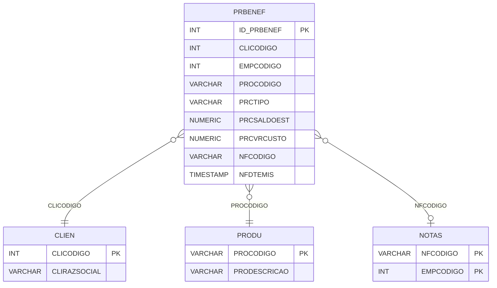

# PRBENEF - Documentação Completa de Relacionamentos

## 📊 Informações Gerais

- **Nome da Tabela**: PRBENEF (Produto Benefício)
- **Total de Registros**: 46
- **Total de Colunas**: 9
- **Chave Primária**: ID_PRBENEF
- **Chaves Estrangeiras**: 0 (relacionamentos lógicos)
- **Índices**: 0
- **Tabelas Dependentes**: 0
- **Banco de Dados**: Firebird

## 📝 Descrição

**PRBENEF** é uma tabela que armazena informações sobre benefícios relacionados a produtos, clientes e notas fiscais. Com **46 registros**, esta tabela registra benefícios aplicados a produtos específicos para clientes específicos, incluindo informações sobre saldo de estoque, custo e nota fiscal relacionada.

Esta tabela é essencial para:
- **Benefícios**: Gerenciar benefícios de produtos para clientes
- **Rastreamento**: Rastrear benefícios por produto e cliente
- **Financeiro**: Controlar custos e valores de benefícios
- **Relatórios**: Gerar relatórios de benefícios

**Contexto de Negócio:**
Produtos podem ter benefícios específicos para clientes específicos. Esta tabela gerencia esses benefícios, permitindo rastrear saldos, custos e notas fiscais relacionadas.

---

## 🔑 Estrutura de Colunas

| Coluna | Tipo | Descrição |
|--------|------|-----------|
| **ID_PRBENEF** 🔑 | INT | Identificador único do benefício (PK) |
| **CLICODIGO** | INT | Código do cliente (relacionamento lógico → CLIEN) |
| **EMPCODIGO** | INT | Código da empresa |
| **PROCODIGO** | VARCHAR(14) | Código do produto (relacionamento lógico → PRODU) |
| **PRCTIPO** | VARCHAR(14) | Tipo do benefício |
| **PRCSALDOEST** | NUMERIC(16,2) | Saldo de estoque do benefício |
| **PRCVRCUSTO** | NUMERIC(16,2) | Valor de custo do benefício |
| **NFCODIGO** | VARCHAR(14) | Código da nota fiscal (relacionamento lógico → NOTAS) |
| **NFDTEMIS** | TIMESTAMP | Data de emissão da nota fiscal |

---

## 🔗 Relacionamentos - Nível 1 (Diretos)

### Relacionamentos Lógicos

### CLIEN - Cliente (Relacionamento Lógico)
**Volume:** 9.251 registros

**Relacionamento Lógico:**
```
PRBENEF.CLICODIGO → CLIEN.CLICODIGO (N:1)
```

**Descrição:** Cada benefício está relacionado a um cliente específico.

---

### PRODU - Produto (Relacionamento Lógico)
**Volume:** 178.187 registros

**Relacionamento Lógico:**
```
PRBENEF.PROCODIGO → PRODU.PROCODIGO (N:1)
```

**Descrição:** Cada benefício está relacionado a um produto específico.

---

### NOTAS - Nota Fiscal (Relacionamento Lógico)
**Volume:** 1.206.013 registros

**Relacionamento Lógico:**
```
PRBENEF.NFCODIGO → NOTAS.NFCODIGO (N:1)
```

**Descrição:** Cada benefício pode estar relacionado a uma nota fiscal.

---

## 🔗 Relacionamentos - Nível 2 (Indiretos)

### CLIEN → PEDID (Pedidos do Cliente)
**Volume:** 3.099.176 registros

**Relacionamento:**
```
PRBENEF → CLIEN → PEDID
```

**Descrição:** Através de CLIEN, é possível identificar pedidos relacionados.

---

## 🗺️ Diagrama de Relacionamentos



---

## 💡 Exemplos de Uso

### Consulta Básica

```sql
SELECT ID_PRBENEF, CLICODIGO, EMPCODIGO, PROCODIGO, PRCTIPO, PRCSALDOEST, PRCVRCUSTO
FROM PRBENEF
WHERE ID_PRBENEF = ?;
```

### Consulta com Informações do Cliente e Produto

```sql
SELECT 
    pb.*,
    c.CLIRAZSOCIAL,
    pr.PRODESCRICAO
FROM PRBENEF pb
INNER JOIN CLIEN c
    ON pb.CLICODIGO = c.CLICODIGO
INNER JOIN PRODU pr
    ON pb.PROCODIGO = pr.PROCODIGO
WHERE pb.ID_PRBENEF = ?;
```

### Consulta de Benefícios por Cliente

```sql
SELECT 
    pb.*,
    pr.PRODESCRICAO
FROM PRBENEF pb
INNER JOIN PRODU pr
    ON pb.PROCODIGO = pr.PROCODIGO
WHERE pb.CLICODIGO = ?
ORDER BY pb.NFDTEMIS DESC;
```

### Consulta de Benefícios por Produto

```sql
SELECT 
    pb.*,
    c.CLIRAZSOCIAL
FROM PRBENEF pb
INNER JOIN CLIEN c
    ON pb.CLICODIGO = c.CLICODIGO
WHERE pb.PROCODIGO = ?
ORDER BY pb.NFDTEMIS DESC;
```

### Consulta de Benefícios por Tipo

```sql
SELECT 
    PRCTIPO,
    COUNT(*) AS TOTAL_BENEFICIOS,
    SUM(PRCVRCUSTO) AS VALOR_TOTAL_CUSTO
FROM PRBENEF
GROUP BY PRCTIPO
ORDER BY TOTAL_BENEFICIOS DESC;
```

### Inserção de Novo Benefício

```sql
INSERT INTO PRBENEF (
    CLICODIGO,
    EMPCODIGO,
    PROCODIGO,
    PRCTIPO,
    PRCSALDOEST,
    PRCVRCUSTO,
    NFCODIGO,
    NFDTEMIS
)
VALUES (?, ?, ?, ?, ?, ?, ?, ?);
```

---

## ⚡ Performance e Otimização

### Índices Recomendados

#### 1. Índice na Chave Primária (Já existe implicitamente)
```sql
-- Índice primário já existe implicitamente
```

#### 2. Índice em CLICODIGO
```sql
CREATE INDEX IDX_PRBENEF_CLICODIGO 
ON PRBENEF (CLICODIGO);
```

**Justificativa:** Facilita buscas por cliente.

#### 3. Índice em PROCODIGO
```sql
CREATE INDEX IDX_PRBENEF_PROCODIGO 
ON PRBENEF (PROCODIGO);
```

**Justificativa:** Facilita buscas por produto.

---

## 📊 Estatísticas e Insights

### Volume de Dados

- **Total de Registros**: 46
- **Tamanho Médio Estimado**: ~80 bytes por registro
- **Tamanho Total Estimado**: ~3.7 KB

### Distribuição de Dados

- **Benefícios**: 46 registros de benefícios
- **Taxa de Utilização**: Baixa (tabela de apoio)

---

## 🔧 Integração com Código Laravel

### Model Eloquent

```php
<?php

namespace App\Models;

use Illuminate\Database\Eloquent\Model;
use Illuminate\Database\Eloquent\Relations\BelongsTo;

final class PrBenef extends Model
{
    protected $table = 'PRBENEF';
    protected $primaryKey = 'ID_PRBENEF';
    public $incrementing = true;
    public $timestamps = false;

    protected $fillable = [
        'CLICODIGO',
        'EMPCODIGO',
        'PROCODIGO',
        'PRCTIPO',
        'PRCSALDOEST',
        'PRCVRCUSTO',
        'NFCODIGO',
        'NFDTEMIS',
    ];

    protected $casts = [
        'ID_PRBENEF' => 'integer',
        'CLICODIGO' => 'integer',
        'EMPCODIGO' => 'integer',
        'PROCODIGO' => 'string',
        'PRCTIPO' => 'string',
        'PRCSALDOEST' => 'decimal:2',
        'PRCVRCUSTO' => 'decimal:2',
        'NFCODIGO' => 'string',
        'NFDTEMIS' => 'datetime',
    ];

    /**
     * Relacionamento com Cliente
     */
    public function cliente(): BelongsTo
    {
        return $this->belongsTo(Clien::class, 'CLICODIGO', 'CLICODIGO');
    }

    /**
     * Relacionamento com Produto
     */
    public function produto(): BelongsTo
    {
        return $this->belongsTo(Produ::class, 'PROCODIGO', 'PROCODIGO');
    }

    /**
     * Buscar benefícios por cliente
     */
    public static function porCliente(int $cliCodigo)
    {
        return self::where('CLICODIGO', $cliCodigo)
            ->with(['cliente', 'produto'])
            ->orderBy('NFDTEMIS', 'desc')
            ->get();
    }

    /**
     * Buscar benefícios por produto
     */
    public static function porProduto(string $proCodigo)
    {
        return self::where('PROCODIGO', $proCodigo)
            ->with(['cliente', 'produto'])
            ->orderBy('NFDTEMIS', 'desc')
            ->get();
    }
}
```

---

## ✅ Boas Práticas

### Design

1. **Chave Primária**: ID_PRBENEF deve ser único e sequencial
2. **Validação**: Validar CLICODIGO, PROCODIGO antes de inserir
3. **Valores**: Validar que PRCSALDOEST e PRCVRCUSTO sejam não negativos

### Performance

1. **Índices**: Usar índices para buscas frequentes
2. **Consultas**: Usar eager loading para relacionamentos

### Segurança

1. **Validação**: Validar valores antes de inserir
2. **Acesso**: Restringir acesso de escrita a usuários autorizados

---

**Documentação gerada em**: 2025-01-27

**Banco de dados**: Firebird

