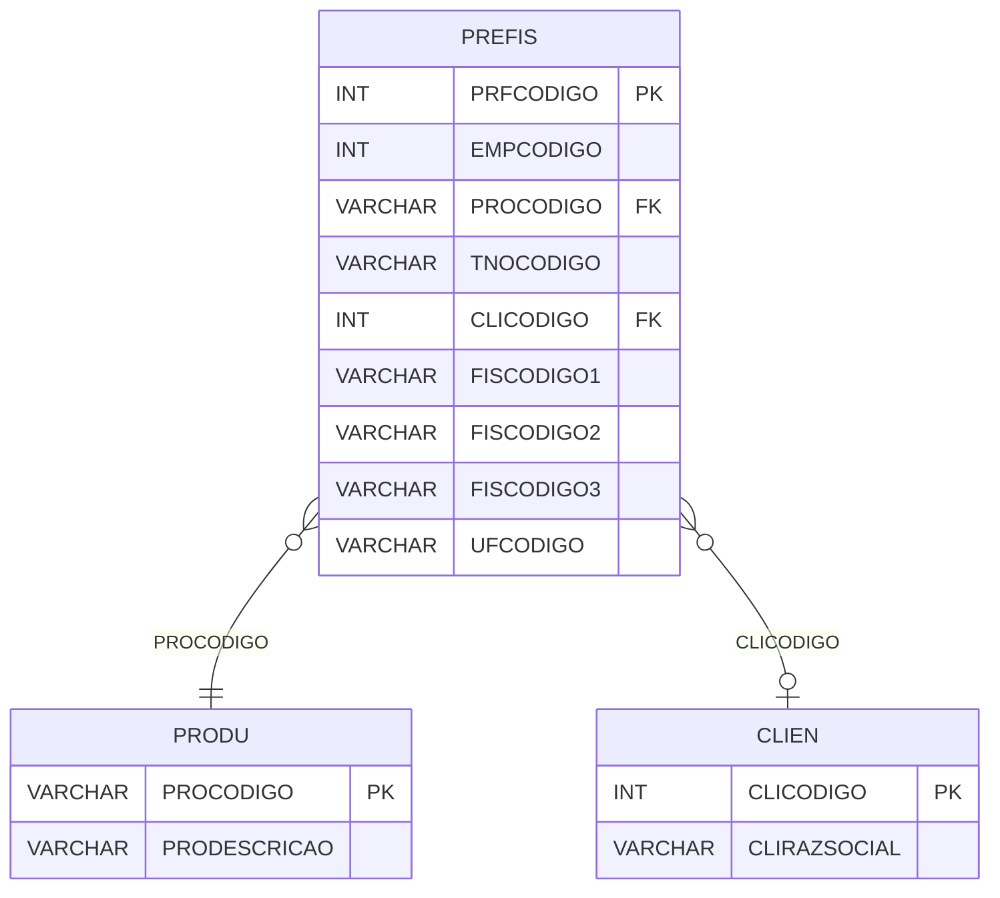

# PREFIS - Documentação Completa de Relacionamentos

## 📊 Informações Gerais

- **Nome da Tabela**: PREFIS (Produto x Cliente x Fiscal)
- **Total de Registros**: 2.551.419
- **Total de Colunas**: 9
- **Chave Primária**: PRFCODIGO
- **Chaves Estrangeiras**: 2
- **Índices**: 0
- **Tabelas Dependentes**: 0
- **Banco de Dados**: Firebird

## 📝 Descrição

**PREFIS** é uma tabela de relacionamento que associa produtos com clientes e configurações fiscais. Com **2.551.419 registros**, esta tabela permite definir configurações fiscais específicas (códigos fiscais) para combinações de produto e cliente, incluindo informações sobre tipo de nota, empresa e unidade federativa.

Esta tabela é essencial para:
- **Configuração Fiscal**: Definir configurações fiscais por produto e cliente
- **Personalização**: Permitir configurações fiscais específicas por cliente
- **Fiscal**: Controlar códigos fiscais por combinação produto/cliente
- **Relatórios**: Gerar relatórios fiscais por produto/cliente

**Contexto de Negócio:**
Produtos podem ter diferentes configurações fiscais dependendo do cliente. Esta tabela gerencia essas configurações, permitindo personalização fiscal por cliente.

---

## 🔑 Estrutura de Colunas

| Coluna | Tipo | Descrição |
|--------|------|-----------|
| **PRFCODIGO** 🔑 | INT | Identificador único do relacionamento (PK) |
| **EMPCODIGO** | INT | Código da empresa |
| **PROCODIGO** 🔗 | VARCHAR(14) | Código do produto (FK → PRODU) |
| **TNOCODIGO** | VARCHAR(14) | Código do tipo de nota |
| **CLICODIGO** 🔗 | INT | Código do cliente (FK → CLIEN) |
| **FISCODIGO1** | VARCHAR(14) | Código fiscal 1 |
| **FISCODIGO2** | VARCHAR(14) | Código fiscal 2 |
| **FISCODIGO3** | VARCHAR(14) | Código fiscal 3 |
| **UFCODIGO** | VARCHAR(14) | Código da unidade federativa |

---

## 🔗 Relacionamentos - Nível 1 (Diretos)

### PRODU - Produto (FK Obrigatória)
**Volume:** 178.187 registros

**Relacionamento:**
```
PREFIS.PROCODIGO → PRODU.PROCODIGO (N:1)
Constraint: PRODU_PREFIS
```

**Descrição:** Cada registro relaciona um produto com configurações fiscais.

**Proporção:** ~14,3 configurações fiscais por produto em média (2.551.419 / 178.187)

---

### CLIEN - Cliente (FK Opcional)
**Volume:** 9.251 registros

**Relacionamento:**
```
PREFIS.CLICODIGO → CLIEN.CLICODIGO (N:1)
Constraint: CLIEN_PREFIS
```

**Descrição:** Cada registro pode estar relacionado a um cliente específico.

---

## 🔗 Relacionamentos - Nível 2 (Indiretos)

### PRODU → PREMP_INTERNA (Produto x Empresa)
**Volume:** 1.068.822 registros

**Relacionamento:**
```
PREFIS → PRODU → PREMP_INTERNA
```

**Descrição:** Através de PRODU, é possível identificar configurações de produto por empresa.

---

## 🗺️ Diagrama de Relacionamentos



---

## 💡 Exemplos de Uso

### Consulta Básica

```sql
SELECT PRFCODIGO, EMPCODIGO, PROCODIGO, TNOCODIGO, CLICODIGO, FISCODIGO1, FISCODIGO2, FISCODIGO3
FROM PREFIS
WHERE PRFCODIGO = ?;
```

### Consulta com Informações do Produto e Cliente

```sql
SELECT 
    pf.*,
    pr.PRODESCRICAO,
    c.CLIRAZSOCIAL
FROM PREFIS pf
INNER JOIN PRODU pr
    ON pf.PROCODIGO = pr.PROCODIGO
LEFT JOIN CLIEN c
    ON pf.CLICODIGO = c.CLICODIGO
WHERE pf.PRFCODIGO = ?;
```

### Consulta de Configurações Fiscais por Produto

```sql
SELECT 
    pf.*,
    c.CLIRAZSOCIAL
FROM PREFIS pf
LEFT JOIN CLIEN c
    ON pf.CLICODIGO = c.CLICODIGO
WHERE pf.PROCODIGO = ?
ORDER BY pf.CLICODIGO NULLS LAST;
```

### Consulta de Configurações Fiscais por Cliente

```sql
SELECT 
    pf.*,
    pr.PRODESCRICAO
FROM PREFIS pf
INNER JOIN PRODU pr
    ON pf.PROCODIGO = pr.PROCODIGO
WHERE pf.CLICODIGO = ?
ORDER BY pr.PRODESCRICAO;
```

### Consulta de Configurações por Tipo de Nota

```sql
SELECT 
    TNOCODIGO,
    COUNT(*) AS TOTAL_CONFIGURACOES
FROM PREFIS
GROUP BY TNOCODIGO
ORDER BY TOTAL_CONFIGURACOES DESC;
```

### Inserção de Configuração Fiscal

```sql
INSERT INTO PREFIS (
    EMPCODIGO,
    PROCODIGO,
    TNOCODIGO,
    CLICODIGO,
    FISCODIGO1,
    FISCODIGO2,
    FISCODIGO3,
    UFCODIGO
)
VALUES (?, ?, ?, ?, ?, ?, ?, ?);
```

---

## ⚡ Performance e Otimização

### Índices Recomendados

#### 1. Índice na Chave Primária (Já existe implicitamente)
```sql
-- Índice primário já existe implicitamente
```

#### 2. Índice Composto em PROCODIGO e CLICODIGO
```sql
CREATE INDEX IDX_PREFIS_PRO_CLI 
ON PREFIS (PROCODIGO, CLICODIGO);
```

**Justificativa:** Facilita buscas por produto e cliente (muito frequente devido ao volume).

#### 3. Índice em EMPCODIGO
```sql
CREATE INDEX IDX_PREFIS_EMPCODIGO 
ON PREFIS (EMPCODIGO);
```

**Justificativa:** Facilita buscas por empresa.

---

## 📊 Estatísticas e Insights

### Volume de Dados

- **Total de Registros**: 2.551.419
- **Tamanho Médio Estimado**: ~60 bytes por registro
- **Tamanho Total Estimado**: ~153 MB

### Distribuição de Dados

- **Configurações Fiscais**: 2.551.419 configurações
- **Média por Produto**: ~14,3 configurações por produto

---

## 🔧 Integração com Código Laravel

### Model Eloquent

```php
<?php

namespace App\Models;

use Illuminate\Database\Eloquent\Model;
use Illuminate\Database\Eloquent\Relations\BelongsTo;

final class PreFis extends Model
{
    protected $table = 'PREFIS';
    protected $primaryKey = 'PRFCODIGO';
    public $incrementing = true;
    public $timestamps = false;

    protected $fillable = [
        'EMPCODIGO',
        'PROCODIGO',
        'TNOCODIGO',
        'CLICODIGO',
        'FISCODIGO1',
        'FISCODIGO2',
        'FISCODIGO3',
        'UFCODIGO',
    ];

    protected $casts = [
        'PRFCODIGO' => 'integer',
        'EMPCODIGO' => 'integer',
        'PROCODIGO' => 'string',
        'TNOCODIGO' => 'string',
        'CLICODIGO' => 'integer',
        'FISCODIGO1' => 'string',
        'FISCODIGO2' => 'string',
        'FISCODIGO3' => 'string',
        'UFCODIGO' => 'string',
    ];

    /**
     * Relacionamento com Produto
     */
    public function produto(): BelongsTo
    {
        return $this->belongsTo(Produ::class, 'PROCODIGO', 'PROCODIGO');
    }

    /**
     * Relacionamento com Cliente
     */
    public function cliente(): BelongsTo
    {
        return $this->belongsTo(Clien::class, 'CLICODIGO', 'CLICODIGO');
    }

    /**
     * Buscar configurações fiscais por produto
     */
    public static function porProduto(string $proCodigo)
    {
        return self::where('PROCODIGO', $proCodigo)
            ->with(['produto', 'cliente'])
            ->get();
    }

    /**
     * Buscar configurações fiscais por cliente
     */
    public static function porCliente(int $cliCodigo)
    {
        return self::where('CLICODIGO', $cliCodigo)
            ->with(['produto', 'cliente'])
            ->get();
    }
}
```

---

## ✅ Boas Práticas

### Design

1. **Chave Primária**: PRFCODIGO deve ser único e sequencial
2. **Validação**: Validar PROCODIGO antes de inserir
3. **Unicidade**: Considerar constraint única em (PROCODIGO, CLICODIGO, EMPCODIGO, TNOCODIGO)

### Performance

1. **Índices**: Usar índices compostos para buscas frequentes (crítico devido ao volume)
2. **Consultas**: Usar eager loading para relacionamentos
3. **Volume**: Considerar particionamento devido ao grande volume

### Segurança

1. **Validação**: Validar valores antes de inserir
2. **Acesso**: Restringir acesso de escrita a usuários autorizados
3. **Fiscal**: Validar códigos fiscais cuidadosamente

---

**Documentação gerada em**: 2025-01-27

**Banco de dados**: Firebird

