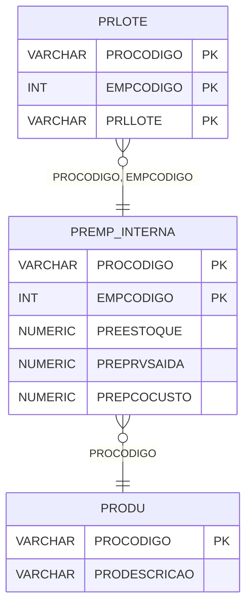

# PREMP_INTERNA - Documentação Completa de Relacionamentos

## 📊 Informações Gerais

- **Nome da Tabela**: PREMP_INTERNA (Produto x Empresa - Interna)
- **Total de Registros**: 1.068.822
- **Total de Colunas**: 75
- **Chave Primária**: PROCODIGO, EMPCODIGO (composite)
- **Chaves Estrangeiras**: 1
- **Índices**: 0
- **Tabelas Dependentes**: 2
- **Banco de Dados**: Firebird

## 📝 Descrição

**PREMP_INTERNA** é uma tabela de relacionamento que armazena configurações específicas de produtos por empresa. Com **1.068.822 registros** e **75 colunas**, esta tabela registra informações completas sobre estoque, preços, custos, impostos e outras configurações específicas de cada produto em cada empresa.

Esta tabela é essencial para:
- **Configuração por Empresa**: Gerenciar configurações específicas de produtos por empresa
- **Estoque**: Controlar estoque por empresa
- **Preços**: Gerenciar preços e custos por empresa
- **Fiscal**: Controlar códigos fiscais por empresa

**Contexto de Negócio:**
Produtos podem ter diferentes configurações dependendo da empresa. Esta tabela gerencia essas configurações, permitindo controle independente de estoque, preços e custos por empresa.

---

## 🔑 Estrutura de Colunas

### Identificação e Estoque
| Coluna | Tipo | Descrição |
|--------|------|-----------|
| **PROCODIGO** 🔑 🔗 | VARCHAR(14) | Código do produto (PK, FK → PRODU) |
| **EMPCODIGO** 🔑 | INT | Código da empresa (PK) |
| **PREESTOQUE** | NUMERIC(27,2) | Estoque atual |
| **PREESTCONSIG** | NUMERIC(27,2) | Estoque em consignação |
| **PREEST** | NUMERIC(27,2) | Estoque total |
| **PREESTMIN** | NUMERIC(27,2) | Estoque mínimo |
| **PREESTMAX** | NUMERIC(27,2) | Estoque máximo |
| **PRERESERVAEST** | NUMERIC(27,2) | Estoque reservado |

### Preços e Custos
| Coluna | Tipo | Descrição |
|--------|------|-----------|
| **PREPRVSAIDA** | NUMERIC(27,2) | Preço de venda |
| **PREPRVSAIDAOS** | NUMERIC(27,2) | Preço de venda OS |
| **PREPRVENTRADA** | NUMERIC(27,2) | Preço de entrada |
| **PREPCOMEDIO** | NUMERIC(27,2) | Preço médio |
| **PREPCOMEDCONSIG** | NUMERIC(27,2) | Preço médio consignação |
| **PREPCOCUSTO** | NUMERIC(27,2) | Preço de custo |
| **PRECUSTOTOTAL** | NUMERIC(27,2) | Custo total |
| **PRECUSTOREAL** | NUMERIC(27,2) | Custo real |
| **PREPCOVENDA** | NUMERIC(27,2) | Preço de venda |
| **PREPCOPROMOCAO** | NUMERIC(27,2) | Preço promocional |
| **PREPCOVENDA2** | NUMERIC(27,2) | Preço de venda 2 |
| **PREPCOPROMO2** | NUMERIC(27,2) | Preço promocional 2 |
| **PREPCOCATALOG** | NUMERIC(27,2) | Preço catálogo |
| **PREPCOVENFUT** | NUMERIC(27,2) | Preço futuro |
| **PREPCOVENFUT2** | NUMERIC(27,2) | Preço futuro 2 |
| **PREPCOSUGERIDOE** | NUMERIC(27,2) | Preço sugerido entrada |
| **PREPCOSUGERIDOS** | NUMERIC(27,2) | Preço sugerido saída |

### Percentuais e Valores Adicionais
| Coluna | Tipo | Descrição |
|--------|------|-----------|
| **PREPCFRETE** | NUMERIC(27,2) | Percentual frete |
| **PREVRFRETE** | NUMERIC(27,2) | Valor frete |
| **PREPCFINANC** | NUMERIC(27,2) | Percentual financeiro |
| **PREVRFINANC** | NUMERIC(16,2) | Valor financeiro |
| **PREPCEMB** | NUMERIC(27,2) | Percentual embalagem |
| **PREPCDIV** | NUMERIC(27,2) | Percentual diverso |
| **PREPCCOMIS** | NUMERIC(27,2) | Percentual comissão |
| **PREPCLUCRO** | NUMERIC(27,2) | Percentual lucro |
| **PREPCCUSTOADIC** | NUMERIC(27,2) | Percentual custo adicional |
| **PREVRCUSTOADIC** | NUMERIC(27,2) | Valor custo adicional |
| **PREPCMOBRA** | NUMERIC(16,2) | Percentual mão de obra |
| **PREPCDEPSVENDA** | NUMERIC(16,2) | Percentual depreciação venda |
| **PREPCCOMERCIAL** | NUMERIC(16,2) | Percentual comercial |
| **PREPCFRETESVENDA** | NUMERIC(16,2) | Percentual frete venda |
| **PREPCADM** | NUMERIC(16,2) | Percentual administrativo |
| **PREPCDEVOLINADIMP** | NUMERIC(16,2) | Percentual devolução inadimplência |
| **PREPCINSUMO** | NUMERIC(16,2) | Percentual insumo |
| **PREVRINSUMO** | NUMERIC(16,2) | Valor insumo |

### Códigos Fiscais
| Coluna | Tipo | Descrição |
|--------|------|-----------|
| **ICMCODIGOSAI** | INT | Código ICMS saída |
| **ICMCODIGOENT** | INT | Código ICMS entrada |
| **IPICODIGOSAI** | INT | Código IPI saída |
| **IPICODIGOENT** | INT | Código IPI entrada |
| **PISCODIGOSAI** | INT | Código PIS saída |
| **PISCODIGOENT** | INT | Código PIS entrada |
| **COFCODIGOSAI** | INT | Código COFINS saída |
| **COFCODIGOENT** | INT | Código COFINS entrada |
| **IBSCODIGOSAI** | INT | Código IBS saída |
| **IBSCODIGOENT** | INT | Código IBS entrada |
| **CBSCODIGOSAI** | INT | Código CBS saída |
| **CBSCODIGOENT** | INT | Código CBS entrada |
| **ISCODIGOSAI** | INT | Código IS saída |
| **ISCODIGOENT** | INT | Código IS entrada |

### Outros Campos
| Coluna | Tipo | Descrição |
|--------|------|-----------|
| **PREPRVPDC** | NUMERIC(27,2) | Preço PDC |
| **PREPRCICMSST** | NUMERIC(16,2) | Percentual ICMS ST |
| **PREVRICMSST** | NUMERIC(16,2) | Valor ICMS ST |
| **PREESTMINPADRAO** | NUMERIC(16,2) | Estoque mínimo padrão |
| **PREESTCONSIGCLI** | NUMERIC(16,2) | Estoque consignação cliente |
| **PREINVENT** | VARCHAR(14) | Flag inventário |
| **PRECTREST** | VARCHAR(14) | Controle estoque |
| **PRELIMDESCTO** | NUMERIC(27,2) | Limite desconto |
| **PREDTLIMPROMO** | TIMESTAMP | Data limite promoção |
| **PREDTREAJUSTE** | TIMESTAMP | Data reajuste |
| **PREDTPVFUT** | TIMESTAMP | Data preço futuro |
| **PRELOCAL** | VARCHAR(37) | Localização |
| **ALXCODIGO** | INT | Código almoxarifado |
| **ALCCODIGO** | VARCHAR(14) | Código célula |
| **COD_ATV** | VARCHAR(14) | Código atividade |
| **PRESEP** | NUMERIC(16,2) | Separação |

---

## 🔗 Relacionamentos - Nível 1 (Diretos)

### PRODU - Produto (FK Obrigatória)
**Volume:** 178.187 registros

**Relacionamento:**
```
PREMP_INTERNA.PROCODIGO → PRODU.PROCODIGO (N:1)
Constraint: PRODU_PREMP_INTERNA
```

**Descrição:** Cada registro está relacionado a um produto específico.

**Proporção:** ~6 configurações por produto em média (1.068.822 / 178.187)

---

## 📊 Tabelas que Referenciam Esta

Esta tabela é referenciada por 2 tabelas:

### PRLOTE - Lote do Produto
**Volume:** Variável

**Relacionamento:**
```
PRLOTE.PROCODIGO, EMPCODIGO → PREMP_INTERNA.PROCODIGO, EMPCODIGO (N:1)
Constraint: PREMP_INTERNA_PRLOTE
```

---

## 🗺️ Diagrama de Relacionamentos



---

## 💡 Exemplos de Uso

### Consulta Básica

```sql
SELECT PROCODIGO, EMPCODIGO, PREESTOQUE, PREPRVSAIDA, PREPCOCUSTO
FROM PREMP_INTERNA
WHERE PROCODIGO = ? AND EMPCODIGO = ?;
```

### Consulta com Informações do Produto

```sql
SELECT 
    pe.*,
    pr.PRODESCRICAO
FROM PREMP_INTERNA pe
INNER JOIN PRODU pr
    ON pe.PROCODIGO = pr.PROCODIGO
WHERE pe.PROCODIGO = ? AND pe.EMPCODIGO = ?;
```

### Consulta de Produtos com Estoque Baixo

```sql
SELECT 
    pe.*,
    pr.PRODESCRICAO
FROM PREMP_INTERNA pe
INNER JOIN PRODU pr
    ON pe.PROCODIGO = pr.PROCODIGO
WHERE pe.PREESTOQUE <= pe.PREESTMIN
    AND pe.EMPCODIGO = ?
ORDER BY pe.PREESTOQUE;
```

### Consulta de Produtos por Empresa

```sql
SELECT 
    pe.*,
    pr.PRODESCRICAO
FROM PREMP_INTERNA pe
INNER JOIN PRODU pr
    ON pe.PROCODIGO = pr.PROCODIGO
WHERE pe.EMPCODIGO = ?
ORDER BY pr.PRODESCRICAO;
```

---

## ⚡ Performance e Otimização

### Índices Recomendados

#### 1. Índice Composto na Chave Primária (Já existe implicitamente)
```sql
-- Índice primário já existe implicitamente
```

#### 2. Índice em EMPCODIGO
```sql
CREATE INDEX IDX_PREMP_INTERNA_EMPCODIGO 
ON PREMP_INTERNA (EMPCODIGO);
```

**Justificativa:** Facilita buscas por empresa (muito frequente devido ao volume).

---

## 📊 Estatísticas e Insights

### Volume de Dados

- **Total de Registros**: 1.068.822
- **Tamanho Médio Estimado**: ~500 bytes por registro
- **Tamanho Total Estimado**: ~534 MB

### Distribuição de Dados

- **Configurações**: 1.068.822 configurações produto x empresa
- **Média por Produto**: ~6 configurações por produto

---

## 🔧 Integração com Código Laravel

### Model Eloquent

```php
<?php

namespace App\Models;

use Illuminate\Database\Eloquent\Model;
use Illuminate\Database\Eloquent\Relations\BelongsTo;

final class PreMpInterna extends Model
{
    protected $table = 'PREMP_INTERNA';
    public $incrementing = false;
    public $timestamps = false;

    protected $primaryKey = ['PROCODIGO', 'EMPCODIGO'];

    protected $fillable = [
        'PROCODIGO',
        'EMPCODIGO',
        'PREESTOQUE',
        'PREPRVSAIDA',
        'PREPCOCUSTO',
        // ... todos os outros campos (75 colunas)
    ];

    protected $casts = [
        'PROCODIGO' => 'string',
        'EMPCODIGO' => 'integer',
        'PREESTOQUE' => 'decimal:2',
        'PREPRVSAIDA' => 'decimal:2',
        'PREPCOCUSTO' => 'decimal:2',
        // ... casts para todos os campos numéricos
    ];

    /**
     * Relacionamento com Produto
     */
    public function produto(): BelongsTo
    {
        return $this->belongsTo(Produ::class, 'PROCODIGO', 'PROCODIGO');
    }

    /**
     * Buscar configuração por produto e empresa
     */
    public static function porProdutoEmpresa(string $proCodigo, int $empCodigo)
    {
        return self::where('PROCODIGO', $proCodigo)
            ->where('EMPCODIGO', $empCodigo)
            ->with(['produto'])
            ->first();
    }
}
```

---

## ✅ Boas Práticas

### Design

1. **Chave Composta**: Manter integridade da chave composta
2. **Validação**: Validar PROCODIGO e EMPCODIGO antes de inserir
3. **Estoque**: Validar que estoque seja não negativo

### Performance

1. **Índices**: Usar índices para buscas frequentes (crítico devido ao volume)
2. **Consultas**: Usar eager loading para relacionamentos
3. **Volume**: Considerar particionamento devido ao grande volume

### Segurança

1. **Validação**: Validar valores antes de inserir
2. **Acesso**: Restringir acesso de escrita a usuários autorizados

---

**Documentação gerada em**: 2025-01-27

**Banco de dados**: Firebird

