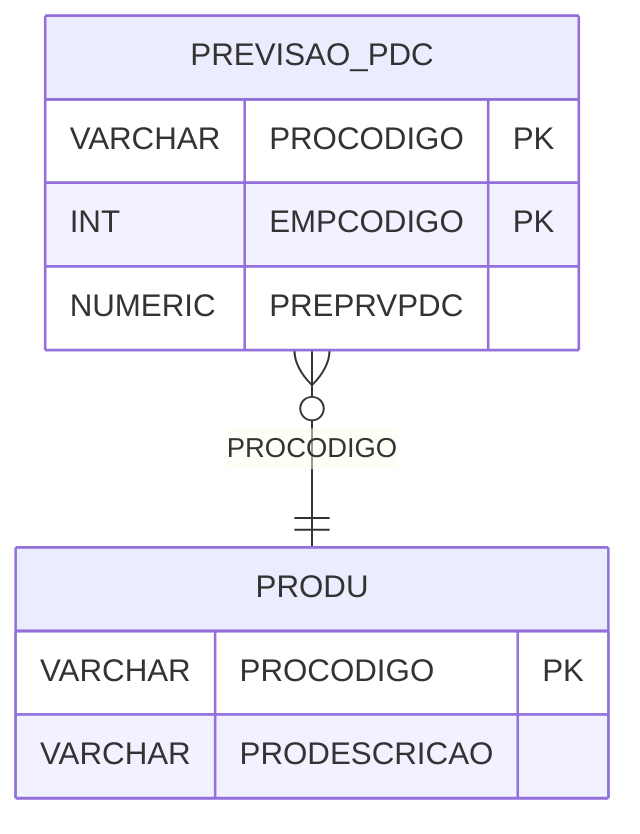

# PREVISAO_PDC - Documentação Completa de Relacionamentos

## 📊 Informações Gerais

- **Nome da Tabela**: PREVISAO_PDC (Previsão PDC)
- **Total de Registros**: 1.068.822
- **Total de Colunas**: 3
- **Chave Primária**: PROCODIGO, EMPCODIGO (composite)
- **Chaves Estrangeiras**: 0 (relacionamentos lógicos)
- **Índices**: 0
- **Tabelas Dependentes**: 0
- **Banco de Dados**: Firebird

## 📝 Descrição

**PREVISAO_PDC** é uma tabela que armazena previsões relacionadas a PDC (Pedido de Compra) por produto e empresa. Com **1.068.822 registros**, esta tabela registra valores previstos relacionados a pedidos de compra, permitindo planejamento e controle de compras futuras.

Esta tabela é essencial para:
- **Planejamento de Compras**: Planejar pedidos de compra futuros
- **Controle**: Controlar previsões de PDC por produto e empresa
- **Relatórios**: Gerar relatórios de previsões de PDC
- **Análise**: Analisar tendências de compras

**Contexto de Negócio:**
O sistema precisa planejar pedidos de compra futuros. Esta tabela armazena essas previsões, permitindo planejamento de compras e controle de estoque futuro.

---

## 🔑 Estrutura de Colunas

| Coluna | Tipo | Descrição |
|--------|------|-----------|
| **PROCODIGO** 🔑 | VARCHAR(14) | Código do produto (PK) |
| **EMPCODIGO** 🔑 | INT | Código da empresa (PK) |
| **PREPRVPDC** | NUMERIC(16,2) | Previsão PDC |

---

## 🔗 Relacionamentos - Nível 1 (Diretos)

### Relacionamentos Lógicos

### PRODU - Produto (Relacionamento Lógico)
**Volume:** 178.187 registros

**Relacionamento Lógico:**
```
PREVISAO_PDC.PROCODIGO → PRODU.PROCODIGO (N:1)
```

**Descrição:** Cada registro está relacionado a um produto específico.

---

### EMPRESA - Empresa (Relacionamento Lógico)
**Volume:** 6 registros

**Relacionamento Lógico:**
```
PREVISAO_PDC.EMPCODIGO → EMPRESA.EMPCODIGO (N:1)
```

**Descrição:** Cada registro está relacionado a uma empresa específica.

---

## 🗺️ Diagrama de Relacionamentos



---

## 💡 Exemplos de Uso

### Consulta Básica

```sql
SELECT PROCODIGO, EMPCODIGO, PREPRVPDC
FROM PREVISAO_PDC
WHERE PROCODIGO = ? AND EMPCODIGO = ?;
```

### Consulta com Informações do Produto

```sql
SELECT 
    pp.*,
    pr.PRODESCRICAO
FROM PREVISAO_PDC pp
INNER JOIN PRODU pr
    ON pp.PROCODIGO = pr.PROCODIGO
WHERE pp.PROCODIGO = ? AND pp.EMPCODIGO = ?;
```

### Consulta de Previsões por Empresa

```sql
SELECT 
    pp.*,
    pr.PRODESCRICAO
FROM PREVISAO_PDC pp
INNER JOIN PRODU pr
    ON pp.PROCODIGO = pr.PROCODIGO
WHERE pp.EMPCODIGO = ?
ORDER BY pp.PREPRVPDC DESC;
```

### Inserção de Previsão

```sql
INSERT INTO PREVISAO_PDC (PROCODIGO, EMPCODIGO, PREPRVPDC)
VALUES (?, ?, ?);
```

---

## ⚡ Performance e Otimização

### Índices Recomendados

#### 1. Índice Composto na Chave Primária (Já existe implicitamente)
```sql
-- Índice primário já existe implicitamente
```

#### 2. Índice em EMPCODIGO
```sql
CREATE INDEX IDX_PREVISAO_PDC_EMPCODIGO 
ON PREVISAO_PDC (EMPCODIGO);
```

**Justificativa:** Facilita buscas por empresa (muito frequente devido ao volume).

---

## 📊 Estatísticas e Insights

### Volume de Dados

- **Total de Registros**: 1.068.822
- **Tamanho Médio Estimado**: ~30 bytes por registro
- **Tamanho Total Estimado**: ~32 MB

### Distribuição de Dados

- **Previsões**: 1.068.822 previsões de PDC
- **Média por Produto**: ~6 previsões por produto

---

## 🔧 Integração com Código Laravel

### Model Eloquent

```php
<?php

namespace App\Models;

use Illuminate\Database\Eloquent\Model;
use Illuminate\Database\Eloquent\Relations\BelongsTo;

final class PrevisaoPdc extends Model
{
    protected $table = 'PREVISAO_PDC';
    public $incrementing = false;
    public $timestamps = false;

    protected $primaryKey = ['PROCODIGO', 'EMPCODIGO'];

    protected $fillable = [
        'PROCODIGO',
        'EMPCODIGO',
        'PREPRVPDC',
    ];

    protected $casts = [
        'PROCODIGO' => 'string',
        'EMPCODIGO' => 'integer',
        'PREPRVPDC' => 'decimal:2',
    ];

    /**
     * Relacionamento com Produto
     */
    public function produto(): BelongsTo
    {
        return $this->belongsTo(Produ::class, 'PROCODIGO', 'PROCODIGO');
    }

    /**
     * Buscar previsão por produto e empresa
     */
    public static function porProdutoEmpresa(string $proCodigo, int $empCodigo)
    {
        return self::where('PROCODIGO', $proCodigo)
            ->where('EMPCODIGO', $empCodigo)
            ->with(['produto'])
            ->first();
    }
}
```

---

## ✅ Boas Práticas

### Design

1. **Chave Composta**: Manter integridade da chave composta
2. **Validação**: Validar PROCODIGO e EMPCODIGO antes de inserir
3. **Valores**: Validar que PREPRVPDC seja não negativo

### Performance

1. **Índices**: Usar índices para buscas frequentes (crítico devido ao volume)
2. **Consultas**: Usar eager loading para relacionamentos
3. **Volume**: Considerar particionamento devido ao grande volume

### Segurança

1. **Validação**: Validar valores antes de inserir
2. **Acesso**: Restringir acesso de escrita a usuários autorizados

---

**Documentação gerada em**: 2025-01-27

**Banco de dados**: Firebird

