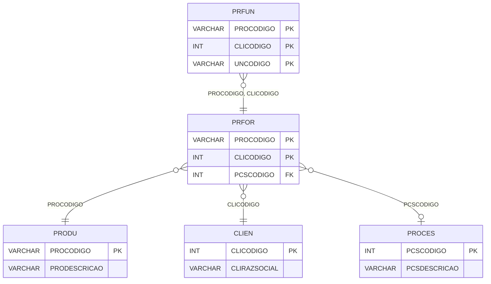

# PRFOR - Documentação Completa de Relacionamentos

## 📊 Informações Gerais

- **Nome da Tabela**: PRFOR (Produto x Fornecedor)
- **Total de Registros**: 149.252
- **Total de Colunas**: 3
- **Chave Primária**: PROCODIGO, CLICODIGO (composite)
- **Chaves Estrangeiras**: 3
- **Índices**: 0
- **Tabelas Dependentes**: 2
- **Banco de Dados**: Firebird

## 📝 Descrição

**PRFOR** é uma tabela de relacionamento que associa produtos com fornecedores (clientes do tipo fornecedor) e processos. Com **149.252 registros**, esta tabela permite definir quais fornecedores fornecem quais produtos e qual processo está relacionado.

Esta tabela é essencial para:
- **Rastreamento de Fornecedores**: Rastrear quais fornecedores fornecem quais produtos
- **Processos**: Associar processos a produtos e fornecedores
- **Compras**: Facilitar gestão de compras por fornecedor
- **Relatórios**: Gerar relatórios de produtos por fornecedor

**Contexto de Negócio:**
Produtos podem ser fornecidos por diferentes fornecedores. Esta tabela gerencia essas relações, permitindo identificar fornecedores preferenciais e processos relacionados.

---

## 🔑 Estrutura de Colunas

| Coluna | Tipo | Descrição |
|--------|------|-----------|
| **PROCODIGO** 🔑 🔗 | VARCHAR(14) | Código do produto (PK, FK → PRODU) |
| **CLICODIGO** 🔑 🔗 | INT | Código do fornecedor/cliente (PK, FK → CLIEN) |
| **PCSCODIGO** 🔗 | INT | Código do processo (FK → PROCES) |

---

## 🔗 Relacionamentos - Nível 1 (Diretos)

### PRODU - Produto (FK Obrigatória)
**Volume:** 178.187 registros

**Relacionamento:**
```
PRFOR.PROCODIGO → PRODU.PROCODIGO (N:1)
Constraint: PRODU_PRFOR
```

**Descrição:** Cada registro relaciona um produto com um fornecedor.

**Proporção:** ~0,8 fornecedores por produto em média (149.252 / 178.187)

---

### CLIEN - Fornecedor/Cliente (FK Obrigatória)
**Volume:** 9.251 registros

**Relacionamento:**
```
PRFOR.CLICODIGO → CLIEN.CLICODIGO (N:1)
Constraint: CLIEN_PRFOR
```

**Descrição:** Cada registro relaciona um fornecedor com um produto.

---

### PROCES - Processo (FK Opcional)
**Volume:** 6 registros

**Relacionamento:**
```
PRFOR.PCSCODIGO → PROCES.PCSCODIGO (N:1)
Constraint: PROCES_PRFOR
```

**Descrição:** Define o processo relacionado ao produto e fornecedor.

---

## 📊 Tabelas que Referenciam Esta

Esta tabela é referenciada por 2 tabelas:

### PRFUN - Produto x Fornecedor x Unidade de Medida
**Volume:** 57.942 registros

**Relacionamento:**
```
PRFUN.PROCODIGO, CLICODIGO → PRFOR.PROCODIGO, CLICODIGO (N:1)
Constraint: PRFOR_PRFUN
```

**Descrição:** Relaciona unidades de medida com produtos e fornecedores.

---

## 🗺️ Diagrama de Relacionamentos



---

## 💡 Exemplos de Uso

### Consulta Básica

```sql
SELECT PROCODIGO, CLICODIGO, PCSCODIGO
FROM PRFOR
WHERE PROCODIGO = ?;
```

### Consulta com Informações do Produto e Fornecedor

```sql
SELECT 
    pf.*,
    pr.PRODESCRICAO,
    c.CLIRAZSOCIAL AS FORNECEDOR,
    pc.PCSDESCRICAO AS PROCESSO
FROM PRFOR pf
INNER JOIN PRODU pr
    ON pf.PROCODIGO = pr.PROCODIGO
INNER JOIN CLIEN c
    ON pf.CLICODIGO = c.CLICODIGO
LEFT JOIN PROCES pc
    ON pf.PCSCODIGO = pc.PCSCODIGO
WHERE pf.PROCODIGO = ?;
```

### Consulta de Fornecedores por Produto

```sql
SELECT 
    pf.*,
    c.CLIRAZSOCIAL AS FORNECEDOR
FROM PRFOR pf
INNER JOIN CLIEN c
    ON pf.CLICODIGO = c.CLICODIGO
WHERE pf.PROCODIGO = ?
ORDER BY c.CLIRAZSOCIAL;
```

### Consulta de Produtos por Fornecedor

```sql
SELECT 
    pf.*,
    pr.PRODESCRICAO
FROM PRFOR pf
INNER JOIN PRODU pr
    ON pf.PROCODIGO = pr.PROCODIGO
WHERE pf.CLICODIGO = ?
ORDER BY pr.PRODESCRICAO;
```

### Inserção de Relacionamento

```sql
INSERT INTO PRFOR (PROCODIGO, CLICODIGO, PCSCODIGO)
VALUES (?, ?, ?);
```

---

## ⚡ Performance e Otimização

### Índices Recomendados

#### 1. Índice Composto na Chave Primária (Já existe implicitamente)
```sql
-- Índice primário já existe implicitamente
```

#### 2. Índice em CLICODIGO
```sql
CREATE INDEX IDX_PRFOR_CLICODIGO 
ON PRFOR (CLICODIGO);
```

**Justificativa:** Facilita buscas por fornecedor.

---

## 📊 Estatísticas e Insights

### Volume de Dados

- **Total de Registros**: 149.252
- **Tamanho Médio Estimado**: ~30 bytes por registro
- **Tamanho Total Estimado**: ~4.5 MB

### Distribuição de Dados

- **Relacionamentos**: 149.252 relacionamentos produto x fornecedor
- **Média por Produto**: ~0,8 fornecedores por produto

---

## 🔧 Integração com Código Laravel

### Model Eloquent

```php
<?php

namespace App\Models;

use Illuminate\Database\Eloquent\Model;
use Illuminate\Database\Eloquent\Relations\BelongsTo;
use Illuminate\Database\Eloquent\Relations\HasMany;

final class PrFor extends Model
{
    protected $table = 'PRFOR';
    public $incrementing = false;
    public $timestamps = false;

    protected $primaryKey = ['PROCODIGO', 'CLICODIGO'];

    protected $fillable = [
        'PROCODIGO',
        'CLICODIGO',
        'PCSCODIGO',
    ];

    protected $casts = [
        'PROCODIGO' => 'string',
        'CLICODIGO' => 'integer',
        'PCSCODIGO' => 'integer',
    ];

    /**
     * Relacionamento com Produto
     */
    public function produto(): BelongsTo
    {
        return $this->belongsTo(Produ::class, 'PROCODIGO', 'PROCODIGO');
    }

    /**
     * Relacionamento com Fornecedor/Cliente
     */
    public function fornecedor(): BelongsTo
    {
        return $this->belongsTo(Clien::class, 'CLICODIGO', 'CLICODIGO');
    }

    /**
     * Relacionamento com Processo
     */
    public function processo(): BelongsTo
    {
        return $this->belongsTo(Proces::class, 'PCSCODIGO', 'PCSCODIGO');
    }

    /**
     * Relacionamento com Unidades de Medida
     */
    public function unidadesMedida(): HasMany
    {
        return $this->hasMany(PrFun::class, ['PROCODIGO', 'CLICODIGO'], ['PROCODIGO', 'CLICODIGO']);
    }

    /**
     * Buscar fornecedores por produto
     */
    public static function fornecedoresPorProduto(string $proCodigo)
    {
        return self::where('PROCODIGO', $proCodigo)
            ->with(['fornecedor', 'processo'])
            ->get();
    }
}
```

---

## ✅ Boas Práticas

### Design

1. **Chave Composta**: Manter integridade da chave composta
2. **Validação**: Validar PROCODIGO e CLICODIGO antes de inserir
3. **Unicidade**: Garantir que não haja duplicatas

### Performance

1. **Índices**: Usar índices para buscas frequentes
2. **Consultas**: Usar eager loading para relacionamentos

### Segurança

1. **Validação**: Validar valores antes de inserir
2. **Acesso**: Restringir acesso de escrita a usuários autorizados

---

**Documentação gerada em**: 2025-01-27

**Banco de dados**: Firebird

