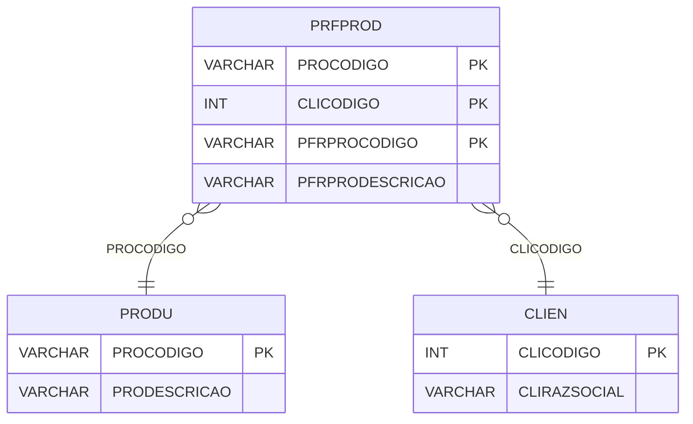

# PRFPROD - Documentação Completa de Relacionamentos

## 📊 Informações Gerais

- **Nome da Tabela**: PRFPROD (Produto x Fornecedor x Produto)
- **Total de Registros**: 155.607
- **Total de Colunas**: 4
- **Chave Primária**: PROCODIGO, CLICODIGO, PFRPROCODIGO (composite)
- **Chaves Estrangeiras**: 0 (relacionamentos lógicos)
- **Índices**: 0
- **Tabelas Dependentes**: 0
- **Banco de Dados**: Firebird

## 📝 Descrição

**PRFPROD** é uma tabela de relacionamento que associa produtos com fornecedores e produtos relacionados do fornecedor. Com **155.607 registros**, esta tabela permite mapear produtos internos com produtos do fornecedor, facilitando integração e rastreamento.

Esta tabela é essencial para:
- **Mapeamento**: Mapear produtos internos com produtos do fornecedor
- **Integração**: Facilitar integração com sistemas de fornecedores
- **Rastreamento**: Rastrear produtos do fornecedor relacionados
- **Relatórios**: Gerar relatórios de mapeamento produto/fornecedor

**Contexto de Negócio:**
Produtos internos podem ter correspondência com produtos específicos de fornecedores. Esta tabela gerencia esse mapeamento, permitindo identificar qual produto do fornecedor corresponde a qual produto interno.

---

## 🔑 Estrutura de Colunas

| Coluna | Tipo | Descrição |
|--------|------|-----------|
| **PROCODIGO** 🔑 | VARCHAR(14) | Código do produto interno (PK) |
| **CLICODIGO** 🔑 | INT | Código do fornecedor/cliente (PK) |
| **PFRPROCODIGO** 🔑 | VARCHAR(14) | Código do produto do fornecedor (PK) |
| **PFRPRODESCRICAO** | VARCHAR(37) | Descrição do produto do fornecedor |

---

## 🔗 Relacionamentos - Nível 1 (Diretos)

### Relacionamentos Lógicos

### PRODU - Produto Interno (Relacionamento Lógico)
**Volume:** 178.187 registros

**Relacionamento Lógico:**
```
PRFPROD.PROCODIGO → PRODU.PROCODIGO (N:1)
```

**Descrição:** Cada registro relaciona um produto interno com um produto do fornecedor.

---

### CLIEN - Fornecedor/Cliente (Relacionamento Lógico)
**Volume:** 9.251 registros

**Relacionamento Lógico:**
```
PRFPROD.CLICODIGO → CLIEN.CLICODIGO (N:1)
```

**Descrição:** Cada registro relaciona um fornecedor com produtos.

---

## 🔗 Relacionamentos - Nível 2 (Indiretos)

### PRODU → PREMP_INTERNA (Produto x Empresa)
**Volume:** 1.068.822 registros

**Relacionamento:**
```
PRFPROD → PRODU → PREMP_INTERNA
```

**Descrição:** Através de PRODU, é possível identificar configurações de produto por empresa.

---

## 🗺️ Diagrama de Relacionamentos



---

## 💡 Exemplos de Uso

### Consulta Básica

```sql
SELECT PROCODIGO, CLICODIGO, PFRPROCODIGO, PFRPRODESCRICAO
FROM PRFPROD
WHERE PROCODIGO = ?;
```

### Consulta com Informações do Produto e Fornecedor

```sql
SELECT 
    pp.*,
    pr.PRODESCRICAO AS PRODUTO_INTERNO,
    c.CLIRAZSOCIAL AS FORNECEDOR
FROM PRFPROD pp
INNER JOIN PRODU pr
    ON pp.PROCODIGO = pr.PROCODIGO
INNER JOIN CLIEN c
    ON pp.CLICODIGO = c.CLICODIGO
WHERE pp.PROCODIGO = ?;
```

### Consulta de Produtos do Fornecedor por Produto Interno

```sql
SELECT 
    pp.*,
    c.CLIRAZSOCIAL AS FORNECEDOR
FROM PRFPROD pp
INNER JOIN CLIEN c
    ON pp.CLICODIGO = c.CLICODIGO
WHERE pp.PROCODIGO = ?
ORDER BY c.CLIRAZSOCIAL;
```

### Consulta de Produtos Internos por Produto do Fornecedor

```sql
SELECT 
    pp.*,
    pr.PRODESCRICAO AS PRODUTO_INTERNO
FROM PRFPROD pp
INNER JOIN PRODU pr
    ON pp.PROCODIGO = pr.PROCODIGO
WHERE pp.CLICODIGO = ?
    AND pp.PFRPROCODIGO = ?;
```

### Inserção de Mapeamento

```sql
INSERT INTO PRFPROD (PROCODIGO, CLICODIGO, PFRPROCODIGO, PFRPRODESCRICAO)
VALUES (?, ?, ?, ?);
```

---

## ⚡ Performance e Otimização

### Índices Recomendados

#### 1. Índice Composto na Chave Primária (Já existe implicitamente)
```sql
-- Índice primário já existe implicitamente
```

#### 2. Índice em CLICODIGO
```sql
CREATE INDEX IDX_PRFPROD_CLICODIGO 
ON PRFPROD (CLICODIGO);
```

**Justificativa:** Facilita buscas por fornecedor.

---

## 📊 Estatísticas e Insights

### Volume de Dados

- **Total de Registros**: 155.607
- **Tamanho Médio Estimado**: ~50 bytes por registro
- **Tamanho Total Estimado**: ~7.8 MB

### Distribuição de Dados

- **Mapeamentos**: 155.607 mapeamentos produto interno x produto fornecedor
- **Média por Produto**: ~0,9 mapeamentos por produto

---

## 🔧 Integração com Código Laravel

### Model Eloquent

```php
<?php

namespace App\Models;

use Illuminate\Database\Eloquent\Model;
use Illuminate\Database\Eloquent\Relations\BelongsTo;

final class PrFProd extends Model
{
    protected $table = 'PRFPROD';
    public $incrementing = false;
    public $timestamps = false;

    protected $primaryKey = ['PROCODIGO', 'CLICODIGO', 'PFRPROCODIGO'];

    protected $fillable = [
        'PROCODIGO',
        'CLICODIGO',
        'PFRPROCODIGO',
        'PFRPRODESCRICAO',
    ];

    protected $casts = [
        'PROCODIGO' => 'string',
        'CLICODIGO' => 'integer',
        'PFRPROCODIGO' => 'string',
        'PFRPRODESCRICAO' => 'string',
    ];

    /**
     * Relacionamento com Produto Interno
     */
    public function produto(): BelongsTo
    {
        return $this->belongsTo(Produ::class, 'PROCODIGO', 'PROCODIGO');
    }

    /**
     * Relacionamento com Fornecedor/Cliente
     */
    public function fornecedor(): BelongsTo
    {
        return $this->belongsTo(Clien::class, 'CLICODIGO', 'CLICODIGO');
    }

    /**
     * Buscar produtos do fornecedor por produto interno
     */
    public static function produtosFornecedorPorProduto(string $proCodigo)
    {
        return self::where('PROCODIGO', $proCodigo)
            ->with(['produto', 'fornecedor'])
            ->get();
    }
}
```

---

## ✅ Boas Práticas

### Design

1. **Chave Composta**: Manter integridade da chave composta
2. **Validação**: Validar PROCODIGO, CLICODIGO e PFRPROCODIGO antes de inserir
3. **Unicidade**: Garantir que não haja duplicatas

### Performance

1. **Índices**: Usar índices para buscas frequentes
2. **Consultas**: Usar eager loading para relacionamentos

### Segurança

1. **Validação**: Validar valores antes de inserir
2. **Acesso**: Restringir acesso de escrita a usuários autorizados

---

**Documentação gerada em**: 2025-01-27

**Banco de dados**: Firebird

