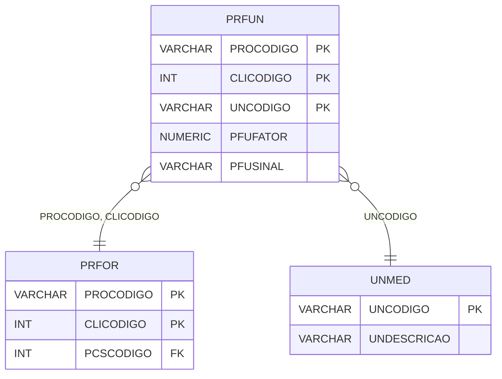

# PRFUN - Documentação Completa de Relacionamentos

## 📊 Informações Gerais

- **Nome da Tabela**: PRFUN (Produto x Fornecedor x Unidade de Medida)
- **Total de Registros**: 57.942
- **Total de Colunas**: 5
- **Chave Primária**: PROCODIGO, CLICODIGO, UNCODIGO (composite)
- **Chaves Estrangeiras**: 3
- **Índices**: 0
- **Tabelas Dependentes**: 0
- **Banco de Dados**: Firebird

## 📝 Descrição

**PRFUN** é uma tabela de relacionamento que associa produtos com fornecedores e unidades de medida específicas. Com **57.942 registros**, esta tabela permite definir unidades de medida específicas para combinações de produto e fornecedor, incluindo fatores de conversão e sinais.

Esta tabela é essencial para:
- **Unidades de Medida**: Definir unidades de medida específicas por produto e fornecedor
- **Conversão**: Gerenciar fatores de conversão entre unidades
- **Personalização**: Permitir unidades personalizadas por fornecedor
- **Relatórios**: Gerar relatórios de unidades por produto/fornecedor

**Contexto de Negócio:**
Produtos podem ter diferentes unidades de medida dependendo do fornecedor. Esta tabela gerencia essas unidades, permitindo conversões e personalizações por fornecedor.

---

## 🔑 Estrutura de Colunas

| Coluna | Tipo | Descrição |
|--------|------|-----------|
| **PROCODIGO** 🔑 🔗 | VARCHAR(14) | Código do produto (PK, FK → PRFOR) |
| **CLICODIGO** 🔑 🔗 | INT | Código do fornecedor/cliente (PK, FK → PRFOR) |
| **UNCODIGO** 🔑 🔗 | VARCHAR(14) | Código da unidade de medida (PK, FK → UNMED) |
| **PFUFATOR** | NUMERIC(27,2) | Fator de conversão |
| **PFUSINAL** | VARCHAR(14) | Sinal da conversão (+, -, *, /) |

---

## 🔗 Relacionamentos - Nível 1 (Diretos)

### PRFOR - Produto x Fornecedor (FK Obrigatória)
**Volume:** 149.252 registros

**Relacionamento:**
```
PRFUN.PROCODIGO, CLICODIGO → PRFOR.PROCODIGO, CLICODIGO (N:1)
Constraint: PRFOR_PRFUN
```

**Descrição:** Cada registro está relacionado a um relacionamento produto x fornecedor específico.

**Proporção:** ~0,4 unidades por relacionamento produto/fornecedor (57.942 / 149.252)

---

### UNMED - Unidade de Medida (FK Obrigatória)
**Volume:** 130 registros

**Relacionamento:**
```
PRFUN.UNCODIGO → UNMED.UNCODIGO (N:1)
Constraint: UNMED_PRFUN
```

**Descrição:** Define a unidade de medida relacionada.

---

## 🔗 Relacionamentos - Nível 2 (Indiretos)

### PRFOR → PRODU (Produto)
**Volume:** 178.187 registros

**Relacionamento:**
```
PRFUN → PRFOR → PRODU
```

**Descrição:** Através de PRFOR, é possível identificar o produto relacionado.

---

### PRFOR → CLIEN (Fornecedor)
**Volume:** 9.251 registros

**Relacionamento:**
```
PRFUN → PRFOR → CLIEN
```

**Descrição:** Através de PRFOR, é possível identificar o fornecedor relacionado.

---

## 🗺️ Diagrama de Relacionamentos



---

## 💡 Exemplos de Uso

### Consulta Básica

```sql
SELECT PROCODIGO, CLICODIGO, UNCODIGO, PFUFATOR, PFUSINAL
FROM PRFUN
WHERE PROCODIGO = ? AND CLICODIGO = ?;
```

### Consulta com Informações da Unidade de Medida

```sql
SELECT 
    pu.*,
    u.UNDESCRICAO
FROM PRFUN pu
INNER JOIN UNMED u
    ON pu.UNCODIGO = u.UNCODIGO
WHERE pu.PROCODIGO = ? AND pu.CLICODIGO = ?;
```

### Consulta com Informações do Produto e Fornecedor

```sql
SELECT 
    pu.*,
    pr.PRODESCRICAO,
    c.CLIRAZSOCIAL AS FORNECEDOR,
    u.UNDESCRICAO
FROM PRFUN pu
INNER JOIN PRFOR pf
    ON pu.PROCODIGO = pf.PROCODIGO
    AND pu.CLICODIGO = pf.CLICODIGO
INNER JOIN PRODU pr
    ON pu.PROCODIGO = pr.PROCODIGO
INNER JOIN CLIEN c
    ON pu.CLICODIGO = c.CLICODIGO
INNER JOIN UNMED u
    ON pu.UNCODIGO = u.UNCODIGO
WHERE pu.PROCODIGO = ? AND pu.CLICODIGO = ?;
```

### Consulta de Unidades por Produto e Fornecedor

```sql
SELECT 
    pu.*,
    u.UNDESCRICAO
FROM PRFUN pu
INNER JOIN UNMED u
    ON pu.UNCODIGO = u.UNCODIGO
WHERE pu.PROCODIGO = ?
    AND pu.CLICODIGO = ?
ORDER BY u.UNDESCRICAO;
```

### Inserção de Unidade

```sql
INSERT INTO PRFUN (PROCODIGO, CLICODIGO, UNCODIGO, PFUFATOR, PFUSINAL)
VALUES (?, ?, ?, ?, ?);
```

---

## ⚡ Performance e Otimização

### Índices Recomendados

#### 1. Índice Composto na Chave Primária (Já existe implicitamente)
```sql
-- Índice primário já existe implicitamente
```

#### 2. Índice Composto em PROCODIGO e CLICODIGO
```sql
CREATE INDEX IDX_PRFUN_PRO_CLI 
ON PRFUN (PROCODIGO, CLICODIGO);
```

**Justificativa:** Facilita buscas por produto e fornecedor.

---

## 📊 Estatísticas e Insights

### Volume de Dados

- **Total de Registros**: 57.942
- **Tamanho Médio Estimado**: ~40 bytes por registro
- **Tamanho Total Estimado**: ~2.3 MB

### Distribuição de Dados

- **Unidades**: 57.942 unidades de medida por produto/fornecedor
- **Média por Relacionamento**: ~0,4 unidades por relacionamento produto/fornecedor

---

## 🔧 Integração com Código Laravel

### Model Eloquent

```php
<?php

namespace App\Models;

use Illuminate\Database\Eloquent\Model;
use Illuminate\Database\Eloquent\Relations\BelongsTo;

final class PrFun extends Model
{
    protected $table = 'PRFUN';
    public $incrementing = false;
    public $timestamps = false;

    protected $primaryKey = ['PROCODIGO', 'CLICODIGO', 'UNCODIGO'];

    protected $fillable = [
        'PROCODIGO',
        'CLICODIGO',
        'UNCODIGO',
        'PFUFATOR',
        'PFUSINAL',
    ];

    protected $casts = [
        'PROCODIGO' => 'string',
        'CLICODIGO' => 'integer',
        'UNCODIGO' => 'string',
        'PFUFATOR' => 'decimal:2',
        'PFUSINAL' => 'string',
    ];

    /**
     * Relacionamento com Produto x Fornecedor
     */
    public function produtoFornecedor(): BelongsTo
    {
        return $this->belongsTo(PrFor::class, ['PROCODIGO', 'CLICODIGO'], ['PROCODIGO', 'CLICODIGO']);
    }

    /**
     * Relacionamento com Unidade de Medida
     */
    public function unidadeMedida(): BelongsTo
    {
        return $this->belongsTo(UnMed::class, 'UNCODIGO', 'UNCODIGO');
    }

    /**
     * Buscar unidades por produto e fornecedor
     */
    public static function unidadesPorProdutoFornecedor(string $proCodigo, int $cliCodigo)
    {
        return self::where('PROCODIGO', $proCodigo)
            ->where('CLICODIGO', $cliCodigo)
            ->with(['unidadeMedida', 'produtoFornecedor'])
            ->get();
    }
}
```

---

## ✅ Boas Práticas

### Design

1. **Chave Composta**: Manter integridade da chave composta
2. **Validação**: Validar PROCODIGO, CLICODIGO e UNCODIGO antes de inserir
3. **Fator**: Validar que PFUFATOR seja positivo

### Performance

1. **Índices**: Usar índices compostos para buscas frequentes
2. **Consultas**: Usar eager loading para relacionamentos

### Segurança

1. **Validação**: Validar valores antes de inserir
2. **Acesso**: Restringir acesso de escrita a usuários autorizados

---

**Documentação gerada em**: 2025-01-27

**Banco de dados**: Firebird

