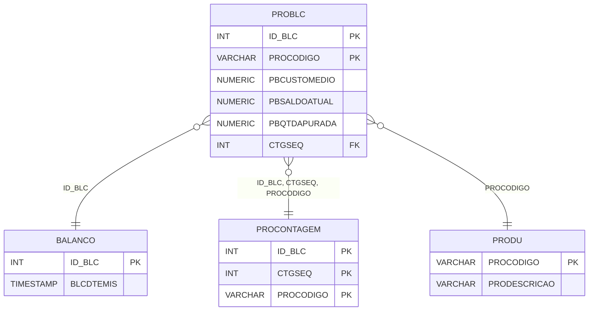

# PROBLC - Documentação Completa de Relacionamentos

## 📊 Informações Gerais

- **Nome da Tabela**: PROBLC (Produto x Balanço/Contagem)
- **Total de Registros**: 1.010.769
- **Total de Colunas**: 8
- **Chave Primária**: ID_BLC, PROCODIGO (composite)
- **Chaves Estrangeiras**: 5
- **Índices**: 0
- **Tabelas Dependentes**: 0
- **Banco de Dados**: Firebird

## 📝 Descrição

**PROBLC** é uma tabela de relacionamento que associa produtos com balanços e contagens. Com **1.010.769 registros**, esta tabela registra informações sobre produtos incluídos em balanços e contagens, incluindo custo médio, saldo atual, quantidade apurada e outras informações relacionadas.

Esta tabela é essencial para:
- **Balanços**: Registrar produtos incluídos em balanços
- **Contagens**: Registrar produtos incluídos em contagens
- **Auditoria**: Manter histórico de balanços e contagens por produto
- **Relatórios**: Gerar relatórios de balanços e contagens

**Contexto de Negócio:**
Balanços e contagens de estoque incluem múltiplos produtos. Esta tabela gerencia essas relações, permitindo rastrear quais produtos foram incluídos em cada balanço/contagem e suas informações relacionadas.

---

## 🔑 Estrutura de Colunas

| Coluna | Tipo | Descrição |
|--------|------|-----------|
| **ID_BLC** 🔑 🔗 | INT | Código do balanço/contagem (PK, FK → BALANCO, PROCONTAGEM) |
| **PROCODIGO** 🔑 🔗 | VARCHAR(14) | Código do produto (PK, FK → PRODU, PROCONTAGEM) |
| **PBCUSTOMEDIO** | NUMERIC(16,2) | Custo médio do produto |
| **PBSALDOATUAL** | NUMERIC(16,2) | Saldo atual do produto |
| **PBQTDAPURADA** | NUMERIC(16,2) | Quantidade apurada |
| **PBAPURADO** | VARCHAR(14) | Flag indicando se foi apurado |
| **CTGSEQ** 🔗 | INT | Sequencial da contagem (FK → PROCONTAGEM) |
| **PBQTDSETORCOMPRA** | NUMERIC(16,2) | Quantidade setor compra |

---

## 🔗 Relacionamentos - Nível 1 (Diretos)

### BALANCO - Balanço (FK Obrigatória)
**Volume:** Variável

**Relacionamento:**
```
PROBLC.ID_BLC → BALANCO.ID_BLC (N:1)
Constraint: BALANCO_PROBLC
```

**Descrição:** Cada registro relaciona um produto com um balanço.

---

### PROCONTAGEM - Produto x Contagem (FK Obrigatória)
**Volume:** 923.382 registros

**Relacionamento:**
```
PROBLC.ID_BLC, CTGSEQ, PROCODIGO → PROCONTAGEM.ID_BLC, CTGSEQ, PROCODIGO (N:1)
Constraint: PROCONTAGEM_PROBLC
```

**Descrição:** Cada registro relaciona um produto com uma contagem específica.

---

### PRODU - Produto (FK Obrigatória)
**Volume:** 178.187 registros

**Relacionamento:**
```
PROBLC.PROCODIGO → PRODU.PROCODIGO (N:1)
Constraint: PRODU_PROBLC
```

**Descrição:** Identifica o produto relacionado.

---

## 🔗 Relacionamentos - Nível 2 (Indiretos)

### BALANCO → CONTAGEM (Contagem)
**Volume:** Variável

**Relacionamento:**
```
PROBLC → BALANCO → CONTAGEM
```

**Descrição:** Através de BALANCO, é possível identificar contagens relacionadas.

---

## 🗺️ Diagrama de Relacionamentos



---

## 💡 Exemplos de Uso

### Consulta Básica

```sql
SELECT ID_BLC, PROCODIGO, PBCUSTOMEDIO, PBSALDOATUAL, PBQTDAPURADA, PBAPURADO
FROM PROBLC
WHERE ID_BLC = ?;
```

### Consulta com Informações do Produto

```sql
SELECT 
    pb.*,
    pr.PRODESCRICAO
FROM PROBLC pb
INNER JOIN PRODU pr
    ON pb.PROCODIGO = pr.PROCODIGO
WHERE pb.ID_BLC = ?;
```

### Consulta de Produtos Apurados

```sql
SELECT 
    pb.*,
    pr.PRODESCRICAO
FROM PROBLC pb
INNER JOIN PRODU pr
    ON pb.PROCODIGO = pr.PROCODIGO
WHERE pb.ID_BLC = ?
    AND pb.PBAPURADO = 'SIM'
ORDER BY pr.PRODESCRICAO;
```

### Consulta de Diferenças (Saldo vs Apurado)

```sql
SELECT 
    pb.*,
    pr.PRODESCRICAO,
    (pb.PBSALDOATUAL - pb.PBQTDAPURADA) AS DIFERENCA
FROM PROBLC pb
INNER JOIN PRODU pr
    ON pb.PROCODIGO = pr.PROCODIGO
WHERE pb.ID_BLC = ?
    AND ABS(pb.PBSALDOATUAL - pb.PBQTDAPURADA) > 0
ORDER BY ABS(pb.PBSALDOATUAL - pb.PBQTDAPURADA) DESC;
```

### Inserção de Produto em Balanço

```sql
INSERT INTO PROBLC (
    ID_BLC,
    PROCODIGO,
    PBCUSTOMEDIO,
    PBSALDOATUAL,
    PBQTDAPURADA,
    PBAPURADO,
    CTGSEQ
)
VALUES (?, ?, ?, ?, ?, ?, ?);
```

---

## ⚡ Performance e Otimização

### Índices Recomendados

#### 1. Índice Composto na Chave Primária (Já existe implicitamente)
```sql
-- Índice primário já existe implicitamente
```

#### 2. Índice em PROCODIGO
```sql
CREATE INDEX IDX_PROBLC_PROCODIGO 
ON PROBLC (PROCODIGO);
```

**Justificativa:** Facilita buscas por produto (muito frequente devido ao volume).

---

## 📊 Estatísticas e Insights

### Volume de Dados

- **Total de Registros**: 1.010.769
- **Tamanho Médio Estimado**: ~50 bytes por registro
- **Tamanho Total Estimado**: ~50 MB

### Distribuição de Dados

- **Relacionamentos**: 1.010.769 relacionamentos produto x balanço/contagem
- **Média por Produto**: ~5,7 relacionamentos por produto

---

## 🔧 Integração com Código Laravel

### Model Eloquent

```php
<?php

namespace App\Models;

use Illuminate\Database\Eloquent\Model;
use Illuminate\Database\Eloquent\Relations\BelongsTo;

final class ProBlc extends Model
{
    protected $table = 'PROBLC';
    public $incrementing = false;
    public $timestamps = false;

    protected $primaryKey = ['ID_BLC', 'PROCODIGO'];

    protected $fillable = [
        'ID_BLC',
        'PROCODIGO',
        'PBCUSTOMEDIO',
        'PBSALDOATUAL',
        'PBQTDAPURADA',
        'PBAPURADO',
        'CTGSEQ',
        'PBQTDSETORCOMPRA',
    ];

    protected $casts = [
        'ID_BLC' => 'integer',
        'PROCODIGO' => 'string',
        'PBCUSTOMEDIO' => 'decimal:2',
        'PBSALDOATUAL' => 'decimal:2',
        'PBQTDAPURADA' => 'decimal:2',
        'PBAPURADO' => 'string',
        'CTGSEQ' => 'integer',
        'PBQTDSETORCOMPRA' => 'decimal:2',
    ];

    /**
     * Relacionamento com Balanço
     */
    public function balanco(): BelongsTo
    {
        return $this->belongsTo(Balanco::class, 'ID_BLC', 'ID_BLC');
    }

    /**
     * Relacionamento com Produto x Contagem
     */
    public function produtoContagem(): BelongsTo
    {
        return $this->belongsTo(ProContagem::class, ['ID_BLC', 'CTGSEQ', 'PROCODIGO'], ['ID_BLC', 'CTGSEQ', 'PROCODIGO']);
    }

    /**
     * Relacionamento com Produto
     */
    public function produto(): BelongsTo
    {
        return $this->belongsTo(Produ::class, 'PROCODIGO', 'PROCODIGO');
    }

    /**
     * Buscar produtos por balanço
     */
    public static function produtosPorBalanco(int $idBlc)
    {
        return self::where('ID_BLC', $idBlc)
            ->with(['produto', 'balanco'])
            ->get();
    }
}
```

---

## ✅ Boas Práticas

### Design

1. **Chave Composta**: Manter integridade da chave composta
2. **Validação**: Validar ID_BLC e PROCODIGO antes de inserir
3. **Valores**: Validar que quantidades sejam não negativas

### Performance

1. **Índices**: Usar índices para buscas frequentes (crítico devido ao volume)
2. **Consultas**: Usar eager loading para relacionamentos
3. **Volume**: Considerar particionamento devido ao grande volume

### Segurança

1. **Validação**: Validar valores antes de inserir
2. **Acesso**: Restringir acesso de escrita a usuários autorizados

---

**Documentação gerada em**: 2025-01-27

**Banco de dados**: Firebird

