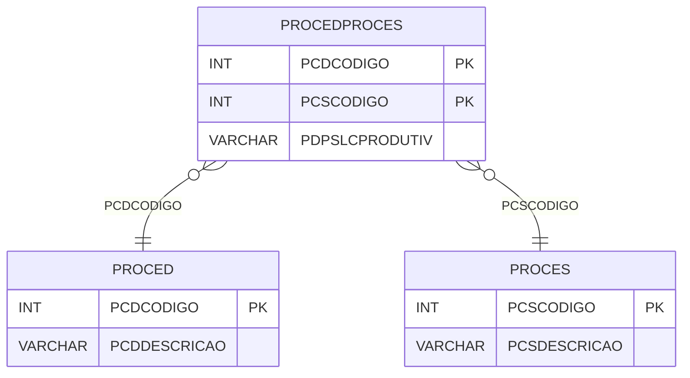

# PROCEDPROCES - Documentação Completa de Relacionamentos

## 📊 Informações Gerais

- **Nome da Tabela**: PROCEDPROCES (Procedimento x Processo)
- **Total de Registros**: 5
- **Total de Colunas**: 3
- **Chave Primária**: PCDCODIGO, PCSCODIGO (composite)
- **Chaves Estrangeiras**: 2
- **Índices**: 0
- **Tabelas Dependentes**: 0
- **Banco de Dados**: Firebird

## 📝 Descrição

**PROCEDPROCES** é uma tabela de relacionamento que associa procedimentos com processos. Com apenas **5 registros**, esta tabela permite definir quais procedimentos estão relacionados a quais processos, incluindo informações sobre localização produtiva.

Esta tabela é essencial para:
- **Rastreamento**: Rastrear quais procedimentos estão relacionados a quais processos
- **Configuração**: Configurar procedimentos por processo
- **Relatórios**: Gerar relatórios de procedimentos por processo
- **Produção**: Gerenciar procedimentos na produção

**Contexto de Negócio:**
Processos podem ter procedimentos específicos associados. Esta tabela gerencia essas relações, permitindo identificar quais procedimentos são aplicados em cada processo.

---

## 🔑 Estrutura de Colunas

| Coluna | Tipo | Descrição |
|--------|------|-----------|
| **PCDCODIGO** 🔑 🔗 | INT | Código do procedimento (PK, FK → PROCED) |
| **PCSCODIGO** 🔑 🔗 | INT | Código do processo (PK, FK → PROCES) |
| **PDPSLCPRODUTIV** | VARCHAR(14) | Flag de localização produtiva |

---

## 🔗 Relacionamentos - Nível 1 (Diretos)

### PROCED - Procedimento (FK Obrigatória)
**Volume:** 10 registros

**Relacionamento:**
```
PROCEDPROCES.PCDCODIGO → PROCED.PCDCODIGO (N:1)
Constraint: PROCED_PROCEDPROCES
```

**Descrição:** Cada registro relaciona um procedimento com um processo.

---

### PROCES - Processo (FK Obrigatória)
**Volume:** 6 registros

**Relacionamento:**
```
PROCEDPROCES.PCSCODIGO → PROCES.PCSCODIGO (N:1)
Constraint: PROCES_PROCEDPROCES
```

**Descrição:** Cada registro relaciona um processo com um procedimento.

---

## 🔗 Relacionamentos - Nível 2 (Indiretos)

### PROCES → LOCALPED (Localização Pedido)
**Volume:** Variável

**Relacionamento:**
```
PROCEDPROCES → PROCES → LOCALPED
```

**Descrição:** Através de PROCES, é possível identificar localizações relacionadas.

---

## 🗺️ Diagrama de Relacionamentos



---

## 💡 Exemplos de Uso

### Consulta Básica

```sql
SELECT PCDCODIGO, PCSCODIGO, PDPSLCPRODUTIV
FROM PROCEDPROCES
WHERE PCDCODIGO = ?;
```

### Consulta com Informações do Procedimento e Processo

```sql
SELECT 
    pp.*,
    pcd.PCDDESCRICAO AS PROCEDIMENTO,
    pcs.PCSDESCRICAO AS PROCESSO
FROM PROCEDPROCES pp
INNER JOIN PROCED pcd
    ON pp.PCDCODIGO = pcd.PCDCODIGO
INNER JOIN PROCES pcs
    ON pp.PCSCODIGO = pcs.PCSCODIGO
WHERE pp.PCDCODIGO = ?;
```

### Consulta de Procedimentos por Processo

```sql
SELECT 
    pp.*,
    pcd.PCDDESCRICAO
FROM PROCEDPROCES pp
INNER JOIN PROCED pcd
    ON pp.PCDCODIGO = pcd.PCDCODIGO
WHERE pp.PCSCODIGO = ?
ORDER BY pcd.PCDDESCRICAO;
```

### Inserção de Relacionamento

```sql
INSERT INTO PROCEDPROCES (PCDCODIGO, PCSCODIGO, PDPSLCPRODUTIV)
VALUES (?, ?, ?);
```

---

## ⚡ Performance e Otimização

### Índices Recomendados

#### 1. Índice Composto na Chave Primária (Já existe implicitamente)
```sql
-- Índice primário já existe implicitamente
```

---

## 📊 Estatísticas e Insights

### Volume de Dados

- **Total de Registros**: 5
- **Tamanho Médio Estimado**: ~30 bytes por registro
- **Tamanho Total Estimado**: ~150 bytes

### Distribuição de Dados

- **Relacionamentos**: 5 relacionamentos procedimento x processo
- **Taxa de Utilização**: Muito baixa (tabela de configuração)

---

## 🔧 Integração com Código Laravel

### Model Eloquent

```php
<?php

namespace App\Models;

use Illuminate\Database\Eloquent\Model;
use Illuminate\Database\Eloquent\Relations\BelongsTo;

final class ProcedProces extends Model
{
    protected $table = 'PROCEDPROCES';
    public $incrementing = false;
    public $timestamps = false;

    protected $primaryKey = ['PCDCODIGO', 'PCSCODIGO'];

    protected $fillable = [
        'PCDCODIGO',
        'PCSCODIGO',
        'PDPSLCPRODUTIV',
    ];

    protected $casts = [
        'PCDCODIGO' => 'integer',
        'PCSCODIGO' => 'integer',
        'PDPSLCPRODUTIV' => 'string',
    ];

    /**
     * Relacionamento com Procedimento
     */
    public function procedimento(): BelongsTo
    {
        return $this->belongsTo(Proced::class, 'PCDCODIGO', 'PCDCODIGO');
    }

    /**
     * Relacionamento com Processo
     */
    public function processo(): BelongsTo
    {
        return $this->belongsTo(Proces::class, 'PCSCODIGO', 'PCSCODIGO');
    }

    /**
     * Buscar procedimentos por processo
     */
    public static function procedimentosPorProcesso(int $pcsCodigo)
    {
        return self::where('PCSCODIGO', $pcsCodigo)
            ->with(['procedimento', 'processo'])
            ->get();
    }
}
```

---

## ✅ Boas Práticas

### Design

1. **Chave Composta**: Manter integridade da chave composta
2. **Validação**: Validar PCDCODIGO e PCSCODIGO antes de inserir
3. **Unicidade**: Garantir que não haja duplicatas

### Performance

1. **Índices**: Não necessário devido ao volume mínimo
2. **Consultas**: Usar eager loading para relacionamentos

### Segurança

1. **Validação**: Validar valores antes de inserir
2. **Acesso**: Restringir acesso de escrita a usuários autorizados

---

**Documentação gerada em**: 2025-01-27

**Banco de dados**: Firebird

