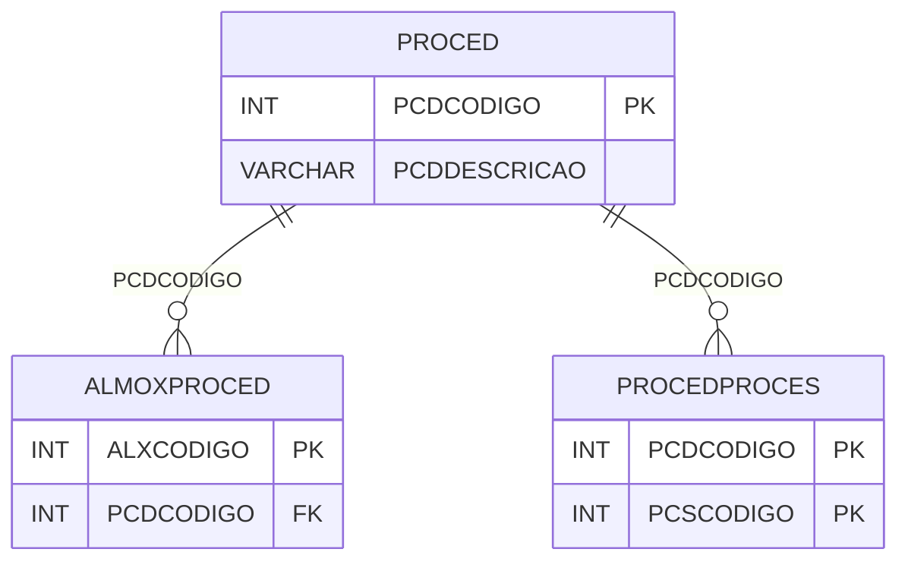

# PROCED - Documentação Completa de Relacionamentos

## 📊 Informações Gerais

- **Nome da Tabela**: PROCED (Procedimento)
- **Total de Registros**: 10
- **Total de Colunas**: 2
- **Chave Primária**: PCDCODIGO
- **Chaves Estrangeiras**: 0
- **Índices**: 0
- **Tabelas Dependentes**: 2
- **Banco de Dados**: Firebird

## 📝 Descrição

**PROCED** é uma tabela mestre que define procedimentos disponíveis no sistema. Com apenas **10 registros**, esta tabela armazena tipos de procedimentos que podem ser associados a processos e almoxarifados.

Esta tabela é essencial para:
- **Tipos de Procedimento**: Definir tipos de procedimentos disponíveis
- **Configuração**: Armazenar configurações de procedimentos
- **Rastreamento**: Rastrear quais procedimentos estão disponíveis
- **Relatórios**: Gerar relatórios de procedimentos

**Contexto de Negócio:**
O sistema possui diferentes tipos de procedimentos que podem ser aplicados em processos e almoxarifados. Esta tabela define esses tipos e suas descrições.

---

## 🔑 Estrutura de Colunas

| Coluna | Tipo | Descrição |
|--------|------|-----------|
| **PCDCODIGO** 🔑 | INT | Código do procedimento (PK) |
| **PCDDESCRICAO** | VARCHAR(37) | Descrição do procedimento |

---

## 🔗 Relacionamentos - Nível 1 (Diretos)

### Tabelas que Referenciam Esta

### ALMOXPROCED - Almoxarifado x Procedimento
**Volume:** Variável

**Relacionamento:**
```
ALMOXPROCED.PCDCODIGO → PROCED.PCDCODIGO (N:1)
Constraint: PROCED_ALMOXPROCED
```

**Descrição:** Relaciona procedimentos com almoxarifados.

---

### PROCEDPROCES - Procedimento x Processo
**Volume:** 5 registros

**Relacionamento:**
```
PROCEDPROCES.PCDCODIGO → PROCED.PCDCODIGO (N:1)
Constraint: PROCED_PROCEDPROCES
```

**Descrição:** Relaciona procedimentos com processos.

---

## 🗺️ Diagrama de Relacionamentos



---

## 💡 Exemplos de Uso

### Consulta Básica

```sql
SELECT PCDCODIGO, PCDDESCRICAO
FROM PROCED
WHERE PCDCODIGO = ?;
```

### Consulta com Processos Relacionados

```sql
SELECT 
    p.*,
    COUNT(pp.PCSCODIGO) AS TOTAL_PROCESSOS
FROM PROCED p
LEFT JOIN PROCEDPROCES pp
    ON p.PCDCODIGO = pp.PCDCODIGO
GROUP BY p.PCDCODIGO, p.PCDDESCRICAO
ORDER BY TOTAL_PROCESSOS DESC;
```

### Inserção de Novo Procedimento

```sql
INSERT INTO PROCED (PCDDESCRICAO)
VALUES (?);
```

---

## ⚡ Performance e Otimização

### Índices Recomendados

#### 1. Índice na Chave Primária (Já existe implicitamente)
```sql
-- Índice primário já existe implicitamente
```

---

## 📊 Estatísticas e Insights

### Volume de Dados

- **Total de Registros**: 10
- **Tamanho Médio Estimado**: ~50 bytes por registro
- **Tamanho Total Estimado**: ~500 bytes

### Distribuição de Dados

- **Procedimentos**: 10 tipos de procedimentos disponíveis
- **Taxa de Utilização**: Tabela mestre com poucos registros

---

## 🔧 Integração com Código Laravel

### Model Eloquent

```php
<?php

namespace App\Models;

use Illuminate\Database\Eloquent\Model;
use Illuminate\Database\Eloquent\Relations\HasMany;

final class Proced extends Model
{
    protected $table = 'PROCED';
    protected $primaryKey = 'PCDCODIGO';
    public $incrementing = true;
    public $timestamps = false;

    protected $fillable = [
        'PCDDESCRICAO',
    ];

    protected $casts = [
        'PCDCODIGO' => 'integer',
        'PCDDESCRICAO' => 'string',
    ];

    /**
     * Buscar todos os procedimentos
     */
    public static function todos()
    {
        return self::orderBy('PCDDESCRICAO')
            ->get();
    }
}
```

---

## ✅ Boas Práticas

### Design

1. **Chave Primária**: PCDCODIGO deve ser único e sequencial
2. **Validação**: Validar PCDDESCRICAO antes de inserir
3. **Unicidade**: Garantir que PCDDESCRICAO seja único

### Performance

1. **Índices**: Não necessário devido ao volume mínimo
2. **Consultas**: Consultas simples são suficientes

### Segurança

1. **Validação**: Validar valores antes de inserir
2. **Acesso**: Restringir acesso de escrita a administradores

---

**Documentação gerada em**: 2025-01-27

**Banco de dados**: Firebird

