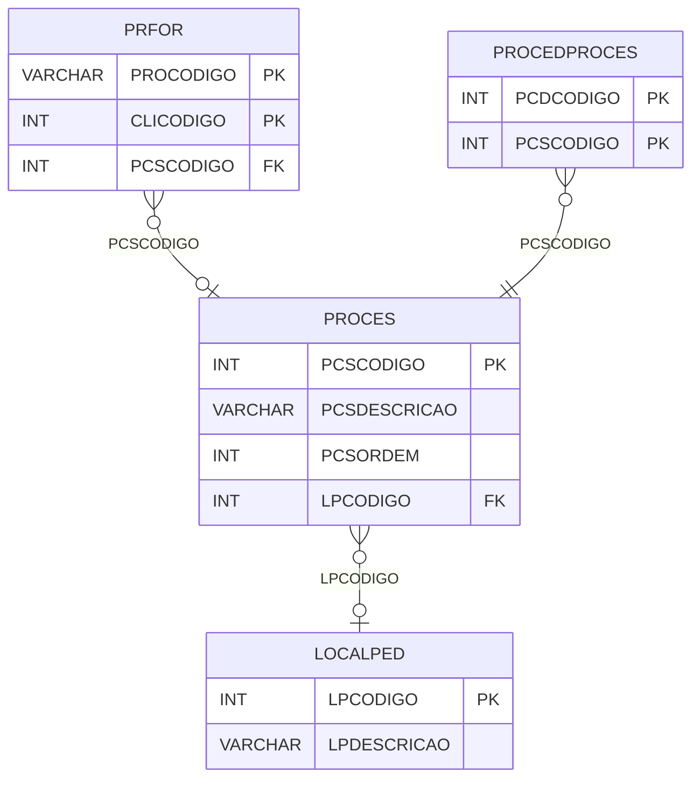

# PROCES - Documentação Completa de Relacionamentos

## 📊 Informações Gerais

- **Nome da Tabela**: PROCES (Processo)
- **Total de Registros**: 6
- **Total de Colunas**: 7
- **Chave Primária**: PCSCODIGO
- **Chaves Estrangeiras**: 1
- **Índices**: 0
- **Tabelas Dependentes**: 5
- **Banco de Dados**: Firebird

## 📝 Descrição

**PROCES** é uma tabela mestre que define processos disponíveis no sistema. Com apenas **6 registros**, esta tabela armazena processos que podem ser associados a produtos, fornecedores, procedimentos e localizações de pedidos.

Esta tabela é essencial para:
- **Processos**: Definir processos disponíveis no sistema
- **Configuração**: Armazenar configurações de processos
- **Rastreamento**: Rastrear quais processos estão disponíveis
- **Relatórios**: Gerar relatórios de processos

**Contexto de Negócio:**
O sistema possui diferentes processos que podem ser aplicados em produtos, fornecedores e localizações. Esta tabela define esses processos e suas configurações.

---

## 🔑 Estrutura de Colunas

| Coluna | Tipo | Descrição |
|--------|------|-----------|
| **PCSCODIGO** 🔑 | INT | Código do processo (PK) |
| **PCSDESCRICAO** | VARCHAR(37) | Descrição do processo |
| **PCSORDEM** | INT | Ordem do processo |
| **PCSTERCEIRO** | VARCHAR(14) | Flag indicando se é terceiro |
| **LPCODIGO** 🔗 | INT | Código da localização pedido (FK → LOCALPED) |
| **PCSTEMPOMINIMO** | INT | Tempo mínimo do processo |
| **PCSNAOGERASUBROTEIRO** | VARCHAR(14) | Flag de não geração sub-roteiro terceiro |

---

## 🔗 Relacionamentos - Nível 1 (Diretos)

### LOCALPED - Localização Pedido (FK Opcional)
**Volume:** Variável

**Relacionamento:**
```
PROCES.LPCODIGO → LOCALPED.LPCODIGO (N:1)
Constraint: LOCALPED_PROCES
```

**Descrição:** Define a localização pedido relacionada ao processo.

---

## 📊 Tabelas que Referenciam Esta

Esta tabela é referenciada por 5 tabelas:

### LOCALPEDPROCESSO - Localização Pedido x Processo
**Volume:** Variável

**Relacionamento:**
```
LOCALPEDPROCESSO.PCSCODIGO → PROCES.PCSCODIGO (N:1)
Constraint: PROCES_LOCALPEDPROCESSO
```

### PRFOR - Produto x Fornecedor
**Volume:** 149.252 registros

**Relacionamento:**
```
PRFOR.PCSCODIGO → PROCES.PCSCODIGO (N:1)
Constraint: PROCES_PRFOR
```

### PROCEDPROCES - Procedimento x Processo
**Volume:** 5 registros

**Relacionamento:**
```
PROCEDPROCES.PCSCODIGO → PROCES.PCSCODIGO (N:1)
Constraint: PROCES_PROCEDPROCES
```

### PROCESCOMB - Processo x Combinação
**Volume:** Variável

**Relacionamento:**
```
PROCESCOMB.PCSCODIGO → PROCES.PCSCODIGO (N:1)
Constraint: FK_PROCESCOMB_PROCES
```

### SRFOR - Serviço x Fornecedor
**Volume:** Variável

**Relacionamento:**
```
SRFOR.PCSCODIGO → PROCES.PCSCODIGO (N:1)
Constraint: PROCES_SRFOR
```

---

## 🗺️ Diagrama de Relacionamentos



---

## 💡 Exemplos de Uso

### Consulta Básica

```sql
SELECT PCSCODIGO, PCSDESCRICAO, PCSORDEM, PCSTERCEIRO, LPCODIGO, PCSTEMPOMINIMO
FROM PROCES
WHERE PCSCODIGO = ?;
```

### Consulta com Localização Pedido

```sql
SELECT 
    p.*,
    lp.LPDESCRICAO
FROM PROCES p
LEFT JOIN LOCALPED lp
    ON p.LPCODIGO = lp.LPCODIGO
WHERE p.PCSCODIGO = ?;
```

### Consulta de Processos Ordenados

```sql
SELECT PCSCODIGO, PCSDESCRICAO, PCSORDEM
FROM PROCES
ORDER BY PCSORDEM;
```

### Inserção de Novo Processo

```sql
INSERT INTO PROCES (
    PCSDESCRICAO,
    PCSORDEM,
    PCSTERCEIRO,
    LPCODIGO,
    PCSTEMPOMINIMO,
    PCSNAOGERASUBROTEIRO
)
VALUES (?, ?, ?, ?, ?, ?);
```

---

## ⚡ Performance e Otimização

### Índices Recomendados

#### 1. Índice na Chave Primária (Já existe implicitamente)
```sql
-- Índice primário já existe implicitamente
```

---

## 📊 Estatísticas e Insights

### Volume de Dados

- **Total de Registros**: 6
- **Tamanho Médio Estimado**: ~80 bytes por registro
- **Tamanho Total Estimado**: ~480 bytes

### Distribuição de Dados

- **Processos**: 6 processos disponíveis
- **Taxa de Utilização**: Tabela mestre com poucos registros

---

## 🔧 Integração com Código Laravel

### Model Eloquent

```php
<?php

namespace App\Models;

use Illuminate\Database\Eloquent\Model;
use Illuminate\Database\Eloquent\Relations\BelongsTo;
use Illuminate\Database\Eloquent\Relations\HasMany;

final class Proces extends Model
{
    protected $table = 'PROCES';
    protected $primaryKey = 'PCSCODIGO';
    public $incrementing = true;
    public $timestamps = false;

    protected $fillable = [
        'PCSDESCRICAO',
        'PCSORDEM',
        'PCSTERCEIRO',
        'LPCODIGO',
        'PCSTEMPOMINIMO',
        'PCSNAOGERASUBROTEIRO',
    ];

    protected $casts = [
        'PCSCODIGO' => 'integer',
        'PCSORDEM' => 'integer',
        'LPCODIGO' => 'integer',
        'PCSTEMPOMINIMO' => 'integer',
    ];

    /**
     * Relacionamento com Localização Pedido
     */
    public function localizacaoPedido(): BelongsTo
    {
        return $this->belongsTo(LocalPed::class, 'LPCODIGO', 'LPCODIGO');
    }

    /**
     * Buscar todos os processos ordenados
     */
    public static function todos()
    {
        return self::orderBy('PCSORDEM')
            ->with(['localizacaoPedido'])
            ->get();
    }
}
```

---

## ✅ Boas Práticas

### Design

1. **Chave Primária**: PCSCODIGO deve ser único e sequencial
2. **Validação**: Validar PCSDESCRICAO antes de inserir
3. **Ordem**: Manter PCSORDEM consistente

### Performance

1. **Índices**: Não necessário devido ao volume mínimo
2. **Consultas**: Usar eager loading para relacionamentos

### Segurança

1. **Validação**: Validar valores antes de inserir
2. **Acesso**: Restringir acesso de escrita a administradores

---

**Documentação gerada em**: 2025-01-27

**Banco de dados**: Firebird

