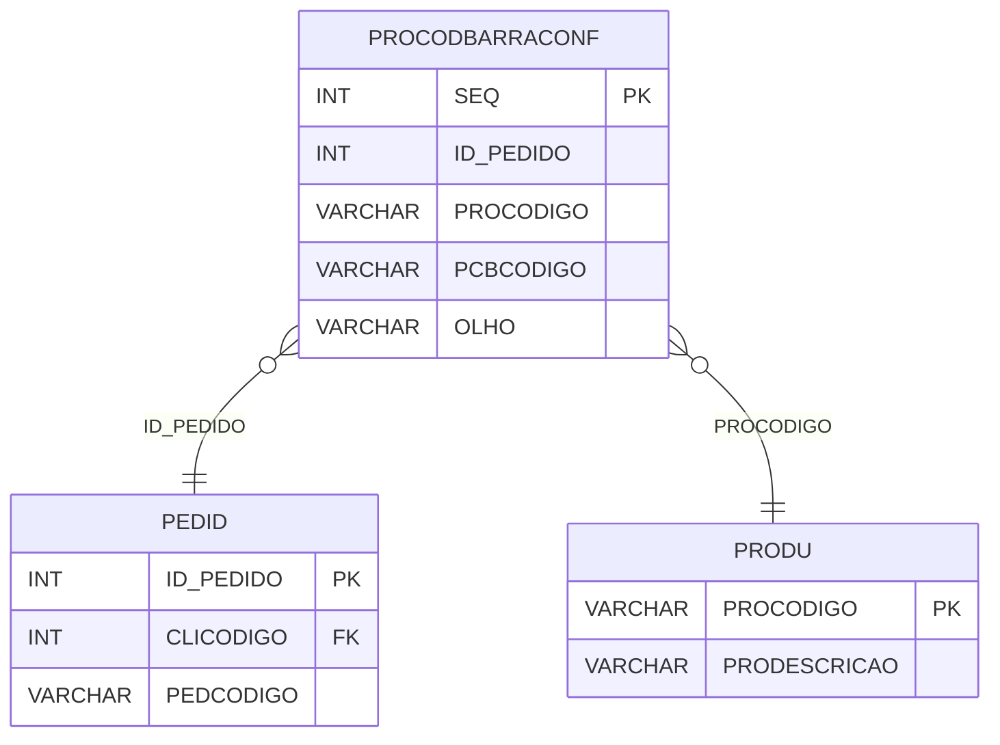

# PROCODBARRACONF - Documentação Completa de Relacionamentos

## 📊 Informações Gerais

- **Nome da Tabela**: PROCODBARRACONF (Produto Código de Barras Confirmação)
- **Total de Registros**: 4.747.026
- **Total de Colunas**: 5
- **Chave Primária**: SEQ
- **Chaves Estrangeiras**: 0 (relacionamentos lógicos)
- **Índices**: 2
- **Tabelas Dependentes**: 0
- **Banco de Dados**: Firebird

## 📝 Descrição

**PROCODBARRACONF** é uma tabela de confirmação que armazena códigos de barras confirmados relacionados a pedidos e produtos. Com **4.747.026 registros**, esta tabela registra confirmações de códigos de barras por pedido, produto e olho (direito/esquerdo), permitindo rastreamento detalhado de confirmações.

Esta tabela é essencial para:
- **Confirmação**: Confirmar códigos de barras por pedido e produto
- **Rastreamento**: Rastrear confirmações por pedido, produto e olho
- **Auditoria**: Manter histórico de confirmações
- **Relatórios**: Gerar relatórios de confirmações

**Contexto de Negócio:**
Pedidos podem ter códigos de barras confirmados por produto e olho. Esta tabela gerencia essas confirmações, permitindo rastreamento detalhado de cada confirmação.

---

## 🔑 Estrutura de Colunas

| Coluna | Tipo | Descrição |
|--------|------|-----------|
| **SEQ** 🔑 | INT | Sequencial único da confirmação (PK) |
| **ID_PEDIDO** | INT | Código do pedido (relacionamento lógico → PEDID) |
| **PROCODIGO** | VARCHAR(37) | Código do produto (relacionamento lógico → PRODU) |
| **PCBCODIGO** | VARCHAR(37) | Código de barras confirmado |
| **OLHO** | VARCHAR(14) | Olho relacionado (DIREITO, ESQUERDO, etc.) |

---

## 🔗 Relacionamentos - Nível 1 (Diretos)

### Relacionamentos Lógicos

### PEDID - Pedido (Relacionamento Lógico)
**Volume:** 3.099.176 registros

**Relacionamento Lógico:**
```
PROCODBARRACONF.ID_PEDIDO → PEDID.ID_PEDIDO (N:1)
```

**Descrição:** Cada confirmação está relacionada a um pedido específico.

---

### PRODU - Produto (Relacionamento Lógico)
**Volume:** 178.187 registros

**Relacionamento Lógico:**
```
PROCODBARRACONF.PROCODIGO → PRODU.PROCODIGO (N:1)
```

**Descrição:** Cada confirmação está relacionada a um produto específico.

---

## 🔗 Relacionamentos - Nível 2 (Indiretos)

### PEDID → CLIEN (Cliente)
**Volume:** 9.251 registros

**Relacionamento:**
```
PROCODBARRACONF → PEDID → CLIEN
```

**Descrição:** Através de PEDID, é possível identificar o cliente relacionado.

---

## 🗺️ Diagrama de Relacionamentos



---

## 💡 Exemplos de Uso

### Consulta Básica

```sql
SELECT SEQ, ID_PEDIDO, PROCODIGO, PCBCODIGO, OLHO
FROM PROCODBARRACONF
WHERE SEQ = ?;
```

### Consulta com Informações do Pedido e Produto

```sql
SELECT 
    pcb.*,
    pd.PEDCODIGO,
    pr.PRODESCRICAO
FROM PROCODBARRACONF pcb
INNER JOIN PEDID pd
    ON pcb.ID_PEDIDO = pd.ID_PEDIDO
INNER JOIN PRODU pr
    ON pcb.PROCODIGO = pr.PROCODIGO
WHERE pcb.SEQ = ?;
```

### Consulta de Confirmações por Pedido

```sql
SELECT 
    pcb.*,
    pr.PRODESCRICAO
FROM PROCODBARRACONF pcb
INNER JOIN PRODU pr
    ON pcb.PROCODIGO = pr.PROCODIGO
WHERE pcb.ID_PEDIDO = ?
ORDER BY pr.PRODESCRICAO, pcb.OLHO;
```

### Consulta de Confirmações por Produto

```sql
SELECT 
    pcb.*,
    pd.PEDCODIGO
FROM PROCODBARRACONF pcb
INNER JOIN PEDID pd
    ON pcb.ID_PEDIDO = pd.ID_PEDIDO
WHERE pcb.PROCODIGO = ?
ORDER BY pd.PEDDTEMIS DESC;
```

### Consulta de Confirmações por Código de Barras

```sql
SELECT 
    pcb.*,
    pd.PEDCODIGO,
    pr.PRODESCRICAO
FROM PROCODBARRACONF pcb
INNER JOIN PEDID pd
    ON pcb.ID_PEDIDO = pd.ID_PEDIDO
INNER JOIN PRODU pr
    ON pcb.PROCODIGO = pr.PROCODIGO
WHERE pcb.PCBCODIGO = ?;
```

### Inserção de Confirmação

```sql
INSERT INTO PROCODBARRACONF (ID_PEDIDO, PROCODIGO, PCBCODIGO, OLHO)
VALUES (?, ?, ?, ?);
```

---

## ⚡ Performance e Otimização

### Índices Existentes

#### 1. Índice em ID_PEDIDO
**Nome:** IDX_ID_PEDIDO_PROCODBARRACONF
**Colunas:** ID_PEDIDO

**Justificativa:** Facilita buscas por pedido (muito frequente devido ao volume).

---

#### 2. Índice em PROCODIGO
**Nome:** IDX_PRODUTO_PROCODBARRACONF
**Colunas:** PROCODIGO

**Justificativa:** Facilita buscas por produto (muito frequente devido ao volume).

---

### Índices Recomendados

#### 1. Índice na Chave Primária (Já existe implicitamente)
```sql
-- Índice primário já existe implicitamente
```

#### 2. Índice Composto em ID_PEDIDO e PROCODIGO
```sql
CREATE INDEX IDX_PROCODBARRACONF_PED_PRO 
ON PROCODBARRACONF (ID_PEDIDO, PROCODIGO);
```

**Justificativa:** Facilita buscas por pedido e produto simultaneamente (muito frequente).

---

## 📊 Estatísticas e Insights

### Volume de Dados

- **Total de Registros**: 4.747.026
- **Tamanho Médio Estimado**: ~50 bytes por registro
- **Tamanho Total Estimado**: ~237 MB

### Distribuição de Dados

- **Confirmações**: 4.747.026 confirmações de códigos de barras
- **Média por Pedido**: ~1,5 confirmações por pedido

---

## 🔧 Integração com Código Laravel

### Model Eloquent

```php
<?php

namespace App\Models;

use Illuminate\Database\Eloquent\Model;
use Illuminate\Database\Eloquent\Relations\BelongsTo;

final class ProCodBarraConf extends Model
{
    protected $table = 'PROCODBARRACONF';
    protected $primaryKey = 'SEQ';
    public $incrementing = true;
    public $timestamps = false;

    protected $fillable = [
        'ID_PEDIDO',
        'PROCODIGO',
        'PCBCODIGO',
        'OLHO',
    ];

    protected $casts = [
        'SEQ' => 'integer',
        'ID_PEDIDO' => 'integer',
        'PROCODIGO' => 'string',
        'PCBCODIGO' => 'string',
        'OLHO' => 'string',
    ];

    /**
     * Relacionamento com Pedido
     */
    public function pedido(): BelongsTo
    {
        return $this->belongsTo(Pedid::class, 'ID_PEDIDO', 'ID_PEDIDO');
    }

    /**
     * Relacionamento com Produto
     */
    public function produto(): BelongsTo
    {
        return $this->belongsTo(Produ::class, 'PROCODIGO', 'PROCODIGO');
    }

    /**
     * Buscar confirmações por pedido
     */
    public static function confirmacoesPorPedido(int $idPedido)
    {
        return self::where('ID_PEDIDO', $idPedido)
            ->with(['pedido', 'produto'])
            ->get();
    }

    /**
     * Buscar confirmações por código de barras
     */
    public static function confirmacoesPorCodigo(string $pcbCodigo)
    {
        return self::where('PCBCODIGO', $pcbCodigo)
            ->with(['pedido', 'produto'])
            ->get();
    }
}
```

---

## ✅ Boas Práticas

### Design

1. **Chave Primária**: SEQ deve ser único e sequencial
2. **Validação**: Validar ID_PEDIDO e PROCODIGO antes de inserir
3. **Unicidade**: Considerar constraint única em (ID_PEDIDO, PROCODIGO, PCBCODIGO, OLHO)

### Performance

1. **Índices**: Usar índices compostos para buscas frequentes (crítico devido ao volume)
2. **Consultas**: Usar eager loading para relacionamentos
3. **Volume**: Considerar particionamento devido ao grande volume

### Segurança

1. **Validação**: Validar valores antes de inserir
2. **Acesso**: Restringir acesso de escrita a usuários autorizados

---

**Documentação gerada em**: 2025-01-27

**Banco de dados**: Firebird

