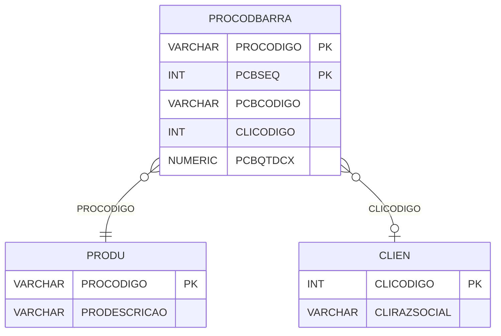

# PROCODBARRA - Documentação Completa de Relacionamentos

## 📊 Informações Gerais

- **Nome da Tabela**: PROCODBARRA (Produto x Código de Barras)
- **Total de Registros**: 67.809
- **Total de Colunas**: 5
- **Chave Primária**: PROCODIGO, PCBSEQ (composite)
- **Chaves Estrangeiras**: 1
- **Índices**: 1
- **Tabelas Dependentes**: 0
- **Banco de Dados**: Firebird

## 📝 Descrição

**PROCODBARRA** é uma tabela de detalhamento que armazena códigos de barras relacionados a produtos. Com **67.809 registros**, esta tabela permite que produtos tenham múltiplos códigos de barras, incluindo códigos específicos por cliente e quantidades por caixa.

Esta tabela é essencial para:
- **Códigos de Barras**: Gerenciar múltiplos códigos de barras por produto
- **Personalização**: Permitir códigos de barras específicos por cliente
- **Rastreamento**: Rastrear códigos de barras por produto
- **Relatórios**: Gerar relatórios de códigos de barras

**Contexto de Negócio:**
Produtos podem ter diferentes códigos de barras dependendo do cliente ou da embalagem. Esta tabela gerencia esses códigos, permitindo múltiplos códigos por produto.

---

## 🔑 Estrutura de Colunas

| Coluna | Tipo | Descrição |
|--------|------|-----------|
| **PROCODIGO** 🔑 🔗 | VARCHAR(14) | Código do produto (PK, FK → PRODU) |
| **PCBSEQ** 🔑 | INT | Sequencial do código de barras (PK) |
| **PCBCODIGO** | VARCHAR(37) | Código de barras |
| **CLICODIGO** | INT | Código do cliente (relacionamento lógico → CLIEN) |
| **PCBQTDCX** | NUMERIC(16,2) | Quantidade por caixa |

---

## 🔗 Relacionamentos - Nível 1 (Diretos)

### PRODU - Produto (FK Obrigatória)
**Volume:** 178.187 registros

**Relacionamento:**
```
PROCODBARRA.PROCODIGO → PRODU.PROCODIGO (N:1)
Constraint: PRODU_PROCODBARRA
```

**Descrição:** Cada código de barras está relacionado a um produto específico.

**Proporção:** ~0,4 códigos de barras por produto em média (67.809 / 178.187)

---

## 🔗 Relacionamentos - Nível 2 (Indiretos)

### CLIEN - Cliente (Relacionamento Lógico)
**Volume:** 9.251 registros

**Relacionamento Lógico:**
```
PROCODBARRA.CLICODIGO → CLIEN.CLICODIGO (N:1)
```

**Descrição:** Cada código de barras pode estar relacionado a um cliente específico.

---

## 🗺️ Diagrama de Relacionamentos



---

## 💡 Exemplos de Uso

### Consulta Básica

```sql
SELECT PROCODIGO, PCBSEQ, PCBCODIGO, CLICODIGO, PCBQTDCX
FROM PROCODBARRA
WHERE PROCODIGO = ?
ORDER BY PCBSEQ;
```

### Consulta com Informações do Produto

```sql
SELECT 
    pcb.*,
    pr.PRODESCRICAO
FROM PROCODBARRA pcb
INNER JOIN PRODU pr
    ON pcb.PROCODIGO = pr.PROCODIGO
WHERE pcb.PROCODIGO = ?
ORDER BY pcb.PCBSEQ;
```

### Consulta de Código de Barras por Código

```sql
SELECT 
    pcb.*,
    pr.PRODESCRICAO
FROM PROCODBARRA pcb
INNER JOIN PRODU pr
    ON pcb.PROCODIGO = pr.PROCODIGO
WHERE pcb.PCBCODIGO = ?;
```

### Consulta de Códigos por Cliente

```sql
SELECT 
    pcb.*,
    pr.PRODESCRICAO,
    c.CLIRAZSOCIAL
FROM PROCODBARRA pcb
INNER JOIN PRODU pr
    ON pcb.PROCODIGO = pr.PROCODIGO
LEFT JOIN CLIEN c
    ON pcb.CLICODIGO = c.CLICODIGO
WHERE pcb.CLICODIGO = ?
ORDER BY pr.PRODESCRICAO;
```

### Inserção de Novo Código de Barras

```sql
INSERT INTO PROCODBARRA (PROCODIGO, PCBSEQ, PCBCODIGO, CLICODIGO, PCBQTDCX)
VALUES (?, ?, ?, ?, ?);
```

---

## ⚡ Performance e Otimização

### Índices Existentes

#### 1. Índice em PCBCODIGO
**Nome:** INDPROCODBARRA
**Colunas:** PCBCODIGO

**Justificativa:** Facilita buscas por código de barras (crítico para leitura de códigos).

---

### Índices Recomendados

#### 1. Índice Composto na Chave Primária (Já existe implicitamente)
```sql
-- Índice primário já existe implicitamente
```

#### 2. Índice em CLICODIGO
```sql
CREATE INDEX IDX_PROCODBARRA_CLICODIGO 
ON PROCODBARRA (CLICODIGO);
```

**Justificativa:** Facilita buscas por cliente.

---

## 📊 Estatísticas e Insights

### Volume de Dados

- **Total de Registros**: 67.809
- **Tamanho Médio Estimado**: ~50 bytes por registro
- **Tamanho Total Estimado**: ~3.4 MB

### Distribuição de Dados

- **Códigos de Barras**: 67.809 códigos de barras
- **Média por Produto**: ~0,4 códigos por produto

---

## 🔧 Integração com Código Laravel

### Model Eloquent

```php
<?php

namespace App\Models;

use Illuminate\Database\Eloquent\Model;
use Illuminate\Database\Eloquent\Relations\BelongsTo;

final class ProCodBarra extends Model
{
    protected $table = 'PROCODBARRA';
    public $incrementing = false;
    public $timestamps = false;

    protected $primaryKey = ['PROCODIGO', 'PCBSEQ'];

    protected $fillable = [
        'PROCODIGO',
        'PCBSEQ',
        'PCBCODIGO',
        'CLICODIGO',
        'PCBQTDCX',
    ];

    protected $casts = [
        'PROCODIGO' => 'string',
        'PCBSEQ' => 'integer',
        'PCBCODIGO' => 'string',
        'CLICODIGO' => 'integer',
        'PCBQTDCX' => 'decimal:2',
    ];

    /**
     * Relacionamento com Produto
     */
    public function produto(): BelongsTo
    {
        return $this->belongsTo(Produ::class, 'PROCODIGO', 'PROCODIGO');
    }

    /**
     * Relacionamento com Cliente
     */
    public function cliente(): BelongsTo
    {
        return $this->belongsTo(Clien::class, 'CLICODIGO', 'CLICODIGO');
    }

    /**
     * Buscar códigos de barras por produto
     */
    public static function codigosPorProduto(string $proCodigo)
    {
        return self::where('PROCODIGO', $proCodigo)
            ->with(['produto', 'cliente'])
            ->orderBy('PCBSEQ')
            ->get();
    }

    /**
     * Buscar produto por código de barras
     */
    public static function produtoPorCodigo(string $pcbCodigo)
    {
        return self::where('PCBCODIGO', $pcbCodigo)
            ->with(['produto', 'cliente'])
            ->first();
    }
}
```

---

## ✅ Boas Práticas

### Design

1. **Chave Composta**: Manter integridade da chave composta
2. **Validação**: Validar PROCODIGO e PCBCODIGO antes de inserir
3. **Unicidade**: Considerar constraint única em PCBCODIGO

### Performance

1. **Índices**: Usar índice para busca por código de barras (crítico)
2. **Consultas**: Usar eager loading para relacionamentos

### Segurança

1. **Validação**: Validar valores antes de inserir
2. **Acesso**: Restringir acesso de escrita a usuários autorizados

---

**Documentação gerada em**: 2025-01-27

**Banco de dados**: Firebird

