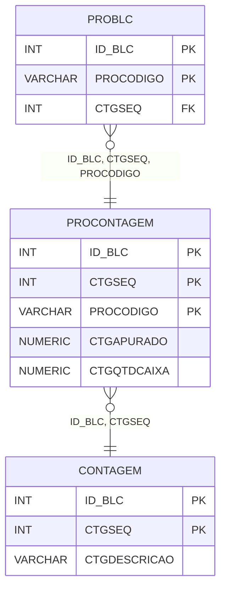

# PROCONTAGEM - Documentação Completa de Relacionamentos

## 📊 Informações Gerais

- **Nome da Tabela**: PROCONTAGEM (Produto x Contagem)
- **Total de Registros**: 923.382
- **Total de Colunas**: 5
- **Chave Primária**: ID_BLC, CTGSEQ, PROCODIGO (composite)
- **Chaves Estrangeiras**: 2
- **Índices**: 1
- **Tabelas Dependentes**: 3
- **Banco de Dados**: Firebird

## 📝 Descrição

**PROCONTAGEM** é uma tabela de relacionamento que associa produtos com contagens específicas. Com **923.382 registros**, esta tabela registra produtos incluídos em cada contagem, incluindo informações sobre quantidade apurada e quantidade por caixa.

Esta tabela é essencial para:
- **Contagens**: Registrar produtos incluídos em contagens
- **Auditoria**: Manter histórico de contagens por produto
- **Rastreamento**: Rastrear produtos por contagem
- **Relatórios**: Gerar relatórios de contagens

**Contexto de Negócio:**
Contagens de estoque incluem múltiplos produtos. Esta tabela gerencia essas relações, permitindo rastrear quais produtos foram incluídos em cada contagem e suas quantidades apuradas.

---

## 🔑 Estrutura de Colunas

| Coluna | Tipo | Descrição |
|--------|------|-----------|
| **ID_BLC** 🔑 🔗 | INT | Código do balanço/contagem (PK, FK → CONTAGEM) |
| **CTGSEQ** 🔑 🔗 | INT | Sequencial da contagem (PK, FK → CONTAGEM) |
| **PROCODIGO** 🔑 | VARCHAR(14) | Código do produto (PK) |
| **CTGAPURADO** | NUMERIC(16,2) | Quantidade apurada |
| **CTGQTDCAIXA** | NUMERIC(16,2) | Quantidade por caixa |

---

## 🔗 Relacionamentos - Nível 1 (Diretos)

### CONTAGEM - Contagem (FK Obrigatória)
**Volume:** 3.098 registros

**Relacionamento:**
```
PROCONTAGEM.ID_BLC, CTGSEQ → CONTAGEM.ID_BLC, CTGSEQ (N:1)
Constraint: CONTAGEM_PROCONTAGEM
```

**Descrição:** Cada registro relaciona um produto com uma contagem específica.

**Proporção:** ~298 produtos por contagem em média (923.382 / 3.098)

---

## 📊 Tabelas que Referenciam Esta

Esta tabela é referenciada por 3 tabelas:

### PROBLC - Produto x Balanço/Contagem
**Volume:** 1.010.769 registros

**Relacionamento:**
```
PROBLC.ID_BLC, CTGSEQ, PROCODIGO → PROCONTAGEM.ID_BLC, CTGSEQ, PROCODIGO (N:1)
Constraint: PROCONTAGEM_PROBLC
```

**Descrição:** Relaciona produtos de balanços com contagens específicas.

---

## 🗺️ Diagrama de Relacionamentos



---

## 💡 Exemplos de Uso

### Consulta Básica

```sql
SELECT ID_BLC, CTGSEQ, PROCODIGO, CTGAPURADO, CTGQTDCAIXA
FROM PROCONTAGEM
WHERE ID_BLC = ? AND CTGSEQ = ?;
```

### Consulta com Informações da Contagem

```sql
SELECT 
    pc.*,
    c.CTGDESCRICAO
FROM PROCONTAGEM pc
INNER JOIN CONTAGEM c
    ON pc.ID_BLC = c.ID_BLC
    AND pc.CTGSEQ = c.CTGSEQ
WHERE pc.ID_BLC = ? AND pc.CTGSEQ = ?;
```

### Consulta de Produtos por Contagem

```sql
SELECT 
    pc.*,
    pr.PRODESCRICAO
FROM PROCONTAGEM pc
INNER JOIN PRODU pr
    ON pc.PROCODIGO = pr.PROCODIGO
WHERE pc.ID_BLC = ? AND pc.CTGSEQ = ?
ORDER BY pr.PRODESCRICAO;
```

### Consulta de Contagens por Produto

```sql
SELECT 
    pc.*,
    c.CTGDESCRICAO,
    c.CTGDTENCERRAMENTO
FROM PROCONTAGEM pc
INNER JOIN CONTAGEM c
    ON pc.ID_BLC = c.ID_BLC
    AND pc.CTGSEQ = c.CTGSEQ
WHERE pc.PROCODIGO = ?
ORDER BY c.CTGDTENCERRAMENTO DESC;
```

### Inserção de Produto em Contagem

```sql
INSERT INTO PROCONTAGEM (ID_BLC, CTGSEQ, PROCODIGO, CTGAPURADO, CTGQTDCAIXA)
VALUES (?, ?, ?, ?, ?);
```

---

## ⚡ Performance e Otimização

### Índices Existentes

#### 1. Índice em PROCODIGO
**Nome:** INDCONTAGEMPRODU
**Colunas:** PROCODIGO

**Justificativa:** Facilita buscas por produto (muito frequente devido ao volume).

---

### Índices Recomendados

#### 1. Índice Composto na Chave Primária (Já existe implicitamente)
```sql
-- Índice primário já existe implicitamente
```

#### 2. Índice Composto em ID_BLC e CTGSEQ
```sql
CREATE INDEX IDX_PROCONTAGEM_BLC_SEQ 
ON PROCONTAGEM (ID_BLC, CTGSEQ);
```

**Justificativa:** Facilita buscas por contagem (muito frequente devido ao volume).

---

## 📊 Estatísticas e Insights

### Volume de Dados

- **Total de Registros**: 923.382
- **Tamanho Médio Estimado**: ~40 bytes por registro
- **Tamanho Total Estimado**: ~37 MB

### Distribuição de Dados

- **Relacionamentos**: 923.382 relacionamentos produto x contagem
- **Média por Contagem**: ~298 produtos por contagem

---

## 🔧 Integração com Código Laravel

### Model Eloquent

```php
<?php

namespace App\Models;

use Illuminate\Database\Eloquent\Model;
use Illuminate\Database\Eloquent\Relations\BelongsTo;

final class ProContagem extends Model
{
    protected $table = 'PROCONTAGEM';
    public $incrementing = false;
    public $timestamps = false;

    protected $primaryKey = ['ID_BLC', 'CTGSEQ', 'PROCODIGO'];

    protected $fillable = [
        'ID_BLC',
        'CTGSEQ',
        'PROCODIGO',
        'CTGAPURADO',
        'CTGQTDCAIXA',
    ];

    protected $casts = [
        'ID_BLC' => 'integer',
        'CTGSEQ' => 'integer',
        'PROCODIGO' => 'string',
        'CTGAPURADO' => 'decimal:2',
        'CTGQTDCAIXA' => 'decimal:2',
    ];

    /**
     * Relacionamento com Contagem
     */
    public function contagem(): BelongsTo
    {
        return $this->belongsTo(Contagem::class, ['ID_BLC', 'CTGSEQ'], ['ID_BLC', 'CTGSEQ']);
    }

    /**
     * Buscar produtos por contagem
     */
    public static function produtosPorContagem(int $idBlc, int $ctgSeq)
    {
        return self::where('ID_BLC', $idBlc)
            ->where('CTGSEQ', $ctgSeq)
            ->with(['contagem'])
            ->get();
    }
}
```

---

## ✅ Boas Práticas

### Design

1. **Chave Composta**: Manter integridade da chave composta
2. **Validação**: Validar ID_BLC, CTGSEQ e PROCODIGO antes de inserir
3. **Valores**: Validar que quantidades sejam não negativas

### Performance

1. **Índices**: Usar índices compostos para buscas frequentes (crítico devido ao volume)
2. **Consultas**: Usar eager loading para relacionamentos
3. **Volume**: Considerar particionamento devido ao grande volume

### Segurança

1. **Validação**: Validar valores antes de inserir
2. **Acesso**: Restringir acesso de escrita a usuários autorizados

---

**Documentação gerada em**: 2025-01-27

**Banco de dados**: Firebird

