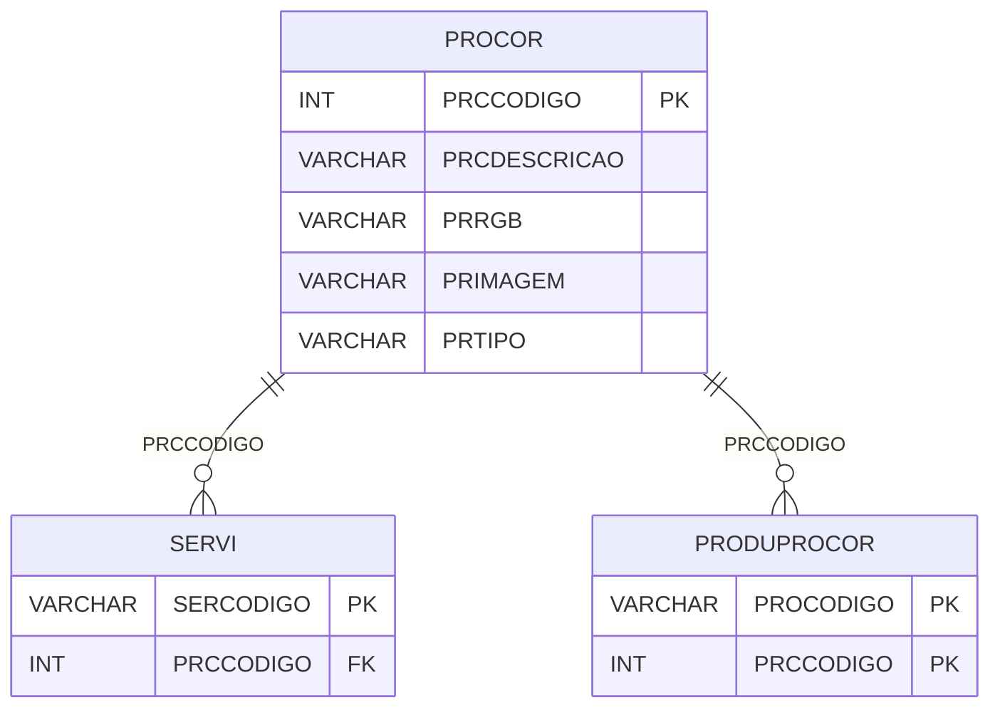

# PROCOR - Documentação Completa de Relacionamentos

## 📊 Informações Gerais

- **Nome da Tabela**: PROCOR (Produto Cor)
- **Total de Registros**: 48
- **Total de Colunas**: 5
- **Chave Primária**: PRCCODIGO
- **Chaves Estrangeiras**: 0
- **Índices**: 0
- **Tabelas Dependentes**: 4
- **Banco de Dados**: Firebird

## 📝 Descrição

**PROCOR** é uma tabela mestre que define cores disponíveis para produtos e serviços. Com **48 registros**, esta tabela armazena cores com suas descrições, tipos, valores RGB e imagens relacionadas.

Esta tabela é essencial para:
- **Cores**: Definir cores disponíveis para produtos e serviços
- **Visualização**: Armazenar valores RGB e imagens de cores
- **Rastreamento**: Rastrear quais cores estão disponíveis
- **Relatórios**: Gerar relatórios de cores

**Contexto de Negócio:**
Produtos e serviços podem ter cores específicas. Esta tabela define essas cores, permitindo visualização e rastreamento por cor.

---

## 🔑 Estrutura de Colunas

| Coluna | Tipo | Descrição |
|--------|------|-----------|
| **PRCCODIGO** 🔑 | INT | Código da cor (PK) |
| **PRCDESCRICAO** | VARCHAR(37) | Descrição da cor |
| **PRRGB** | VARCHAR(37) | Valor RGB da cor |
| **PRIMAGEM** | VARCHAR(261) | Caminho da imagem da cor |
| **PRTIPO** | VARCHAR(37) | Tipo da cor |

---

## 🔗 Relacionamentos - Nível 1 (Diretos)

### Tabelas que Referenciam Esta

Esta tabela é referenciada por 4 tabelas:

### CORSISEXT - Cor x Sistema Externo
**Volume:** Variável

**Relacionamento:**
```
CORSISEXT.PRCCODIGO → PROCOR.PRCCODIGO (N:1)
Constraint: CORSISEXT_PROCOR
```

### PRODUPROCOR - Produto x Cor
**Volume:** Variável

**Relacionamento:**
```
PRODUPROCOR.PRCCODIGO → PROCOR.PRCCODIGO (N:1)
Constraint: PROCOR_PRODUPROCOR
```

### SERVI - Serviço
**Volume:** 13 registros

**Relacionamento:**
```
SERVI.PRCCODIGO → PROCOR.PRCCODIGO (N:1)
Constraint: PROCOR_SERVI
```

### SERVIPROCOR - Serviço x Cor
**Volume:** Variável

**Relacionamento:**
```
SERVIPROCOR.PRCCODIGO → PROCOR.PRCCODIGO (N:1)
Constraint: PROCOR_SERVIPROCOR
```

---

## 🗺️ Diagrama de Relacionamentos



---

## 💡 Exemplos de Uso

### Consulta Básica

```sql
SELECT PRCCODIGO, PRCDESCRICAO, PRRGB, PRIMAGEM, PRTIPO
FROM PROCOR
WHERE PRCCODIGO = ?;
```

### Consulta de Cores por Tipo

```sql
SELECT 
    PRTIPO,
    COUNT(*) AS TOTAL_CORES
FROM PROCOR
GROUP BY PRTIPO
ORDER BY TOTAL_CORES DESC;
```

### Consulta de Cores com Produtos Relacionados

```sql
SELECT 
    pr.*,
    COUNT(DISTINCT pc.PROCODIGO) AS TOTAL_PRODUTOS
FROM PROCOR pr
LEFT JOIN PRODUPROCOR pc
    ON pr.PRCCODIGO = pc.PRCCODIGO
GROUP BY pr.PRCCODIGO, pr.PRCDESCRICAO, pr.PRRGB, pr.PRIMAGEM, pr.PRTIPO
ORDER BY TOTAL_PRODUTOS DESC;
```

### Inserção de Nova Cor

```sql
INSERT INTO PROCOR (PRCDESCRICAO, PRRGB, PRIMAGEM, PRTIPO)
VALUES (?, ?, ?, ?);
```

---

## ⚡ Performance e Otimização

### Índices Recomendados

#### 1. Índice na Chave Primária (Já existe implicitamente)
```sql
-- Índice primário já existe implicitamente
```

#### 2. Índice em PRTIPO
```sql
CREATE INDEX IDX_PROCOR_PRTIPO 
ON PROCOR (PRTIPO);
```

**Justificativa:** Facilita buscas por tipo de cor.

---

## 📊 Estatísticas e Insights

### Volume de Dados

- **Total de Registros**: 48
- **Tamanho Médio Estimado**: ~150 bytes por registro
- **Tamanho Total Estimado**: ~7.2 KB

### Distribuição de Dados

- **Cores**: 48 cores disponíveis
- **Taxa de Utilização**: Tabela mestre com uso moderado

---

## 🔧 Integração com Código Laravel

### Model Eloquent

```php
<?php

namespace App\Models;

use Illuminate\Database\Eloquent\Model;

final class ProCor extends Model
{
    protected $table = 'PROCOR';
    protected $primaryKey = 'PRCCODIGO';
    public $incrementing = true;
    public $timestamps = false;

    protected $fillable = [
        'PRCDESCRICAO',
        'PRRGB',
        'PRIMAGEM',
        'PRTIPO',
    ];

    protected $casts = [
        'PRCCODIGO' => 'integer',
        'PRCDESCRICAO' => 'string',
        'PRRGB' => 'string',
        'PRIMAGEM' => 'string',
        'PRTIPO' => 'string',
    ];

    /**
     * Buscar todas as cores
     */
    public static function todas()
    {
        return self::orderBy('PRCDESCRICAO')
            ->get();
    }

    /**
     * Buscar cores por tipo
     */
    public static function porTipo(string $prTipo)
    {
        return self::where('PRTIPO', $prTipo)
            ->orderBy('PRCDESCRICAO')
            ->get();
    }
}
```

---

## ✅ Boas Práticas

### Design

1. **Chave Primária**: PRCCODIGO deve ser único e sequencial
2. **Validação**: Validar PRCDESCRICAO antes de inserir
3. **RGB**: Validar formato RGB se aplicável

### Performance

1. **Índices**: Usar índice para busca por tipo
2. **Consultas**: Consultas simples são suficientes

### Segurança

1. **Validação**: Validar valores antes de inserir
2. **Acesso**: Restringir acesso de escrita a administradores

---

**Documentação gerada em**: 2025-01-27

**Banco de dados**: Firebird

