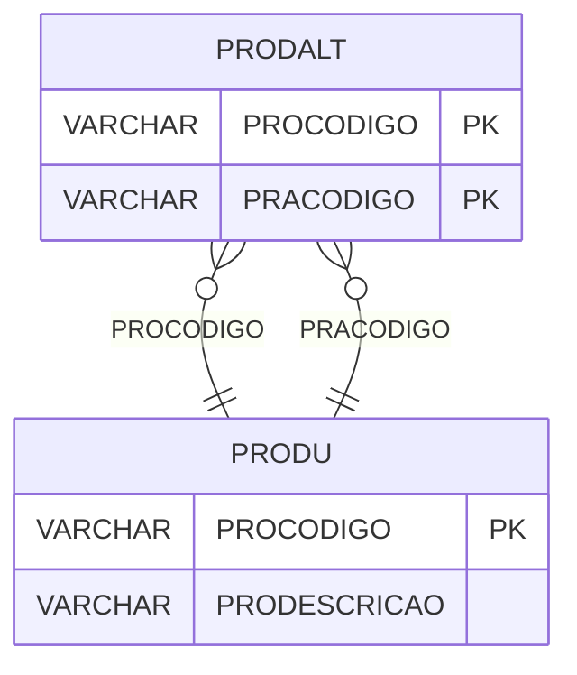

# PRODALT - Documentação Completa de Relacionamentos

## 📊 Informações Gerais

- **Nome da Tabela**: PRODALT (Produto Alternativo)
- **Total de Registros**: 98.495
- **Total de Colunas**: 2
- **Chave Primária**: PROCODIGO, PRACODIGO (composite)
- **Chaves Estrangeiras**: 1
- **Índices**: 1
- **Tabelas Dependentes**: 0
- **Banco de Dados**: Firebird

## 📝 Descrição

**PRODALT** é uma tabela de relacionamento que associa produtos com produtos alternativos. Com **98.495 registros**, esta tabela permite definir produtos alternativos para cada produto, facilitando substituições e sugestões.

Esta tabela é essencial para:
- **Substituições**: Definir produtos alternativos para substituição
- **Sugestões**: Sugerir produtos alternativos
- **Rastreamento**: Rastrear relações entre produtos
- **Relatórios**: Gerar relatórios de produtos alternativos

**Contexto de Negócio:**
Produtos podem ter produtos alternativos que podem ser usados como substituição. Esta tabela gerencia essas relações, permitindo identificar produtos alternativos para cada produto.

---

## 🔑 Estrutura de Colunas

| Coluna | Tipo | Descrição |
|--------|------|-----------|
| **PROCODIGO** 🔑 🔗 | VARCHAR(14) | Código do produto (PK, FK → PRODU) |
| **PRACODIGO** 🔑 | VARCHAR(14) | Código do produto alternativo (PK) |

---

## 🔗 Relacionamentos - Nível 1 (Diretos)

### PRODU - Produto (FK Obrigatória)
**Volume:** 178.187 registros

**Relacionamento:**
```
PRODALT.PROCODIGO → PRODU.PROCODIGO (N:1)
Constraint: PRODU_PRODALT
```

**Descrição:** Cada registro relaciona um produto com um produto alternativo.

**Proporção:** ~0,6 produtos alternativos por produto em média (98.495 / 178.187)

---

## 🔗 Relacionamentos - Nível 2 (Indiretos)

### PRODU - Produto Alternativo (Relacionamento Lógico)
**Volume:** 178.187 registros

**Relacionamento Lógico:**
```
PRODALT.PRACODIGO → PRODU.PROCODIGO (N:1)
```

**Descrição:** Cada registro relaciona um produto alternativo com o produto original.

---

## 🗺️ Diagrama de Relacionamentos



---

## 💡 Exemplos de Uso

### Consulta Básica

```sql
SELECT PROCODIGO, PRACODIGO
FROM PRODALT
WHERE PROCODIGO = ?;
```

### Consulta com Informações dos Produtos

```sql
SELECT 
    pa.*,
    pr_original.PRODESCRICAO AS PRODUTO_ORIGINAL,
    pr_alternativo.PRODESCRICAO AS PRODUTO_ALTERNATIVO
FROM PRODALT pa
INNER JOIN PRODU pr_original
    ON pa.PROCODIGO = pr_original.PROCODIGO
INNER JOIN PRODU pr_alternativo
    ON pa.PRACODIGO = pr_alternativo.PROCODIGO
WHERE pa.PROCODIGO = ?;
```

### Consulta de Produtos Alternativos por Produto

```sql
SELECT 
    pa.PRACODIGO,
    pr.PRODESCRICAO
FROM PRODALT pa
INNER JOIN PRODU pr
    ON pa.PRACODIGO = pr.PROCODIGO
WHERE pa.PROCODIGO = ?
ORDER BY pr.PRODESCRICAO;
```

### Inserção de Produto Alternativo

```sql
INSERT INTO PRODALT (PROCODIGO, PRACODIGO)
VALUES (?, ?);
```

---

## ⚡ Performance e Otimização

### Índices Existentes

#### 1. Índice em PRACODIGO
**Nome:** INDPRACODIGO
**Colunas:** PRACODIGO

**Justificativa:** Facilita buscas por produto alternativo.

---

### Índices Recomendados

#### 1. Índice Composto na Chave Primária (Já existe implicitamente)
```sql
-- Índice primário já existe implicitamente
```

---

## 📊 Estatísticas e Insights

### Volume de Dados

- **Total de Registros**: 98.495
- **Tamanho Médio Estimado**: ~30 bytes por registro
- **Tamanho Total Estimado**: ~3 MB

### Distribuição de Dados

- **Relacionamentos**: 98.495 relacionamentos produto x produto alternativo
- **Média por Produto**: ~0,6 produtos alternativos por produto

---

## 🔧 Integração com Código Laravel

### Model Eloquent

```php
<?php

namespace App\Models;

use Illuminate\Database\Eloquent\Model;
use Illuminate\Database\Eloquent\Relations\BelongsTo;

final class ProdAlt extends Model
{
    protected $table = 'PRODALT';
    public $incrementing = false;
    public $timestamps = false;

    protected $primaryKey = ['PROCODIGO', 'PRACODIGO'];

    protected $fillable = [
        'PROCODIGO',
        'PRACODIGO',
    ];

    protected $casts = [
        'PROCODIGO' => 'string',
        'PRACODIGO' => 'string',
    ];

    /**
     * Relacionamento com Produto Original
     */
    public function produtoOriginal(): BelongsTo
    {
        return $this->belongsTo(Produ::class, 'PROCODIGO', 'PROCODIGO');
    }

    /**
     * Relacionamento com Produto Alternativo
     */
    public function produtoAlternativo(): BelongsTo
    {
        return $this->belongsTo(Produ::class, 'PRACODIGO', 'PROCODIGO');
    }

    /**
     * Buscar produtos alternativos por produto
     */
    public static function alternativosPorProduto(string $proCodigo)
    {
        return self::where('PROCODIGO', $proCodigo)
            ->with(['produtoOriginal', 'produtoAlternativo'])
            ->get();
    }
}
```

---

## ✅ Boas Práticas

### Design

1. **Chave Composta**: Manter integridade da chave composta
2. **Validação**: Validar PROCODIGO e PRACODIGO antes de inserir
3. **Ciclos**: Evitar criar ciclos de alternativas

### Performance

1. **Índices**: Usar índices para buscas frequentes
2. **Consultas**: Usar eager loading para relacionamentos

### Segurança

1. **Validação**: Validar valores antes de inserir
2. **Acesso**: Restringir acesso de escrita a usuários autorizados

---

**Documentação gerada em**: 2025-01-27

**Banco de dados**: Firebird

