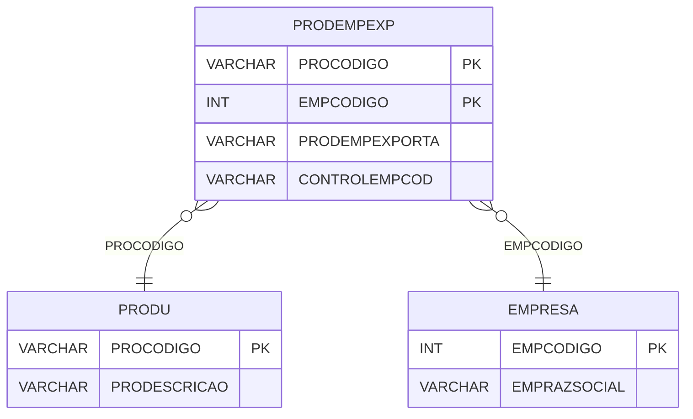

# PRODEMPEXP - Documentação Completa de Relacionamentos

## 📊 Informações Gerais

- **Nome da Tabela**: PRODEMPEXP (Produto x Empresa x Exportação)
- **Total de Registros**: 541.076
- **Total de Colunas**: 4
- **Chave Primária**: PROCODIGO, EMPCODIGO (composite)
- **Chaves Estrangeiras**: 2
- **Índices**: 0
- **Tabelas Dependentes**: 0
- **Banco de Dados**: Firebird

## 📝 Descrição

**PRODEMPEXP** é uma tabela de relacionamento que associa produtos com empresas e configurações de exportação. Com **541.076 registros**, esta tabela permite definir configurações específicas de exportação para cada produto em cada empresa, incluindo controle de código de empresa.

Esta tabela é essencial para:
- **Exportação**: Gerenciar configurações de exportação por produto e empresa
- **Controle**: Controlar exportações por empresa
- **Rastreamento**: Rastrear produtos exportados por empresa
- **Relatórios**: Gerar relatórios de exportação

**Contexto de Negócio:**
Produtos podem ter diferentes configurações de exportação dependendo da empresa. Esta tabela gerencia essas configurações, permitindo controle independente de exportações por empresa.

---

## 🔑 Estrutura de Colunas

| Coluna | Tipo | Descrição |
|--------|------|-----------|
| **PROCODIGO** 🔑 🔗 | VARCHAR(14) | Código do produto (PK, FK → PRODU) |
| **PRODEMPEXPORTA** | VARCHAR(14) | Flag indicando se exporta |
| **EMPCODIGO** 🔑 🔗 | INT | Código da empresa (PK, FK → EMPRESA) |
| **CONTROLEMPCOD** | VARCHAR(37) | Código de controle da empresa |

---

## 🔗 Relacionamentos - Nível 1 (Diretos)

### PRODU - Produto (FK Obrigatória)
**Volume:** 178.187 registros

**Relacionamento:**
```
PRODEMPEXP.PROCODIGO → PRODU.PROCODIGO (N:1)
Constraint: FK_PRODEMPEXP_PRODU
```

**Descrição:** Cada registro relaciona um produto com uma empresa e configuração de exportação.

**Proporção:** ~3 configurações de exportação por produto em média (541.076 / 178.187)

---

### EMPRESA - Empresa (FK Obrigatória)
**Volume:** 6 registros

**Relacionamento:**
```
PRODEMPEXP.EMPCODIGO → EMPRESA.EMPCODIGO (N:1)
Constraint: FK_PRODEMPEXP_EMPRESA
```

**Descrição:** Cada registro relaciona uma empresa com um produto e configuração de exportação.

---

## 🗺️ Diagrama de Relacionamentos



---

## 💡 Exemplos de Uso

### Consulta Básica

```sql
SELECT PROCODIGO, EMPCODIGO, PRODEMPEXPORTA, CONTROLEMPCOD
FROM PRODEMPEXP
WHERE PROCODIGO = ? AND EMPCODIGO = ?;
```

### Consulta com Informações do Produto e Empresa

```sql
SELECT 
    pe.*,
    pr.PRODESCRICAO,
    e.EMPRAZSOCIAL
FROM PRODEMPEXP pe
INNER JOIN PRODU pr
    ON pe.PROCODIGO = pr.PROCODIGO
INNER JOIN EMPRESA e
    ON pe.EMPCODIGO = e.EMPCODIGO
WHERE pe.PROCODIGO = ? AND pe.EMPCODIGO = ?;
```

### Consulta de Produtos Exportáveis por Empresa

```sql
SELECT 
    pe.*,
    pr.PRODESCRICAO
FROM PRODEMPEXP pe
INNER JOIN PRODU pr
    ON pe.PROCODIGO = pr.PROCODIGO
WHERE pe.EMPCODIGO = ?
    AND pe.PRODEMPEXPORTA = 'SIM'
ORDER BY pr.PRODESCRICAO;
```

### Inserção de Configuração de Exportação

```sql
INSERT INTO PRODEMPEXP (PROCODIGO, EMPCODIGO, PRODEMPEXPORTA, CONTROLEMPCOD)
VALUES (?, ?, ?, ?);
```

---

## ⚡ Performance e Otimização

### Índices Recomendados

#### 1. Índice Composto na Chave Primária (Já existe implicitamente)
```sql
-- Índice primário já existe implicitamente
```

#### 2. Índice em EMPCODIGO
```sql
CREATE INDEX IDX_PRODEMPEXP_EMPCODIGO 
ON PRODEMPEXP (EMPCODIGO);
```

**Justificativa:** Facilita buscas por empresa (muito frequente devido ao volume).

---

## 📊 Estatísticas e Insights

### Volume de Dados

- **Total de Registros**: 541.076
- **Tamanho Médio Estimado**: ~50 bytes por registro
- **Tamanho Total Estimado**: ~27 MB

### Distribuição de Dados

- **Configurações**: 541.076 configurações produto x empresa x exportação
- **Média por Produto**: ~3 configurações por produto

---

## 🔧 Integração com Código Laravel

### Model Eloquent

```php
<?php

namespace App\Models;

use Illuminate\Database\Eloquent\Model;
use Illuminate\Database\Eloquent\Relations\BelongsTo;

final class ProDemPExp extends Model
{
    protected $table = 'PRODEMPEXP';
    public $incrementing = false;
    public $timestamps = false;

    protected $primaryKey = ['PROCODIGO', 'EMPCODIGO'];

    protected $fillable = [
        'PROCODIGO',
        'PRODEMPEXPORTA',
        'EMPCODIGO',
        'CONTROLEMPCOD',
    ];

    protected $casts = [
        'PROCODIGO' => 'string',
        'EMPCODIGO' => 'integer',
        'PRODEMPEXPORTA' => 'string',
        'CONTROLEMPCOD' => 'string',
    ];

    /**
     * Relacionamento com Produto
     */
    public function produto(): BelongsTo
    {
        return $this->belongsTo(Produ::class, 'PROCODIGO', 'PROCODIGO');
    }

    /**
     * Relacionamento com Empresa
     */
    public function empresa(): BelongsTo
    {
        return $this->belongsTo(Empresa::class, 'EMPCODIGO', 'EMPCODIGO');
    }

    /**
     * Buscar configuração por produto e empresa
     */
    public static function porProdutoEmpresa(string $proCodigo, int $empCodigo)
    {
        return self::where('PROCODIGO', $proCodigo)
            ->where('EMPCODIGO', $empCodigo)
            ->with(['produto', 'empresa'])
            ->first();
    }
}
```

---

## ✅ Boas Práticas

### Design

1. **Chave Composta**: Manter integridade da chave composta
2. **Validação**: Validar PROCODIGO e EMPCODIGO antes de inserir
3. **Unicidade**: Garantir que não haja duplicatas

### Performance

1. **Índices**: Usar índices para buscas frequentes (crítico devido ao volume)
2. **Consultas**: Usar eager loading para relacionamentos

### Segurança

1. **Validação**: Validar valores antes de inserir
2. **Acesso**: Restringir acesso de escrita a usuários autorizados

---

**Documentação gerada em**: 2025-01-27

**Banco de dados**: Firebird

