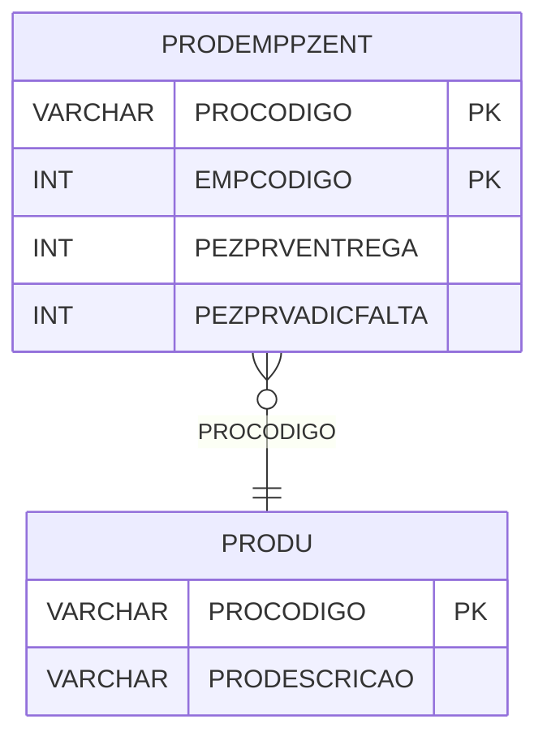

# PRODEMPPZENT - Documentação Completa de Relacionamentos

## 📊 Informações Gerais

- **Nome da Tabela**: PRODEMPPZENT (Produto x Empresa x Preço Entrega)
- **Total de Registros**: 64.370
- **Total de Colunas**: 4
- **Chave Primária**: PROCODIGO, EMPCODIGO (composite)
- **Chaves Estrangeiras**: 0 (relacionamentos lógicos)
- **Índices**: 0
- **Tabelas Dependentes**: 0
- **Banco de Dados**: Firebird

## 📝 Descrição

**PRODEMPPZENT** é uma tabela que armazena preços de entrega relacionados a produtos por empresa. Com **64.370 registros**, esta tabela registra preços de entrega e preços adicionais por falta para cada produto em cada empresa.

Esta tabela é essencial para:
- **Preços de Entrega**: Gerenciar preços de entrega por produto e empresa
- **Preços Adicionais**: Controlar preços adicionais por falta
- **Relatórios**: Gerar relatórios de preços de entrega
- **Financeiro**: Controlar valores de entrega

**Contexto de Negócio:**
Produtos podem ter diferentes preços de entrega dependendo da empresa. Esta tabela gerencia esses preços, permitindo controle independente de preços de entrega por empresa.

---

## 🔑 Estrutura de Colunas

| Coluna | Tipo | Descrição |
|--------|------|-----------|
| **PROCODIGO** 🔑 | VARCHAR(14) | Código do produto (PK) |
| **EMPCODIGO** 🔑 | INT | Código da empresa (PK) |
| **PEZPRVENTREGA** | INT | Preço de entrega |
| **PEZPRVADICFALTA** | INT | Preço adicional por falta |

---

## 🔗 Relacionamentos - Nível 1 (Diretos)

### Relacionamentos Lógicos

### PRODU - Produto (Relacionamento Lógico)
**Volume:** 178.187 registros

**Relacionamento Lógico:**
```
PRODEMPPZENT.PROCODIGO → PRODU.PROCODIGO (N:1)
```

**Descrição:** Cada registro está relacionado a um produto específico.

---

### EMPRESA - Empresa (Relacionamento Lógico)
**Volume:** 6 registros

**Relacionamento Lógico:**
```
PRODEMPPZENT.EMPCODIGO → EMPRESA.EMPCODIGO (N:1)
```

**Descrição:** Cada registro está relacionado a uma empresa específica.

---

## 🗺️ Diagrama de Relacionamentos



---

## 💡 Exemplos de Uso

### Consulta Básica

```sql
SELECT PROCODIGO, EMPCODIGO, PEZPRVENTREGA, PEZPRVADICFALTA
FROM PRODEMPPZENT
WHERE PROCODIGO = ? AND EMPCODIGO = ?;
```

### Consulta com Informações do Produto

```sql
SELECT 
    pe.*,
    pr.PRODESCRICAO
FROM PRODEMPPZENT pe
INNER JOIN PRODU pr
    ON pe.PROCODIGO = pr.PROCODIGO
WHERE pe.PROCODIGO = ? AND pe.EMPCODIGO = ?;
```

### Consulta de Preços por Empresa

```sql
SELECT 
    pe.*,
    pr.PRODESCRICAO
FROM PRODEMPPZENT pe
INNER JOIN PRODU pr
    ON pe.PROCODIGO = pr.PROCODIGO
WHERE pe.EMPCODIGO = ?
ORDER BY pr.PRODESCRICAO;
```

### Inserção de Preço de Entrega

```sql
INSERT INTO PRODEMPPZENT (PROCODIGO, EMPCODIGO, PEZPRVENTREGA, PEZPRVADICFALTA)
VALUES (?, ?, ?, ?);
```

---

## ⚡ Performance e Otimização

### Índices Recomendados

#### 1. Índice Composto na Chave Primária (Já existe implicitamente)
```sql
-- Índice primário já existe implicitamente
```

#### 2. Índice em EMPCODIGO
```sql
CREATE INDEX IDX_PRODEMPPZENT_EMPCODIGO 
ON PRODEMPPZENT (EMPCODIGO);
```

**Justificativa:** Facilita buscas por empresa.

---

## 📊 Estatísticas e Insights

### Volume de Dados

- **Total de Registros**: 64.370
- **Tamanho Médio Estimado**: ~30 bytes por registro
- **Tamanho Total Estimado**: ~1.9 MB

### Distribuição de Dados

- **Preços**: 64.370 preços de entrega produto x empresa
- **Média por Produto**: ~0,4 preços por produto

---

## 🔧 Integração com Código Laravel

### Model Eloquent

```php
<?php

namespace App\Models;

use Illuminate\Database\Eloquent\Model;
use Illuminate\Database\Eloquent\Relations\BelongsTo;

final class ProDemPpZent extends Model
{
    protected $table = 'PRODEMPPZENT';
    public $incrementing = false;
    public $timestamps = false;

    protected $primaryKey = ['PROCODIGO', 'EMPCODIGO'];

    protected $fillable = [
        'PROCODIGO',
        'EMPCODIGO',
        'PEZPRVENTREGA',
        'PEZPRVADICFALTA',
    ];

    protected $casts = [
        'PROCODIGO' => 'string',
        'EMPCODIGO' => 'integer',
        'PEZPRVENTREGA' => 'integer',
        'PEZPRVADICFALTA' => 'integer',
    ];

    /**
     * Relacionamento com Produto
     */
    public function produto(): BelongsTo
    {
        return $this->belongsTo(Produ::class, 'PROCODIGO', 'PROCODIGO');
    }

    /**
     * Buscar preço por produto e empresa
     */
    public static function precoPorProdutoEmpresa(string $proCodigo, int $empCodigo)
    {
        return self::where('PROCODIGO', $proCodigo)
            ->where('EMPCODIGO', $empCodigo)
            ->with(['produto'])
            ->first();
    }
}
```

---

## ✅ Boas Práticas

### Design

1. **Chave Composta**: Manter integridade da chave composta
2. **Validação**: Validar PROCODIGO e EMPCODIGO antes de inserir
3. **Valores**: Validar que preços sejam não negativos

### Performance

1. **Índices**: Usar índices para buscas frequentes
2. **Consultas**: Usar eager loading para relacionamentos

### Segurança

1. **Validação**: Validar valores antes de inserir
2. **Acesso**: Restringir acesso de escrita a usuários autorizados

---

**Documentação gerada em**: 2025-01-27

**Banco de dados**: Firebird

