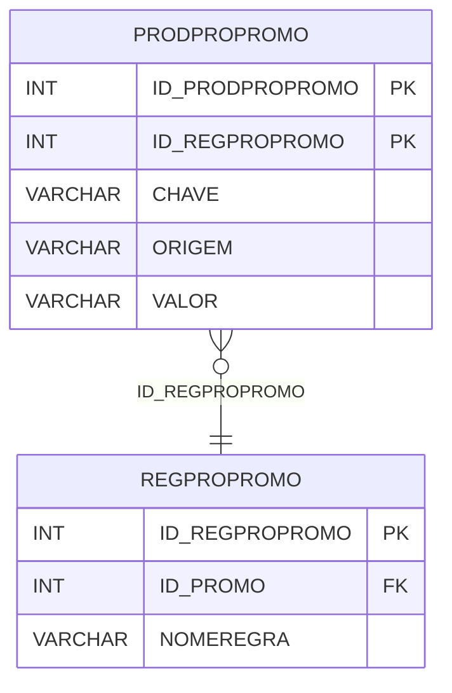

# PRODPROPROMO - Documentação Completa de Relacionamentos

## 📊 Informações Gerais

- **Nome da Tabela**: PRODPROPROMO (Produto Propriedade Promoção)
- **Total de Registros**: 4.786
- **Total de Colunas**: 5
- **Chave Primária**: ID_PRODPROPROMO, ID_REGPROPROMO (composite)
- **Chaves Estrangeiras**: 1
- **Índices**: 0
- **Tabelas Dependentes**: 0
- **Banco de Dados**: Firebird

## 📝 Descrição

**PRODPROPROMO** é uma tabela de relacionamento que associa regras de promoção de produtos com propriedades. Com **4.786 registros**, esta tabela registra propriedades de produtos em promoções, incluindo chave, origem e valor relacionados.

Esta tabela é essencial para:
- **Promoções**: Gerenciar propriedades de produtos em promoções
- **Rastreamento**: Rastrear propriedades de produtos por regra de promoção
- **Relatórios**: Gerar relatórios de propriedades de produtos em promoções
- **Auditoria**: Manter histórico de propriedades

**Contexto de Negócio:**
Regras de promoção de produtos podem ter informações sobre propriedades dos produtos. Esta tabela gerencia essas informações, permitindo rastrear propriedades de produtos em cada regra de promoção.

---

## 🔑 Estrutura de Colunas

| Coluna | Tipo | Descrição |
|--------|------|-----------|
| **ID_PRODPROPROMO** 🔑 | INT | Identificador único da propriedade (PK) |
| **ID_REGPROPROMO** 🔑 🔗 | INT | Código da regra de promoção de produto (PK, FK → REGPROPROMO) |
| **CHAVE** | VARCHAR(37) | Chave da propriedade |
| **ORIGEM** | VARCHAR(37) | Descrição da origem |
| **VALOR** | VARCHAR(37) | Valor relacionado à propriedade |

---

## 🔗 Relacionamentos - Nível 1 (Diretos)

### REGPROPROMO - Regra Promoção Produto (FK Obrigatória)
**Volume:** 2.251 registros

**Relacionamento:**
```
PRODPROPROMO.ID_REGPROPROMO → REGPROPROMO.ID_REGPROPROMO (N:1)
Constraint: XFK_PRODPROPROMO_REGPROPROMO
```

**Descrição:** Cada registro relaciona uma propriedade com uma regra de promoção de produto.

**Proporção:** ~2,1 propriedades por regra de promoção em média (4.786 / 2.251)

---

## 🔗 Relacionamentos - Nível 2 (Indiretos)

### REGPROPROMO → PROMO (Promoção)
**Volume:** Variável

**Relacionamento:**
```
PRODPROPROMO → REGPROPROMO → PROMO
```

**Descrição:** Através de REGPROPROMO, é possível identificar a promoção relacionada.

---

## 🗺️ Diagrama de Relacionamentos



---

## 💡 Exemplos de Uso

### Consulta Básica

```sql
SELECT ID_PRODPROPROMO, ID_REGPROPROMO, CHAVE, ORIGEM, VALOR
FROM PRODPROPROMO
WHERE ID_REGPROPROMO = ?;
```

### Consulta com Informações da Regra de Promoção

```sql
SELECT 
    pp.*,
    rp.NOMEREGRA
FROM PRODPROPROMO pp
INNER JOIN REGPROPROMO rp
    ON pp.ID_REGPROPROMO = rp.ID_REGPROPROMO
WHERE pp.ID_REGPROPROMO = ?;
```

### Consulta de Propriedades por Regra de Promoção

```sql
SELECT 
    pp.*
FROM PRODPROPROMO pp
WHERE pp.ID_REGPROPROMO = ?
ORDER BY pp.CHAVE;
```

### Inserção de Propriedade

```sql
INSERT INTO PRODPROPROMO (ID_REGPROPROMO, CHAVE, ORIGEM, VALOR)
VALUES (?, ?, ?, ?);
```

---

## ⚡ Performance e Otimização

### Índices Recomendados

#### 1. Índice Composto na Chave Primária (Já existe implicitamente)
```sql
-- Índice primário já existe implicitamente
```

#### 2. Índice em ID_REGPROPROMO
```sql
CREATE INDEX IDX_PRODPROPROMO_ID_REGPROPROMO 
ON PRODPROPROMO (ID_REGPROPROMO);
```

**Justificativa:** Facilita buscas por regra de promoção.

---

## 📊 Estatísticas e Insights

### Volume de Dados

- **Total de Registros**: 4.786
- **Tamanho Médio Estimado**: ~60 bytes por registro
- **Tamanho Total Estimado**: ~287 KB

### Distribuição de Dados

- **Propriedades**: 4.786 propriedades de produtos em promoções
- **Média por Regra**: ~2,1 propriedades por regra de promoção

---

## 🔧 Integração com Código Laravel

### Model Eloquent

```php
<?php

namespace App\Models;

use Illuminate\Database\Eloquent\Model;
use Illuminate\Database\Eloquent\Relations\BelongsTo;

final class ProDProPromo extends Model
{
    protected $table = 'PRODPROPROMO';
    public $incrementing = false;
    public $timestamps = false;

    protected $primaryKey = ['ID_PRODPROPROMO', 'ID_REGPROPROMO'];

    protected $fillable = [
        'ID_REGPROPROMO',
        'CHAVE',
        'ORIGEM',
        'VALOR',
    ];

    protected $casts = [
        'ID_PRODPROPROMO' => 'integer',
        'ID_REGPROPROMO' => 'integer',
        'CHAVE' => 'string',
        'ORIGEM' => 'string',
        'VALOR' => 'string',
    ];

    /**
     * Relacionamento com Regra Promoção Produto
     */
    public function regraPromocaoProduto(): BelongsTo
    {
        return $this->belongsTo(RegProPromo::class, 'ID_REGPROPROMO', 'ID_REGPROPROMO');
    }

    /**
     * Buscar propriedades por regra de promoção
     */
    public static function propriedadesPorRegra(int $idRegProPromo)
    {
        return self::where('ID_REGPROPROMO', $idRegProPromo)
            ->with(['regraPromocaoProduto'])
            ->get();
    }
}
```

---

## ✅ Boas Práticas

### Design

1. **Chave Composta**: Manter integridade da chave composta
2. **Validação**: Validar ID_REGPROPROMO antes de inserir
3. **Unicidade**: Garantir que não haja duplicatas

### Performance

1. **Índices**: Usar índices para buscas frequentes
2. **Consultas**: Usar eager loading para relacionamentos

### Segurança

1. **Validação**: Validar valores antes de inserir
2. **Acesso**: Restringir acesso de escrita a usuários autorizados

---

**Documentação gerada em**: 2025-01-27

**Banco de dados**: Firebird

