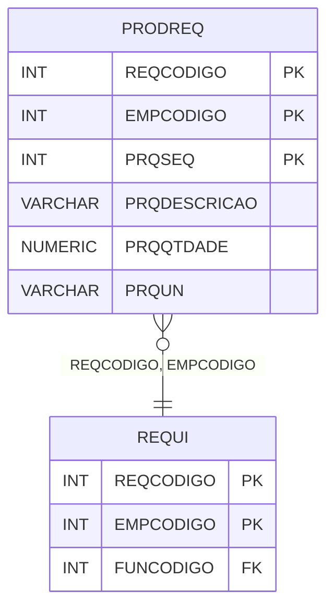

# PRODREQ - Documentação Completa de Relacionamentos

## 📊 Informações Gerais

- **Nome da Tabela**: PRODREQ (Produto x Requisição)
- **Total de Registros**: 8
- **Total de Colunas**: 6
- **Chave Primária**: REQCODIGO, EMPCODIGO, PRQSEQ (composite)
- **Chaves Estrangeiras**: 2
- **Índices**: 0
- **Tabelas Dependentes**: 0
- **Banco de Dados**: Firebird

## 📝 Descrição

**PRODREQ** é uma tabela de detalhamento que armazena produtos relacionados a requisições. Com apenas **8 registros**, esta tabela registra produtos incluídos em requisições, incluindo descrição, quantidade e unidade de medida.

Esta tabela é essencial para:
- **Requisições**: Registrar produtos incluídos em requisições
- **Rastreamento**: Rastrear produtos por requisição
- **Relatórios**: Gerar relatórios de produtos por requisição
- **Auditoria**: Manter histórico de requisições

**Contexto de Negócio:**
Requisições podem incluir múltiplos produtos. Esta tabela gerencia essas relações, permitindo rastrear quais produtos foram incluídos em cada requisição.

---

## 🔑 Estrutura de Colunas

| Coluna | Tipo | Descrição |
|--------|------|-----------|
| **REQCODIGO** 🔑 🔗 | INT | Código da requisição (PK, FK → REQUI) |
| **EMPCODIGO** 🔑 🔗 | INT | Código da empresa (PK, FK → REQUI) |
| **PRQSEQ** 🔑 | INT | Sequencial do produto na requisição (PK) |
| **PRQDESCRICAO** | VARCHAR(37) | Descrição do produto |
| **PRQQTDADE** | NUMERIC(27,2) | Quantidade do produto |
| **PRQUN** | VARCHAR(37) | Unidade de medida |

---

## 🔗 Relacionamentos - Nível 1 (Diretos)

### REQUI - Requisição (FK Obrigatória)
**Volume:** 1.365.818 registros

**Relacionamento:**
```
PRODREQ.REQCODIGO, EMPCODIGO → REQUI.REQCODIGO, EMPCODIGO (N:1)
Constraint: REQUI_PRODREQ
```

**Descrição:** Cada registro relaciona um produto com uma requisição específica.

---

## 🔗 Relacionamentos - Nível 2 (Indiretos)

### REQUI → FUNCIO (Funcionário)
**Volume:** 435 registros

**Relacionamento:**
```
PRODREQ → REQUI → FUNCIO
```

**Descrição:** Através de REQUI, é possível identificar o funcionário que fez a requisição.

---

## 🗺️ Diagrama de Relacionamentos



---

## 💡 Exemplos de Uso

### Consulta Básica

```sql
SELECT REQCODIGO, EMPCODIGO, PRQSEQ, PRQDESCRICAO, PRQQTDADE, PRQUN
FROM PRODREQ
WHERE REQCODIGO = ? AND EMPCODIGO = ?
ORDER BY PRQSEQ;
```

### Consulta com Informações da Requisição

```sql
SELECT 
    pr.*,
    rq.REQDATA,
    rq.REQTIPO
FROM PRODREQ pr
INNER JOIN REQUI rq
    ON pr.REQCODIGO = rq.REQCODIGO
    AND pr.EMPCODIGO = rq.EMPCODIGO
WHERE pr.REQCODIGO = ? AND pr.EMPCODIGO = ?
ORDER BY pr.PRQSEQ;
```

### Consulta de Produtos por Requisição

```sql
SELECT 
    pr.*
FROM PRODREQ pr
WHERE pr.REQCODIGO = ? AND pr.EMPCODIGO = ?
ORDER BY pr.PRQSEQ;
```

### Inserção de Produto em Requisição

```sql
INSERT INTO PRODREQ (
    REQCODIGO,
    EMPCODIGO,
    PRQSEQ,
    PRQDESCRICAO,
    PRQQTDADE,
    PRQUN
)
VALUES (?, ?, ?, ?, ?, ?);
```

---

## ⚡ Performance e Otimização

### Índices Recomendados

#### 1. Índice Composto na Chave Primária (Já existe implicitamente)
```sql
-- Índice primário já existe implicitamente
```

---

## 📊 Estatísticas e Insights

### Volume de Dados

- **Total de Registros**: 8
- **Tamanho Médio Estimado**: ~80 bytes por registro
- **Tamanho Total Estimado**: ~640 bytes

### Distribuição de Dados

- **Produtos em Requisições**: 8 produtos em requisições
- **Taxa de Utilização**: Muito baixa (tabela de apoio)

---

## 🔧 Integração com Código Laravel

### Model Eloquent

```php
<?php

namespace App\Models;

use Illuminate\Database\Eloquent\Model;
use Illuminate\Database\Eloquent\Relations\BelongsTo;

final class ProdReq extends Model
{
    protected $table = 'PRODREQ';
    public $incrementing = false;
    public $timestamps = false;

    protected $primaryKey = ['REQCODIGO', 'EMPCODIGO', 'PRQSEQ'];

    protected $fillable = [
        'REQCODIGO',
        'EMPCODIGO',
        'PRQSEQ',
        'PRQDESCRICAO',
        'PRQQTDADE',
        'PRQUN',
    ];

    protected $casts = [
        'REQCODIGO' => 'integer',
        'EMPCODIGO' => 'integer',
        'PRQSEQ' => 'integer',
        'PRQDESCRICAO' => 'string',
        'PRQQTDADE' => 'decimal:2',
        'PRQUN' => 'string',
    ];

    /**
     * Relacionamento com Requisição
     */
    public function requisicao(): BelongsTo
    {
        return $this->belongsTo(Requi::class, ['REQCODIGO', 'EMPCODIGO'], ['REQCODIGO', 'EMPCODIGO']);
    }

    /**
     * Buscar produtos por requisição
     */
    public static function produtosPorRequisicao(int $reqCodigo, int $empCodigo)
    {
        return self::where('REQCODIGO', $reqCodigo)
            ->where('EMPCODIGO', $empCodigo)
            ->with(['requisicao'])
            ->orderBy('PRQSEQ')
            ->get();
    }
}
```

---

## ✅ Boas Práticas

### Design

1. **Chave Composta**: Manter integridade da chave composta
2. **Validação**: Validar REQCODIGO, EMPCODIGO antes de inserir
3. **Valores**: Validar que PRQQTDADE seja positiva

### Performance

1. **Índices**: Não necessário devido ao volume mínimo
2. **Consultas**: Usar eager loading para relacionamentos

### Segurança

1. **Validação**: Validar valores antes de inserir
2. **Acesso**: Restringir acesso de escrita a usuários autorizados

---

**Documentação gerada em**: 2025-01-27

**Banco de dados**: Firebird

