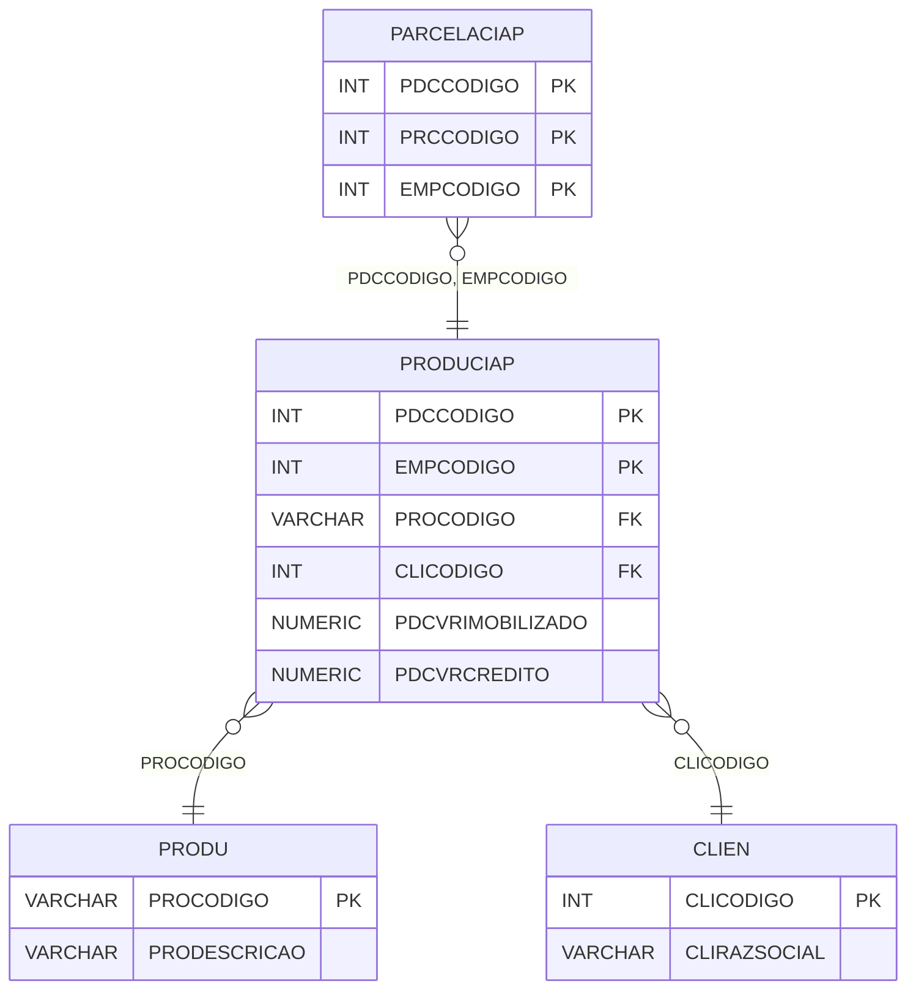

# PRODUCIAP - Documentação Completa de Relacionamentos

## 📊 Informações Gerais

- **Nome da Tabela**: PRODUCIAP (Produto CIAP)
- **Total de Registros**: 3.368
- **Total de Colunas**: 29
- **Chave Primária**: PDCCODIGO, EMPCODIGO (composite)
- **Chaves Estrangeiras**: 2
- **Índices**: 0
- **Tabelas Dependentes**: 2
- **Banco de Dados**: Firebird

## 📝 Descrição

**PRODUCIAP** é uma tabela que armazena informações sobre produtos relacionados ao CIAP (Controle de Imobilização de Ativo Permanente). Com **3.368 registros** e **29 colunas**, esta tabela registra produtos imobilizados com informações sobre valores, créditos, notas fiscais, parcelas e outras informações contábeis e fiscais.

Esta tabela é essencial para:
- **CIAP**: Gerenciar produtos imobilizados no CIAP
- **Contabilidade**: Controlar valores imobilizados e créditos
- **Fiscal**: Rastrear notas fiscais relacionadas
- **Relatórios**: Gerar relatórios de produtos imobilizados

**Contexto de Negócio:**
Produtos podem ser imobilizados como ativos permanentes. Esta tabela gerencia essas informações, permitindo controle contábil e fiscal de produtos imobilizados.

---

## 🔑 Estrutura de Colunas

### Identificação
| Coluna | Tipo | Descrição |
|--------|------|-----------|
| **PDCCODIGO** 🔑 | INT | Código do produto CIAP (PK) |
| **EMPCODIGO** 🔑 | INT | Código da empresa (PK) |
| **PROCODIGO** 🔗 | VARCHAR(14) | Código do produto (FK → PRODU) |
| **CLICODIGO** 🔗 | INT | Código do cliente/fornecedor (FK → CLIEN) |
| **PDCDTEMISS** | DATE | Data de emissão |
| **NFECODIGO** | INT | Código da NF-e |
| **NFENRNOTA** | VARCHAR(14) | Número da NF-e |

### Valores e Créditos
| Coluna | Tipo | Descrição |
|--------|------|-----------|
| **PDCVRIMOBILIZADO** | NUMERIC(16,2) | Valor imobilizado |
| **PDCVRCREDITO** | NUMERIC(16,2) | Valor crédito |
| **PDCORIGEM** | VARCHAR(14) | Origem do produto |
| **PDCLRENR** | INT | Lote receita número |
| **PDCLREPG** | INT | Lote receita página |
| **PDCPERDAEV** | VARCHAR(37) | Perda evento |
| **PDCPERDADT** | TIMESTAMP | Data perda |
| **PDCPARCINI** | INT | Parcela inicial |

### Informações Adicionais
| Coluna | Tipo | Descrição |
|--------|------|-----------|
| **PDCIDENTMERC** | VARCHAR(14) | Identificação mercadoria |
| **PDCCODPRNC** | INT | Código princípio |
| **PLACODIGO** | VARCHAR(14) | Código plano de contas |
| **PDCUTILBEM** | VARCHAR(14) | Utilização bem |
| **CCCODIGO** | VARCHAR(14) | Código centro de custo |
| **PDCFUNCAO** | VARCHAR(37) | Função |
| **PDCVIDAUTIL** | INT | Vida útil |
| **PDCMODELONOTA** | VARCHAR(14) | Modelo nota |
| **PDCCHVNOTA** | VARCHAR(14) | Chave nota |
| **PDCVRICMSSFRETE** | NUMERIC(16,2) | Valor ICMS sobre frete |
| **PDCVRICMSDIFALIQ** | NUMERIC(16,2) | Valor ICMS diferencial alíquota |
| **PDCSEQ** | INT | Sequencial |
| **PDCDTAPROPRIACAO** | TIMESTAMP | Data apropriação |
| **PDCOBSER** | VARCHAR(261) | Observações |

---

## 🔗 Relacionamentos - Nível 1 (Diretos)

### PRODU - Produto (FK Obrigatória)
**Volume:** 178.187 registros

**Relacionamento:**
```
PRODUCIAP.PROCODIGO → PRODU.PROCODIGO (N:1)
Constraint: FK_PRODUCIAP_PRODU
```

**Descrição:** Cada registro relaciona um produto CIAP com um produto específico.

---

### CLIEN - Cliente/Fornecedor (FK Obrigatória)
**Volume:** 9.251 registros

**Relacionamento:**
```
PRODUCIAP.CLICODIGO → CLIEN.CLICODIGO (N:1)
Constraint: FK_PRODUCIAP_CLIEN
```

**Descrição:** Identifica o cliente/fornecedor relacionado ao produto CIAP.

---

## 📊 Tabelas que Referenciam Esta

Esta tabela é referenciada por 2 tabelas:

### PARCELACIAP - Parcela CIAP
**Volume:** 161.664 registros

**Relacionamento:**
```
PARCELACIAP.PDCCODIGO, EMPCODIGO → PRODUCIAP.PDCCODIGO, EMPCODIGO (N:1)
Constraint: FK_PARCELACIAP_PRODUCIAP
```

**Descrição:** Relaciona parcelas com produtos CIAP.

---

## 🗺️ Diagrama de Relacionamentos



---

## 💡 Exemplos de Uso

### Consulta Básica

```sql
SELECT PDCCODIGO, EMPCODIGO, PROCODIGO, CLICODIGO, PDCVRIMOBILIZADO, PDCVRCREDITO
FROM PRODUCIAP
WHERE PDCCODIGO = ? AND EMPCODIGO = ?;
```

### Consulta com Informações do Produto e Cliente

```sql
SELECT 
    pc.*,
    pr.PRODESCRICAO,
    c.CLIRAZSOCIAL
FROM PRODUCIAP pc
INNER JOIN PRODU pr
    ON pc.PROCODIGO = pr.PROCODIGO
INNER JOIN CLIEN c
    ON pc.CLICODIGO = c.CLICODIGO
WHERE pc.PDCCODIGO = ? AND pc.EMPCODIGO = ?;
```

### Consulta de Produtos CIAP por Empresa

```sql
SELECT 
    pc.*,
    pr.PRODESCRICAO
FROM PRODUCIAP pc
INNER JOIN PRODU pr
    ON pc.PROCODIGO = pr.PROCODIGO
WHERE pc.EMPCODIGO = ?
ORDER BY pc.PDCDTEMISS DESC;
```

### Consulta com Parcelas

```sql
SELECT 
    pc.*,
    COUNT(par.PRCCODIGO) AS TOTAL_PARCELAS,
    SUM(par.PRCVALOR) AS VALOR_TOTAL_PARCELAS
FROM PRODUCIAP pc
LEFT JOIN PARCELACIAP par
    ON pc.PDCCODIGO = par.PDCCODIGO
    AND pc.EMPCODIGO = par.EMPCODIGO
WHERE pc.PDCCODIGO = ? AND pc.EMPCODIGO = ?
GROUP BY pc.PDCCODIGO, pc.EMPCODIGO, pc.PROCODIGO, pc.CLICODIGO;
```

### Inserção de Produto CIAP

```sql
INSERT INTO PRODUCIAP (
    PDCCODIGO,
    EMPCODIGO,
    PROCODIGO,
    CLICODIGO,
    PDCDTEMISS,
    PDCVRIMOBILIZADO,
    PDCVRCREDITO,
    PDCORIGEM
)
VALUES (?, ?, ?, ?, ?, ?, ?, ?);
```

---

## ⚡ Performance e Otimização

### Índices Recomendados

#### 1. Índice Composto na Chave Primária (Já existe implicitamente)
```sql
-- Índice primário já existe implicitamente
```

#### 2. Índice em PROCODIGO
```sql
CREATE INDEX IDX_PRODUCIAP_PROCODIGO 
ON PRODUCIAP (PROCODIGO);
```

**Justificativa:** Facilita buscas por produto.

---

## 📊 Estatísticas e Insights

### Volume de Dados

- **Total de Registros**: 3.368
- **Tamanho Médio Estimado**: ~200 bytes por registro
- **Tamanho Total Estimado**: ~674 KB

### Distribuição de Dados

- **Produtos CIAP**: 3.368 produtos imobilizados
- **Média por Empresa**: ~561 produtos por empresa

---

## 🔧 Integração com Código Laravel

### Model Eloquent

```php
<?php

namespace App\Models;

use Illuminate\Database\Eloquent\Model;
use Illuminate\Database\Eloquent\Relations\BelongsTo;
use Illuminate\Database\Eloquent\Relations\HasMany;

final class ProduCiap extends Model
{
    protected $table = 'PRODUCIAP';
    public $incrementing = false;
    public $timestamps = false;

    protected $primaryKey = ['PDCCODIGO', 'EMPCODIGO'];

    protected $fillable = [
        'PROCODIGO',
        'CLICODIGO',
        'PDCDTEMISS',
        'NFECODIGO',
        'NFENRNOTA',
        'PDCVRIMOBILIZADO',
        'PDCVRCREDITO',
        // ... todos os outros campos (29 colunas)
    ];

    protected $casts = [
        'PDCCODIGO' => 'integer',
        'EMPCODIGO' => 'integer',
        'PROCODIGO' => 'string',
        'CLICODIGO' => 'integer',
        'PDCDTEMISS' => 'date',
        'PDCVRIMOBILIZADO' => 'decimal:2',
        'PDCVRCREDITO' => 'decimal:2',
        // ... casts para todos os campos numéricos e datas
    ];

    /**
     * Relacionamento com Produto
     */
    public function produto(): BelongsTo
    {
        return $this->belongsTo(Produ::class, 'PROCODIGO', 'PROCODIGO');
    }

    /**
     * Relacionamento com Cliente/Fornecedor
     */
    public function cliente(): BelongsTo
    {
        return $this->belongsTo(Clien::class, 'CLICODIGO', 'CLICODIGO');
    }

    /**
     * Relacionamento com Parcelas
     */
    public function parcelas(): HasMany
    {
        return $this->hasMany(ParcelaCiap::class, ['PDCCODIGO', 'EMPCODIGO'], ['PDCCODIGO', 'EMPCODIGO']);
    }

    /**
     * Buscar produto CIAP por código e empresa
     */
    public static function porCodigoEmpresa(int $pdcCodigo, int $empCodigo)
    {
        return self::where('PDCCODIGO', $pdcCodigo)
            ->where('EMPCODIGO', $empCodigo)
            ->with(['produto', 'cliente', 'parcelas'])
            ->first();
    }
}
```

---

## ✅ Boas Práticas

### Design

1. **Chave Composta**: Manter integridade da chave composta
2. **Validação**: Validar PROCODIGO e CLICODIGO antes de inserir
3. **Valores**: Validar que valores sejam não negativos

### Performance

1. **Índices**: Usar índices para buscas frequentes
2. **Consultas**: Usar eager loading para relacionamentos

### Segurança

1. **Validação**: Validar valores antes de inserir
2. **Acesso**: Restringir acesso de escrita a usuários autorizados
3. **Contábil**: Validar cálculos contábeis cuidadosamente

---

**Documentação gerada em**: 2025-01-27

**Banco de dados**: Firebird

