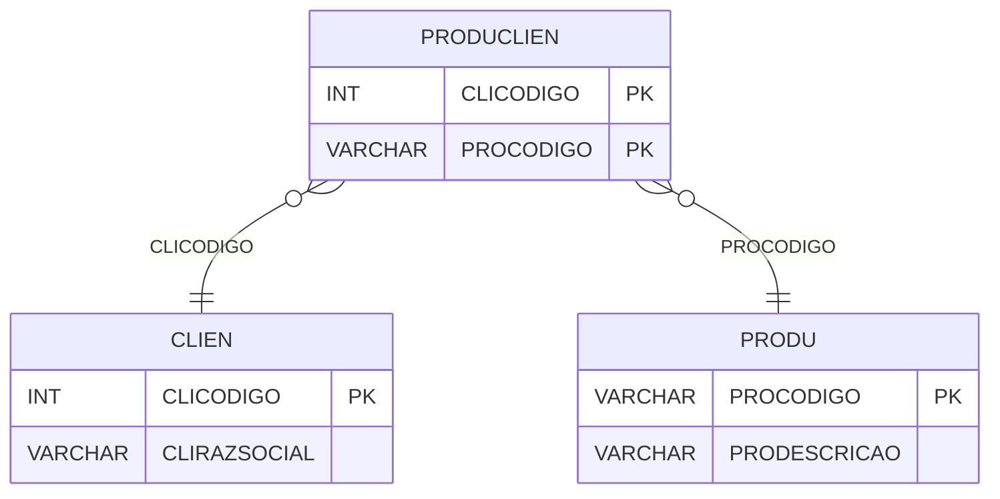

# PRODUCLIEN - Documentação Completa de Relacionamentos

## 📊 Informações Gerais

- **Nome da Tabela**: PRODUCLIEN (Produto x Cliente)
- **Total de Registros**: 1.824
- **Total de Colunas**: 2
- **Chave Primária**: CLICODIGO, PROCODIGO (composite)
- **Chaves Estrangeiras**: 2
- **Índices**: 0
- **Tabelas Dependentes**: 0
- **Banco de Dados**: Firebird

## 📝 Descrição

**PRODUCLIEN** é uma tabela de relacionamento que associa produtos com clientes. Com **1.824 registros**, esta tabela permite definir quais produtos estão relacionados a quais clientes, facilitando gestão de produtos por cliente.

Esta tabela é essencial para:
- **Rastreamento**: Rastrear quais produtos estão relacionados a quais clientes
- **Personalização**: Permitir produtos específicos por cliente
- **Relatórios**: Gerar relatórios de produtos por cliente
- **Gestão**: Facilitar gestão de produtos por cliente

**Contexto de Negócio:**
Produtos podem estar relacionados a clientes específicos. Esta tabela gerencia essas relações, permitindo identificar produtos relacionados a cada cliente.

---

## 🔑 Estrutura de Colunas

| Coluna | Tipo | Descrição |
|--------|------|-----------|
| **CLICODIGO** 🔑 🔗 | INT | Código do cliente (PK, FK → CLIEN) |
| **PROCODIGO** 🔑 🔗 | VARCHAR(37) | Código do produto (PK, FK → PRODU) |

---

## 🔗 Relacionamentos - Nível 1 (Diretos)

### CLIEN - Cliente (FK Obrigatória)
**Volume:** 9.251 registros

**Relacionamento:**
```
PRODUCLIEN.CLICODIGO → CLIEN.CLICODIGO (N:1)
Constraint: FKPRODUCLIEN_CLIEN
```

**Descrição:** Cada registro relaciona um cliente com um produto.

---

### PRODU - Produto (FK Obrigatória)
**Volume:** 178.187 registros

**Relacionamento:**
```
PRODUCLIEN.PROCODIGO → PRODU.PROCODIGO (N:1)
Constraint: FKPRODUCLIEN_PRODU
```

**Descrição:** Cada registro relaciona um produto com um cliente.

---

## 🗺️ Diagrama de Relacionamentos



---

## 💡 Exemplos de Uso

### Consulta Básica

```sql
SELECT CLICODIGO, PROCODIGO
FROM PRODUCLIEN
WHERE CLICODIGO = ?;
```

### Consulta com Informações do Cliente e Produto

```sql
SELECT 
    pc.*,
    c.CLIRAZSOCIAL,
    pr.PRODESCRICAO
FROM PRODUCLIEN pc
INNER JOIN CLIEN c
    ON pc.CLICODIGO = c.CLICODIGO
INNER JOIN PRODU pr
    ON pc.PROCODIGO = pr.PROCODIGO
WHERE pc.CLICODIGO = ?;
```

### Consulta de Produtos por Cliente

```sql
SELECT 
    pc.*,
    pr.PRODESCRICAO
FROM PRODUCLIEN pc
INNER JOIN PRODU pr
    ON pc.PROCODIGO = pr.PROCODIGO
WHERE pc.CLICODIGO = ?
ORDER BY pr.PRODESCRICAO;
```

### Consulta de Clientes por Produto

```sql
SELECT 
    pc.*,
    c.CLIRAZSOCIAL
FROM PRODUCLIEN pc
INNER JOIN CLIEN c
    ON pc.CLICODIGO = c.CLICODIGO
WHERE pc.PROCODIGO = ?
ORDER BY c.CLIRAZSOCIAL;
```

### Inserção de Relacionamento

```sql
INSERT INTO PRODUCLIEN (CLICODIGO, PROCODIGO)
VALUES (?, ?);
```

---

## ⚡ Performance e Otimização

### Índices Recomendados

#### 1. Índice Composto na Chave Primária (Já existe implicitamente)
```sql
-- Índice primário já existe implicitamente
```

#### 2. Índice em PROCODIGO
```sql
CREATE INDEX IDX_PRODUCLIEN_PROCODIGO 
ON PRODUCLIEN (PROCODIGO);
```

**Justificativa:** Facilita buscas por produto.

---

## 📊 Estatísticas e Insights

### Volume de Dados

- **Total de Registros**: 1.824
- **Tamanho Médio Estimado**: ~30 bytes por registro
- **Tamanho Total Estimado**: ~55 KB

### Distribuição de Dados

- **Relacionamentos**: 1.824 relacionamentos produto x cliente
- **Média por Cliente**: ~0,2 produtos por cliente

---

## 🔧 Integração com Código Laravel

### Model Eloquent

```php
<?php

namespace App\Models;

use Illuminate\Database\Eloquent\Model;
use Illuminate\Database\Eloquent\Relations\BelongsTo;

final class ProduClien extends Model
{
    protected $table = 'PRODUCLIEN';
    public $incrementing = false;
    public $timestamps = false;

    protected $primaryKey = ['CLICODIGO', 'PROCODIGO'];

    protected $fillable = [
        'CLICODIGO',
        'PROCODIGO',
    ];

    protected $casts = [
        'CLICODIGO' => 'integer',
        'PROCODIGO' => 'string',
    ];

    /**
     * Relacionamento com Cliente
     */
    public function cliente(): BelongsTo
    {
        return $this->belongsTo(Clien::class, 'CLICODIGO', 'CLICODIGO');
    }

    /**
     * Relacionamento com Produto
     */
    public function produto(): BelongsTo
    {
        return $this->belongsTo(Produ::class, 'PROCODIGO', 'PROCODIGO');
    }

    /**
     * Buscar produtos por cliente
     */
    public static function produtosPorCliente(int $cliCodigo)
    {
        return self::where('CLICODIGO', $cliCodigo)
            ->with(['cliente', 'produto'])
            ->get();
    }
}
```

---

## ✅ Boas Práticas

### Design

1. **Chave Composta**: Manter integridade da chave composta
2. **Validação**: Validar CLICODIGO e PROCODIGO antes de inserir
3. **Unicidade**: Garantir que não haja duplicatas

### Performance

1. **Índices**: Usar índices para buscas frequentes
2. **Consultas**: Usar eager loading para relacionamentos

### Segurança

1. **Validação**: Validar valores antes de inserir
2. **Acesso**: Restringir acesso de escrita a usuários autorizados

---

**Documentação gerada em**: 2025-01-27

**Banco de dados**: Firebird

