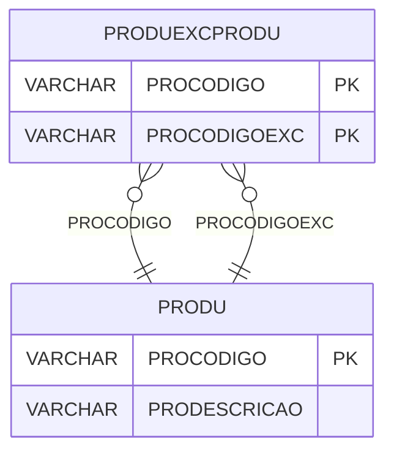

# PRODUEXCPRODU - Documentação Completa de Relacionamentos

## 📊 Informações Gerais

- **Nome da Tabela**: PRODUEXCPRODU (Produto Exceção Produto)
- **Total de Registros**: 20
- **Total de Colunas**: 2
- **Chave Primária**: PROCODIGO, PROCODIGOEXC (composite)
- **Chaves Estrangeiras**: 2
- **Índices**: 0
- **Tabelas Dependentes**: 0
- **Banco de Dados**: Firebird

## 📝 Descrição

**PRODUEXCPRODU** é uma tabela de relacionamento que associa produtos com produtos de exceção. Com apenas **20 registros**, esta tabela permite definir produtos que são exceções de outros produtos, facilitando gestão de exceções e substituições.

Esta tabela é essencial para:
- **Exceções**: Definir produtos de exceção para outros produtos
- **Substituições**: Facilitar substituições por produtos de exceção
- **Rastreamento**: Rastrear relações de exceção entre produtos
- **Relatórios**: Gerar relatórios de produtos de exceção

**Contexto de Negócio:**
Produtos podem ter produtos de exceção que podem ser usados como substituição em casos específicos. Esta tabela gerencia essas relações, permitindo identificar produtos de exceção para cada produto.

---

## 🔑 Estrutura de Colunas

| Coluna | Tipo | Descrição |
|--------|------|-----------|
| **PROCODIGO** 🔑 🔗 | VARCHAR(14) | Código do produto (PK, FK → PRODU) |
| **PROCODIGOEXC** 🔑 🔗 | VARCHAR(14) | Código do produto de exceção (PK, FK → PRODU) |

---

## 🔗 Relacionamentos - Nível 1 (Diretos)

### PRODU - Produto (FK Obrigatória)
**Volume:** 178.187 registros

**Relacionamento:**
```
PRODUEXCPRODU.PROCODIGO → PRODU.PROCODIGO (N:1)
Constraint: PRODUEXCPRODU_PRODU
```

**Descrição:** Cada registro relaciona um produto com um produto de exceção.

---

### PRODU - Produto de Exceção (FK Obrigatória)
**Volume:** 178.187 registros

**Relacionamento:**
```
PRODUEXCPRODU.PROCODIGOEXC → PRODU.PROCODIGO (N:1)
Constraint: PRODUEXCPRODU_PRODUEXC
```

**Descrição:** Cada registro relaciona um produto de exceção com o produto original.

---

## 🗺️ Diagrama de Relacionamentos



---

## 💡 Exemplos de Uso

### Consulta Básica

```sql
SELECT PROCODIGO, PROCODIGOEXC
FROM PRODUEXCPRODU
WHERE PROCODIGO = ?;
```

### Consulta com Informações dos Produtos

```sql
SELECT 
    pe.*,
    pr_original.PRODESCRICAO AS PRODUTO_ORIGINAL,
    pr_excecao.PRODESCRICAO AS PRODUTO_EXCECAO
FROM PRODUEXCPRODU pe
INNER JOIN PRODU pr_original
    ON pe.PROCODIGO = pr_original.PROCODIGO
INNER JOIN PRODU pr_excecao
    ON pe.PROCODIGOEXC = pr_excecao.PROCODIGO
WHERE pe.PROCODIGO = ?;
```

### Consulta de Produtos de Exceção por Produto

```sql
SELECT 
    pe.PROCODIGOEXC,
    pr.PRODESCRICAO
FROM PRODUEXCPRODU pe
INNER JOIN PRODU pr
    ON pe.PROCODIGOEXC = pr.PROCODIGO
WHERE pe.PROCODIGO = ?
ORDER BY pr.PRODESCRICAO;
```

### Inserção de Produto de Exceção

```sql
INSERT INTO PRODUEXCPRODU (PROCODIGO, PROCODIGOEXC)
VALUES (?, ?);
```

---

## ⚡ Performance e Otimização

### Índices Recomendados

#### 1. Índice Composto na Chave Primária (Já existe implicitamente)
```sql
-- Índice primário já existe implicitamente
```

---

## 📊 Estatísticas e Insights

### Volume de Dados

- **Total de Registros**: 20
- **Tamanho Médio Estimado**: ~30 bytes por registro
- **Tamanho Total Estimado**: ~600 bytes

### Distribuição de Dados

- **Exceções**: 20 relacionamentos produto x produto de exceção
- **Taxa de Utilização**: Muito baixa (tabela de apoio)

---

## 🔧 Integração com Código Laravel

### Model Eloquent

```php
<?php

namespace App\Models;

use Illuminate\Database\Eloquent\Model;
use Illuminate\Database\Eloquent\Relations\BelongsTo;

final class ProduExcProdu extends Model
{
    protected $table = 'PRODUEXCPRODU';
    public $incrementing = false;
    public $timestamps = false;

    protected $primaryKey = ['PROCODIGO', 'PROCODIGOEXC'];

    protected $fillable = [
        'PROCODIGO',
        'PROCODIGOEXC',
    ];

    protected $casts = [
        'PROCODIGO' => 'string',
        'PROCODIGOEXC' => 'string',
    ];

    /**
     * Relacionamento com Produto Original
     */
    public function produtoOriginal(): BelongsTo
    {
        return $this->belongsTo(Produ::class, 'PROCODIGO', 'PROCODIGO');
    }

    /**
     * Relacionamento com Produto de Exceção
     */
    public function produtoExcecao(): BelongsTo
    {
        return $this->belongsTo(Produ::class, 'PROCODIGOEXC', 'PROCODIGO');
    }

    /**
     * Buscar produtos de exceção por produto
     */
    public static function excecoesPorProduto(string $proCodigo)
    {
        return self::where('PROCODIGO', $proCodigo)
            ->with(['produtoOriginal', 'produtoExcecao'])
            ->get();
    }
}
```

---

## ✅ Boas Práticas

### Design

1. **Chave Composta**: Manter integridade da chave composta
2. **Validação**: Validar PROCODIGO e PROCODIGOEXC antes de inserir
3. **Ciclos**: Evitar criar ciclos de exceções

### Performance

1. **Índices**: Não necessário devido ao volume mínimo
2. **Consultas**: Usar eager loading para relacionamentos

### Segurança

1. **Validação**: Validar valores antes de inserir
2. **Acesso**: Restringir acesso de escrita a usuários autorizados

---

**Documentação gerada em**: 2025-01-27

**Banco de dados**: Firebird

