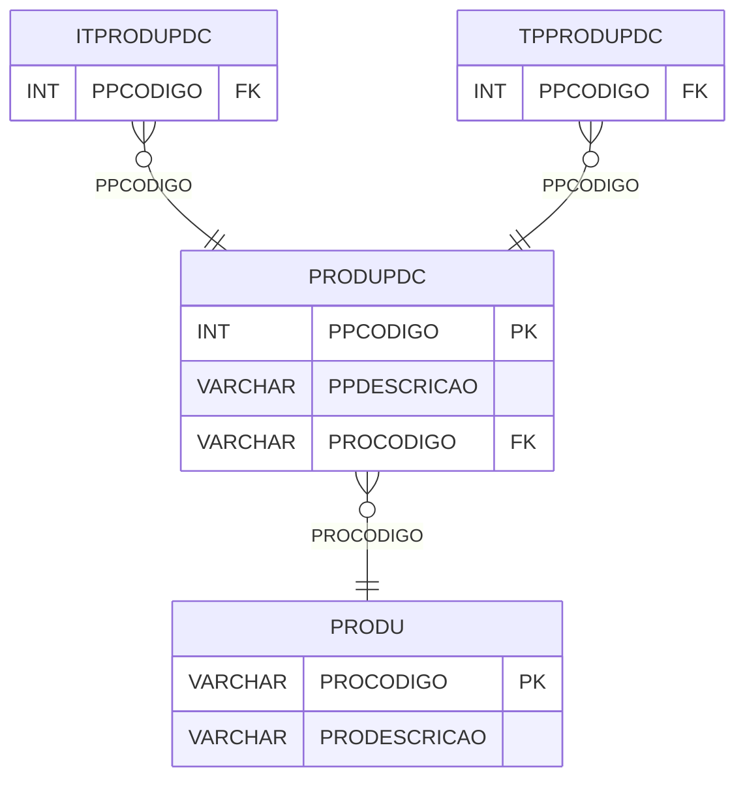

# PRODUPDC - Documentação Completa de Relacionamentos

## 📊 Informações Gerais

- **Nome da Tabela**: PRODUPDC (Produto PDC)
- **Total de Registros**: 1
- **Total de Colunas**: 4
- **Chave Primária**: PPCODIGO
- **Chaves Estrangeiras**: 1
- **Índices**: 0
- **Tabelas Dependentes**: 2
- **Banco de Dados**: Firebird

## 📝 Descrição

**PRODUPDC** é uma tabela mestre que define produtos relacionados a PDC (Pedido de Compra). Com apenas **1 registro**, esta tabela armazena informações sobre produtos PDC, incluindo descrição e descrição opcional.

Esta tabela é essencial para:
- **PDC**: Gerenciar produtos relacionados a pedidos de compra
- **Configuração**: Armazenar configurações de produtos PDC
- **Rastreamento**: Rastrear produtos PDC
- **Relatórios**: Gerar relatórios de produtos PDC

**Contexto de Negócio:**
O sistema possui produtos específicos relacionados a pedidos de compra. Esta tabela define esses produtos e suas configurações.

---

## 🔑 Estrutura de Colunas

| Coluna | Tipo | Descrição |
|--------|------|-----------|
| **PPCODIGO** 🔑 | INT | Código do produto PDC (PK) |
| **PPDESCRICAO** | VARCHAR(37) | Descrição do produto |
| **PPDESCRICAOOP** | VARCHAR(37) | Descrição opcional |
| **PROCODIGO** 🔗 | VARCHAR(37) | Código do produto (FK → PRODU) |

---

## 🔗 Relacionamentos - Nível 1 (Diretos)

### PRODU - Produto (FK Obrigatória)
**Volume:** 178.187 registros

**Relacionamento:**
```
PRODUPDC.PROCODIGO → PRODU.PROCODIGO (N:1)
Constraint: PRODU_PRODUPDC
```

**Descrição:** Cada registro relaciona um produto PDC com um produto específico.

---

## 📊 Tabelas que Referenciam Esta

Esta tabela é referenciada por 2 tabelas:

### ITPRODUPDC - Item Produto PDC
**Volume:** Variável

**Relacionamento:**
```
ITPRODUPDC.PPCODIGO → PRODUPDC.PPCODIGO (N:1)
Constraint: PRODUPDC_ITPRODUPDC
```

### TPPRODUPDC - Tipo Produto PDC
**Volume:** Variável

**Relacionamento:**
```
TPPRODUPDC.PPCODIGO → PRODUPDC.PPCODIGO (N:1)
Constraint: PRODUPDC_TPPRODUPDC
```

---

## 🗺️ Diagrama de Relacionamentos



---

## 💡 Exemplos de Uso

### Consulta Básica

```sql
SELECT PPCODIGO, PPDESCRICAO, PPDESCRICAOOP, PROCODIGO
FROM PRODUPDC
WHERE PPCODIGO = ?;
```

### Consulta com Informações do Produto

```sql
SELECT 
    pp.*,
    pr.PRODESCRICAO
FROM PRODUPDC pp
INNER JOIN PRODU pr
    ON pp.PROCODIGO = pr.PROCODIGO
WHERE pp.PPCODIGO = ?;
```

### Inserção de Produto PDC

```sql
INSERT INTO PRODUPDC (PPDESCRICAO, PPDESCRICAOOP, PROCODIGO)
VALUES (?, ?, ?);
```

---

## ⚡ Performance e Otimização

### Índices Recomendados

#### 1. Índice na Chave Primária (Já existe implicitamente)
```sql
-- Índice primário já existe implicitamente
```

---

## 📊 Estatísticas e Insights

### Volume de Dados

- **Total de Registros**: 1
- **Tamanho Médio Estimado**: ~100 bytes por registro
- **Tamanho Total Estimado**: ~100 bytes

### Distribuição de Dados

- **Produtos PDC**: 1 produto PDC
- **Taxa de Utilização**: Tabela mestre com volume mínimo

---

## 🔧 Integração com Código Laravel

### Model Eloquent

```php
<?php

namespace App\Models;

use Illuminate\Database\Eloquent\Model;
use Illuminate\Database\Eloquent\Relations\BelongsTo;

final class ProduPdc extends Model
{
    protected $table = 'PRODUPDC';
    protected $primaryKey = 'PPCODIGO';
    public $incrementing = true;
    public $timestamps = false;

    protected $fillable = [
        'PPDESCRICAO',
        'PPDESCRICAOOP',
        'PROCODIGO',
    ];

    protected $casts = [
        'PPCODIGO' => 'integer',
        'PPDESCRICAO' => 'string',
        'PPDESCRICAOOP' => 'string',
        'PROCODIGO' => 'string',
    ];

    /**
     * Relacionamento com Produto
     */
    public function produto(): BelongsTo
    {
        return $this->belongsTo(Produ::class, 'PROCODIGO', 'PROCODIGO');
    }

    /**
     * Obter produto PDC
     */
    public static function produtoPdc()
    {
        return self::with(['produto'])
            ->first();
    }
}
```

---

## ✅ Boas Práticas

### Design

1. **Chave Primária**: PPCODIGO deve ser único e sequencial
2. **Validação**: Validar PROCODIGO antes de inserir
3. **Volume**: Manter apenas produtos necessários

### Performance

1. **Índices**: Não necessário devido ao volume mínimo
2. **Consultas**: Consultas simples são suficientes

### Segurança

1. **Validação**: Validar valores antes de inserir
2. **Acesso**: Restringir acesso de escrita a administradores

---

**Documentação gerada em**: 2025-01-27

**Banco de dados**: Firebird

