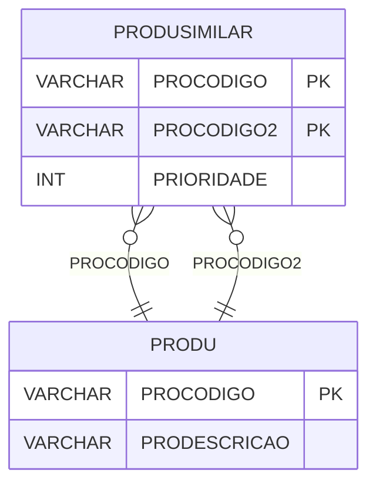

# PRODUSIMILAR - Documentação Completa de Relacionamentos

## 📊 Informações Gerais

- **Nome da Tabela**: PRODUSIMILAR (Produto Similar)
- **Total de Registros**: 19.349
- **Total de Colunas**: 3
- **Chave Primária**: PROCODIGO, PROCODIGO2 (composite)
- **Chaves Estrangeiras**: 2
- **Índices**: 0
- **Tabelas Dependentes**: 0
- **Banco de Dados**: Firebird

## 📝 Descrição

**PRODUSIMILAR** é uma tabela de relacionamento que associa produtos com produtos similares. Com **19.349 registros**, esta tabela permite definir produtos similares para cada produto, incluindo prioridade de similaridade.

Esta tabela é essencial para:
- **Produtos Similares**: Definir produtos similares para cada produto
- **Sugestões**: Sugerir produtos similares
- **Rastreamento**: Rastrear relações de similaridade entre produtos
- **Relatórios**: Gerar relatórios de produtos similares

**Contexto de Negócio:**
Produtos podem ter produtos similares que podem ser sugeridos ou usados como substituição. Esta tabela gerencia essas relações, permitindo identificar produtos similares para cada produto com prioridade.

---

## 🔑 Estrutura de Colunas

| Coluna | Tipo | Descrição |
|--------|------|-----------|
| **PROCODIGO** 🔑 🔗 | VARCHAR(37) | Código do produto (PK, FK → PRODU) |
| **PROCODIGO2** 🔑 🔗 | VARCHAR(37) | Código do produto similar (PK, FK → PRODU) |
| **PRIORIDADE** | INT | Prioridade da similaridade |

---

## 🔗 Relacionamentos - Nível 1 (Diretos)

### PRODU - Produto (FK Obrigatória)
**Volume:** 178.187 registros

**Relacionamento:**
```
PRODUSIMILAR.PROCODIGO → PRODU.PROCODIGO (N:1)
Constraint: PRODU_PRODUSIMILAR
```

**Descrição:** Cada registro relaciona um produto com um produto similar.

---

### PRODU - Produto Similar (FK Obrigatória)
**Volume:** 178.187 registros

**Relacionamento:**
```
PRODUSIMILAR.PROCODIGO2 → PRODU.PROCODIGO (N:1)
Constraint: PRODU_PRODUSIMILAR2
```

**Descrição:** Cada registro relaciona um produto similar com o produto original.

---

## 🗺️ Diagrama de Relacionamentos



---

## 💡 Exemplos de Uso

### Consulta Básica

```sql
SELECT PROCODIGO, PROCODIGO2, PRIORIDADE
FROM PRODUSIMILAR
WHERE PROCODIGO = ?
ORDER BY PRIORIDADE;
```

### Consulta com Informações dos Produtos

```sql
SELECT 
    ps.*,
    pr_original.PRODESCRICAO AS PRODUTO_ORIGINAL,
    pr_similar.PRODESCRICAO AS PRODUTO_SIMILAR
FROM PRODUSIMILAR ps
INNER JOIN PRODU pr_original
    ON ps.PROCODIGO = pr_original.PROCODIGO
INNER JOIN PRODU pr_similar
    ON ps.PROCODIGO2 = pr_similar.PROCODIGO
WHERE ps.PROCODIGO = ?
ORDER BY ps.PRIORIDADE;
```

### Consulta de Produtos Similares por Produto (Ordenados por Prioridade)

```sql
SELECT 
    ps.PROCODIGO2,
    pr.PRODESCRICAO,
    ps.PRIORIDADE
FROM PRODUSIMILAR ps
INNER JOIN PRODU pr
    ON ps.PROCODIGO2 = pr.PROCODIGO
WHERE ps.PROCODIGO = ?
ORDER BY ps.PRIORIDADE, pr.PRODESCRICAO;
```

### Inserção de Produto Similar

```sql
INSERT INTO PRODUSIMILAR (PROCODIGO, PROCODIGO2, PRIORIDADE)
VALUES (?, ?, ?);
```

---

## ⚡ Performance e Otimização

### Índices Recomendados

#### 1. Índice Composto na Chave Primária (Já existe implicitamente)
```sql
-- Índice primário já existe implicitamente
```

#### 2. Índice em PROCODIGO
```sql
CREATE INDEX IDX_PRODUSIMILAR_PROCODIGO 
ON PRODUSIMILAR (PROCODIGO);
```

**Justificativa:** Facilita buscas por produto.

---

## 📊 Estatísticas e Insights

### Volume de Dados

- **Total de Registros**: 19.349
- **Tamanho Médio Estimado**: ~40 bytes por registro
- **Tamanho Total Estimado**: ~774 KB

### Distribuição de Dados

- **Relacionamentos**: 19.349 relacionamentos produto x produto similar
- **Média por Produto**: ~0,1 produtos similares por produto

---

## 🔧 Integração com Código Laravel

### Model Eloquent

```php
<?php

namespace App\Models;

use Illuminate\Database\Eloquent\Model;
use Illuminate\Database\Eloquent\Relations\BelongsTo;

final class ProduSimilar extends Model
{
    protected $table = 'PRODUSIMILAR';
    public $incrementing = false;
    public $timestamps = false;

    protected $primaryKey = ['PROCODIGO', 'PROCODIGO2'];

    protected $fillable = [
        'PROCODIGO',
        'PROCODIGO2',
        'PRIORIDADE',
    ];

    protected $casts = [
        'PROCODIGO' => 'string',
        'PROCODIGO2' => 'string',
        'PRIORIDADE' => 'integer',
    ];

    /**
     * Relacionamento com Produto Original
     */
    public function produtoOriginal(): BelongsTo
    {
        return $this->belongsTo(Produ::class, 'PROCODIGO', 'PROCODIGO');
    }

    /**
     * Relacionamento com Produto Similar
     */
    public function produtoSimilar(): BelongsTo
    {
        return $this->belongsTo(Produ::class, 'PROCODIGO2', 'PROCODIGO');
    }

    /**
     * Buscar produtos similares por produto
     */
    public static function similaresPorProduto(string $proCodigo)
    {
        return self::where('PROCODIGO', $proCodigo)
            ->with(['produtoOriginal', 'produtoSimilar'])
            ->orderBy('PRIORIDADE')
            ->get();
    }
}
```

---

## ✅ Boas Práticas

### Design

1. **Chave Composta**: Manter integridade da chave composta
2. **Validação**: Validar PROCODIGO e PROCODIGO2 antes de inserir
3. **Ciclos**: Evitar criar ciclos de similaridade
4. **Prioridade**: Manter PRIORIDADE consistente

### Performance

1. **Índices**: Usar índices para buscas frequentes
2. **Consultas**: Usar eager loading para relacionamentos

### Segurança

1. **Validação**: Validar valores antes de inserir
2. **Acesso**: Restringir acesso de escrita a usuários autorizados

---

**Documentação gerada em**: 2025-01-27

**Banco de dados**: Firebird

