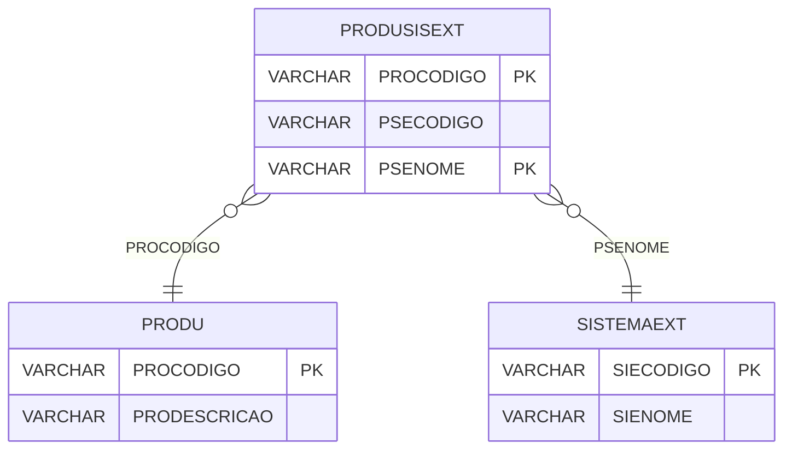

# PRODUSISEXT - Documentação Completa de Relacionamentos

## 📊 Informações Gerais

- **Nome da Tabela**: PRODUSISEXT (Produto x Sistema Externo)
- **Total de Registros**: 217
- **Total de Colunas**: 3
- **Chave Primária**: PROCODIGO, PSENOME (composite)
- **Chaves Estrangeiras**: 2
- **Índices**: 0
- **Tabelas Dependentes**: 0
- **Banco de Dados**: Firebird

## 📝 Descrição

**PRODUSISEXT** é uma tabela de relacionamento que associa produtos com sistemas externos. Com **217 registros**, esta tabela permite mapear produtos internos com códigos de produtos em sistemas externos, facilitando integração e sincronização.

Esta tabela é essencial para:
- **Integração**: Facilitar integração com sistemas externos
- **Mapeamento**: Mapear produtos internos com produtos de sistemas externos
- **Sincronização**: Sincronizar produtos entre sistemas
- **Relatórios**: Gerar relatórios de produtos por sistema externo

**Contexto de Negócio:**
Produtos internos podem ter correspondência com produtos específicos em sistemas externos. Esta tabela gerencia esse mapeamento, permitindo identificar qual produto do sistema externo corresponde a qual produto interno.

---

## 🔑 Estrutura de Colunas

| Coluna | Tipo | Descrição |
|--------|------|-----------|
| **PROCODIGO** 🔑 🔗 | VARCHAR(14) | Código do produto interno (PK, FK → PRODU) |
| **PSECODIGO** | VARCHAR(37) | Código do produto no sistema externo |
| **PSENOME** 🔑 🔗 | VARCHAR(14) | Nome do sistema externo (PK, FK → SISTEMAEXT) |

---

## 🔗 Relacionamentos - Nível 1 (Diretos)

### PRODU - Produto (FK Obrigatória)
**Volume:** 178.187 registros

**Relacionamento:**
```
PRODUSISEXT.PROCODIGO → PRODU.PROCODIGO (N:1)
Constraint: PRODU_PRODUSISEXT
```

**Descrição:** Cada registro relaciona um produto interno com um produto de sistema externo.

---

### SISTEMAEXT - Sistema Externo (FK Obrigatória)
**Volume:** 26 registros

**Relacionamento:**
```
PRODUSISEXT.PSENOME → SISTEMAEXT.SIECODIGO (N:1)
Constraint: SISTEMAEXT_PRODUSISEXT
```

**Descrição:** Identifica o sistema externo relacionado.

---

## 🗺️ Diagrama de Relacionamentos



---

## 💡 Exemplos de Uso

### Consulta Básica

```sql
SELECT PROCODIGO, PSECODIGO, PSENOME
FROM PRODUSISEXT
WHERE PROCODIGO = ?;
```

### Consulta com Informações do Produto e Sistema Externo

```sql
SELECT 
    ps.*,
    pr.PRODESCRICAO,
    se.SIENOME AS SISTEMA_EXTERNO
FROM PRODUSISEXT ps
INNER JOIN PRODU pr
    ON ps.PROCODIGO = pr.PROCODIGO
INNER JOIN SISTEMAEXT se
    ON ps.PSENOME = se.SIECODIGO
WHERE ps.PROCODIGO = ?;
```

### Consulta de Produtos por Sistema Externo

```sql
SELECT 
    ps.*,
    pr.PRODESCRICAO
FROM PRODUSISEXT ps
INNER JOIN PRODU pr
    ON ps.PROCODIGO = pr.PROCODIGO
WHERE ps.PSENOME = ?
ORDER BY pr.PRODESCRICAO;
```

### Consulta de Mapeamento por Código do Sistema Externo

```sql
SELECT 
    ps.*,
    pr.PRODESCRICAO,
    se.SIENOME AS SISTEMA_EXTERNO
FROM PRODUSISEXT ps
INNER JOIN PRODU pr
    ON ps.PROCODIGO = pr.PROCODIGO
INNER JOIN SISTEMAEXT se
    ON ps.PSENOME = se.SIECODIGO
WHERE ps.PSENOME = ?
    AND ps.PSECODIGO = ?;
```

### Inserção de Mapeamento

```sql
INSERT INTO PRODUSISEXT (PROCODIGO, PSECODIGO, PSENOME)
VALUES (?, ?, ?);
```

---

## ⚡ Performance e Otimização

### Índices Recomendados

#### 1. Índice Composto na Chave Primária (Já existe implicitamente)
```sql
-- Índice primário já existe implicitamente
```

#### 2. Índice Composto em PSENOME e PSECODIGO
```sql
CREATE INDEX IDX_PRODUSISEXT_SISTEMA_CODIGO 
ON PRODUSISEXT (PSENOME, PSECODIGO);
```

**Justificativa:** Facilita buscas por sistema externo e código (muito frequente em integrações).

---

## 📊 Estatísticas e Insights

### Volume de Dados

- **Total de Registros**: 217
- **Tamanho Médio Estimado**: ~50 bytes por registro
- **Tamanho Total Estimado**: ~11 KB

### Distribuição de Dados

- **Mapeamentos**: 217 mapeamentos produto interno x sistema externo
- **Média por Produto**: ~0,001 mapeamentos por produto

---

## 🔧 Integração com Código Laravel

### Model Eloquent

```php
<?php

namespace App\Models;

use Illuminate\Database\Eloquent\Model;
use Illuminate\Database\Eloquent\Relations\BelongsTo;

final class ProduSisExt extends Model
{
    protected $table = 'PRODUSISEXT';
    public $incrementing = false;
    public $timestamps = false;

    protected $primaryKey = ['PROCODIGO', 'PSENOME'];

    protected $fillable = [
        'PROCODIGO',
        'PSECODIGO',
        'PSENOME',
    ];

    protected $casts = [
        'PROCODIGO' => 'string',
        'PSECODIGO' => 'string',
        'PSENOME' => 'string',
    ];

    /**
     * Relacionamento com Produto
     */
    public function produto(): BelongsTo
    {
        return $this->belongsTo(Produ::class, 'PROCODIGO', 'PROCODIGO');
    }

    /**
     * Relacionamento com Sistema Externo
     */
    public function sistemaExterno(): BelongsTo
    {
        return $this->belongsTo(SistemaExt::class, 'PSENOME', 'SIECODIGO');
    }

    /**
     * Buscar mapeamentos por produto
     */
    public static function mapeamentosPorProduto(string $proCodigo)
    {
        return self::where('PROCODIGO', $proCodigo)
            ->with(['produto', 'sistemaExterno'])
            ->get();
    }

    /**
     * Buscar produto por código do sistema externo
     */
    public static function produtoPorCodigoSistema(string $psenome, string $pseCodigo)
    {
        return self::where('PSENOME', $psenome)
            ->where('PSECODIGO', $pseCodigo)
            ->with(['produto', 'sistemaExterno'])
            ->first();
    }
}
```

---

## ✅ Boas Práticas

### Design

1. **Chave Composta**: Manter integridade da chave composta
2. **Validação**: Validar PROCODIGO e PSENOME antes de inserir
3. **Unicidade**: Considerar constraint única em (PROCODIGO, PSENOME, PSECODIGO)

### Performance

1. **Índices**: Usar índices compostos para buscas frequentes em integrações
2. **Consultas**: Usar eager loading para relacionamentos

### Segurança

1. **Validação**: Validar valores antes de inserir
2. **Acesso**: Restringir acesso de escrita a usuários autorizados
3. **Integração**: Validar códigos de sistemas externos cuidadosamente

---

**Documentação gerada em**: 2025-01-27

**Banco de dados**: Firebird

