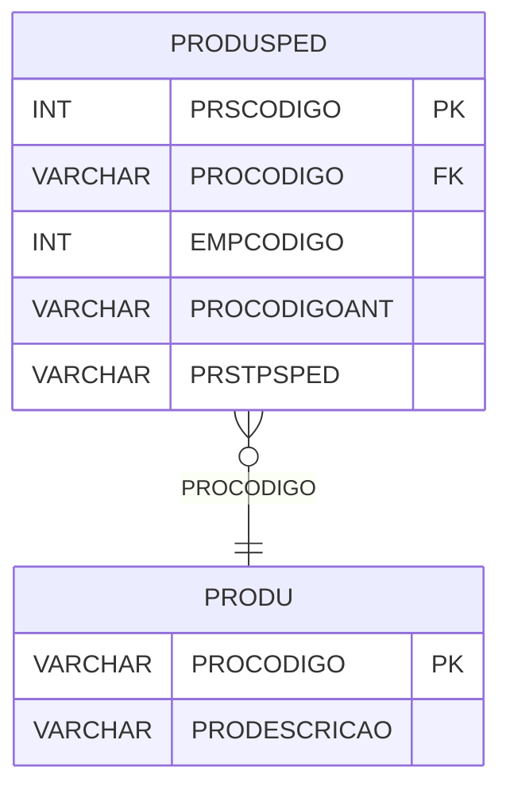

# PRODUSPED - Documentação Completa de Relacionamentos

## 📊 Informações Gerais

- **Nome da Tabela**: PRODUSPED (Produto x Pedido)
- **Total de Registros**: 1.155.268
- **Total de Colunas**: 5
- **Chave Primária**: PRSCODIGO
- **Chaves Estrangeiras**: 1
- **Índices**: 0
- **Tabelas Dependentes**: 0
- **Banco de Dados**: Firebird

## 📝 Descrição

**PRODUSPED** é uma tabela de relacionamento que associa produtos com pedidos. Com **1.155.268 registros**, esta tabela registra produtos relacionados a pedidos, incluindo informações sobre empresa, código anterior do produto e tipo de separação.

Esta tabela é essencial para:
- **Rastreamento**: Rastrear quais produtos estão relacionados a quais pedidos
- **Histórico**: Manter histórico de produtos por pedido
- **Relatórios**: Gerar relatórios de produtos por pedido
- **Auditoria**: Facilitar auditoria de produtos em pedidos

**Contexto de Negócio:**
Pedidos podem ter produtos relacionados. Esta tabela gerencia essas relações, permitindo rastrear produtos relacionados a cada pedido, incluindo informações sobre separação e códigos anteriores.

---

## 🔑 Estrutura de Colunas

| Coluna | Tipo | Descrição |
|--------|------|-----------|
| **PRSCODIGO** 🔑 | INT | Identificador único do relacionamento (PK) |
| **PROCODIGO** 🔗 | VARCHAR(14) | Código do produto (FK → PRODU) |
| **EMPCODIGO** | INT | Código da empresa |
| **PROCODIGOANT** | VARCHAR(14) | Código anterior do produto |
| **PRSTPSPED** | VARCHAR(14) | Tipo de separação do pedido |

---

## 🔗 Relacionamentos - Nível 1 (Diretos)

### PRODU - Produto (FK Obrigatória)
**Volume:** 178.187 registros

**Relacionamento:**
```
PRODUSPED.PROCODIGO → PRODU.PROCODIGO (N:1)
Constraint: FK_PRODUSPED_1
```

**Descrição:** Cada registro relaciona um produto com um pedido.

**Proporção:** ~6,5 produtos por pedido em média (1.155.268 / 178.187)

---

## 🔗 Relacionamentos - Nível 2 (Indiretos)

### PEDID - Pedido (Relacionamento Lógico)
**Volume:** 3.099.176 registros

**Relacionamento Lógico:**
```
PRODUSPED → PEDID (via lógica de negócio)
```

**Descrição:** Cada registro pode estar relacionado a um pedido específico através de lógica de negócio.

---

## 🗺️ Diagrama de Relacionamentos



---

## 💡 Exemplos de Uso

### Consulta Básica

```sql
SELECT PRSCODIGO, PROCODIGO, EMPCODIGO, PROCODIGOANT, PRSTPSPED
FROM PRODUSPED
WHERE PRSCODIGO = ?;
```

### Consulta com Informações do Produto

```sql
SELECT 
    ps.*,
    pr.PRODESCRICAO
FROM PRODUSPED ps
INNER JOIN PRODU pr
    ON ps.PROCODIGO = pr.PROCODIGO
WHERE ps.PRSCODIGO = ?;
```

### Consulta de Produtos por Empresa

```sql
SELECT 
    ps.*,
    pr.PRODESCRICAO
FROM PRODUSPED ps
INNER JOIN PRODU pr
    ON ps.PROCODIGO = pr.PROCODIGO
WHERE ps.EMPCODIGO = ?
ORDER BY pr.PRODESCRICAO;
```

### Consulta de Produtos por Tipo de Separação

```sql
SELECT 
    ps.*,
    pr.PRODESCRICAO
FROM PRODUSPED ps
INNER JOIN PRODU pr
    ON ps.PROCODIGO = pr.PROCODIGO
WHERE ps.PRSTPSPED = ?
ORDER BY pr.PRODESCRICAO;
```

### Inserção de Relacionamento

```sql
INSERT INTO PRODUSPED (PROCODIGO, EMPCODIGO, PROCODIGOANT, PRSTPSPED)
VALUES (?, ?, ?, ?);
```

---

## ⚡ Performance e Otimização

### Índices Recomendados

#### 1. Índice na Chave Primária (Já existe implicitamente)
```sql
-- Índice primário já existe implicitamente
```

#### 2. Índice em PROCODIGO
```sql
CREATE INDEX IDX_PRODUSPED_PROCODIGO 
ON PRODUSPED (PROCODIGO);
```

**Justificativa:** Facilita buscas por produto (muito frequente devido ao volume).

#### 3. Índice em EMPCODIGO
```sql
CREATE INDEX IDX_PRODUSPED_EMPCODIGO 
ON PRODUSPED (EMPCODIGO);
```

**Justificativa:** Facilita buscas por empresa.

---

## 📊 Estatísticas e Insights

### Volume de Dados

- **Total de Registros**: 1.155.268
- **Tamanho Médio Estimado**: ~50 bytes por registro
- **Tamanho Total Estimado**: ~58 MB

### Distribuição de Dados

- **Relacionamentos**: 1.155.268 relacionamentos produto x pedido
- **Média por Produto**: ~6,5 relacionamentos por produto

---

## 🔧 Integração com Código Laravel

### Model Eloquent

```php
<?php

namespace App\Models;

use Illuminate\Database\Eloquent\Model;
use Illuminate\Database\Eloquent\Relations\BelongsTo;

final class ProduSped extends Model
{
    protected $table = 'PRODUSPED';
    protected $primaryKey = 'PRSCODIGO';
    public $incrementing = true;
    public $timestamps = false;

    protected $fillable = [
        'PROCODIGO',
        'EMPCODIGO',
        'PROCODIGOANT',
        'PRSTPSPED',
    ];

    protected $casts = [
        'PRSCODIGO' => 'integer',
        'PROCODIGO' => 'string',
        'EMPCODIGO' => 'integer',
        'PROCODIGOANT' => 'string',
        'PRSTPSPED' => 'string',
    ];

    /**
     * Relacionamento com Produto
     */
    public function produto(): BelongsTo
    {
        return $this->belongsTo(Produ::class, 'PROCODIGO', 'PROCODIGO');
    }

    /**
     * Buscar relacionamentos por produto
     */
    public static function relacionamentosPorProduto(string $proCodigo)
    {
        return self::where('PROCODIGO', $proCodigo)
            ->with(['produto'])
            ->get();
    }
}
```

---

## ✅ Boas Práticas

### Design

1. **Chave Primária**: PRSCODIGO deve ser único e sequencial
2. **Validação**: Validar PROCODIGO antes de inserir
3. **Unicidade**: Considerar constraint única em (PROCODIGO, EMPCODIGO, PRSTPSPED)

### Performance

1. **Índices**: Usar índices para buscas frequentes (crítico devido ao volume)
2. **Consultas**: Usar eager loading para relacionamentos
3. **Volume**: Considerar particionamento devido ao grande volume

### Segurança

1. **Validação**: Validar valores antes de inserir
2. **Acesso**: Restringir acesso de escrita a usuários autorizados

---

**Documentação gerada em**: 2025-01-27

**Banco de dados**: Firebird

