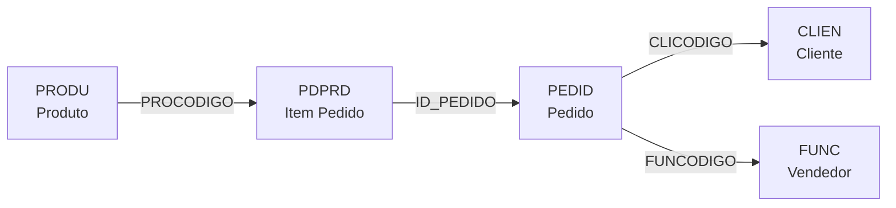
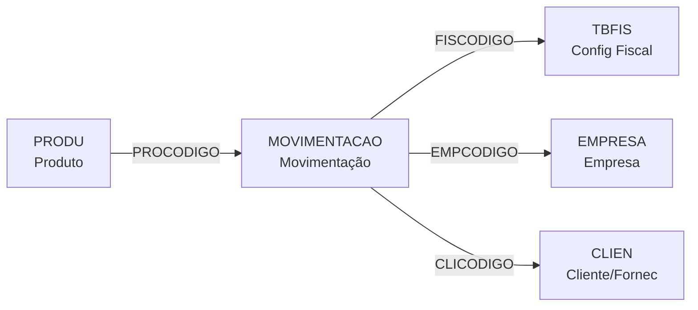
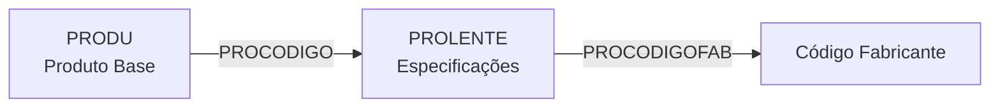
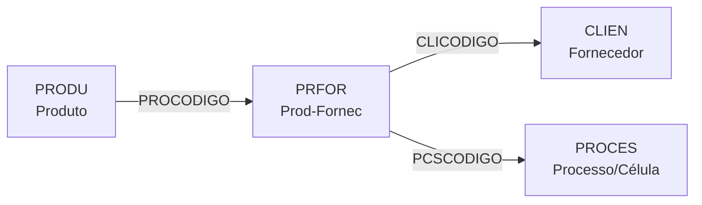
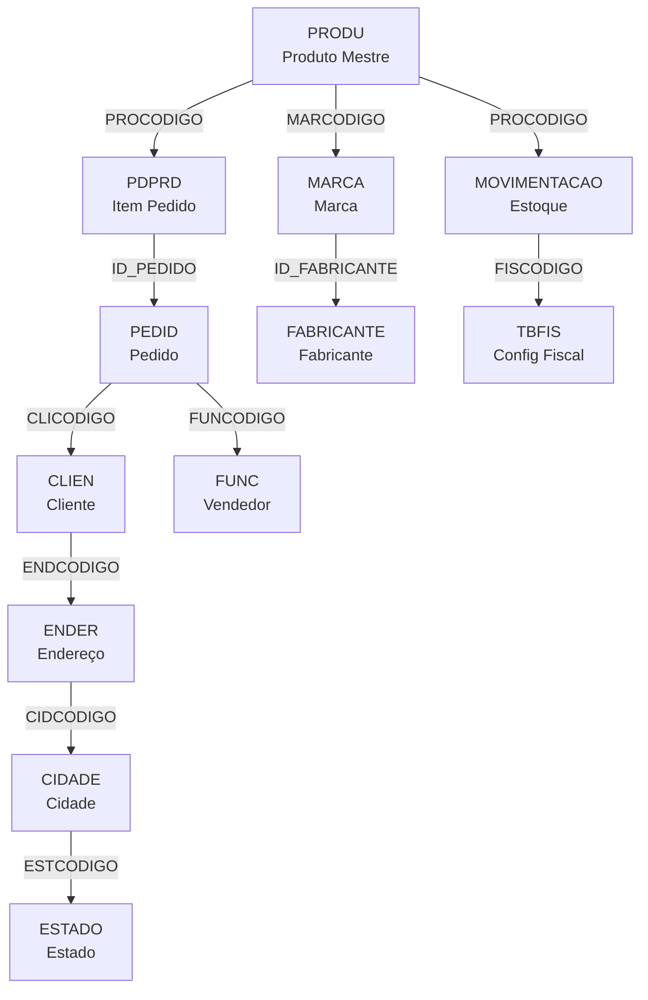

# PRODU - Documentação Completa de Relacionamentos

## 📊 Informações Gerais

- **Nome da Tabela**: PRODU (Produtos)
- **Total de Registros**: 178.187
- **Total de Colunas**: 134
- **Chave Primária**: PROCODIGO
- **Chaves Estrangeiras**: 0 (tabela mestre)
- **Índices**: 3
- **Tabelas Dependentes**: 101
- **Banco de Dados**: Firebird

## 📝 Descrição

**PRODU** é a tabela central do catálogo de produtos do sistema. Ela armazena informações mestres de todos os produtos comercializados, incluindo características físicas, classificação, especificações ópticas, dados fiscais e comerciais.

Esta é uma **tabela mestre** que não possui foreign keys para outras tabelas, mas é referenciada por 101 tabelas dependentes que armazenam informações complementares como estoque, preços, movimentações, vendas e especificações técnicas.

---

## 🔑 Estrutura de Colunas Principais

### Identificação e Controle
| Coluna | Tipo | Descrição |
|--------|------|-----------|
| **PROCODIGO** 🔑 | VARCHAR(14) | Código único do produto (PK) |
| **PRODESCRICAO** | VARCHAR(37) | Descrição/nome do produto |
| **PROCODIGO2** | VARCHAR(14) | Código alternativo do produto |
| **PROCODIGOEAN** | VARCHAR(37) | Código de barras EAN |
| **PROCODORIGEM** | VARCHAR(37) | Código de origem do produto |
| **PROSITUACAO** | VARCHAR(14) | Situação (ATIVO/INATIVO) |

### Classificação e Categorização
| Coluna | Tipo | Descrição |
|--------|------|-----------|
| **MARCODIGO** | INT | Código da marca/fabricante |
| **GR1CODIGO** | INT | Grupo nível 1 (categoria principal) |
| **GR2CODIGO** | INT | Grupo nível 2 (subcategoria) |
| **GR3CODIGO** | INT | Grupo nível 3 |
| **GR4CODIGO** | INT | Grupo nível 4 (nível mais detalhado) |
| **DESCODIGO** | INT | Código do designer |
| **TPLCODIGO** | INT | Tipo de lente |
| **ARMCODIGO** | INT | Código da armação |
| **PROTIPO** | VARCHAR(14) | Tipo do produto |

### Características Físicas
| Coluna | Tipo | Descrição |
|--------|------|-----------|
| **PROUN** | VARCHAR(14) | Unidade de medida |
| **PROMEDIDA** | VARCHAR(37) | Medida do produto |
| **PROPESOBRUTO** | DECIMAL(27,2) | Peso bruto |
| **PROPESOLIQ** | DECIMAL(27,2) | Peso líquido |
| **PROVOLUME** | DECIMAL(27,2) | Volume |
| **PROQTDEEMB** | DECIMAL(27,2) | Quantidade por embalagem |
| **PROESPESSURA** | VARCHAR(37) | Espessura |

### Comercial e Precificação
| Coluna | Tipo | Descrição |
|--------|------|-----------|
| **PROLISTAPRECO** | VARCHAR(14) | Lista de preço padrão |
| **PROPCCOMIS** | DECIMAL(27,2) | Percentual de comissão |
| **PROALTDESC** | VARCHAR(14) | Permite alteração de desconto |
| **PROGARANTIA** | INT | Período de garantia |
| **PROTPVAL** | VARCHAR(14) | Tipo de valor |

### Fiscal e Tributário
| Coluna | Tipo | Descrição |
|--------|------|-----------|
| **PROPCIPI** | DECIMAL(27,2) | % IPI |
| **PROPCPIS** | DECIMAL(16,2) | % PIS |
| **PROPCCOFINS** | DECIMAL(16,2) | % COFINS |
| **PROPCBSPIS** | DECIMAL(27,2) | % Base de cálculo PIS |
| **PROPCBSCOFINS** | DECIMAL(27,2) | % Base de cálculo COFINS |
| **PROPCBSCSLL** | DECIMAL(16,2) | % Base de cálculo CSLL |
| **PROCLASFISCAL** | VARCHAR(14) | Classificação fiscal (NCM) |
| **PROCODIGOEANTRIB** | VARCHAR(37) | Código EAN tributável |

### Lentes Ópticas (Específico)
| Coluna | Tipo | Descrição |
|--------|------|-----------|
| **PROESF1**, **PROESF2** | VARCHAR(14) | Faixa esférica mínima/máxima |
| **PROCIL1**, **PROCIL2** | VARCHAR(14) | Faixa cilíndrica mínima/máxima |
| **PROSESF1**, **PROSESF2** | VARCHAR(14) | Sinal esférico |
| **PROSCIL1**, **PROSCIL2** | VARCHAR(14) | Sinal cilíndrico |
| **PROINDICE** | DECIMAL(16,2) | Índice de refração |
| **PRODIAMETRO** | DECIMAL(16,2) | Diâmetro da lente |
| **PROCURVATURA** | VARCHAR(37) | Curvatura base |
| **PROMFBASE** | VARCHAR(37) | Manufatura base |
| **PROMFAADICAO** | VARCHAR(37) | Manufatura adição |
| **PROMFGRAU** | INT | Manufatura grau |

### Estoque e Controle
| Coluna | Tipo | Descrição |
|--------|------|-----------|
| **PROCTREST** | VARCHAR(14) | Controla estoque |
| **PROETIQUETA** | VARCHAR(14) | Imprime etiqueta |
| **PROCTRLOTE** | VARCHAR(14) | Controla lote |
| **PROCTRSERIAL** | VARCHAR(14) | Controla número serial |
| **PROVALIDADE** | INT | Dias de validade |
| **PROGRNRLOTE** | VARCHAR(14) | Gera número de lote |

### Armações (Específico)
| Coluna | Tipo | Descrição |
|--------|------|-----------|
| **PROTAMANHO** | INT | Tamanho da armação |
| **PROSEXO** | VARCHAR(14) | Sexo (Masculino/Feminino/Unissex) |
| **PROPONTE** | INT | Largura da ponte |
| **PROSAGITA** | DECIMAL(16,2) | Sagita |
| **PROALTURAMONT** | INT | Altura de montagem |
| **PROALTURAMAX** | INT | Altura máxima |
| **COR** | VARCHAR(37) | Cor do produto |
| **DESCRICAO_COR** | VARCHAR(37) | Descrição da cor |

### Outros
| Coluna | Tipo | Descrição |
|--------|------|-----------|
| **PROFICHATEC** | VARCHAR(261) | Ficha técnica |
| **PROOBSERV** | VARCHAR(261) | Observações |
| **GLCODIGO** | INT | Código da linha de produto |
| **CUSCODIGO** | INT | Centro de custo |
| **PRODTCAD** | DATE | Data de cadastro |
| **PROULTALTERACAO** | TIMESTAMP | Última alteração |
| **PRODTINATIVACAO** | TIMESTAMP | Data de inativação |

---

## 🔗 Relacionamentos - Nível 1 (101 Tabelas Dependentes)

### Categoria: Vendas e Comercialização (8 tabelas)

#### PDPRD - Produtos em Pedidos ⚡
**Volume:** 6.710.760 registros (2º MAIOR VOLUME)

**Relacionamento:**
```
PDPRD.PROCODIGO → PRODU.PROCODIGO (N:1)
```

**Descrição:** Registra cada produto vendido em pedidos. Liga o catálogo de produtos às vendas realizadas.

**Campos-chave:**
- `PROCODIGO` - Produto vendido
- `ID_PEDIDO` - Pedido ao qual pertence
- `PDPSEQ` - Sequência do item no pedido
- `PDPQTDADE` - Quantidade vendida
- `PDPPCOVENDA` - Preço de venda praticado
- `PDPCUSTO` - Custo do produto
- `PDPVRMERC` - Valor total do item

#### CLIPRO - Cliente x Produto
**Relacionamento:**
```
CLIPRO.PROCODIGO → PRODU.PROCODIGO (N:1)
```

**Descrição:** Associação entre clientes e produtos para controle de preferências e restrições.

#### OCPRD - Produtos em Orçamentos
**Relacionamento:**
```
OCPRD.PROCODIGO → PRODU.PROCODIGO (N:1)
```

**Descrição:** Produtos incluídos em orçamentos.

#### Outras Tabelas de Vendas:
- **PRCONSIG** - Produtos em consignação
- **REPDIARIA** - Relatório diário de vendas
- **COMBPRODUTOS** - Combinações de produtos
- **CLICOMBPROPRO** - Combinações cliente-produto
- **CTPPRO** - Tipo de pedido x produto

---

### Categoria: Estoque e Movimentação (12 tabelas)

#### MOVIMENTACAO - Movimentação de Estoque 🔥
**Volume:** 70.939.930 registros (MAIOR VOLUME DE TODAS!)

**Relacionamento:**
```
MOVIMENTACAO.PROCODIGO → PRODU.PROCODIGO (N:1)
```

**Descrição:** Registro histórico completo de todas as entradas e saídas de estoque. Tabela crítica para rastreabilidade total.

**Campos-chave:**
- `PROCODIGO` - Produto movimentado
- `QUANTIDADE` - Quantidade da movimentação
- `TIPO` - Tipo de movimentação (E/S)
- `DATA` - Data da movimentação
- `CUSTO` - Custo unitário
- `CUSTOTOTAL` - Custo total
- `FISCODIGO` - Código fiscal
- `ORIGIN` - Origem da movimentação
- `DOCTO_ORIGEM` - Documento de origem

#### MOVPDC - Movimentação PDC
**Relacionamento:**
```
MOVPDC.PROCODIGO → PRODU.PROCODIGO (N:1)
```

**Descrição:** Movimentação de produtos em centro de distribuição.

#### Outras Tabelas de Estoque:
- **MOVPDCAO** - Movimentação PDC adicional
- **MOVPCTPRO** - Movimentação por tipo de produto
- **MOVTOPRVOS** - Movimentação provisória
- **CUSTOACUMULADOMOVTO** - Custo acumulado
- **CUSTOACUMULADOMOVTOCOMB** - Custo acumulado combinado
- **CUSTOACUMULADOMOVTOP** - Custo acumulado por operação
- **SERIAL** - Números de série
- **RQPLOTE** - Lote de requisição
- **REQPRO** - Requisição de produtos
- **SOLPRD** - Solicitação de produtos

---

### Categoria: Precificação (11 tabelas)

#### TBPPRODU - Tabela de Preços
**Volume:** 24.852 registros

**Relacionamento:**
```
TBPPRODU.PROCODIGO → PRODU.PROCODIGO (N:1)
TBPPRODU.TBPCODIGO → TABPRECO.TBPCODIGO (N:1)
```

**Descrição:** Matriz de preços onde cada produto pode ter múltiplos preços conforme tabelas diferentes.

**Campos-chave:**
- `PROCODIGO` - Produto
- `TBPCODIGO` - Tabela de preço
- `TBPPCOVENDA` - Preço de venda
- `TBPPCDESCTO` - % desconto permitido

#### TBPGRAU - Preço por Grau
**Relacionamento:**
```
TBPGRAU.PROCODIGO → PRODU.PROCODIGO (N:1)
```

**Descrição:** Precificação específica por faixa de grau (lentes).

#### Outras Tabelas de Preço:
- **TBPQTD** - Preço por quantidade
- **TBPMMPRODU** - Margem mínima
- **PCTPRO** - Preço custo tabela
- **PREFIS** - Preço fiscal
- **PREMP_CAMPOS** - Preço empresa campos
- **PREMP_INTERNA** - Preço empresa interna
- **TABCOMPRO** - Tabela de compra
- **TBPCOMBPROPRO** - Combinação de produtos
- **TBPCOMBPROSER** - Combinação produto-serviço

---

### Categoria: Especificações Técnicas (10 tabelas)

#### PROLENTE - Especificações de Lentes 🔥
**Volume:** 17.735.841 registros (3º MAIOR VOLUME)

**Relacionamento:**
```
PROLENTE.PROCODIGO → PRODU.PROCODIGO (N:1)
```

**Descrição:** Especificações técnicas de lentes ópticas (graus esféricos, cilíndricos, adições). Volume massivo devido à granularidade por faixa de grau.

**Campos-chave:**
- `PROCODIGO` - Produto base
- `PLTSEQINT` - Sequência interna
- `PLTESFINICIAL`, `PLTESFFINAL` - Faixa esférica
- `PLTCILINICIAL`, `PLTCILFINAL` - Faixa cilíndrica
- `PLTADICAO` - Valor de adição
- `PROCODIGOFAB` - Código no fabricante

#### ARMPRO - Armações x Produtos
**Relacionamento:**
```
ARMPRO.PROCODIGO → PRODU.PROCODIGO (N:1)
```

**Descrição:** Relacionamento entre armações e produtos compatíveis.

#### Outras Tabelas de Especificações:
- **FOTOPRO** - Fotos do produto
- **COMPO** - Composição do produto
- **PRODALT** - Produtos alternativos
- **PRODUSIMILAR** - Produtos similares
- **FAIXACILPRODU** - Faixa cilíndrica
- **FAIXADESPRODU** - Faixa de descentralização
- **FAIXAPCOPRODU** - Faixa de preço
- **FAIXAPRISMAPRODU** - Faixa de prisma

---

### Categoria: Fornecimento e Compras (7 tabelas)

#### PRFOR - Produto x Fornecedor
**Volume:** 149.252 registros

**Relacionamento:**
```
PRFOR.PROCODIGO → PRODU.PROCODIGO (N:1)
PRFOR.CLICODIGO → CLIEN.CLICODIGO (N:1)
```

**Descrição:** Mapeia quais fornecedores fornecem cada produto e em qual processo/célula.

**Campos-chave:**
- `PROCODIGO` - Produto
- `CLICODIGO` - Fornecedor (cliente marcado como fornecedor)
- `PCSCODIGO` - Processo/célula de produção

#### Outras Tabelas de Fornecimento:
- **CPPRD** - Produtos em compras
- **NFCPRO** - Produtos em notas de compra
- **DEVNFPFO** - Devolução de produtos
- **CONFPARCIAL** - Conferência parcial
- **CONFPEDFO** - Conferência de pedido fornecedor
- **ITEMPRECONFFISICA** - Pré-conferência física

---

### Categoria: Produção (6 tabelas)

- **PDCPRO** - Produtos em produção
- **PDCAO** - Produtos em centro de operação
- **MOVPDCAO** - Movimentação produção
- **PRODUPDC** - Configuração produto-PDC
- **PFPRO** - Produto em fabricação
- **OCMAT** - Material em ordens de produção

---

### Categoria: Fiscal e Tributação (8 tabelas)

- **NFPRO** - Produtos em notas fiscais
- **NFEPRO** - Produtos em NF-e
- **FCI** - Ficha de Conteúdo de Importação
- **PREFIS** - Preço fiscal
- **PROPAUTAICMSUB** - Pauta ICMS substituição
- **PRODUCIAP** - Produto CIAP
- **EXCPDCPROEMP** - Exceção PDC empresa
- **PROBLC** - Bloqueio de produtos

---

### Categoria: Configuração e Controle (20 tabelas)

- **PRODEMP** - Produto x Empresa
- **PROCODBARRA** - Códigos de barras
- **PRODUSISEXT** - Produtos sistema externo
- **PRODEMPEXP** - Produto empresa exportação
- **PRODUCLIEN** - Produto cliente
- **PRODUSPED** - Produtos suspensos
- **IMPRPRODU** - Impressão de produtos
- **EXCQTDEPRODU** - Exceção quantidade
- **RAMOSPRODU** - Ramos x produtos
- **TPCPRODU** - Tipo de pedido x produto
- **OBRIGAPARTTIPOPRO** - Obrigatoriedade partes
- **PRODUEXCPRODU** - Exclusão produto-produto
- **PRODUEXCSERVI** - Exclusão produto-serviço
- **PRODUMOLDE** - Produto molde
- **PRODUPROCOR** - Produto processo cor
- **PONTCOMBINADO** - Pontuação combinada
- **MOVPONTPRODU** - Movimentação pontuação
- **PONTPRODU** - Pontuação produto
- **EXPPRODU** - Exportação produtos
- **PROAJUSTE** - Ajuste de produtos

---

### Categoria: Outros (19 tabelas)

- **APPRO** - Aplicativo produto
- **COMPSER** - Composição serviço
- **CURVAABC** - Curva ABC
- **FTPRODU** - Ficha técnica
- **PVCITEM** - Item PVC
- **SUGPRO** - Sugestão de produtos
- **SUGPROEMP** - Sugestão empresa
- **TPLPRO** - Tipo lente produto
- **TREMPPRO** - Tratamento empresa
- **SERVIEXCPRODU** - Serviço exclusão
- **OCSER** - Serviço orçamento
- **OCSERPROD** - Serviço produto orçamento
- **CTPCOMBPROPRO** - Combinação tipo pedido
- **CTPCOMBPROSER** - Combinação serviço
- **CLICOMBPROSER** - Cliente combinação serviço
- **MOVIMENTACAO** - Movimentação
- **REPDIARIA** - Relatório diário

---

## 🔗 Relacionamentos - Nível 2 (Tabelas Conectadas via Dependentes)

### Fluxo: PRODU → PDPRD → PEDID → CLIEN



**Descrição:** Do produto até o cliente que comprou e vendedor que vendeu.

**Exemplo SQL:**
```sql
SELECT
    pr.PROCODIGO,
    pr.PRODESCRICAO,
    COUNT(DISTINCT pe.ID_PEDIDO) AS TOTAL_PEDIDOS,
    COUNT(DISTINCT pe.CLICODIGO) AS TOTAL_CLIENTES,
    SUM(pp.PDPQTDADE) AS QUANTIDADE_VENDIDA,
    SUM(pp.PDPVRMERC) AS FATURAMENTO_TOTAL
FROM PRODU pr
INNER JOIN PDPRD pp ON pp.PROCODIGO = pr.PROCODIGO
INNER JOIN PEDID pe ON pe.ID_PEDIDO = pp.ID_PEDIDO
WHERE pe.PEDDTEMIS BETWEEN ? AND ?
GROUP BY pr.PROCODIGO, pr.PRODESCRICAO
ORDER BY FATURAMENTO_TOTAL DESC
```

---

### Fluxo: PRODU → MOVIMENTACAO → TBFIS



**Descrição:** Do produto até o rastreamento completo de movimentações de estoque.

**Exemplo SQL:**
```sql
SELECT
    pr.PROCODIGO,
    pr.PRODESCRICAO,
    m.DATA,
    m.TIPO,
    m.QUANTIDADE,
    m.CUSTO,
    m.CUSTOTOTAL,
    tf.FISDESCRICAO AS OPERACAO_FISCAL,
    c.CLINOME AS CLIENTE_FORNECEDOR
FROM PRODU pr
INNER JOIN MOVIMENTACAO m ON m.PROCODIGO = pr.PROCODIGO
LEFT JOIN TBFIS tf ON tf.FISCODIGO = m.FISCODIGO
LEFT JOIN CLIEN c ON c.CLICODIGO = m.CLICODIGO
WHERE pr.PROCODIGO = ?
  AND m.DATA BETWEEN ? AND ?
ORDER BY m.DATA DESC, m.HORA DESC
```

---

### Fluxo: PRODU → TBPPRODU → TABPRECO → CLITBP → CLIEN


**Descrição:** Do produto até os clientes que têm acesso a cada tabela de preço.

**Exemplo SQL:**
```sql
SELECT
    pr.PROCODIGO,
    pr.PRODESCRICAO,
    tp.TBPDESCRICAO AS TABELA_PRECO,
    tbp.TBPPCOVENDA AS PRECO,
    tbp.TBPPCDESCTO AS DESCONTO_MAX,
    c.CLINOME AS CLIENTE
FROM PRODU pr
INNER JOIN TBPPRODU tbp ON tbp.PROCODIGO = pr.PROCODIGO
INNER JOIN TABPRECO tp ON tp.TBPCODIGO = tbp.TBPCODIGO
LEFT JOIN CLITBP ct ON ct.TBPCODIGO = tp.TBPCODIGO
LEFT JOIN CLIEN c ON c.CLICODIGO = ct.CLICODIGO
WHERE pr.PROCODIGO = ?
ORDER BY tp.TBPDESCRICAO, c.CLINOME
```

---

### Fluxo: PRODU → PROLENTE → (Especificações Técnicas)



**Descrição:** Do produto base até as variações técnicas de lentes por faixa de grau.

**Exemplo SQL:**
```sql
SELECT
    pr.PROCODIGO,
    pr.PRODESCRICAO,
    pl.PLTSEQINT,
    pl.PLTESFINICIAL || ' a ' || pl.PLTESFFINAL AS FAIXA_ESFERICA,
    pl.PLTCILINICIAL || ' a ' || pl.PLTCILFINAL AS FAIXA_CILINDRICA,
    pl.PLTADICAO,
    pl.PROCODIGOFAB AS CODIGO_FABRICANTE
FROM PRODU pr
INNER JOIN PROLENTE pl ON pl.PROCODIGO = pr.PROCODIGO
WHERE pr.PROCODIGO = ?
ORDER BY pl.PLTSEQINT
```

---

### Fluxo: PRODU → PRFOR → CLIEN (Fornecedores)



**Descrição:** Do produto até os fornecedores e células de produção.

**Exemplo SQL:**
```sql
SELECT
    pr.PROCODIGO,
    pr.PRODESCRICAO,
    c.CLINOME AS FORNECEDOR,
    c.CLIDOCUMENTO AS CNPJ,
    pf.PCSCODIGO AS PROCESSO
FROM PRODU pr
INNER JOIN PRFOR pf ON pf.PROCODIGO = pr.PROCODIGO
INNER JOIN CLIEN c ON c.CLICODIGO = pf.CLICODIGO
WHERE pr.PROCODIGO = ?
ORDER BY c.CLINOME
```

---

### Fluxo: PRODU → MARCA → FABRICANTE


**Descrição:** Do produto até o fabricante/marca.

**Exemplo SQL:**
```sql
SELECT
    pr.PROCODIGO,
    pr.PRODESCRICAO,
    m.MARNOME AS MARCA,
    m.MAROBSER AS OBSERVACAO_MARCA
FROM PRODU pr
LEFT JOIN MARCA m ON m.MARCODIGO = pr.MARCODIGO
WHERE pr.PROCODIGO = ?
```

---

## 🔗 Relacionamentos - Nível 3 (Exemplo Completo)

### Fluxo Completo: Produto → Venda → Cliente → Endereço → Cidade



**Exemplo SQL Completo (3 Níveis):**
```sql
SELECT
    -- Nível 1: PRODUTO
    pr.PROCODIGO,
    pr.PRODESCRICAO,
    pr.PROSITUACAO,

    -- Nível 2: MARCA
    m.MARNOME AS MARCA,

    -- Nível 2: ITEM DO PEDIDO
    pp.PDPSEQ AS ITEM,
    pp.PDPQTDADE AS QUANTIDADE,
    pp.PDPPCOVENDA AS PRECO_UNITARIO,

    -- Nível 2: PEDIDO
    pe.PEDCODIGO AS NUMERO_PEDIDO,
    pe.PEDDTEMIS AS DATA_EMISSAO,

    -- Nível 3: CLIENTE
    c.CLINOME AS CLIENTE,
    c.CLIDOCUMENTO AS CPF_CNPJ,

    -- Nível 4: ENDEREÇO → CIDADE → ESTADO
    en.ENDLOGRADOURO AS ENDERECO,
    ci.CIDNOME AS CIDADE,
    es.ESTNOME AS ESTADO,

    -- Nível 3: VENDEDOR
    f.FUNNOME AS VENDEDOR

FROM PRODU pr

-- Nível 1 → 2: Marca
LEFT JOIN MARCA m ON m.MARCODIGO = pr.MARCODIGO

-- Nível 1 → 2: Itens vendidos
INNER JOIN PDPRD pp ON pp.PROCODIGO = pr.PROCODIGO

-- Nível 2 → 3: Pedidos
INNER JOIN PEDID pe ON pe.ID_PEDIDO = pp.ID_PEDIDO

-- Nível 2 → 3: Cliente
LEFT JOIN CLIEN c ON c.CLICODIGO = pe.CLICODIGO

-- Nível 3 → 4: Endereço → Cidade → Estado
LEFT JOIN ENDER en ON en.ENDCODIGO = c.ENDCODIGO
LEFT JOIN CIDADE ci ON ci.CIDCODIGO = en.CIDCODIGO
LEFT JOIN ESTADO es ON es.ESTCODIGO = ci.ESTCODIGO

-- Nível 2 → 3: Vendedor
LEFT JOIN FUNC f ON f.FUNCODIGO = pe.FUNCODIGO

WHERE pr.PROCODIGO = ?
ORDER BY pe.PEDDTEMIS DESC
```

---

## 📊 Casos de Uso Comuns

### 1. Análise de Vendas por Produto

```sql
SELECT
    pr.PROCODIGO,
    pr.PRODESCRICAO,
    m.MARNOME AS MARCA,
    COUNT(DISTINCT pp.ID_PEDIDO) AS TOTAL_PEDIDOS,
    SUM(pp.PDPQTDADE) AS QUANTIDADE_VENDIDA,
    AVG(pp.PDPPCOVENDA) AS PRECO_MEDIO,
    SUM(pp.PDPVRMERC) AS FATURAMENTO_TOTAL,
    SUM(pp.PDPVRMERC - (pp.PDPCUSTO * pp.PDPQTDADE)) AS MARGEM_BRUTA
FROM PRODU pr
LEFT JOIN MARCA m ON m.MARCODIGO = pr.MARCODIGO
INNER JOIN PDPRD pp ON pp.PROCODIGO = pr.PROCODIGO
INNER JOIN PEDID pe ON pe.ID_PEDIDO = pp.ID_PEDIDO
WHERE pe.PEDDTEMIS BETWEEN ? AND ?
  AND pe.PEDSITPED NOT IN ('CANCELADO')
GROUP BY pr.PROCODIGO, pr.PRODESCRICAO, m.MARNOME
ORDER BY FATURAMENTO_TOTAL DESC
```

---

### 2. Rastreamento de Estoque por Produto

```sql
SELECT
    pr.PROCODIGO,
    pr.PRODESCRICAO,
    m.DATA,
    m.TIPO AS TIPO_MOVIMENTO,
    m.QUANTIDADE,
    m.CUSTO,
    m.CUSTOTOTAL,
    tf.FISDESCRICAO AS OPERACAO_FISCAL,
    c.CLINOME AS ORIGEM_DESTINO,
    m.DOCTO_ORIGEM AS DOCUMENTO
FROM PRODU pr
INNER JOIN MOVIMENTACAO m ON m.PROCODIGO = pr.PROCODIGO
LEFT JOIN TBFIS tf ON tf.FISCODIGO = m.FISCODIGO
LEFT JOIN CLIEN c ON c.CLICODIGO = m.CLICODIGO
WHERE pr.PROCODIGO = ?
  AND m.DATA BETWEEN ? AND ?
ORDER BY m.DATA DESC, m.HORA DESC
LIMIT 100
```

---

### 3. Produtos Sem Movimentação (Estoque Parado)

```sql
SELECT
    pr.PROCODIGO,
    pr.PRODESCRICAO,
    pr.PROSITUACAO,
    m.MARNOME AS MARCA,
    MAX(mov.DATA) AS ULTIMA_MOVIMENTACAO,
    CURRENT_DATE - MAX(mov.DATA) AS DIAS_SEM_MOVIMENTO
FROM PRODU pr
LEFT JOIN MARCA m ON m.MARCODIGO = pr.MARCODIGO
LEFT JOIN MOVIMENTACAO mov ON mov.PROCODIGO = pr.PROCODIGO
WHERE pr.PROSITUACAO = 'ATIVO'
  AND pr.PROCTREST = 'S'
GROUP BY pr.PROCODIGO, pr.PRODESCRICAO, pr.PROSITUACAO, m.MARNOME
HAVING MAX(mov.DATA) < CURRENT_DATE - 180
    OR MAX(mov.DATA) IS NULL
ORDER BY DIAS_SEM_MOVIMENTO DESC NULLS FIRST
```

---

### 4. Produtos Mais Rentáveis

```sql
SELECT
    pr.PROCODIGO,
    pr.PRODESCRICAO,
    m.MARNOME AS MARCA,
    SUM(pp.PDPQTDADE) AS QUANTIDADE_VENDIDA,
    SUM(pp.PDPVRMERC) AS RECEITA_TOTAL,
    SUM(pp.PDPCUSTO * pp.PDPQTDADE) AS CUSTO_TOTAL,
    SUM(pp.PDPVRMERC - (pp.PDPCUSTO * pp.PDPQTDADE)) AS MARGEM_BRUTA,
    CASE
        WHEN SUM(pp.PDPVRMERC) > 0 THEN
            (SUM(pp.PDPVRMERC - (pp.PDPCUSTO * pp.PDPQTDADE)) / SUM(pp.PDPVRMERC)) * 100
        ELSE 0
    END AS MARGEM_PERCENTUAL
FROM PRODU pr
LEFT JOIN MARCA m ON m.MARCODIGO = pr.MARCODIGO
INNER JOIN PDPRD pp ON pp.PROCODIGO = pr.PROCODIGO
INNER JOIN PEDID pe ON pe.ID_PEDIDO = pp.ID_PEDIDO
WHERE pe.PEDDTEMIS BETWEEN ? AND ?
  AND pe.PEDSITPED NOT IN ('CANCELADO')
GROUP BY pr.PROCODIGO, pr.PRODESCRICAO, m.MARNOME
HAVING SUM(pp.PDPQTDADE) > 0
ORDER BY MARGEM_BRUTA DESC
LIMIT 20
```

---

### 5. Variações de Lentes por Produto

```sql
SELECT
    pr.PROCODIGO,
    pr.PRODESCRICAO,
    pl.PLTSEQINT AS VARIACAO,
    pl.PLTESFINICIAL || ' a ' || pl.PLTESFFINAL AS FAIXA_ESFERICA,
    pl.PLTCILINICIAL || ' a ' || pl.PLTCILFINAL AS FAIXA_CILINDRICA,
    pl.PLTADICAO AS ADICAO,
    pl.PROCODIGOFAB AS CODIGO_FABRICANTE
FROM PRODU pr
INNER JOIN PROLENTE pl ON pl.PROCODIGO = pr.PROCODIGO
WHERE pr.PROCODIGO = ?
ORDER BY pl.PLTSEQINT
```

---

### 6. Produtos por Fornecedor

```sql
SELECT
    c.CLINOME AS FORNECEDOR,
    c.CLIDOCUMENTO AS CNPJ,
    COUNT(DISTINCT pf.PROCODIGO) AS TOTAL_PRODUTOS,
    STRING_AGG(pr.PRODESCRICAO, ', ') AS PRODUTOS
FROM CLIEN c
INNER JOIN PRFOR pf ON pf.CLICODIGO = c.CLICODIGO
INNER JOIN PRODU pr ON pr.PROCODIGO = pf.PROCODIGO
WHERE c.CLIFORNEC = 'S'
GROUP BY c.CLINOME, c.CLIDOCUMENTO
ORDER BY TOTAL_PRODUTOS DESC
```

---

## 📈 Estatísticas de Volume (por tabela relacionada)

| Tabela | Registros | Proporção | Tipo de Dados |
|--------|-----------|-----------|---------------|
| MOVIMENTACAO | 70.939.930 | 398:1 | 🔥 Movimentações estoque |
| PROLENTE | 17.735.841 | 99:1 | 🔥 Especificações lentes |
| PDPRD | 6.710.760 | 38:1 | Vendas (itens pedidos) |
| PRFOR | 149.252 | 0.8:1 | Produto-Fornecedor |
| TBPPRODU | 24.852 | 0.14:1 | Tabela de preços |
| PRODU | 178.187 | 1:1 | **TABELA MESTRE** |
| MARCA | 31 | 0.0002:1 | Marcas/Fabricantes |

**Interpretação:**
- Cada produto tem em média **398 movimentações** de estoque
- Cada produto tem em média **99 variações de grau** (lentes)
- Cada produto foi vendido em média **38 vezes** (itens)
- Apenas 31 marcas gerenciam 178k produtos
- 14% dos produtos têm preços em tabelas especiais

---

## 🎯 Principais Campos de Junção

| Campo | Presente em | Uso |
|-------|-------------|-----|
| **PROCODIGO** | 101 tabelas | Chave primária universal |
| **MARCODIGO** | PRODU + MARCA + relacionadas | Classificação por marca |
| **GR1CODIGO** | PRODU + GRUPO | Grupo nível 1 |
| **TPLCODIGO** | PRODU + TPL + PROLENTE | Tipo de lente |
| **ARMCODIGO** | PRODU + ARMACAO | Armações |
| **EMPCODIGO** | PRODEMP + múltiplas | Filtro empresa/filial |

---

## 🚀 Performance e Otimização

### Índices Existentes em PRODU

```sql
-- Índices simples
INDPROCODIGO2 (PROCODIGO2)
INDPRODESCRICAO (PRODESCRICAO)
INDPROTPLCODIGO (TPLCODIGO)
```

### Índices Críticos em Tabelas Relacionadas

**MOVIMENTACAO:**
- Volume massivo (70.9M) - SEMPRE filtrar por data
- Índice crítico: `IDX_PRODU_DATA` (PROCODIGO, DATA)

**PROLENTE:**
- Volume massivo (17.7M) - Filtrar por PROCODIGOFAB
- Índice crítico: `IDX_PROLENTE_PROCODIGOFAB` (PROCODIGOFAB)

**PDPRD:**
- Volume alto (6.7M) - Filtrar por ID_PEDIDO primeiro
- Índice: `PEDID_PDPRD` (ID_PEDIDO)

### Dicas de Performance

1. **Sempre use PROCODIGO** (PK) ao invés de PRODESCRICAO
2. **Filtros em MOVIMENTACAO**: SEMPRE inclua filtro de data
3. **Filtros em PROLENTE**: Use PROCODIGOFAB quando disponível
4. **Joins volumosos**: PDPRD e MOVIMENTACAO - sempre filtre antes do JOIN
5. **Cache**: Considere cache para MARCA (31 registros) e TBPPRODU
6. **Paginação**: Use LIMIT/OFFSET em consultas de listagem

---

## 📚 Documentos Relacionados

- [PRODU.md](tables/PRODU.md) - Documentação base da tabela
- [PDPRD.md](tables/PDPRD.md) - Produtos em pedidos
- [MOVIMENTACAO.md](tables/MOVIMENTACAO.md) - Movimentação de estoque
- [PROLENTE.md](tables/PROLENTE.md) - Especificações de lentes
- [PEDID_RELACIONAMENTOS_COMPLETOS.md](PEDID_RELACIONAMENTOS_COMPLETOS.md) - Relacionamentos PEDID

---

**Documentação gerada em**: 2025-11-09
**Versão**: 1.0
**Autor**: Claude Code
