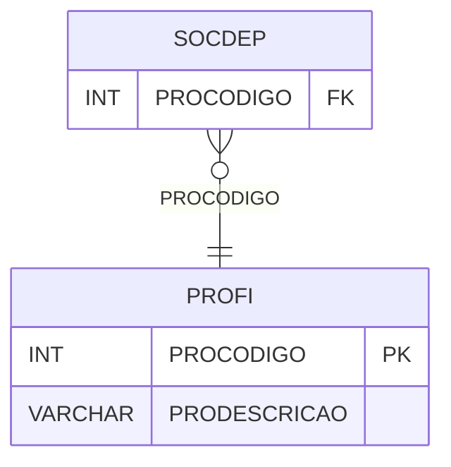

# PROFI - Documentação Completa de Relacionamentos

## 📊 Informações Gerais

- **Nome da Tabela**: PROFI (Produto Financeiro)
- **Total de Registros**: 20
- **Total de Colunas**: 2
- **Chave Primária**: PROCODIGO
- **Chaves Estrangeiras**: 0
- **Índices**: 0
- **Tabelas Dependentes**: 1
- **Banco de Dados**: Firebird

## 📝 Descrição

**PROFI** é uma tabela mestre que armazena informações sobre produtos financeiros. Com apenas **20 registros**, esta tabela define produtos financeiros disponíveis no sistema, incluindo código e descrição.

Esta tabela é essencial para:
- **Produtos Financeiros**: Definir produtos financeiros disponíveis
- **Configuração**: Armazenar configurações de produtos financeiros
- **Rastreamento**: Rastrear quais produtos financeiros estão disponíveis
- **Relatórios**: Gerar relatórios de produtos financeiros

**Contexto de Negócio:**
O sistema possui produtos financeiros específicos que podem ser utilizados em diferentes contextos. Esta tabela define esses produtos e suas descrições.

---

## 🔑 Estrutura de Colunas

| Coluna | Tipo | Descrição |
|--------|------|-----------|
| **PROCODIGO** 🔑 | INT | Código do produto financeiro (PK) |
| **PRODESCRICAO** | VARCHAR(37) | Descrição do produto financeiro |

---

## 📊 Tabelas que Referenciam Esta

Esta tabela é referenciada por 1 tabela:

### SOCDEP - Sociedade Dependente
**Volume:** Variável

**Relacionamento:**
```
SOCDEP.PROCODIGO → PROFI.PROCODIGO (N:1)
Constraint: PROFI_SOCDEP
```

**Descrição:** Identifica o produto financeiro relacionado à sociedade dependente.

---

## 🗺️ Diagrama de Relacionamentos



---

## 💡 Exemplos de Uso

### Consulta Básica

```sql
SELECT PROCODIGO, PRODESCRICAO
FROM PROFI
WHERE PROCODIGO = ?;
```

### Consulta com Tabelas Dependentes

```sql
SELECT 
    pf.*,
    sd.*
FROM PROFI pf
LEFT JOIN SOCDEP sd
    ON pf.PROCODIGO = sd.PROCODIGO
WHERE pf.PROCODIGO = ?;
```

### Inserção de Produto Financeiro

```sql
INSERT INTO PROFI (PRODESCRICAO)
VALUES (?);
```

---

## ⚡ Performance e Otimização

### Índices Recomendados

#### 1. Índice na Chave Primária (Já existe implicitamente)
```sql
-- Índice primário já existe implicitamente
```

---

## 📊 Estatísticas e Insights

### Volume de Dados

- **Total de Registros**: 20
- **Tamanho Médio Estimado**: ~50 bytes por registro
- **Tamanho Total Estimado**: ~1 KB

### Distribuição de Dados

- **Produtos Financeiros**: 20 produtos financeiros disponíveis
- **Taxa de Utilização**: Tabela mestre com volume mínimo

---

## 🔧 Integração com Código Laravel

### Model Eloquent

```php
<?php

namespace App\Models;

use Illuminate\Database\Eloquent\Model;
use Illuminate\Database\Eloquent\Relations\HasMany;

final class Profi extends Model
{
    protected $table = 'PROFI';
    protected $primaryKey = 'PROCODIGO';
    public $incrementing = true;
    public $timestamps = false;

    protected $fillable = [
        'PRODESCRICAO',
    ];

    protected $casts = [
        'PROCODIGO' => 'integer',
        'PRODESCRICAO' => 'string',
    ];

    /**
     * Relacionamento com Sociedades Dependentes
     */
    public function sociedadesDependentes(): HasMany
    {
        return $this->hasMany(SocDep::class, 'PROCODIGO', 'PROCODIGO');
    }

    /**
     * Obter todos os produtos financeiros
     */
    public static function todos()
    {
        return self::orderBy('PRODESCRICAO')
            ->get();
    }
}
```

---

## ✅ Boas Práticas

### Design

1. **Chave Primária**: PROCODIGO deve ser único e sequencial
2. **Validação**: Validar PRODESCRICAO antes de inserir
3. **Volume**: Manter apenas produtos necessários

### Performance

1. **Índices**: Não necessário devido ao volume mínimo
2. **Consultas**: Consultas simples são suficientes

### Segurança

1. **Validação**: Validar valores antes de inserir
2. **Acesso**: Restringir acesso de escrita a administradores

---

**Documentação gerada em**: 2025-01-27

**Banco de dados**: Firebird

