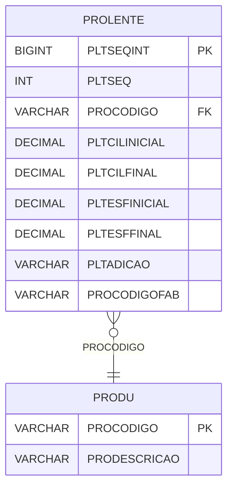

# PROLENTE - Documentação Completa de Relacionamentos

## 📊 Informações Gerais

- **Nome da Tabela**: PROLENTE (Produto Lente)
- **Total de Registros**: 17.735.841
- **Total de Colunas**: 9
- **Chave Primária**: PLTSEQINT
- **Chaves Estrangeiras**: 1
- **Índices**: 1
- **Tabelas Dependentes**: 0
- **Banco de Dados**: Firebird

## 📝 Descrição

**PROLENTE** é uma tabela de detalhamento que armazena informações específicas sobre lentes de produtos. Com **17.735.841 registros**, esta tabela registra características ópticas de lentes, incluindo cilindro inicial/final, esfera inicial/final, adição e código do fabricante.

Esta tabela é essencial para:
- **Características Ópticas**: Armazenar características ópticas de lentes
- **Rastreamento**: Rastrear lentes por produto
- **Fabricação**: Gerenciar informações de fabricação
- **Relatórios**: Gerar relatórios de lentes

**Contexto de Negócio:**
Produtos do tipo lente possuem características ópticas específicas que precisam ser armazenadas. Esta tabela gerencia essas informações, permitindo rastrear características ópticas de cada lente, incluindo cilindro, esfera, adição e código do fabricante.

---

## 🔑 Estrutura de Colunas

| Coluna | Tipo | Descrição |
|--------|------|-----------|
| **PLTSEQINT** 🔑 | BIGINT | Identificador único da lente (PK) |
| **PLTSEQ** | INT | Sequência da lente |
| **PROCODIGO** 🔗 | VARCHAR(14) | Código do produto (FK → PRODU) |
| **PLTCILINICIAL** | DECIMAL(18,2) | Cilindro inicial |
| **PLTCILFINAL** | DECIMAL(18,2) | Cilindro final |
| **PLTESFINICIAL** | DECIMAL(18,2) | Esfera inicial |
| **PLTESFFINAL** | DECIMAL(18,2) | Esfera final |
| **PLTADICAO** | VARCHAR(37) | Adição da lente |
| **PROCODIGOFAB** | VARCHAR(14) | Código do produto do fabricante |

---

## 🔗 Relacionamentos - Nível 1 (Diretos)

### PRODU - Produto (FK Obrigatória)
**Volume:** 178.187 registros

**Relacionamento:**
```
PROLENTE.PROCODIGO → PRODU.PROCODIGO (N:1)
Constraint: PRODU_PROLENTE
```

**Descrição:** Cada registro relaciona uma lente com um produto específico.

**Proporção:** ~99,5 lentes por produto em média (17.735.841 / 178.187)

---

## 🗺️ Diagrama de Relacionamentos



---

## 📇 Índices

| Nome do Índice | Colunas | Único |
|----------------|---------|-------|
| IDX_PROLENTE_PROCODIGOFAB | PROCODIGOOFAB | Não |

---

## 💡 Exemplos de Uso

### Consulta Básica

```sql
SELECT PLTSEQINT, PLTSEQ, PROCODIGO, PLTCILINICIAL, PLTCILFINAL, 
       PLTESFINICIAL, PLTESFFINAL, PLTADICAO, PROCODIGOFAB
FROM PROLENTE
WHERE PLTSEQINT = ?;
```

### Consulta com Informações do Produto

```sql
SELECT 
    pl.*,
    pr.PRODESCRICAO
FROM PROLENTE pl
INNER JOIN PRODU pr
    ON pl.PROCODIGO = pr.PROCODIGO
WHERE pl.PLTSEQINT = ?;
```

### Consulta de Lentes por Produto

```sql
SELECT 
    pl.*,
    pr.PRODESCRICAO
FROM PROLENTE pl
INNER JOIN PRODU pr
    ON pl.PROCODIGO = pr.PROCODIGO
WHERE pl.PROCODIGO = ?
ORDER BY pl.PLTSEQ;
```

### Consulta de Lentes por Código do Fabricante

```sql
SELECT 
    pl.*,
    pr.PRODESCRICAO
FROM PROLENTE pl
INNER JOIN PRODU pr
    ON pl.PROCODIGO = pr.PROCODIGO
WHERE pl.PROCODIGOFAB = ?
ORDER BY pl.PLTSEQ;
```

### Inserção de Lente

```sql
INSERT INTO PROLENTE (PLTSEQ, PROCODIGO, PLTCILINICIAL, PLTCILFINAL, 
                      PLTESFINICIAL, PLTESFFINAL, PLTADICAO, PROCODIGOFAB)
VALUES (?, ?, ?, ?, ?, ?, ?, ?);
```

---

## ⚡ Performance e Otimização

### Índices Recomendados

#### 1. Índice na Chave Primária (Já existe implicitamente)
```sql
-- Índice primário já existe implicitamente
```

#### 2. Índice em PROCODIGO
```sql
CREATE INDEX IDX_PROLENTE_PROCODIGO 
ON PROLENTE (PROCODIGO);
```

**Justificativa:** Facilita buscas por produto (crítico devido ao volume extremamente alto).

#### 3. Índice Composto em PROCODIGO e PLTSEQ
```sql
CREATE INDEX IDX_PROLENTE_PROD_SEQ 
ON PROLENTE (PROCODIGO, PLTSEQ);
```

**Justificativa:** Facilita ordenação por sequência dentro de cada produto.

---

## 📊 Estatísticas e Insights

### Volume de Dados

- **Total de Registros**: 17.735.841
- **Tamanho Médio Estimado**: ~80 bytes por registro
- **Tamanho Total Estimado**: ~1,4 GB

### Distribuição de Dados

- **Lentes**: 17.735.841 lentes registradas
- **Média por Produto**: ~99,5 lentes por produto

---

## 🔧 Integração com Código Laravel

### Model Eloquent

```php
<?php

namespace App\Models;

use Illuminate\Database\Eloquent\Model;
use Illuminate\Database\Eloquent\Relations\BelongsTo;

final class ProLente extends Model
{
    protected $table = 'PROLENTE';
    protected $primaryKey = 'PLTSEQINT';
    public $incrementing = true;
    public $timestamps = false;

    protected $fillable = [
        'PLTSEQ',
        'PROCODIGO',
        'PLTCILINICIAL',
        'PLTCILFINAL',
        'PLTESFINICIAL',
        'PLTESFFINAL',
        'PLTADICAO',
        'PROCODIGOFAB',
    ];

    protected $casts = [
        'PLTSEQINT' => 'integer',
        'PLTSEQ' => 'integer',
        'PROCODIGO' => 'string',
        'PLTCILINICIAL' => 'decimal:2',
        'PLTCILFINAL' => 'decimal:2',
        'PLTESFINICIAL' => 'decimal:2',
        'PLTESFFINAL' => 'decimal:2',
        'PLTADICAO' => 'string',
        'PROCODIGOFAB' => 'string',
    ];

    /**
     * Relacionamento com Produto
     */
    public function produto(): BelongsTo
    {
        return $this->belongsTo(Produ::class, 'PROCODIGO', 'PROCODIGO');
    }

    /**
     * Buscar lentes por produto
     */
    public static function lentesPorProduto(string $proCodigo)
    {
        return self::where('PROCODIGO', $proCodigo)
            ->with(['produto'])
            ->orderBy('PLTSEQ')
            ->get();
    }
}
```

---

## ✅ Boas Práticas

### Design

1. **Chave Primária**: PLTSEQINT deve ser único e sequencial
2. **Validação**: Validar PROCODIGO antes de inserir
3. **Volume**: Considerar particionamento devido ao volume extremamente alto

### Performance

1. **Índices**: Usar índices para buscas frequentes (crítico devido ao volume)
2. **Consultas**: Usar eager loading para relacionamentos
3. **Paginação**: Sempre usar paginação em consultas

### Segurança

1. **Validação**: Validar valores antes de inserir
2. **Acesso**: Restringir acesso de escrita a usuários autorizados

---

**Documentação gerada em**: 2025-01-27

**Banco de dados**: Firebird

