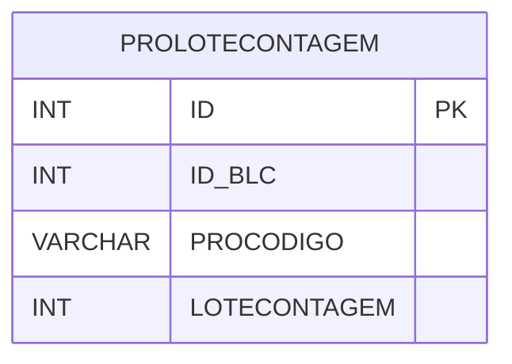

# PROLOTECONTAGEM - Documentação Completa de Relacionamentos

## 📊 Informações Gerais

- **Nome da Tabela**: PROLOTECONTAGEM (Produto Lote Contagem)
- **Total de Registros**: 54.472
- **Total de Colunas**: 4
- **Chave Primária**: ID
- **Chaves Estrangeiras**: 0
- **Índices**: 0
- **Tabelas Dependentes**: 0
- **Banco de Dados**: Firebird

## 📝 Descrição

**PROLOTECONTAGEM** é uma tabela de dados que armazena informações sobre produtos relacionados a lotes de contagem. Com **54.472 registros**, esta tabela registra produtos associados a lotes de contagem, incluindo identificador do balanço, código do produto e lote de contagem.

Esta tabela é essencial para:
- **Contagem**: Gerenciar produtos em lotes de contagem
- **Rastreamento**: Rastrear produtos por lote de contagem
- **Auditoria**: Manter histórico de produtos em contagens
- **Relatórios**: Gerar relatórios de produtos por lote de contagem

**Contexto de Negócio:**
Durante processos de contagem de estoque, produtos são agrupados em lotes. Esta tabela gerencia essas relações, permitindo rastrear quais produtos estão relacionados a quais lotes de contagem.

---

## 🔑 Estrutura de Colunas

| Coluna | Tipo | Descrição |
|--------|------|-----------|
| **ID** 🔑 | INT | Identificador único do registro (PK) |
| **ID_BLC** | INT | Identificador do balanço |
| **PROCODIGO** | VARCHAR(14) | Código do produto |
| **LOTECONTAGEM** | INT | Lote de contagem |

---

## 🗺️ Diagrama de Relacionamentos



---

## 💡 Exemplos de Uso

### Consulta Básica

```sql
SELECT ID, ID_BLC, PROCODIGO, LOTECONTAGEM
FROM PROLOTECONTAGEM
WHERE ID = ?;
```

### Consulta de Produtos por Lote de Contagem

```sql
SELECT 
    plc.*
FROM PROLOTECONTAGEM plc
WHERE plc.LOTECONTAGEM = ?
ORDER BY plc.PROCODIGO;
```

### Consulta de Produtos por Balanço

```sql
SELECT 
    plc.*
FROM PROLOTECONTAGEM plc
WHERE plc.ID_BLC = ?
ORDER BY plc.LOTECONTAGEM, plc.PROCODIGO;
```

### Inserção de Produto em Lote de Contagem

```sql
INSERT INTO PROLOTECONTAGEM (ID_BLC, PROCODIGO, LOTECONTAGEM)
VALUES (?, ?, ?);
```

---

## ⚡ Performance e Otimização

### Índices Recomendados

#### 1. Índice na Chave Primária (Já existe implicitamente)
```sql
-- Índice primário já existe implicitamente
```

#### 2. Índice em ID_BLC
```sql
CREATE INDEX IDX_PROLOTECONTAGEM_ID_BLC 
ON PROLOTECONTAGEM (ID_BLC);
```

**Justificativa:** Facilita buscas por balanço.

#### 3. Índice em LOTECONTAGEM
```sql
CREATE INDEX IDX_PROLOTECONTAGEM_LOTECONTAGEM 
ON PROLOTECONTAGEM (LOTECONTAGEM);
```

**Justificativa:** Facilita buscas por lote de contagem.

#### 4. Índice Composto em ID_BLC e LOTECONTAGEM
```sql
CREATE INDEX IDX_PROLOTECONTAGEM_BLC_LOTE 
ON PROLOTECONTAGEM (ID_BLC, LOTECONTAGEM);
```

**Justificativa:** Facilita buscas combinadas por balanço e lote.

---

## 📊 Estatísticas e Insights

### Volume de Dados

- **Total de Registros**: 54.472
- **Tamanho Médio Estimado**: ~30 bytes por registro
- **Tamanho Total Estimado**: ~1,6 MB

### Distribuição de Dados

- **Produtos em Lotes**: 54.472 produtos relacionados a lotes de contagem
- **Média por Lote**: Variável dependendo do processo de contagem

---

## 🔧 Integração com Código Laravel

### Model Eloquent

```php
<?php

namespace App\Models;

use Illuminate\Database\Eloquent\Model;

final class ProLoteContagem extends Model
{
    protected $table = 'PROLOTECONTAGEM';
    protected $primaryKey = 'ID';
    public $incrementing = true;
    public $timestamps = false;

    protected $fillable = [
        'ID_BLC',
        'PROCODIGO',
        'LOTECONTAGEM',
    ];

    protected $casts = [
        'ID' => 'integer',
        'ID_BLC' => 'integer',
        'PROCODIGO' => 'string',
        'LOTECONTAGEM' => 'integer',
    ];

    /**
     * Buscar produtos por lote de contagem
     */
    public static function produtosPorLote(int $loteContagem)
    {
        return self::where('LOTECONTAGEM', $loteContagem)
            ->orderBy('PROCODIGO')
            ->get();
    }

    /**
     * Buscar produtos por balanço
     */
    public static function produtosPorBalanco(int $idBlc)
    {
        return self::where('ID_BLC', $idBlc)
            ->orderBy('LOTECONTAGEM', 'PROCODIGO')
            ->get();
    }
}
```

---

## ✅ Boas Práticas

### Design

1. **Chave Primária**: ID deve ser único e sequencial
2. **Validação**: Validar ID_BLC, PROCODIGO e LOTECONTAGEM antes de inserir
3. **Integridade**: Considerar constraints de integridade referencial

### Performance

1. **Índices**: Usar índices para buscas frequentes
2. **Consultas**: Usar índices compostos para buscas combinadas

### Segurança

1. **Validação**: Validar valores antes de inserir
2. **Acesso**: Restringir acesso de escrita a usuários autorizados

---

**Documentação gerada em**: 2025-01-27

**Banco de dados**: Firebird

