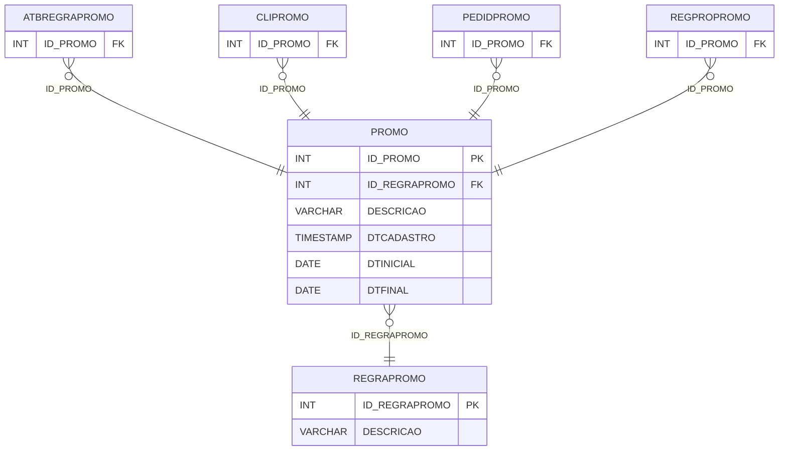

# PROMO - Documentação Completa de Relacionamentos

## 📊 Informações Gerais

- **Nome da Tabela**: PROMO (Promoção)
- **Total de Registros**: 156
- **Total de Colunas**: 35
- **Chave Primária**: ID_PROMO
- **Chaves Estrangeiras**: 1
- **Índices**: 0
- **Tabelas Dependentes**: 10
- **Banco de Dados**: Firebird

## 📝 Descrição

**PROMO** é uma tabela intermediária que armazena informações sobre campanhas promocionais. Com **156 registros**, esta tabela registra campanhas promocionais com descrição, datas de início e fim, regras de promoção e diversas configurações comportamentais.

Esta tabela é essencial para:
- **Campanhas Promocionais**: Gerenciar campanhas promocionais
- **Rastreamento**: Rastrear campanhas por regra de promoção
- **Configuração**: Armazenar configurações comportamentais das campanhas
- **Relatórios**: Gerar relatórios de campanhas promocionais

**Contexto de Negócio:**
O sistema possui um sistema completo de promoções que permite criar campanhas com regras complexas. Esta tabela gerencia essas campanhas, incluindo vigência, configurações comportamentais e regras de aplicação.

---

## 🔑 Estrutura de Colunas

| Coluna | Tipo | Descrição |
|--------|------|-----------|
| **ID_PROMO** 🔑 | INT | Identificador único da promoção (PK) |
| **ID_REGRAPROMO** 🔗 | INT | Código da regra de promoção (FK → REGRAPROMO) |
| **DESCRICAO** | VARCHAR(37) | Descrição da campanha |
| **DTCADASTRO** | TIMESTAMP | Data de cadastro |
| **DTINICIAL** | DATE | Data inicial da vigência |
| **DTFINAL** | DATE | Data final da vigência |
| **VALPEDLISTASERV** | CHAR(1) | Valida pedido lista serviço |
| **EXIGENRCONTROLE** | CHAR(1) | Exige número de controle |
| **TRAVAALTDIOPTRIA** | CHAR(1) | Trava alteração de dioptria |
| **LANCAPEDIDOUNICO** | CHAR(1) | Lança pedido único |
| **GERAVINCULOAUTOPED** | CHAR(1) | Gera vínculo automático pedido |
| **PEDPROMOPCOMENIGUAL** | CHAR(1) | Pedido promoção com mesmo igual |
| **GRNFSEPPEDPROMO** | CHAR(1) | Gera NF separada pedido promoção |
| **DISPOINTERNET** | CHAR(1) | Disponível na internet |
| **OBSCODIGO** | INT | Código da observação |
| **OBSPEDNFPROMO** | VARCHAR(261) | Observação pedido NF promoção |
| **SERVFORAPROMO** | VARCHAR(37) | Serviço fora promoção |
| **IMAGEM** | VARCHAR(261) | Caminho da imagem |
| **NAOGERAPONTOWEBPREMIO** | CHAR(1) | Não gera ponto web prêmio |
| **PRODBENEFFORAPROMO** | CHAR(1) | Produto benefício fora promoção |
| **TIPO** | CHAR(1) | Tipo da promoção |
| **SERVFORAPROMOSEG** | VARCHAR(37) | Serviço fora promoção segundo |
| **NAOREPRECARMRECD** | CHAR(1) | Não reprecar marca recebida |
| **OBRIGAPARAPAR** | CHAR(1) | Obrigatória para participação |
| **PERMITESEGPEDPROMO** | CHAR(1) | Permite segundo pedido promoção |
| **UTILAPVPEDPROMO** | CHAR(1) | Utiliza APV pedido promoção |
| **PROMOVALIDPRECOVENDA** | DECIMAL(18,2) | Valor validação preço venda |
| **PROMOTPVALIDAPRECOVENDA** | DECIMAL(18,2) | Tipo validação preço venda |
| **TRAVAALTPRODSEGPED** | VARCHAR(37) | Trava alteração produto segundo pedido |
| **ACREVRTOTPED** | DECIMAL(18,2) | Acrescenta valor total pedido |
| **LIMADICAOPED** | DECIMAL(18,2) | Limite adição pedido |
| **LIMADICAOPEDFLAG** | CHAR(1) | Flag limite adição pedido |
| **DESCFIXO** | VARCHAR(37) | Desconto fixo |
| **CONSTABPRECOCOMB** | CHAR(1) | Consta tabela preço combinação |
| **CONFIRMAGERARPROMO** | VARCHAR(37) | Confirmação geração promoção |

---

## 🔗 Relacionamentos - Nível 1 (Diretos)

### REGRAPROMO - Regra Promoção (FK Obrigatória)
**Volume:** 3 registros

**Relacionamento:**
```
PROMO.ID_REGRAPROMO → REGRAPROMO.ID_REGRAPROMO (N:1)
Constraint: XFKPROMO_REGRAPROMO
```

**Descrição:** Cada registro relaciona uma campanha promocional com uma regra de promoção.

**Proporção:** ~52 campanhas por tipo de regra em média (156 / 3)

---

## 📊 Tabelas que Referenciam Esta

Esta tabela é referenciada por 10 tabelas:

### ATBREGRAPROMO - Atributo Regra Promoção
**Volume:** 314 registros

**Relacionamento:**
```
ATBREGRAPROMO.ID_PROMO → PROMO.ID_PROMO (N:1)
Constraint: XFKATBRPROMO_PROMO
```

### CLIPROMO - Cliente Promoção
**Volume:** 662 registros

**Relacionamento:**
```
CLIPROMO.ID_PROMO → PROMO.ID_PROMO (N:1)
Constraint: XFKCLIPROMO_PROMO
```

### NRCONTROLEPROMO - Número Controle Promoção
**Volume:** Variável

**Relacionamento:**
```
NRCONTROLEPROMO.ID_PROMO → PROMO.ID_PROMO (N:1)
Constraint: XFKNRCTRLPROMO_PROMO
```

### PEDIDPROMO - Pedido Promoção
**Volume:** 87.566 registros

**Relacionamento:**
```
PEDIDPROMO.ID_PROMO → PROMO.ID_PROMO (N:1)
Constraint: XFKPEDIDPROMO_PROMO
```

### PROMOSISEXT - Promoção Sistema Externo
**Volume:** Variável

**Relacionamento:**
```
PROMOSISEXT.ID_PROMO → PROMO.ID_PROMO (N:1)
Constraint: PROMO_PROMOSISEXT
```

### PROSERPROMO - Produto Serviço Promoção
**Volume:** Variável

**Relacionamento:**
```
PROSERPROMO.ID_PROMO → PROMO.ID_PROMO (N:1)
Constraint: XFK_PROSERPROMO_PROMO
```

### REGPROPROMO - Regra Produto Promoção
**Volume:** 2.251 registros

**Relacionamento:**
```
REGPROPROMO.ID_PROMO → PROMO.ID_PROMO (N:1)
Constraint: XFK_REGPROPROMO_PROMO
```

### SERPROMO - Serviço Promoção
**Volume:** 466 registros

**Relacionamento:**
```
SERPROMO.ID_PROMO → PROMO.ID_PROMO (N:1)
Constraint: XFK_SERPROMO_PROMO
```

### TPPEDIDPROMO - Tipo Pedido Promoção
**Volume:** 4 registros

**Relacionamento:**
```
TPPEDIDPROMO.ID_PROMO → PROMO.ID_PROMO (N:1)
Constraint: XFKTPPEDIDPROMO_PROMO
```

### TRAVATPLENTEPROMO - Trava Tipo Lente Promoção
**Volume:** Variável

**Relacionamento:**
```
TRAVATPLENTEPROMO.ID_PROMO → PROMO.ID_PROMO (N:1)
Constraint: XFKTRVTPLPROMO_PROMO
```

---

## 🗺️ Diagrama de Relacionamentos



---

## 💡 Exemplos de Uso

### Consulta Básica

```sql
SELECT ID_PROMO, ID_REGRAPROMO, DESCRICAO, DTCADASTRO, DTINICIAL, DTFINAL, ...
FROM PROMO
WHERE ID_PROMO = ?;
```

### Consulta com Informações da Regra de Promoção

```sql
SELECT 
    p.*,
    rp.DESCRICAO AS REGRA_DESCRICAO
FROM PROMO p
INNER JOIN REGRAPROMO rp
    ON p.ID_REGRAPROMO = rp.ID_REGRAPROMO
WHERE p.ID_PROMO = ?;
```

### Consulta de Promoções Ativas

```sql
SELECT 
    p.*,
    rp.DESCRICAO AS REGRA_DESCRICAO
FROM PROMO p
INNER JOIN REGRAPROMO rp
    ON p.ID_REGRAPROMO = rp.ID_REGRAPROMO
WHERE p.DTINICIAL <= CURRENT_DATE
    AND p.DTFINAL >= CURRENT_DATE
ORDER BY p.DESCRICAO;
```

### Consulta de Promoções com Estatísticas

```sql
SELECT 
    p.*,
    rp.DESCRICAO AS REGRA_DESCRICAO,
    COUNT(DISTINCT pp.ID_PEDIDO) AS TOTAL_PEDIDOS,
    COUNT(DISTINCT cp.CLICODIGO) AS TOTAL_CLIENTES
FROM PROMO p
INNER JOIN REGRAPROMO rp
    ON p.ID_REGRAPROMO = rp.ID_REGRAPROMO
LEFT JOIN PEDIDPROMO pp
    ON p.ID_PROMO = pp.ID_PROMO
LEFT JOIN CLIPROMO cp
    ON p.ID_PROMO = cp.ID_PROMO
WHERE p.ID_PROMO = ?
GROUP BY p.ID_PROMO, rp.DESCRICAO;
```

### Inserção de Promoção

```sql
INSERT INTO PROMO (ID_REGRAPROMO, DESCRICAO, DTCADASTRO, DTINICIAL, DTFINAL, ...)
VALUES (?, ?, ?, ?, ?, ...);
```

---

## ⚡ Performance e Otimização

### Índices Recomendados

#### 1. Índice na Chave Primária (Já existe implicitamente)
```sql
-- Índice primário já existe implicitamente
```

#### 2. Índice em ID_REGRAPROMO
```sql
CREATE INDEX IDX_PROMO_REGRAPROMO 
ON PROMO (ID_REGRAPROMO);
```

**Justificativa:** Facilita buscas por regra de promoção.

#### 3. Índice Composto em DTINICIAL e DTFINAL
```sql
CREATE INDEX IDX_PROMO_VIGENCIA 
ON PROMO (DTINICIAL, DTFINAL);
```

**Justificativa:** Facilita buscas por promoções ativas.

---

## 📊 Estatísticas e Insights

### Volume de Dados

- **Total de Registros**: 156
- **Tamanho Médio Estimado**: ~1 KB por registro
- **Tamanho Total Estimado**: ~156 KB

### Distribuição de Dados

- **Campanhas**: 156 campanhas promocionais
- **Média por Regra**: ~52 campanhas por tipo de regra
- **Pedidos**: ~561 pedidos por promoção em média (87.566 / 156)

---

## 🔧 Integração com Código Laravel

### Model Eloquent

```php
<?php

namespace App\Models;

use Illuminate\Database\Eloquent\Model;
use Illuminate\Database\Eloquent\Relations\BelongsTo;
use Illuminate\Database\Eloquent\Relations\HasMany;

final class Promo extends Model
{
    protected $table = 'PROMO';
    protected $primaryKey = 'ID_PROMO';
    public $incrementing = true;
    public $timestamps = false;

    protected $fillable = [
        'ID_REGRAPROMO',
        'DESCRICAO',
        'DTCADASTRO',
        'DTINICIAL',
        'DTFINAL',
        // ... outros campos
    ];

    protected $casts = [
        'ID_PROMO' => 'integer',
        'ID_REGRAPROMO' => 'integer',
        'DESCRICAO' => 'string',
        'DTCADASTRO' => 'datetime',
        'DTINICIAL' => 'date',
        'DTFINAL' => 'date',
        // ... outros casts
    ];

    /**
     * Relacionamento com Regra de Promoção
     */
    public function regraPromocao(): BelongsTo
    {
        return $this->belongsTo(RegraPromo::class, 'ID_REGRAPROMO', 'ID_REGRAPROMO');
    }

    /**
     * Relacionamento com Pedidos Promoção
     */
    public function pedidosPromocao(): HasMany
    {
        return $this->hasMany(PedidPromo::class, 'ID_PROMO', 'ID_PROMO');
    }

    /**
     * Verificar se promoção está ativa
     */
    public function isAtiva(): bool
    {
        $hoje = now()->toDateString();
        return $this->DTINICIAL <= $hoje && $this->DTFINAL >= $hoje;
    }

    /**
     * Buscar promoções ativas
     */
    public static function ativas()
    {
        $hoje = now()->toDateString();
        return self::where('DTINICIAL', '<=', $hoje)
            ->where('DTFINAL', '>=', $hoje)
            ->with(['regraPromocao'])
            ->get();
    }
}
```

---

## ✅ Boas Práticas

### Design

1. **Chave Primária**: ID_PROMO deve ser único e sequencial
2. **Validação**: Validar ID_REGRAPROMO antes de inserir
3. **Datas**: Validar que DTINICIAL <= DTFINAL

### Performance

1. **Índices**: Usar índices para buscas frequentes
2. **Consultas**: Usar eager loading para relacionamentos

### Segurança

1. **Validação**: Validar valores antes de inserir
2. **Acesso**: Restringir acesso de escrita a usuários autorizados

---

**Documentação gerada em**: 2025-01-27

**Banco de dados**: Firebird

